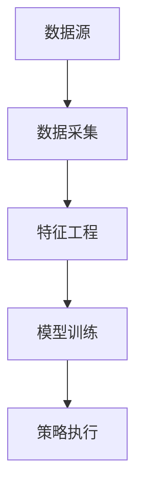
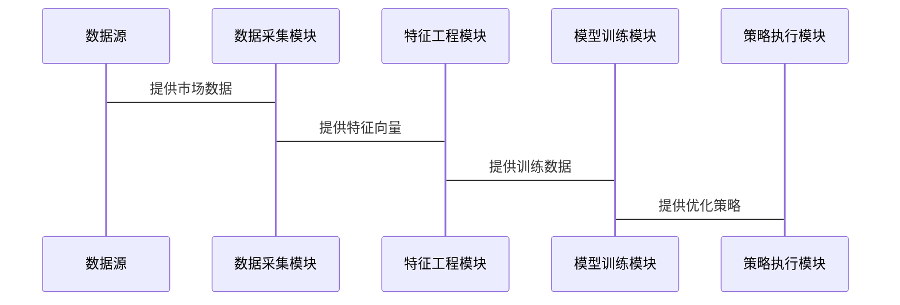

                 


# AI驱动的价值投资组合再平衡策略

## 关键词：人工智能、投资组合优化、强化学习、金融数据分析、价值投资

## 摘要：本文探讨了如何利用人工智能技术优化投资组合的再平衡策略，通过强化学习和数据驱动的方法，提出了一种创新的投资组合优化框架，旨在提升投资组合的长期收益和风险控制能力。

---

# 第1章: 价值投资与投资组合再平衡概述

## 1.1 价值投资的核心理念

### 1.1.1 价值投资的定义与特点

价值投资是一种投资策略，强调以低于市场价值的价格购买优质资产，长期持有，通过市场回归实现收益。其核心理念包括:

- **长期导向**: 以长期视角看待投资，追求资产的内在价值
- **安全边际**: 买入价格低于内在价值，降低投资风险
- **精选个股**: 选择基本面良好、竞争优势明显的公司
- **逆向思维**: 在市场恐慌时买入，在市场狂热时卖出

### 1.1.2 投资组合再平衡的必要性

投资组合再平衡是调整投资组合构成，使之符合预定目标的过程。主要作用包括:

- **风险控制**: 通过调整头寸，降低集中风险
- **收益优化**: 通过动态调整，提升整体收益
- **适应市场变化**: 应对市场波动和经济周期变化

### 1.1.3 传统投资组合管理方法的局限性

传统方法主要依赖人工判断和固定模型，存在以下问题:

- **主观性过强**: 依赖个人经验和判断，存在主观偏差
- **反应滞后**: 无法实时捕捉市场变化
- **计算复杂**: 需要大量人工计算和调整
- **难以处理多目标优化**: 在收益、风险、流动性等多目标之间难以找到最优平衡

## 1.2 AI在金融投资中的应用潜力

### 1.2.1 人工智能在金融领域的应用现状

AI技术在金融领域的应用日益广泛，包括:

- **量化交易**: 利用算法进行高频交易
- **风险管理**: 通过AI模型预测和管理风险
- **智能投顾**: 提供个性化的投资建议
- **市场预测**: 利用深度学习预测市场走势

### 1.2.2 AI驱动投资组合优化的优势

AI技术具有以下优势:

- **数据处理能力强**: 能够处理海量金融数据
- **计算速度快**: 可以快速完成复杂计算
- **自适应能力强**: 能够根据市场变化自动调整策略
- **多目标优化**: 可以同时优化多个目标函数

### 1.2.3 价值投资与AI结合的可行性分析

价值投资与AI的结合可以通过以下方式实现:

- **数据驱动的选股**: 利用AI筛选基本面优秀的企业
- **动态再平衡**: 根据市场变化自动调整投资比例
- **风险控制**: 利用AI实时监控和管理风险

## 1.3 本书的核心目标与结构安排

### 1.3.1 本书的核心目标

本书旨在:

- 探讨AI技术在价值投资中的应用
- 提出一种基于AI的投资组合再平衡策略
- 通过实际案例展示策略的有效性

### 1.3.2 本书的章节安排

- **第1章**: 价值投资与投资组合再平衡概述
- **第2章**: 投资组合优化的核心概念
- **第3章**: AI驱动的投资组合优化算法
- **第4章**: 系统架构与实现方案
- **第5章**: 项目实战与案例分析
- **第6章**: 最佳实践与注意事项

### 1.3.3 本书的读者群体

- 金融从业者: 量化分析师、投资经理
- 人工智能工程师: 对金融应用感兴趣的技术人员
- 价值投资爱好者: 对投资策略感兴趣的投资人

---

# 第2章: 投资组合优化的核心概念

## 2.1 投资组合优化的基本原理

### 2.1.1 投资组合优化的定义

投资组合优化是指通过调整投资组合中各资产的比例，使其在风险和收益之间达到最优平衡。

### 2.1.2 投资组合优化的目标函数

目标函数通常包括:

- **收益最大化**: 最大化投资组合的预期收益
- **风险最小化**: 最小化投资组合的波动性
- **流动性优化**: 优化资金的流动性

### 2.1.3 投资组合优化的约束条件

常见的约束条件包括:

- **投资比例限制**: 各资产的投资比例不能超过一定范围
- **风险承受能力**: 投资组合的风险不能超过投资者的承受能力
- **交易成本**: 考虑交易过程中的各项成本

## 2.2 AI驱动的投资组合优化策略

### 2.2.1 基于机器学习的投资组合优化

- **监督学习**: 利用历史数据训练模型预测最优投资组合
- **无监督学习**: 发现数据中的隐藏结构，优化投资组合

### 2.2.2 基于强化学习的投资组合优化

- **状态空间**: 当前市场环境和资产价格
- **动作空间**: 调整投资比例的具体操作
- **奖励函数**: 投资组合的收益与风险的综合评估

### 2.2.3 基于遗传算法的投资组合优化

- **基因编码**: 将投资组合表示为基因序列
- **适应度函数**: 评估投资组合的优劣
- **遗传操作**: 通过交叉和变异优化投资组合

## 2.3 数据驱动的决策优化

### 2.3.1 数据驱动决策的定义

数据驱动决策是基于大量数据和统计分析做出决策的过程。

### 2.3.2 数据驱动决策在投资组合优化中的应用

- **数据清洗**: 对金融数据进行预处理
- **特征工程**: 构建有效的特征向量
- **模型训练**: 基于数据训练投资组合优化模型

### 2.3.3 数据驱动决策的优势与挑战

优势:

- **数据驱动**: 基于大量数据进行决策
- **实时性**: 能够实时调整投资策略
- **准确性**: 可以提高决策的准确性

挑战:

- **数据质量**: 数据的准确性和完整性
- **计算成本**: 大规模数据处理的计算成本
- **模型过拟合**: 模型可能对训练数据过拟合

---

# 第3章: 强化学习在投资组合优化中的应用

## 3.1 强化学习的基本原理

### 3.1.1 强化学习的定义

强化学习是一种机器学习方法，通过智能体与环境的交互，学习最优策略。

### 3.1.2 强化学习的核心要素

- **状态空间**: 当前环境的状态
- **动作空间**: 智能体可以采取的动作
- **奖励函数**: 对智能体行为的奖励或惩罚
- **策略**: 智能体选择动作的概率分布

### 3.1.3 强化学习的算法流程

1. 初始化智能体状态
2. 采取动作并获得奖励
3. 更新策略以最大化未来奖励
4. 重复上述步骤直到达到目标

## 3.2 基于强化学习的投资组合优化算法

### 3.2.1 状态空间的定义

- **市场状态**: 当前市场的整体情况
- **资产价格**: 各资产的当前价格
- **持有比例**: 各资产的持有比例

### 3.2.2 动作空间的定义

- **调整比例**: 调整各资产的持有比例
- **买入/卖出**: 对特定资产进行买入或卖出操作

### 3.2.3 奖励函数的设计

- **收益**: 投资组合的收益
- **风险**: 投资组合的风险
- **交易成本**: 交易过程中的各项成本

## 3.3 算法实现与优化

### 3.3.1 算法实现步骤

1. 数据预处理
2. 状态空间定义
3. 动作空间定义
4. 奖励函数设计
5. 策略网络构建
6. 算法训练与优化

### 3.3.2 算法优化方法

- **网络结构优化**: 优化神经网络的结构
- **超参数调整**: 调整学习率、批次大小等超参数
- **经验回放**: 利用经验回放减少样本偏差

## 3.4 数学模型与公式推导

### 3.4.1 强化学习的目标函数

$$ V_{\theta}(s) = \max_{\theta} \mathbb{E}[r_t | s_t = s] $$

### 3.4.2 策略梯度公式

$$ \nabla \theta = \sum_{t} \nabla \log \pi_{\theta}(a_t | s_t) Q_{\theta}(s_t, a_t) $$

### 3.4.3 奖励函数设计示例

$$ R = \alpha \cdot \text{收益} - \beta \cdot \text{风险} $$

## 3.5 实际案例分析

### 3.5.1 数据来源与处理

- 数据来源: 历史资产价格数据
- 数据处理: 清洗、特征提取

### 3.5.2 算法实现

- 使用强化学习算法训练投资组合优化模型
- 通过回测验证算法的有效性

### 3.5.3 实验结果分析

- 收益率对比
- 风险对比
- 计算效率对比

---

# 第4章: 系统架构与实现方案

## 4.1 系统功能设计

### 4.1.1 系统功能模块

- **数据采集**: 采集市场数据
- **特征工程**: 构建特征向量
- **模型训练**: 训练强化学习模型
- **策略执行**: 执行投资组合再平衡

### 4.1.2 功能模块之间的关系

- 数据采集模块向特征工程模块提供原始数据
- 特征工程模块向模型训练模块提供特征向量
- 模型训练模块向策略执行模块提供优化策略

## 4.2 系统架构设计

### 4.2.1 系统架构图



### 4.2.2 系统组件说明

- **数据源**: 包括股票、基金等市场数据
- **数据采集**: 数据采集模块负责数据的获取和初步处理
- **特征工程**: 特征工程模块负责构建有效的特征向量
- **模型训练**: 模型训练模块负责训练强化学习模型
- **策略执行**: 策略执行模块负责执行投资组合再平衡操作

## 4.3 系统接口设计

### 4.3.1 数据接口

- **输入接口**: 数据采集模块的输入接口
- **输出接口**: 数据采集模块的输出接口

### 4.3.2 模型接口

- **输入接口**: 模型训练模块的输入接口
- **输出接口**: 模型训练模块的输出接口

## 4.4 系统交互流程

### 4.4.1 系统交互流程图



---

# 第5章: 项目实战与案例分析

## 5.1 项目实战

### 5.1.1 环境安装

- **Python**: 安装Python 3.8+
- **深度学习框架**: 安装TensorFlow或PyTorch
- **金融数据源**: 使用Yahoo Finance API或其他数据源

### 5.1.2 数据处理

- 数据清洗
- 特征提取

### 5.1.3 模型训练

- 强化学习模型训练
- 超参数调整

### 5.1.4 策略执行

- 投资组合再平衡
- 交易操作

## 5.2 代码实现

### 5.2.1 数据采集代码

```python
import pandas as pd
import yfinance as yf

# 下载数据
data = yf.download(tickers, start=start_date, end=end_date)
```

### 5.2.2 特征工程代码

```python
from sklearn.preprocessing import StandardScaler

# 特征标准化
scaler = StandardScaler()
features = scaler.fit_transform(features)
```

### 5.2.3 模型训练代码

```python
import tensorflow as tf
from tensorflow.keras import layers

# 构建DNN模型
model = tf.keras.Sequential([
    layers.Dense(64, activation='relu'),
    layers.Dense(1)
])
```

### 5.2.4 策略执行代码

```python
def rebalance_portfolio(current_weights, target_weights):
    # 调整权重
    pass
```

## 5.3 实验结果分析

### 5.3.1 收益率对比

- AI驱动策略的收益率
- 传统策略的收益率
- 市场基准收益率

### 5.3.2 风险对比

- AI驱动策略的波动率
- 传统策略的波动率
- 市场基准波动率

### 5.3.3 计算效率对比

- AI驱动策略的计算时间
- 传统策略的计算时间

---

# 第6章: 最佳实践与注意事项

## 6.1 小结

AI驱动的价值投资组合再平衡策略具有以下优势:

- **数据驱动**: 基于大量数据进行决策
- **实时性**: 能够实时调整投资策略
- **准确性**: 可以提高决策的准确性

## 6.2 最佳实践 tips

- **数据质量**: 确保数据的准确性和完整性
- **模型选择**: 根据具体问题选择合适的模型
- **风险控制**: 建立完善的风险控制机制
- **持续优化**: 持续优化模型和策略

## 6.3 注意事项

- **模型过拟合**: 避免模型对训练数据过拟合
- **数据泄漏**: 避免数据泄漏影响模型的泛化能力
- **交易成本**: 考虑交易过程中的各项成本

## 6.4 拓展阅读

- 《Deep Learning for Finance》
- 《Reinforcement Learning in Finance》
- 《Algorithmic and High-Frequency Trading》

---

# 作者：AI天才研究院 & 禅与计算机程序设计艺术

