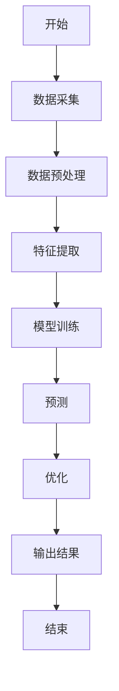
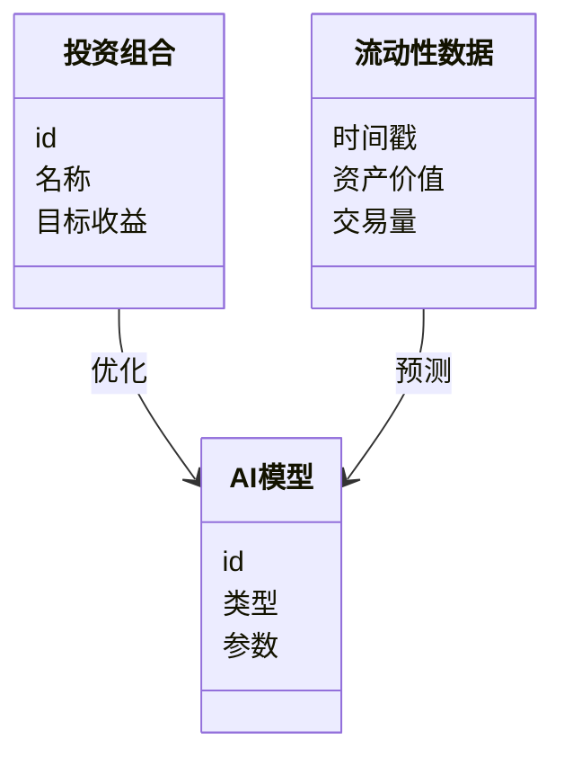
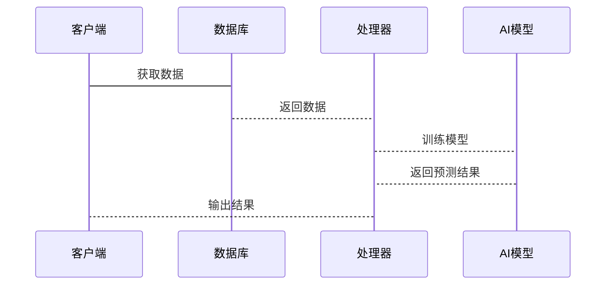

                 


```markdown
# AI驱动的价值投资组合流动性管理

> 关键词：AI、价值投资、流动性管理、投资组合、风险管理、机器学习、深度学习

> 摘要：本文探讨了如何利用人工智能技术优化投资组合的流动性管理。通过分析流动性预测、投资组合优化及风险管理的算法，结合系统架构设计和实际案例，展示了AI在价值投资中的应用潜力。本文适合金融从业者、数据科学家和对AI技术感兴趣的读者。

---

## 第一章：背景介绍

### 1.1 问题背景
传统投资组合管理依赖人工判断，存在效率低、误差大的问题。随着市场波动加剧，对实时流动性管理的需求迫切。AI技术的引入，通过大数据分析和机器学习，为流动性管理提供了新的解决方案。

### 1.2 问题描述
投资组合流动性管理涉及多因素，如市场波动、资产配置等。传统方法难以捕捉复杂市场变化，而AI可以通过实时数据预测和优化，提升管理效率和准确性。

### 1.3 问题解决
引入AI技术，构建流动性预测模型和投资组合优化算法，实现动态调整和风险控制。AI驱动的流动性管理能够实时分析市场数据，优化资产配置，降低风险。

### 1.4 边界与外延
明确AI在流动性管理中的应用范围，如短期预测和战术性调整，同时认识到其局限性，如模型偏差和市场黑天鹅事件。

### 1.5 概念结构与核心要素
构建AI驱动的流动性管理模型，包括数据采集、预测、优化和反馈机制。核心要素包括实时数据流、机器学习模型和动态调整策略。

---

## 第二章：核心概念与联系

### 2.1 AI大模型的原理与特点
AI大模型通过深度学习和神经网络，从海量数据中提取特征，构建预测模型。其特点包括高计算能力、实时性、自适应性和高精度。

### 2.2 核心概念对比表
| 对比维度       | 传统方法                     | AI驱动方法                   |
|----------------|------------------------------|-------------------------------|
| 数据来源       | 历史数据                     | 实时数据                     |
| 预测准确性     | 较低                        | 较高                        |
| 调整频率       | 低                         | 高                         |

### 2.3 ER实体关系图
```mermaid
er
    entity 投资组合 {
        key: id
        attributes: 名称, 目标收益, 风险承受
    }

    entity 流动性数据 {
        key: id
        attributes: 时间戳, 资产价值, 交易量
    }

    entity AI模型 {
        key: id
        attributes: 类型, 参数, 训练数据
    }

    relation 流动性预测 {
        from AI模型
        to 流动性数据
        role: 预测
    }

    relation 投资组合优化 {
        from AI模型
        to 投资组合
        role: 优化
    }
```

---

## 第三章：算法原理讲解

### 3.1 算法原理
流动性预测采用时间序列模型，投资组合优化使用均值-方差模型结合机器学习。风险管理利用神经网络模型，实时监控市场变化。

### 3.2 算法流程图


### 3.3 Python源代码实现
```python
import numpy as np
import pandas as pd
from sklearn.model_selection import train_test_split
from sklearn.linear_model import LinearRegression

# 数据加载与预处理
data = pd.read_csv('流动性数据.csv')
X = data[['资产价值', '交易量']]
y = data['流动性预测值']

# 数据分割
X_train, X_test, y_train, y_test = train_test_split(X, y, test_size=0.2)

# 模型训练
model = LinearRegression()
model.fit(X_train, y_train)

# 预测与评估
y_pred = model.predict(X_test)
print('预测准确率:', model.score(X_test, y_test))
```

### 3.4 数学模型与公式
时间序列模型：
$$ y_t = \alpha y_{t-1} + \beta x_t + \epsilon_t $$

神经网络模型：
$$ y = \sigma(w x + b) $$

---

## 第四章：系统分析与架构设计

### 4.1 问题场景介绍
系统需实时处理市场数据，构建预测模型，并优化投资组合。目标是实现高效、准确的流动性管理。

### 4.2 系统功能设计


### 4.3 系统架构设计
```mermaid
architectural
    Data Layer: 数据库
    Processing Layer: 处理器
    AI Layer: 神经网络模型
    Output Layer: 结果输出
```

### 4.4 接口设计与交互


---

## 第五章：项目实战

### 5.1 环境安装
安装Python、Pandas、Scikit-learn等库，配置Jupyter Notebook环境。

### 5.2 核心代码实现
```python
import numpy as np
import pandas as pd
from sklearn.neural_network import MLPRegressor

# 加载数据
data = pd.read_csv('流动性数据.csv')

# 数据分割
X = data[['资产价值', '交易量']]
y = data['流动性预测值']

# 训练模型
model = MLPRegressor(hidden_layer_sizes=(10, 5))
model.fit(X, y)

# 预测
y_pred = model.predict(X)
print('预测结果:', y_pred)
```

### 5.3 案例分析
分析模型在实际市场中的表现，比较传统方法和AI方法的差异，优化模型参数，提升预测准确率。

### 5.4 项目小结
总结项目成果，讨论AI技术的优势，提出改进建议。

---

## 第六章：最佳实践与经验分享

### 6.1 经验总结
AI模型需要持续优化，定期更新数据，避免过拟合。选择合适的数据源和模型架构，结合领域知识，提升模型表现。

### 6.2 注意事项
数据质量直接影响模型性能，需谨慎处理缺失值和异常值。模型部署需考虑计算资源和实时性要求。

### 6.3 小结
AI驱动的流动性管理是未来趋势，通过技术与金融的结合，优化投资组合，提升收益。

---

## 第七章：总结

### 7.1 总结全文
AI技术为价值投资组合的流动性管理提供了强大工具，通过实时数据分析和预测，显著提升了管理效率和准确性。

### 7.2 展望未来
随着AI技术的进步，投资组合管理将更加智能化、自动化。深度学习和强化学习的应用将推动金融领域的新一轮变革。

---

## 作者

作者：AI天才研究院 & 禅与计算机程序设计艺术

---

感谢您的阅读！如需进一步探讨，欢迎留言交流。
```

