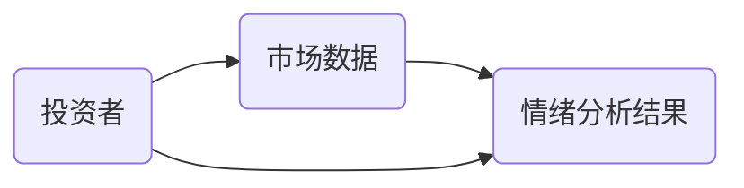
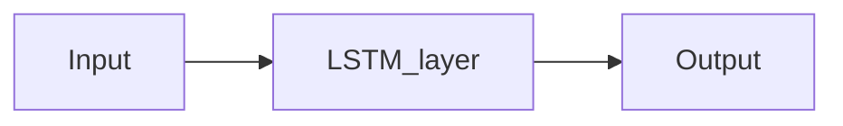
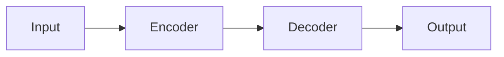
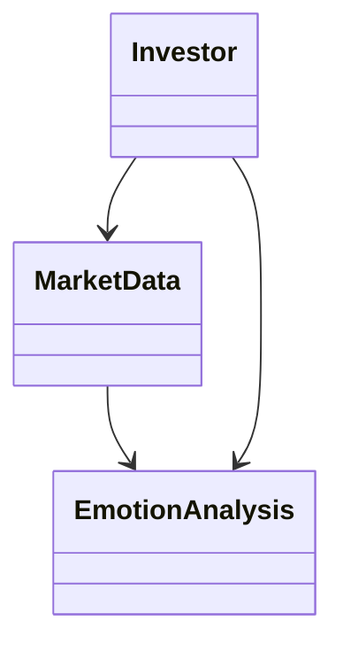
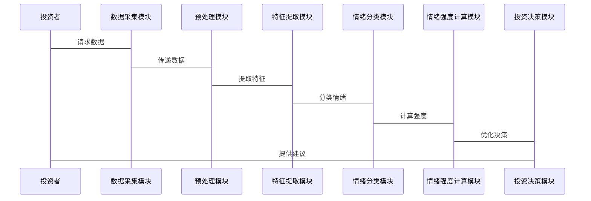

                 


# AI驱动的价值投资者情绪分析与控制

> 关键词：人工智能，情绪分析，价值投资者，投资决策，深度学习，自然语言处理，市场行为预测

> 摘要：本文探讨了如何利用人工智能技术分析和控制投资者的情绪，特别是针对价值投资者的情绪分析与投资决策优化。结合自然语言处理和深度学习技术，构建了一个智能化的情绪分析系统，帮助投资者在复杂多变的市场中保持理性，提升投资收益。

---

## 第一章：背景介绍

### 1.1 问题背景

#### 1.1.1 投资者情绪对市场的影响
投资者的情绪是影响市场波动的重要因素之一。尤其是在股票、基金等金融市场上，投资者的贪婪和恐惧往往会导致市场的非理性波动。例如，在市场下跌时，投资者的恐慌情绪可能导致大规模抛售，进一步加剧市场下跌；而在市场上涨时，过度乐观的情绪则可能导致泡沫的形成。

#### 1.1.2 传统情绪分析的局限性
传统的投资决策更多依赖于经验和基本面分析，而忽略了情绪因素的影响。虽然有一些研究表明，情绪分析在投资决策中具有重要作用，但传统的情绪分析方法存在以下问题：
- 数据来源单一，难以全面捕捉投资者情绪；
- 情绪分析结果缺乏量化，难以直接指导投资决策；
- 方法不够动态，难以实时捕捉市场情绪变化。

#### 1.1.3 AI技术在情绪分析中的潜力
随着人工智能技术的发展，自然语言处理（NLP）、深度学习等技术为情绪分析提供了新的可能性。通过分析大量的文本数据（如新闻、评论、社交媒体等），可以实时捕捉投资者情绪的变化，并将其量化，为投资决策提供科学依据。

### 1.2 核心概念与问题描述

#### 1.2.1 价值投资者情绪分析的定义
价值投资者情绪分析是指通过分析投资者的言论、行为等数据，识别其情绪状态（如乐观、悲观、中性等），并将其量化的过程。这些情绪数据可以进一步用于投资决策优化。

#### 1.2.2 情绪分析的关键要素
- **数据来源**：包括新闻、社交媒体、论坛、投资者报告等。
- **情绪分类**：通常分为正面、负面、中性三类。
- **情绪强度**：情绪的强弱程度，可以用0到1之间的数值表示。
- **时间依赖性**：情绪分析需要考虑时间因素，捕捉市场的短期波动和长期趋势。

#### 1.2.3 问题解决的目标与边界
目标：
- 实时捕捉投资者情绪变化。
- 将情绪数据量化，与市场数据结合，优化投资决策。
- 提供基于情绪分析的投资策略建议。

边界：
- 仅分析公开数据，不涉及内部信息。
- 情绪分析结果仅供参考，不作为投资决策的唯一依据。

---

## 第二章：核心概念与联系

### 2.1 核心概念原理

#### 2.1.1 情感分类与文本挖掘
情感分类是情绪分析的基础，通常包括以下步骤：
1. 文本预处理：去除停用词、分词、去除标点符号等。
2. 特征提取：提取文本中的关键词、句法结构等。
3. 情感分类：使用机器学习或深度学习模型进行分类。

#### 2.1.2 情绪强度与市场行为预测
情绪强度反映了投资者情绪的强弱程度。例如，当情绪强度超过一定阈值时，可以预测市场可能出现剧烈波动。

#### 2.1.3 价值投资者的特征与情绪模式
价值投资者通常注重基本面分析，但其情绪也会受到市场波动的影响。例如，在市场下跌时，价值投资者可能会表现出更强的买入意愿，因为他们认为市场被低估。

### 2.2 情绪分析特征对比表格

| 特征 | 描述 |
|------|------|
| 情感分类 | 正向、负向、中性 |
| 情绪强度 | 0-1之间 |
| 时间依赖性 | 需要考虑市场周期 |
| 数据来源 | 文本、行为数据 |

### 2.3 ER实体关系图



---

## 第三章：算法原理与数学模型

### 3.1 情绪分析算法原理

#### 3.1.1 LSTM网络结构



LSTM（长短期记忆网络）是一种常用的深度学习模型，适合处理时间序列数据。其核心思想是通过记忆单元（cell）来捕捉长期依赖关系。

#### 3.1.2 Transformer模型



Transformer模型通过自注意力机制（self-attention）捕捉文本中的全局关系，适合处理长文本。

### 3.2 数学模型与公式

#### 情感分类损失函数

$$ \text{Loss} = -\sum_{i=1}^{n} y_i \log(p_i) + (1 - y_i) \log(1 - p_i) $$

其中，$y_i$ 是真实标签，$p_i$ 是预测概率。

---

## 第四章：系统分析与架构设计

### 4.1 项目介绍

#### 4.1.1 项目目标
- 实时捕捉投资者情绪变化。
- 将情绪数据量化，与市场数据结合，优化投资决策。

#### 4.1.2 系统功能设计



### 4.2 系统架构设计


### 4.3 系统接口设计

- 数据采集接口：从社交媒体、新闻网站等获取数据。
- 情绪分析接口：接收文本数据，返回情绪分类结果。
- 投资决策接口：接收情绪数据和市场数据，返回投资建议。

### 4.4 系统交互流程



---

## 第五章：项目实战

### 5.1 环境安装

```bash
pip install numpy
pip install pandas
pip install scikit-learn
pip install transformers
pip install torch
```

### 5.2 核心代码实现

#### 5.2.1 数据预处理

```python
import pandas as pd

def preprocess(text):
    # 去除标点符号
    text = text.replace('[^a-zA-Z ]', '')
    # 分词
    words = text.split()
    return ' '.join(words)
```

#### 5.2.2 特征提取

```python
from sklearn.feature_extraction.text import TfidfVectorizer

vectorizer = TfidfVectorizer()
X = vectorizer.fit_transform(corpus)
```

#### 5.2.3 情绪分类

```python
from sklearn.linear_model import LogisticRegression

model = LogisticRegression()
model.fit(X_train, y_train)
```

### 5.3 案例分析

假设我们有一个包含股票评论的数据集，我们可以使用上述代码进行情绪分析：

```python
comments = ["This stock is a good buy!", "I'm worried about its future."]
processed_comments = [preprocess(comment) for comment in comments]
X = vectorizer.transform(processed_comments)
y_pred = model.predict(X)
print(y_pred)
```

---

## 第六章：总结与展望

### 6.1 最佳实践 tips

- 数据质量是关键，确保数据来源多样且准确。
- 模型调优需要结合实际场景，选择合适的参数。
- 定期更新模型，以适应市场变化。

### 6.2 小结

本文详细介绍了AI驱动的价值投资者情绪分析与控制系统的构建过程，包括背景分析、算法原理、系统设计和项目实战。通过结合自然语言处理和深度学习技术，可以有效捕捉投资者情绪变化，优化投资决策。

### 6.3 注意事项

- 情绪分析结果仅供参考，需结合其他因素进行综合判断。
- 数据隐私问题需严格遵守相关法律法规。

### 6.4 拓展阅读

- 《Deep Learning for Natural Language Processing》
- 《AI in Financial Markets》

---

**作者：AI天才研究院**  
**日期：2023年12月**

