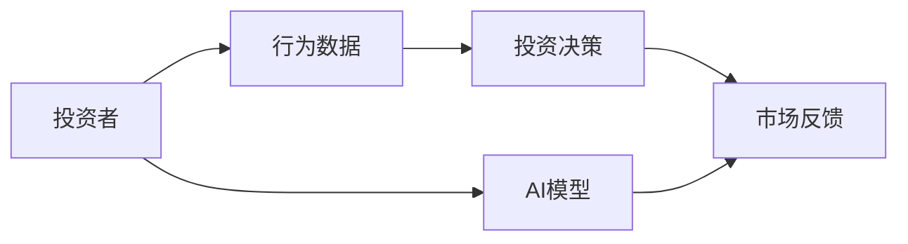
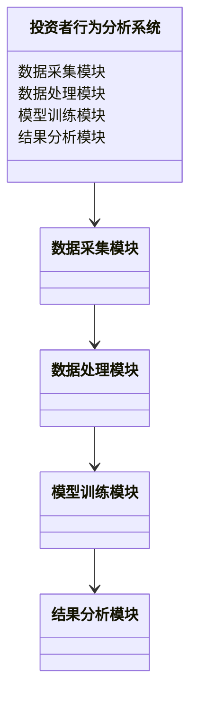
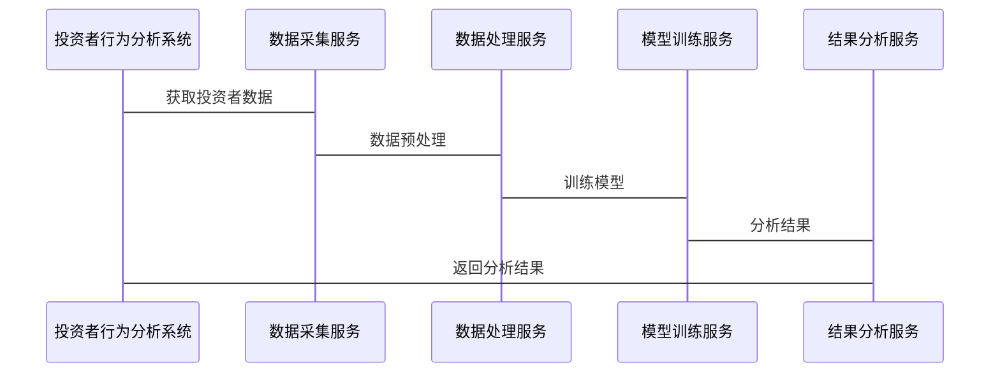

                 


# AI驱动的价值投资者行为模式分析

## 关键词：
AI技术，价值投资者，行为模式分析，机器学习，金融投资，投资者决策

## 摘要：
本文深入探讨了AI技术在价值投资者行为模式分析中的应用，从背景、核心概念、算法原理、系统设计到项目实战，系统性地分析了AI如何驱动投资者行为模式的优化与创新。通过结合机器学习算法、深度学习模型以及系统架构设计，本文为读者提供了从理论到实践的全面解读，揭示了AI在金融投资领域的重要作用。

---

# 第一部分：AI驱动的价值投资者行为模式分析背景与核心概念

## 第1章：AI与价值投资者行为模式分析的背景

### 1.1 AI技术在金融领域的应用背景
#### 1.1.1 人工智能在金融领域的演进历程
人工智能（AI）技术在金融领域的应用可以追溯到20世纪80年代。从最初的专家系统到现在的深度学习模型，AI技术在金融领域的应用经历了多个阶段的演进。特别是在大数据和云计算技术的推动下，AI技术在金融分析、投资决策、风险管理等方面发挥了重要作用。

#### 1.1.2 价值投资与行为金融学的结合
价值投资是一种以基本面分析为基础的投资策略，强调长期持有优质资产。行为金融学则关注投资者的心理和行为对市场的影响。AI技术的引入，使得价值投资与行为金融学能够更好地结合，通过分析投资者的行为模式，优化投资决策。

#### 1.1.3 AI驱动投资者行为模式的必要性
传统的投资分析方法依赖于人工经验，存在主观性强、效率低下的问题。AI技术的引入，使得投资者行为模式的分析更加客观、高效，能够帮助投资者更好地理解市场动态，优化投资策略。

### 1.2 价值投资者行为模式分析的核心问题
#### 1.2.1 投资者行为模式的定义与分类
投资者行为模式是指投资者在不同市场环境下的决策和行为方式。根据投资者的风险偏好、信息处理能力等因素，可以将投资者行为模式分为不同类型，如保守型、激进型、理性型等。

#### 1.2.2 AI驱动行为分析的关键问题
AI驱动的行为分析需要解决以下关键问题：
1. 如何从海量数据中提取有效的投资者行为特征？
2. 如何利用机器学习算法对投资者行为模式进行分类和预测？
3. 如何将AI分析结果应用于实际投资决策中？

#### 1.2.3 问题解决的边界与外延
投资者行为模式分析的边界在于如何平衡个体行为与市场整体行为的关系，而外延则包括如何将AI分析结果应用于实际投资策略中。

### 1.3 核心概念与联系
#### 1.3.1 AI技术在行为分析中的应用原理
AI技术通过收集和分析投资者的行为数据，利用机器学习算法对数据进行建模和分析，从而揭示投资者行为模式的内在规律。

#### 1.3.2 价值投资者行为模式的构成要素
价值投资者行为模式的构成要素包括投资者的风险偏好、信息处理能力、情绪波动等因素。

#### 1.3.3 AI算法与投资者行为模式的关系
AI算法通过分析投资者的行为数据，揭示其行为模式的内在规律，从而为投资者提供个性化的投资建议。

---

## 第2章：AI驱动投资者行为模式的核心概念与联系

### 2.1 核心概念原理
#### 2.1.1 AI技术在行为分析中的应用原理
AI技术通过收集和分析投资者的行为数据，利用机器学习算法对数据进行建模和分析，从而揭示投资者行为模式的内在规律。

#### 2.1.2 价值投资者行为模式的构成要素
价值投资者行为模式的构成要素包括投资者的风险偏好、信息处理能力、情绪波动等因素。

#### 2.1.3 AI算法与投资者行为模式的关系
AI算法通过分析投资者的行为数据，揭示其行为模式的内在规律，从而为投资者提供个性化的投资建议。

### 2.2 核心概念属性特征对比表
#### 表2-1：AI算法与传统统计方法的对比

| 对比维度 | AI算法 | 传统统计方法 |
|----------|---------|---------------|
| 数据量   | 大数据 | 小数据       |
| 计算效率 | 高     | 低           |
| 模型复杂度 | 高     | 低           |
| 可解释性 | 低     | 高           |

### 2.3 实体关系图（ER图）


---

# 第二部分：AI驱动投资者行为模式的算法原理

## 第3章：基于机器学习的行为模式分析算法

### 3.1 聚类算法在投资者行为分析中的应用
#### 3.1.1 K-means算法原理
K-means算法是一种经典的无监督学习算法，通过将数据点聚类成K个簇，揭示数据的内在结构。在投资者行为分析中，K-means算法可以用于将投资者分为不同的行为类型。

#### 3.1.2 层次聚类算法
层次聚类是一种逐步合并或分割数据点的聚类方法，适用于投资者行为数据的层次化分析。

#### 3.1.3 聚类算法的优缺点对比
| 对比维度 | K-means算法 | 层次聚类算法 |
|----------|-------------|--------------|
| 时间复杂度 | 较低        | 较高         |
| 可解释性 | 较低        | 较高         |
| 适用场景 | 数量较多的数据 | 层次化分析     |

---

### 3.2 分类算法在投资者行为预测中的应用
#### 3.2.1 支持向量机（SVM）原理
支持向量机是一种监督学习算法，通过构建超平面将数据点分类。在投资者行为预测中，SVM可以用于预测投资者的买卖行为。

#### 3.2.2 随机森林算法
随机森林是一种基于树模型的集成学习算法，具有较高的准确性和鲁棒性。在投资者行为预测中，随机森林可以用于预测投资者的市场参与度。

#### 3.2.3 分类算法的数学模型
支持向量机的数学模型如下：
$$ \text{max} \frac{1}{2} \|w\|^2 $$
$$ \text{subject to} \ y_i(w \cdot x_i + b) \geq 1, i=1,2,...,n $$

### 3.3 回归算法在投资收益预测中的应用
#### 3.3.1 线性回归模型
线性回归是一种经典的回归算法，通过最小化预测值与实际值之间的平方差，建立回归方程。

#### 3.3.2 逻辑回归模型
逻辑回归是一种用于分类的回归算法，通过sigmoid函数将线性回归的结果映射到0-1之间。

#### 3.3.3 回归算法的数学公式
线性回归的数学公式如下：
$$ y = \beta_0 + \beta_1x_1 + \beta_2x_2 + ... + \beta_nx_n $$

---

## 第4章：基于深度学习的行为模式分析算法

### 4.1 卷积神经网络（CNN）在图像识别中的应用
卷积神经网络通过提取图像的特征，实现图像分类和识别。在投资者行为分析中，CNN可以用于分析投资者的情感倾向。

### 4.2 循环神经网络（RNN）在时间序列分析中的应用
循环神经网络通过处理时间序列数据，预测市场的未来走势。在投资者行为分析中，RNN可以用于预测投资者的交易频率。

### 4.3 Transformer模型在自然语言处理中的应用
Transformer模型通过处理文本数据，实现文本生成和翻译。在投资者行为分析中，Transformer模型可以用于分析投资者的新闻偏好。

---

# 第三部分：AI驱动投资者行为模式的系统分析与架构设计

## 第5章：AI驱动投资者行为模式分析的系统设计

### 5.1 系统功能设计
系统功能设计包括数据采集、数据处理、模型训练、结果分析等模块。通过mermaid类图展示系统功能模块的关系。



### 5.2 系统架构设计
系统架构设计采用微服务架构，通过mermaid架构图展示系统各模块的关系。


### 5.3 系统接口设计
系统接口设计包括数据接口、模型接口和结果接口。通过mermaid序列图展示系统接口的交互流程。



---

## 第6章：AI驱动投资者行为模式分析的项目实战

### 6.1 项目环境安装
项目环境安装需要安装Python、TensorFlow、Pandas等依赖库。

### 6.2 系统核心实现源代码
以下是投资者行为分析系统的Python实现代码：

```python
import pandas as pd
import numpy as np
from sklearn.cluster import KMeans
from sklearn.ensemble import RandomForestClassifier
from sklearn.linear_model import LinearRegression

# 数据采集模块
def collect_data():
    data = pd.read_csv('investor_data.csv')
    return data

# 数据处理模块
def preprocess_data(data):
    # 数据清洗
    data = data.dropna()
    # 数据标准化
    data = (data - data.mean()) / data.std()
    return data

# 模型训练模块
def train_model(data):
    # 聚类分析
    X = data[['feature1', 'feature2']]
    kmeans = KMeans(n_clusters=3)
    kmeans.fit(X)
    # 分类分析
    y = data['label']
    rf = RandomForestClassifier()
    rf.fit(X, y)
    # 回归分析
    X_regression = data[['feature1', 'feature2']]
    y_regression = data['target']
    lr = LinearRegression()
    lr.fit(X_regression, y_regression)
    return kmeans, rf, lr

# 结果分析模块
def analyze_results(kmeans, rf, lr, data):
    # 聚类结果分析
    clusters = kmeans.predict(data[['feature1', 'feature2']])
    print("聚类结果:", clusters)
    # 分类结果分析
    predictions = rf.predict(data[['feature1', 'feature2']])
    print("分类结果:", predictions)
    # 回归结果分析
    y_pred = lr.predict(data[['feature1', 'feature2']])
    print("回归结果:", y_pred)

# 主程序
if __name__ == '__main__':
    data = collect_data()
    data_processed = preprocess_data(data)
    kmeans, rf, lr = train_model(data_processed)
    analyze_results(kmeans, rf, lr, data_processed)
```

### 6.3 代码应用解读与分析
以下是代码的解读与分析：
1. 数据采集模块：从CSV文件中读取投资者数据。
2. 数据处理模块：对数据进行清洗和标准化处理。
3. 模型训练模块：使用K-means算法进行聚类分析，使用随机森林算法进行分类分析，使用线性回归算法进行回归分析。
4. 结果分析模块：对聚类、分类和回归结果进行分析和输出。

### 6.4 实际案例分析
以下是一个实际案例的分析：
1. 数据采集：从投资者数据集中获取投资者的行为数据。
2. 数据处理：对数据进行清洗和标准化处理。
3. 模型训练：使用K-means算法将投资者分为三类，使用随机森林算法预测投资者的交易行为，使用线性回归算法预测投资者的投资收益。
4. 结果分析：输出聚类结果、分类结果和回归结果。

### 6.5 项目小结
通过本项目，我们可以看到AI技术在投资者行为模式分析中的强大能力。通过机器学习算法和深度学习模型，我们可以更准确地分析投资者的行为模式，优化投资决策。

---

# 第四部分：AI驱动投资者行为模式分析的总结与展望

## 第7章：总结与展望

### 7.1 核心内容总结
本文系统性地分析了AI驱动投资者行为模式分析的核心概念、算法原理、系统设计和项目实战。通过机器学习算法和深度学习模型，我们可以更准确地分析投资者的行为模式，优化投资决策。

### 7.2 最佳实践 tips
1. 在投资者行为分析中，数据质量至关重要，需确保数据的完整性和准确性。
2. 选择合适的算法模型，根据具体问题选择合适的算法。
3. 在实际应用中，需结合市场环境和投资者需求，灵活调整分析模型。

### 7.3 小结
AI技术为投资者行为模式分析提供了新的思路和方法。通过AI技术，我们可以更深入地理解投资者的行为模式，优化投资策略，提高投资收益。

### 7.4 注意事项
1. AI模型的可解释性问题需引起重视。
2. 在实际应用中，需注意数据隐私和安全问题。
3. 需结合市场环境和投资者需求，灵活调整分析模型。

### 7.5 拓展阅读
1. 《机器学习实战》
2. 《深度学习入门：基于Python的CNN、RNN、GAN通俗易懂入门》
3. 《投资学原理》

---

## 作者：AI天才研究院 & 禅与计算机程序设计艺术

---

本文系统性地分析了AI驱动投资者行为模式分析的核心概念、算法原理、系统设计和项目实战。通过机器学习算法和深度学习模型，我们可以更准确地分析投资者的行为模式，优化投资决策。希望本文能为读者提供有价值的参考和启发。

