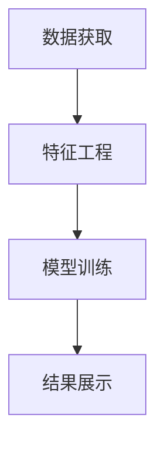

                 

# AI驱动的价值投资风险因子分解

> 关键词：人工智能，价值投资，风险因子，金融数据分析，投资风险管理，机器学习

> 摘要：本文探讨了如何利用人工智能技术，特别是机器学习和深度学习方法，对价值投资中的风险因子进行分解和分析。通过详细的技术分析和实际案例，本文展示了AI在金融风险管理中的潜力和应用。

---

## 第一章: 价值投资与风险因子概述

### 1.1 价值投资的基本概念

#### 1.1.1 价值投资的定义
价值投资是一种投资策略，主要通过分析公司的基本面（如财务状况、行业地位、管理团队等），寻找市场价格低于其内在价值的投资标的。其核心理念是买入被市场低估的资产，长期持有，等待其价值回归。

#### 1.1.2 价值投资的核心理念
价值投资的核心理念包括：
1. 市场价格波动，而非价值的长期稳定。
2. 长期投资，避免频繁交易。
3. 选择具有强大基本面和良好管理的公司。

#### 1.1.3 价值投资与其它投资策略的区别
与其他投资策略（如趋势投资、技术分析等）相比，价值投资更注重公司的内在价值，而非市场的短期波动。

### 1.2 风险因子的基本概念

#### 1.2.1 风险因子的定义
风险因子是指影响投资组合风险的主要因素，包括市场风险、流动性风险、信用风险等。这些因子可以通过统计方法提取，并用于风险管理和投资决策。

#### 1.2.2 风险因子的分类
风险因子可以分为系统性风险和非系统性风险。系统性风险是影响整个市场的风险，如经济衰退、战争等；非系统性风险是影响单一资产或资产类别。

#### 1.2.3 风险因子与投资回报的关系
通过分解风险因子，投资者可以更好地理解投资回报的来源，并采取相应的风险管理策略。

### 1.3 价值投资中的风险因子分解

#### 1.3.1 风险因子分解的定义
风险因子分解是一种通过统计方法，将资产的回报分解为多个风险因子的贡献的过程。

#### 1.3.2 风险因子分解的意义
通过风险因子分解，投资者可以更好地理解资产回报的来源，从而优化投资组合，降低风险。

---

## 第二章: AI技术在价值投资中的应用潜力

### 2.1 AI技术的基本概念

#### 2.1.1 人工智能的定义
人工智能（AI）是指计算机系统模拟人类智能的能力，包括学习、推理、自我改进等。

#### 2.1.2 机器学习的定义
机器学习是一种通过数据训练模型，使其能够从数据中学习并进行预测的技术。

#### 2.1.3 深度学习的定义
深度学习是一种基于人工神经网络的机器学习方法，通过多层非线性变换提取数据特征。

### 2.2 AI在金融领域的应用现状

#### 2.2.1 AI在金融数据分析中的应用
AI技术可以用于金融数据分析，帮助投资者发现数据中的隐藏模式和趋势。

#### 2.2.2 AI在风险管理中的应用
AI技术可以通过实时监控和预测，帮助投资者识别和管理风险。

#### 2.2.3 AI在投资决策中的应用
AI技术可以用于构建投资模型，帮助投资者做出更科学的投资决策。

### 2.3 AI驱动风险因子分解的优势

#### 2.3.1 数据处理能力
AI技术可以处理大量复杂的数据，提取有用的特征。

#### 2.3.2 模型复杂度
AI技术可以构建复杂的模型，捕捉数据中的非线性关系。

#### 2.3.3 自动化特征提取
AI技术可以自动化地从数据中提取特征，减少人工干预。

---

## 第三章: 机器学习基础

### 3.1 机器学习的基本概念

#### 3.1.1 机器学习的分类
机器学习可以分为监督学习、无监督学习、半监督学习和强化学习。

#### 3.1.2 监督学习的定义
监督学习是一种通过训练数据，学习输入与输出之间的关系，从而进行预测的技术。

#### 3.1.3 无监督学习的定义
无监督学习是一种通过发现数据中的结构，进行聚类或降维的技术。

### 3.2 线性回归

#### 3.2.1 线性回归的定义
线性回归是一种通过最小化预测值与实际值之间的平方差，拟合一条直线的技术。

#### 3.2.2 线性回归的数学模型
$$ y = \beta_0 + \beta_1 x + \epsilon $$

#### 3.2.3 线性回归的优缺点
优点：简单易懂，计算效率高。缺点：只能处理线性关系，无法捕捉复杂的模式。

### 3.3 随机森林

#### 3.3.1 随机森林的定义
随机森林是一种通过组合多个决策树的预测结果，提高模型准确性和鲁棒性的技术。

#### 3.3.2 随机森林的数学模型
随机森林通过随机选择特征和样本，构建多个决策树，并进行投票或平均预测。

#### 3.3.3 随机森林的优缺点
优点：能够处理非线性关系，具有较强的抗过拟合能力。缺点：计算复杂度较高。

---

## 第四章: 深度学习基础

### 4.1 深度学习的基本概念

#### 4.1.1 深度学习的定义
深度学习是一种通过多层神经网络，自动提取数据特征的技术。

#### 4.1.2 神经网络的定义
神经网络是一种模拟人脑神经网络结构，用于处理和学习数据的技术。

### 4.2 卷积神经网络（CNN）

#### 4.2.1 CNN的定义
CNN是一种主要用于图像识别的深度学习模型，通过卷积层提取图像特征。

#### 4.2.2 CNN的数学模型
$$ f(x) = \sigma(W \cdot x + b) $$

#### 4.2.3 CNN的优缺点
优点：在图像识别任务中表现优异。缺点：计算资源消耗较大。

### 4.3 循序神经网络（RNN）

#### 4.3.1 RNN的定义
RNN是一种用于处理序列数据的深度学习模型，通过循环层捕捉序列中的时序关系。

#### 4.3.2 RNN的数学模型
$$ s_t = \sigma(W \cdot s_{t-1} + U \cdot x_t) $$
$$ y_t = \sigma(V \cdot s_t) $$

#### 4.3.3 RNN的优缺点
优点：适合处理序列数据。缺点：存在梯度消失或爆炸问题。

---

## 第五章: 风险因子的特征工程

### 5.1 特征工程的基本概念

#### 5.1.1 特征工程的定义
特征工程是指通过选择和变换特征，提高模型性能的技术。

#### 5.1.2 特征工程的重要性
特征工程可以显著提高模型的准确性和鲁棒性。

### 5.2 风险因子的特征选择

#### 5.2.1 数据预处理
数据预处理包括数据清洗、特征标准化等。

#### 5.2.2 特征选择
特征选择包括基于统计的方法（如卡方检验）和基于模型的方法（如Lasso回归）。

### 5.3 风险因子的特征变换

#### 5.3.1 主成分分析（PCA）
PCA是一种通过降维技术，提取数据的主要特征的技术。

#### 5.3.2 线性判别分析（LDA）
LDA是一种通过最大化类间差异，进行特征降维的技术。

---

## 第六章: AI驱动的风险因子分解模型

### 6.1 风险因子分解的数学模型

#### 6.1.1 多因子模型
多因子模型是一种通过多个因子解释资产回报的技术。

#### 6.1.2 因子分解的数学表达
$$ r_i = \alpha_i + \beta_{i1}F_1 + \beta_{i2}F_2 + \ldots + \beta_{ik}F_k + \epsilon_i $$

### 6.2 基于机器学习的风险因子分解

#### 6.2.1 XGBoost模型
XGBoost是一种基于树的集成学习方法，常用于分类和回归任务。

#### 6.2.2 LSTM模型
LSTM是一种基于循环神经网络的变体，适合处理时间序列数据。

### 6.3 模型训练与优化

#### 6.3.1 数据分割
将数据分为训练集、验证集和测试集。

#### 6.3.2 模型调参
通过网格搜索或随机搜索，优化模型参数。

#### 6.3.3 模型评估
使用准确率、召回率、F1分数等指标，评估模型性能。

---

## 第七章: 系统架构与实现

### 7.1 系统架构设计

#### 7.1.1 系统模块划分
系统模块包括数据获取、特征工程、模型训练、结果展示等。

#### 7.1.2 系统架构图

### 7.2 系统实现细节

#### 7.2.1 数据获取
从金融数据源获取股票价格、财务报表等数据。

#### 7.2.2 特征工程
进行数据清洗、特征选择和特征变换。

#### 7.2.3 模型训练
使用机器学习或深度学习模型，训练风险因子分解模型。

#### 7.2.4 结果展示
将模型预测结果可视化，帮助投资者进行决策。

### 7.3 系统交互流程

#### 7.3.1 用户输入
用户输入投资标的和时间范围。

#### 7.3.2 数据处理
系统处理数据，提取特征。

#### 7.3.3 模型预测
系统基于训练好的模型，预测风险因子。

#### 7.3.4 结果输出
系统输出预测结果，帮助用户进行投资决策。

---

## 第八章: 项目实战

### 8.1 项目背景

#### 8.1.1 项目目标
通过AI技术，构建风险因子分解模型，帮助投资者进行价值投资。

#### 8.1.2 数据来源
使用公开的股票价格和财务数据。

### 8.2 项目实施

#### 8.2.1 环境搭建
安装Python、Pandas、Scikit-learn等库。

#### 8.2.2 数据处理
清洗数据，处理缺失值和异常值。

#### 8.2.3 模型训练
使用XGBoost和LSTM模型，训练风险因子分解模型。

#### 8.2.4 模型评估
通过回测和风险指标，评估模型性能。

### 8.3 项目结果

#### 8.3.1 模型预测
模型预测股票的风险因子。

#### 8.3.2 结果分析
分析模型预测结果，优化投资策略。

---

## 第九章: 最佳实践与总结

### 9.1 小结

#### 9.1.1 本文的主要工作
本文通过AI技术，构建了风险因子分解模型，帮助投资者进行价值投资。

#### 9.1.2 本文的主要贡献
本文提出了一种基于机器学习的风险因子分解方法，为价值投资提供了新的思路。

### 9.2 注意事项

#### 9.2.1 数据质量
数据质量是模型性能的关键，需要确保数据的准确性和完整性。

#### 9.2.2 模型选择
根据具体问题，选择合适的模型和算法。

#### 9.2.3 风险管理
在实际投资中，需要结合其他风险管理方法，降低投资风险。

### 9.3 未来展望

#### 9.3.1 研究方向
未来可以研究更复杂的模型，如GNN和Transformer，提高模型性能。

#### 9.3.2 应用场景
未来可以将AI技术应用于更多的金融领域，如智能投顾和风险管理。

---

## 作者：AI天才研究院 & 禅与计算机程序设计艺术

---

以上是《AI驱动的价值投资风险因子分解》的详细目录大纲，涵盖了从理论到实践的各个方面，结合了技术深度和实际应用。

