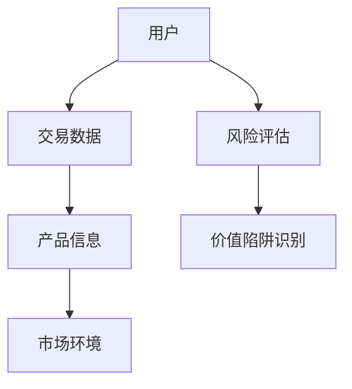

                 


# AI驱动的价值陷阱识别与规避

## 关键词：AI技术，价值陷阱，异常检测，NLP情感分析，风险管理

## 摘要：  
在商业和投资领域，价值陷阱是一种常见但危险的现象，可能导致重大损失。本文将探讨如何利用AI技术来识别和规避这些陷阱。通过分析价值陷阱的特征、原理和算法，结合实际案例和系统设计，本文为读者提供了一套完整的解决方案。

---

# 第一部分：背景介绍

## 第1章：价值陷阱的基本概念

### 1.1 问题背景  
价值陷阱是指在商业或投资中，表面上看似有利可图的机会，实则暗藏风险或亏损的场景。例如，一家公司可能看似业绩增长，但实际存在财务造假或管理问题。  

#### 1.1.1 什么是价值陷阱  
价值陷阱通常表现为：  
- 销量增长但利润下降。  
- 财务数据异常但被掩盖。  
- 市场表现良好但业务模式不可持续。  

#### 1.1.2 价值陷阱的形成原因  
- 企业财务造假或隐瞒问题。  
- 市场波动掩盖真实情况。  
- 分析师或投资者的误判。  

#### 1.1.3 价值陷阱对企业的影响  
- 投资损失。  
- 信任危机。  
- 经营风险。  

### 1.2 问题描述  
价值陷阱的识别具有以下特点：  
- 数据复杂性：涉及财务、市场、产品等多个维度。  
- 时间敏感性：需要及时识别以避免损失。  
- 模糊性：数据和信号可能不完全或有误。  

#### 1.2.1 价值陷阱的典型特征  
- 数据波动异常：如销售额突然下降。  
- 财务指标不匹配：如收入增长但利润下降。  
- 市场反馈滞后：如用户投诉增多。  

#### 1.2.2 价值陷阱的常见场景  
- 投资领域：误判企业基本面。  
- 零售行业：库存积压但未及时清理。  
- 金融领域：隐藏的违约风险。  

#### 1.2.3 价值陷阱的识别难度  
- 数据不足：难以获取关键信息。  
- 计算复杂：需要多维度分析。  
- 人为干扰：企业可能掩盖问题。  

### 1.3 问题解决  
传统方法在识别价值陷阱时存在以下局限性：  
- 依赖人工分析：耗时且易出错。  
- 数据维度单一：难以全面评估。  

#### 1.3.1 传统方法的局限性  
- 人工分析效率低，容易遗漏关键信息。  
- 单一维度分析难以捕捉复杂风险。  

#### 1.3.2 AI技术的优势  
- 高效性：快速处理多维度数据。  
- 准确性：基于算法的模式识别。  
- 智能性：持续优化识别模型。  

#### 1.3.3 结合AI的解决方案  
- 数据采集：整合财务、市场、用户反馈等数据。  
- 特征提取：利用NLP和统计方法提取关键特征。  
- 模型训练：使用机器学习算法识别异常信号。  

### 1.4 边界与外延  
价值陷阱的边界在于其本质是“假象的收益”。外延包括所有可能误导判断的商业现象。  

#### 1.4.1 价值陷阱的边界  
- 明确的财务造假：如虚增收入。  
- 隐含的风险：如高负债率。  

#### 1.4.2 相关概念的对比  
- 价值陷阱 vs. 财务造假：前者是表象，后者是手段。  
- 风险 vs. 机会：价值陷阱是潜在风险。  

#### 1.4.3 价值陷阱的外延  
- 投资领域：企业基本面恶化。  
- 零售领域：库存积压但未及时清理。  

#### 1.4.4 概念结构与核心要素组成  
价值陷阱的识别涉及以下核心要素：  
- 数据特征：如销售额、利润、用户反馈。  
- 业务特征：如行业特性、商业模式。  
- 算法特征：如异常检测、NLP分析。  

---

# 第二部分：核心概念与联系

## 第2章：价值陷阱识别的核心概念

### 2.1 价值陷阱识别的原理  
价值陷阱识别需要结合数据、算法和业务知识。  

#### 2.1.1 数据特征分析  
数据特征包括：  
- 时间序列数据：如月度销售额。  
- 文本数据：如新闻、评论。  

#### 2.1.2 算法特征提取  
- 异常检测：识别数据中的异常点。  
- 情感分析：分析文本中的负面情绪。  

#### 2.1.3 业务特征关联  
- 行业特性：如金融行业的高风险。  
- 企业规模：如小企业更容易造假。  

### 2.2 核心概念对比表格  
以下是核心概念的对比：  

| 特征类型 | 数据特征 | 算法特征 | 业务特征 |
|----------|----------|----------|----------|
| 描述     | 销售数据、用户评论 | 异常检测、情感分析 | 企业规模、行业风险 |
| 作用     | 辅助识别 | 支持决策 | 实际应用 |
| 示例     | 销量波动、用户投诉 | 分类模型、聚类模型 | 投资风险、市场风险 |

### 2.3 ER实体关系图  
以下是价值陷阱识别的实体关系图：  



---

# 第三部分：算法原理讲解

## 第3章：基于AI的价值陷阱识别算法

### 3.1 异常检测算法  
异常检测用于识别数据中的异常点，可能是潜在的价值陷阱。  

#### 3.1.1 算法流程  
1. 数据预处理：清洗和标准化。  
2. 特征提取：选择关键特征。  
3. 模型训练：使用马哈卡诺夫距离或Isolation Forest算法。  
4. 结果分析：标记异常点并解释原因。  

#### 3.1.2 Python实现示例  
```python
import numpy as np
from sklearn.ensemble import IsolationForest

# 示例数据
X = np.array([[1, 2], [3, 4], [5, 6], [7, 8], [9, 10]])

# 训练模型
model = IsolationForest(random_state=42)
model.fit(X)

# 预测异常点
y_pred = model.predict(X)
print(y_pred)
```

#### 3.1.3 算法原理的数学模型  
Isolation Forest算法通过构建隔离树，将数据点隔离成单独的叶节点。隔离树的深度决定了数据点的异常程度。  

### 3.2 NLP情感分析算法  
情感分析用于识别文本中的负面情绪，可能是潜在的价值陷阱。  

#### 3.2.1 算法流程  
1. 数据预处理：分词和去除停用词。  
2. 特征提取：使用TF-IDF提取关键词。  
3. 模型训练：使用朴素贝叶斯或深度学习模型。  
4. 结果分析：识别负面评论并定位问题。  

#### 3.2.2 Python实现示例  
```python
from sklearn.feature_extraction.text import TfidfVectorizer
from sklearn.naive_bayes import MultinomialNB

# 示例文本
text = ["这是一个很好的产品", "产品存在严重问题"]

# 特征提取
vectorizer = TfidfVectorizer()
X = vectorizer.fit_transform(text)

# 训练模型
model = MultinomialNB()
model.fit(X, [1, 0])

# 预测情感
new_text = ["服务态度差"]
X_new = vectorizer.transform([new_text])
y_pred = model.predict(X_new)
print(y_pred)
```

#### 3.2.3 算法原理的数学模型  
TF-IDF计算公式：  
$$ TF-IDF(t, d) = TF(t, d) \times ID

