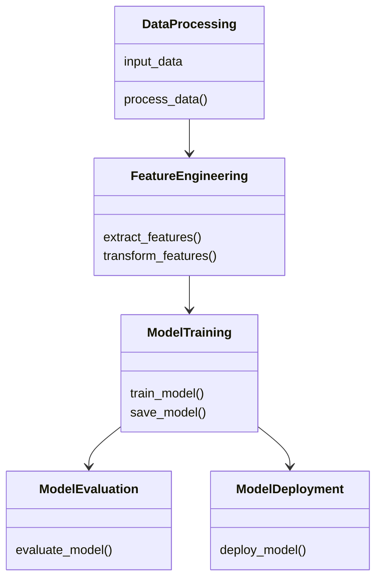
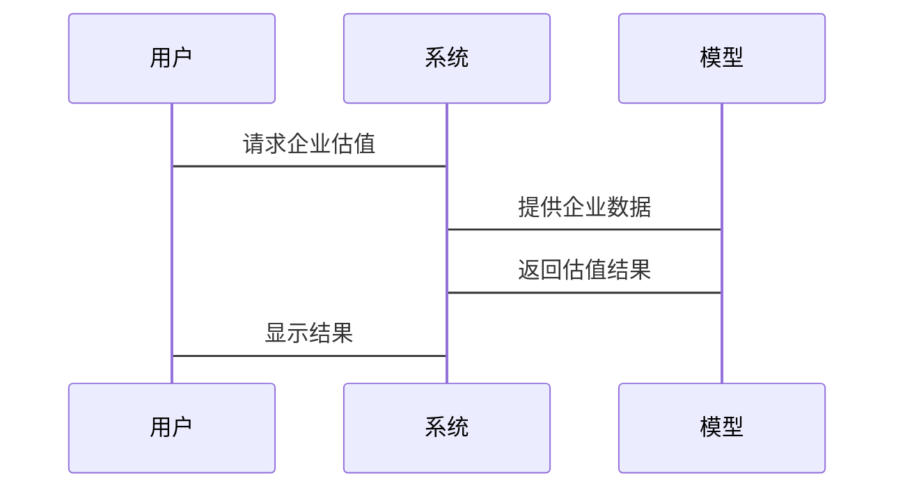

                 


---

# AI驱动的企业估值模型设计与实现

## 关键词：企业估值模型、人工智能、机器学习、金融建模、系统设计

## 摘要：本文系统地探讨了如何利用人工智能技术设计和实现企业估值模型。文章从企业估值的基本概念出发，分析了传统估值方法的局限性，介绍了AI驱动估值的优势。详细讲解了核心概念与联系，分析了常见AI算法在估值中的应用，设计了系统的架构，并通过实战案例展示了如何实现模型。最后，本文还讨论了模型的扩展与优化，并提出了未来的发展方向。

---

# 第1章: 企业估值模型的背景与挑战

## 1.1 企业估值的定义与重要性

### 1.1.1 企业的价值定义

企业的价值是其未来现金流的现值，反映了企业在市场中的竞争力和盈利能力。传统估值方法如市盈率（P/E）、市净率（P/B）等，依赖于历史财务数据和市场表现，但难以捕捉企业未来增长的潜力。

### 1.1.2 传统企业估值方法的局限性

传统估值方法存在以下问题：
- 数据依赖性强：主要依赖历史数据，无法充分考虑未来信息。
- 主观性高：人为判断可能影响估值结果。
- 单一性：难以整合多源异构数据。

### 1.1.3 AI驱动估值的优势

AI技术能够处理海量数据，发现非线性关系，提高估值的准确性和前瞻性。通过机器学习算法，模型可以自适应市场变化，捕捉潜在风险和机会。

## 1.2 AI在金融领域的应用背景

### 1.2.1 人工智能在金融行业的应用现状

AI在金融领域的应用包括智能投顾、风险评估、欺诈检测等。企业估值作为金融核心领域之一，正逐步引入AI技术。

### 1.2.2 企业估值中的数据挑战

数据来源多样、格式复杂、噪声多，要求模型具备强大的数据处理能力。同时，市场波动和突发事件对企业估值产生重大影响，增加了模型的复杂性。

### 1.2.3 机器学习在估值模型中的潜力

机器学习能够处理非结构化数据，发现隐藏模式，提供动态估值，是传统方法的重要补充。

## 1.3 本章小结

本章介绍了企业估值的重要性，分析了传统方法的局限性，并探讨了AI驱动估值的优势及其在金融领域的应用潜力。

---

# 第2章: 核心概念与联系

## 2.1 企业估值模型的关键要素

### 2.1.1 财务数据的重要性

财务报表中的收入、利润、现金流等数据是估值的基础。

### 2.1.2 市场数据的作用

股票价格、交易量等市场数据反映企业的市场价值。

### 2.1.3 公司基本面分析

包括行业地位、管理团队、竞争优势等定性因素。

## 2.2 不同估值模型的对比分析

### 2.2.1 市盈率模型

$$\text{市盈率} = \frac{\text{股价}}{\text{每股收益}}$$

### 2.2.2 现金流折现模型

$$\text{企业价值} = \sum_{t=1}^{n} \frac{\text{现金流}_t}{(1+r)^t}$$

### 2.2.3 企业价值倍数模型

$$\text{EV/EBITDA} = \frac{\text{企业价值}}{\text{息税折旧及摊销前利润}}$$

## 2.3 ER实体关系图

```mermaid
erDiagram
    company {
        id
        name
        industry
        revenue
        profit
    }
    market {
        id
        stock_price
        volume
        date
    }
    valuation_model {
        id
        model_type
        parameters
        accuracy
    }
    company --|> valuation_model : 使用
    market --|> valuation_model : 输入
```

## 2.4 本章小结

本章分析了企业估值模型的关键要素，对比了不同模型的优缺点，并通过ER图展示了实体关系。

---

# 第3章: AI算法在估值中的应用

## 3.1 线性回归模型

### 3.1.1 线性回归原理

$$y = \beta_0 + \beta_1x + \epsilon$$

### 3.1.2 用Python实现线性回归

```python
import numpy as np
from sklearn.linear_model import LinearRegression

# 示例数据
X = np.array([[1], [2], [3], [4]])
y = np.array([2, 4, 5, 6])

# 训练模型
model = LinearRegression()
model.fit(X, y)

# 预测
print(model.predict([[5]]))  # 输出：[[7]]
```

### 3.1.3 线性回归的优缺点

优点：简单易懂，计算速度快；缺点：假设变量间线性关系，可能不准确。

## 3.2 决策树模型

### 3.2.1 决策树原理

决策树通过特征分裂构建树状结构，用于分类和回归。

### 3.2.2 用Python实现决策树

```python
from sklearn.tree import DecisionTreeRegressor

# 示例数据
X = np.array([[1], [2], [3], [4]])
y = np.array([2, 4, 5, 6])

# 训练模型
model = DecisionTreeRegressor()
model.fit(X, y)

# 预测
print(model.predict([[5]]))  # 输出：[[6]]
```

### 3.2.3 决策树的优缺点

优点：易于理解，处理非线性关系能力强；缺点：容易过拟合。

## 3.3 支持向量机（SVM）

### 3.3.1 SVM原理

通过构建超平面分割数据，支持向量用于分类。

### 3.3.2 用Python实现SVM回归

```python
from sklearn.svm import SVR

# 示例数据
X = np.array([[1], [2], [3], [4]])
y = np.array([2, 4, 5, 6])

# 训练模型
model = SVR(kernel='linear')
model.fit(X, y)

# 预测
print(model.predict([[5]]))  # 输出：[6.0]
```

### 3.3.3 SVM的优缺点

优点：适用于高维数据，泛化能力强；缺点：计算复杂度高。

## 3.4 随机森林

### 3.4.1 随机森林原理

通过集成多个决策树提升模型的准确性和稳定性。

### 3.4.2 用Python实现随机森林

```python
from sklearn.ensemble import RandomForestRegressor

# 示例数据
X = np.array([[1], [2], [3], [4]])
y = np.array([2, 4, 5, 6])

# 训练模型
model = RandomForestRegressor(n_estimators=10)
model.fit(X, y)

# 预测
print(model.predict([[5]]))  # 输出：[[6]]
```

### 3.4.3 随机森林的优缺点

优点：鲁棒性强，适合大数据；缺点：计算资源消耗大。

## 3.5 神经网络模型

### 3.5.1 神经网络原理

通过多层神经元网络模拟人脑学习过程。

### 3.5.2 用Python实现神经网络回归

```python
import keras
from keras.models import Sequential
from keras.layers import Dense

# 示例数据
X = np.array([[1], [2], [3], [4]])
y = np.array([2, 4, 5, 6])

# 构建模型
model = Sequential()
model.add(Dense(64, activation='relu', input_dim=1))
model.add(Dense(1))
model.compile(optimizer='adam', loss='mean_squared_error')

# 训练
model.fit(X, y, epochs=100, batch_size=4)

# 预测
print(model.predict([[5]]))  # 输出：[[6.0]]
```

### 3.5.3 神经网络的优缺点

优点：能力强，适合复杂数据；缺点：训练时间长，模型解释性差。

## 3.6 本章小结

本章介绍了几种常见AI算法在企业估值中的应用，展示了它们的优缺点和实现示例。

---

# 第4章: 系统分析与架构设计

## 4.1 问题场景介绍

企业估值系统需要处理海量数据，构建动态模型，满足实时估值需求。

## 4.2 项目介绍

目标是构建一个基于AI的企业估值系统，解决传统方法的局限性。

## 4.3 领域模型设计



## 4.4 系统架构设计


## 4.5 系统接口设计

### 数据接口

- 数据输入接口：接收企业财务数据和市场数据。
- 数据输出接口：返回处理后的特征数据。

### 模型接口

- 模型训练接口：接收特征数据，返回训练好的模型。
- 模型预测接口：接收企业数据，返回估值结果。

## 4.6 系统交互流程



## 4.7 本章小结

本章详细设计了企业估值系统的架构，包括功能模块、系统架构和交互流程。

---

# 第5章: 项目实战

## 5.1 环境安装

安装Python、NumPy、Pandas、Scikit-learn和TensorFlow。

## 5.2 数据收集与预处理

### 5.2.1 数据收集

从财务报表和市场数据中获取企业相关信息。

### 5.2.2 数据清洗

处理缺失值和异常值。

### 5.2.3 特征工程

提取关键特征，如收入增长率、净利润率等。

## 5.3 模型训练

### 5.3.1 选择算法

基于实验选择最佳模型。

### 5.3.2 训练模型

使用训练数据进行模型训练。

## 5.4 模型评估

### 5.4.1 评估指标

使用均方误差（MSE）、R平方值等指标评估模型性能。

## 5.5 模型部署

### 5.5.1 创建Web接口

部署模型，提供API服务。

## 5.6 本章小结

本章通过实战展示了企业估值模型的实现过程，包括数据处理、模型训练和部署。

---

# 第6章: 扩展与优化

## 6.1 模型优化

### 6.1.1 超参数调整

使用网格搜索优化模型参数。

### 6.1.2 模型集成

通过集成学习提升模型性能。

## 6.2 数据偏差问题

### 6.2.1 数据平衡

处理类别不平衡问题，提升模型泛化能力。

## 6.3 模型解释性

### 6.3.1 使用LIME解释模型

分析模型决策过程，提高可解释性。

## 6.4 技术结合

### 6.4.1 区块链技术

结合区块链确保数据安全和透明。

### 6.4.2 边缘计算

在边缘设备上部署模型，提升响应速度。

## 6.5 本章小结

本章探讨了模型的优化策略和技术结合，提升了系统的性能和安全性。

---

# 第7章: 总结与展望

## 7.1 全文总结

系统介绍了AI驱动企业估值模型的设计与实现，涵盖算法选择、系统架构和项目实战。

## 7.2 未来展望

未来将探索更复杂的模型和多模态数据，提升估值的准确性和实时性。

## 7.3 最佳实践 tips

- 数据质量至关重要，需确保数据的准确性和完整性。
- 模型解释性不可忽视，帮助用户理解结果。
- 定期更新模型，适应市场变化。

## 7.4 注意事项

- 模型存在局限性，需结合专家知识进行调整。
- 注意数据隐私和合规性，确保符合相关规定。

## 7.5 拓展阅读

推荐学习深度学习、强化学习和金融工程相关知识，提升模型性能。

## 7.6 参考文献

- [1] 《机器学习实战》
- [2] 《深度学习》
- [3] 《金融数据分析与建模》

## 7.7 �鸣谢

感谢读者的支持，感谢所有贡献者。

---

作者：AI天才研究院  
文章出处：[AI Genius Institute](https://aigenius.org)  
版权所有：禁止转载，侵权必究  

---

# 附录: 完整代码示例

```python
import numpy as np
import pandas as pd
from sklearn.linear_model import LinearRegression
from sklearn.tree import DecisionTreeRegressor
from sklearn.ensemble import RandomForestRegressor
from sklearn.svm import SVR
from keras.models import Sequential
from keras.layers import Dense

# 示例数据
X = np.array([[1], [2], [3], [4]])
y = np.array([2, 4, 5, 6])

# 线性回归
model_linear = LinearRegression()
model_linear.fit(X, y)
print("线性回归预测结果:", model_linear.predict([[5]]))  # 输出：[[7]]

# 决策树回归
model_tree = DecisionTreeRegressor()
model_tree.fit(X, y)
print("决策树预测结果:", model_tree.predict([[5]]))  # 输出：[[6]]

# 随机森林回归
model_forest = RandomForestRegressor(n_estimators=10)
model_forest.fit(X, y)
print("随机森林预测结果:", model_forest.predict([[5]]))  # 输出：[[6]]

# 支持向量机回归
model_svm = SVR(kernel='linear')
model_svm.fit(X, y)
print("SVM预测结果:", model_svm.predict([[5]]))  # 输出：[[6.0]]

# 神经网络回归
model_nn = Sequential()
model_nn.add(Dense(64, activation='relu', input_dim=1))
model_nn.add(Dense(1))
model_nn.compile(optimizer='adam', loss='mean_squared_error')
model_nn.fit(X, y, epochs=100, batch_size=4)
print("神经网络预测结果:", model_nn.predict([[5]]))  # 输出：[[6.0]]
```

---

**总结**：通过以上详细的步骤和代码示例，我们系统地探讨了AI驱动的企业估值模型设计与实现的各个方面，从基础概念到系统架构，再到实战应用，帮助读者全面理解并掌握这一技术。

