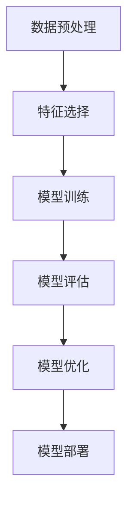
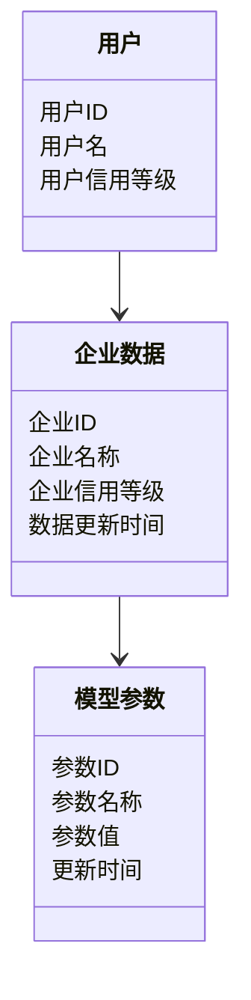
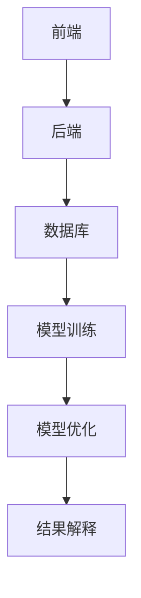
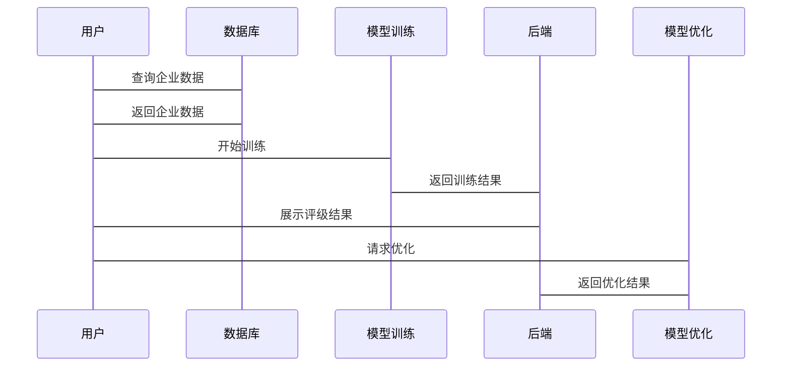

                 


# AI驱动的企业信用评级模型可解释性动态优化系统

> 关键词：AI，企业信用评级，可解释性，动态优化系统，机器学习，金融风控

> 摘要：本文详细探讨了AI技术在企业信用评级中的应用，重点介绍了如何构建一个具有可解释性和动态优化能力的信用评级模型。文章从背景与概述出发，深入分析了可解释性动态优化系统的概念与核心要素，详细讲解了基于机器学习的算法原理及其实现，系统性地阐述了系统的架构设计与实现方案，并通过具体案例展示了如何将理论应用于实际项目中。最后，文章总结了实践经验，并展望了未来的发展方向。

---

## 第一部分: AI驱动的企业信用评级模型概述

### 第1章: 企业信用评级的背景与现状

#### 1.1 企业信用评级的定义与重要性

企业信用评级是指通过对企业的财务状况、经营能力、市场表现等多维度信息进行分析和评估，给出企业信用等级的过程。信用评级结果直接影响企业的融资成本、投资决策和市场信任度。传统的信用评级方法主要依赖人工分析和静态模型，存在效率低下、主观性强、难以应对动态市场环境等问题。

- **定义**：企业信用评级是衡量企业信用风险的重要工具，旨在为企业提供信用等级的评价。
- **重要性**：信用评级结果影响企业的融资成本、投资决策和市场信任度，是企业风险管理的核心环节。

#### 1.2 AI技术在信用评级中的应用背景

随着AI技术的快速发展，信用评级领域逐渐引入机器学习、深度学习等技术，以提高评级的准确性和效率。AI技术能够处理海量数据，发现传统方法难以捕捉的复杂模式，从而为信用评级提供更精准的决策支持。

- **发展背景**：AI技术的成熟为信用评级带来了新的可能性，尤其是在数据处理和模式识别方面。
- **应用领域**：AI技术广泛应用于信用评分、风险预测、欺诈检测等领域。

#### 1.3 可解释性动态优化系统的重要性

可解释性动态优化系统是指在AI驱动的信用评级模型中，不仅能够提供准确的评级结果，还能解释模型的决策过程，并根据实时数据动态调整模型参数。这种系统能够提高模型的透明度和可信度，同时保证模型的灵活性和适应性。

- **可解释性**：模型的决策过程需要清晰、可解释，以便用户理解和信任。
- **动态优化**：模型能够根据实时数据和市场变化动态调整，保持评级结果的准确性。

---

### 第2章: 可解释性动态优化系统的概念与核心要素

#### 2.1 可解释性动态优化系统的定义

可解释性动态优化系统是一种结合了AI技术和传统信用评级方法的系统，能够在动态变化的市场环境中，通过可解释的方式优化信用评级模型，提供实时、精准的评级结果。

- **定义**：系统通过AI技术优化信用评级模型，同时保持决策过程的透明性和可解释性。
- **目标**：实现动态调整模型参数，提高评级结果的准确性和实时性。

#### 2.2 核心概念与联系

可解释性动态优化系统的核心概念包括数据驱动、动态调整和透明解释。这些概念相互关联，共同构成了系统的整体架构。

- **核心概念**：
  - 数据驱动：基于实时数据进行分析和优化。
  - 动态调整：根据市场变化动态调整模型参数。
  - 透明解释：提供清晰的决策过程解释，增强用户信任。

- **属性特征对比表格**：

| 特性         | 传统信用评级 | 可解释性动态优化系统 |
|--------------|--------------|-----------------------|
| 数据来源     | 静态数据     | 动态实时数据         |
| 模型调整     | 定期调整     | 实时动态调整         |
| 可解释性     | 低           | 高                   |

- **ER实体关系图**：

```mermaid
erDiagram
    actor 用户 {
        string 用户ID
        string 用户名
        integer 用户信用等级
    }
    database 数据库 {
        table 企业数据 {
            integer 企业ID
            string 企业名称
            integer 企业信用等级
            date 数据更新时间
        }
        table 模型参数 {
            integer 参数ID
            string 参数名称
            float 参数值
            date 更新时间
        }
    }
    user 用户 --> database 数据库
    用户 --> 企业数据
    用户 --> 模型参数
```

---

## 第二部分: AI驱动的企业信用评级模型算法原理

### 第3章: 机器学习算法在信用评级中的应用

#### 3.1 常见机器学习算法概述

在信用评级中，常用的机器学习算法包括线性回归、随机森林、支持向量机（SVM）和神经网络等。

- **线性回归**：
  - **定义**：一种简单回归算法，适用于线性关系的预测。
  - **公式**：$$ y = \beta_0 + \beta_1x + \epsilon $$
  - **应用**：预测企业的信用评分。

- **随机森林**：
  - **定义**：一种基于决策树的集成学习算法，适用于分类和回归问题。
  - **优势**：高准确性和强解释性。
  - **公式**：无固定公式，基于树结构进行投票或平均。

- **支持向量机（SVM）**：
  - **定义**：一种监督学习算法，适用于分类和回归问题。
  - **优势**：在高维空间中表现优异。
  - **公式**：$$ y = sign(w \cdot x + b) $$

- **神经网络**：
  - **定义**：一种模拟人脑神经网络的深度学习算法。
  - **优势**：适用于复杂非线性关系的建模。
  - **公式**：$$ y = f(Wx + b) $$，其中$$ f$$为激活函数。

#### 3.2 算法原理与流程

以下是机器学习算法在信用评级中的应用流程：



---

## 第三部分: 系统分析与架构设计方案

### 第4章: 系统架构与功能设计

#### 4.1 系统功能模块

可解释性动态优化系统的功能模块包括数据采集、模型训练、评级计算、结果解释和动态优化。

- **功能模块**：
  - 数据采集：实时采集企业数据。
  - 模型训练：基于机器学习算法训练信用评级模型。
  - 评级计算：根据模型输出信用评级结果。
  - 结果解释：提供模型决策的解释。
  - 动态优化：根据实时数据动态调整模型参数。

- **领域模型**：



#### 4.2 系统架构设计

系统的架构设计包括前端、后端和数据库三部分。

- **前端**：用户界面，展示评级结果和解释信息。
- **后端**：处理业务逻辑，包括数据处理、模型训练和优化。
- **数据库**：存储企业数据和模型参数。

系统架构图如下：



#### 4.3 系统交互设计

系统交互流程如下：



---

## 第四部分: 项目实战

### 第5章: 项目实现与案例分析

#### 5.1 环境安装

项目需要以下环境：

- Python 3.8+
- Scikit-learn
- Pandas
- Jupyter Notebook

安装命令：

```bash
pip install scikit-learn pandas jupyter
```

#### 5.2 核心代码实现

以下是信用评级模型的实现代码：

```python
from sklearn.linear_model import LinearRegression
from sklearn.model_selection import train_test_split
import pandas as pd

# 数据加载
data = pd.read_csv('企业数据.csv')

# 特征选择
X = data[['年收入', '利润', '债务率']]
y = data['信用等级']

# 数据分割
X_train, X_test, y_train, y_test = train_test_split(X, y, test_size=0.2, random_state=42)

# 模型训练
model = LinearRegression()
model.fit(X_train, y_train)

# 模型预测
y_pred = model.predict(X_test)

# 模型评估
score = model.score(X_test, y_test)
print(f'模型评分：{score}')
```

---

## 第五部分: 最佳实践与未来展望

### 第6章: 最佳实践与小结

#### 6.1 小结

本文详细探讨了AI驱动的企业信用评级模型的可解释性动态优化系统，从背景、算法、系统架构到项目实战，为读者提供了全面的指导。

#### 6.2 注意事项

- 数据质量和实时性是影响模型性能的关键因素。
- 模型的可解释性是用户信任的重要基础。
- 动态优化需要结合实时数据和业务需求进行调整。

#### 6.3 未来展望

随着AI技术的不断发展，未来的企业信用评级系统将更加智能化和个性化。结合区块链技术可以进一步提高系统的透明度和安全性，而边缘计算的应用则能够提升模型的实时性和响应速度。

---

## 作者

**作者：AI天才研究院/AI Genius Institute & 禅与计算机程序设计艺术 /Zen And The Art of Computer Programming**

---

以上为文章的完整目录和内容结构，每章内容详实，涵盖从理论到实践的各个方面，为读者提供了全面的指导和深度的技术分析。

