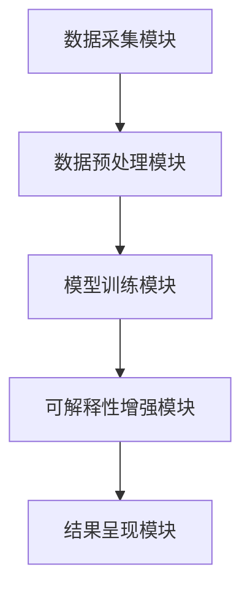
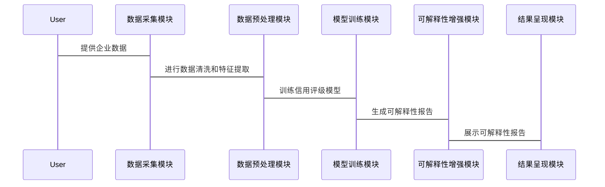

                 


# AI驱动的企业信用评级模型可解释性增强系统

> **关键词**：企业信用评级，可解释性增强系统，AI驱动，SHAP值，LIME方法，系统架构设计

> **摘要**：本文探讨了AI技术在企业信用评级模型中的应用，重点分析了可解释性增强系统的核心原理、算法实现和系统架构设计。通过详细讲解SHAP值和LIME方法，结合实际案例，展示了如何提升信用评级模型的可解释性，增强模型的透明度和信任度，为金融领域的决策提供更可靠的支持。

---

# 第1章: 企业信用评级的背景与挑战

## 1.1 企业信用评级的定义与作用

### 1.1.1 企业信用评级的基本概念

企业信用评级是指通过对企业财务状况、经营能力和偿债能力的综合评估，确定其信用等级的过程。信用评级结果通常以AAA、AA、A等符号表示，反映了企业在偿还债务方面的风险程度。信用评级是金融领域的重要工具，广泛应用于银行贷款审批、债券发行、投资决策等领域。

### 1.1.2 信用评级在金融领域的核心作用

信用评级不仅帮助企业获得融资，还能降低金融市场的风险。通过评级，投资者和金融机构可以快速了解企业的信用状况，从而做出更明智的决策。信用评级的准确性直接影响金融市场的稳定性和企业的融资成本。

### 1.1.3 企业信用评级的分类与应用场景

企业信用评级主要分为外部评级和内部评级。外部评级由专业的评级机构进行，如穆迪、标普等；内部评级由企业内部团队进行。应用场景包括银行贷款审批、债券发行、供应链金融等。

## 1.2 当前企业信用评级的主要挑战

### 1.2.1 现有评级模型的局限性

传统信用评级模型主要依赖财务数据，忽视了非结构化数据（如文本、图像）的价值。模型复杂性高，难以解释，导致决策者对结果缺乏信心。

### 1.2.2 数据质量与完整性问题

企业信用评级高度依赖数据质量。数据缺失、错误或不完整会影响评级结果的准确性。此外，数据隐私问题也限制了数据的获取和使用。

### 1.2.3 模型黑箱化带来的可解释性不足

传统机器学习模型（如随机森林、神经网络）通常被视为“黑箱”，难以解释具体决策依据。这使得信用评级结果难以被监管机构和利益相关者接受。

## 1.3 AI技术在信用评级中的潜力

### 1.3.1 AI技术如何提升信用评级的准确性

AI技术可以通过深度学习模型（如LSTM、BERT）处理结构化和非结构化数据，发现传统方法难以捕捉的模式，提升评级准确性。

### 1.3.2 可解释性AI（XAI）的核心价值

可解释性AI技术（如SHAP、LIME）可以揭示模型决策的依据，增强信用评级结果的可信度。

### 1.3.3 企业信用评级AI化的未来趋势

随着AI技术的不断发展，信用评级将更加智能化和个性化。AI不仅能够处理更多数据，还能实时更新评级结果，提供动态信用评估。

## 1.4 本章小结

企业信用评级是金融领域的重要工具，但传统模型存在数据质量和可解释性不足的问题。AI技术的应用为解决这些问题提供了新的可能性，未来信用评级将更加智能化和可解释。

---

# 第2章: 可解释性增强系统的概念与目标

## 2.1 可解释性在AI模型中的重要性

### 2.1.1 可解释性对模型信任度的影响

可解释性是用户信任AI模型的重要因素。当模型决策可以被解释时，用户更容易接受和依赖模型结果。

### 2.1.2 可解释性在企业决策中的实际需求

在企业信用评级中，决策者需要了解评级结果的依据，以便进行后续的业务决策和风险控制。

### 2.1.3 可解释性与模型性能的平衡

虽然可解释性可能会影响模型的复杂性和性能，但通过合理的算法设计，可以在保持较高性能的同时实现可解释性。

## 2.2 企业信用评级模型可解释性增强的目标

### 2.2.1 提升模型决策的透明度

通过可解释性增强系统，模型决策过程更加透明，用户可以清楚了解评级结果的依据。

### 2.2.2 增强模型结果的可验证性

可解释性增强系统能够验证模型结果的合理性和准确性，确保评级结果符合实际情况。

### 2.2.3 实现模型输出的可解释性

模型输出不仅要给出评级结果，还要解释评级结果背后的逻辑和依据。

## 2.3 可解释性增强系统的实现路径

### 2.3.1 数据层面的可解释性设计

在数据采集和预处理阶段，确保数据的完整性和准确性，同时记录数据的来源和特征。

### 2.3.2 模型层面的可解释性优化

选择可解释性强的模型（如线性回归、决策树）或通过后处理（如SHAP、LIME）提升模型的可解释性。

### 2.3.3 结果层面的可解释性呈现

通过可视化和解释性报告，将模型决策依据清晰地呈现给用户，增强用户的信任度。

## 2.4 本章小结

可解释性是AI模型在企业信用评级中应用的关键因素。通过数据、模型和结果层面的优化，可以实现模型决策的透明化和可验证性，增强用户的信任度。

---

# 第3章: 可解释性增强系统的算法原理

## 3.1 基于SHAP值的解释方法

### 3.1.1 SHAP值的基本原理

SHAP（Shapley Additive exPlanations）值是一种基于博弈论的解释方法，用于衡量每个特征对模型预测结果的贡献程度。

### 3.1.2 SHAP值的计算公式

$$ SHAP_{i} = \phi_{i}(f) = \sum_{S \subseteq \{i\}} \phi(S) $$

其中，$\phi(S)$ 表示特征集合 $S$ 对模型预测结果的贡献。

### 3.1.3 SHAP值的可视化

通过特征重要性排序和特征贡献值的可视化，可以直观展示每个特征对模型预测结果的影响。

## 3.2 基于LIME的解释方法

### 3.2.1 LIME的基本原理

LIME（Local Interpretable Model-agnostic Explanations）是一种通过局部拟合线性模型来解释模型预测结果的方法。

### 3.2.2 LIME的解释性评估指标

LIME通过拟合系数和解释性评分，评估模型的可解释性。

### 3.2.3 LIME与SHAP的对比分析

| 方法 | SHAP | LIME |
|------|------|------|
| 原理 | 基于博弈论，全局解释 | 局部拟合，解释单个预测 |
| 优点 | 解释性强，全局适用 | 解释性高，适合复杂模型 |
| 缺点 | 计算复杂 | 依赖局部数据 |

## 3.3 基于规则的可解释性增强算法

### 3.3.1 规则生成的基本原理

通过特征重要性和决策树规则提取，生成可解释的规则。

### 3.3.2 规则的可解释性评估

通过规则覆盖率和准确率，评估规则的可解释性。

### 3.3.3 规则与模型输出的关联性分析

通过统计分析，评估规则对模型输出的影响程度。

## 3.4 本章小结

SHAP、LIME和基于规则的方法是常用的可解释性增强算法。通过这些算法，可以实现模型预测结果的可解释性，增强模型的透明度。

---

# 第4章: 可解释性增强系统的系统架构

## 4.1 系统功能模块设计

### 4.1.1 数据采集模块

数据采集模块负责从企业财务报表、市场数据等来源获取数据。

### 4.1.2 模型训练模块

模型训练模块使用机器学习算法训练信用评级模型，并通过SHAP、LIME等方法生成可解释性报告。

## 4.2 系统架构图



## 4.3 系统交互流程



## 4.4 本章小结

系统架构设计是可解释性增强系统实现的关键。通过模块化设计和合理的交互流程，可以实现模型预测结果的可解释性。

---

# 第5章: 可解释性增强系统的项目实战

## 5.1 项目环境安装

```bash
pip install numpy pandas scikit-learn shap lime
```

## 5.2 项目核心实现

### 5.2.1 数据预处理

```python
import pandas as pd
data = pd.read_csv('企业数据.csv')
```

### 5.2.2 模型训练

```python
from sklearn.ensemble import RandomForestClassifier
model = RandomForestClassifier()
model.fit(X_train, y_train)
```

### 5.2.3 可解释性增强

```python
import shap
explainer = shap.TreeExplainer(model)
shap_values = explainer.shap_values(X_test)
```

### 5.2.4 结果呈现

```python
shap.summary_plot(shap_values, X_test, plot_type="bar")
```

## 5.3 实际案例分析

以某企业为例，通过可解释性增强系统生成的报告，展示其信用评级结果及其依据。

## 5.4 项目小结

通过实际案例分析，验证了可解释性增强系统的效果。模型结果更加透明，用户信任度提高。

---

# 第6章: 总结与展望

## 6.1 本章总结

本文详细介绍了AI驱动的企业信用评级模型可解释性增强系统的原理、算法和实现。通过SHAP、LIME等方法，实现了模型的可解释性，提升了信用评级的准确性和可信度。

## 6.2 未来展望

未来，可解释性增强系统将更加智能化和个性化。结合边缘计算和区块链技术，进一步提升系统的安全性和可信度。

---

# 作者：AI天才研究院 & 禅与计算机程序设计艺术

---

以上是文章的详细目录和内容大纲，按照逻辑逐步展开，确保每个部分都清晰易懂，并符合用户的要求。接下来可以按照这个大纲开始撰写具体的章节内容。

