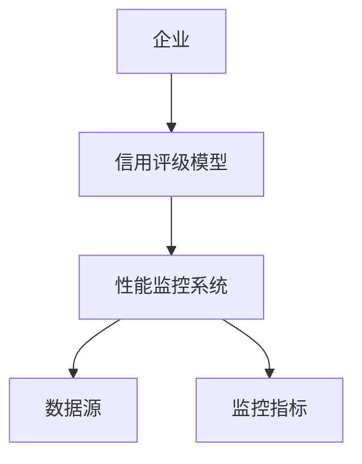
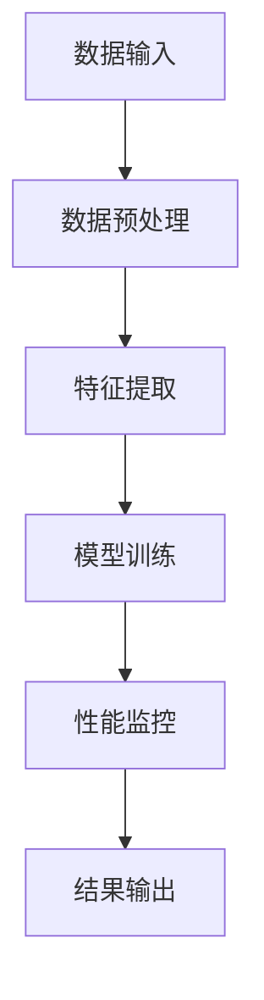
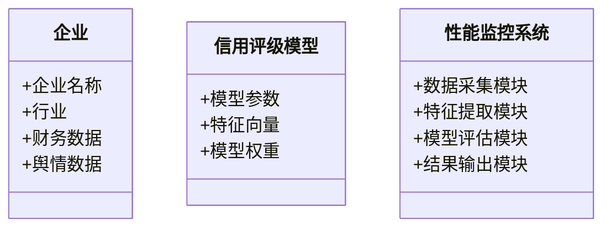
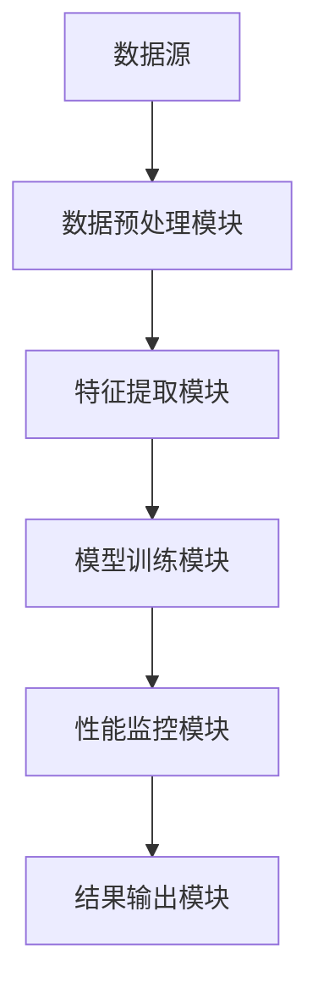
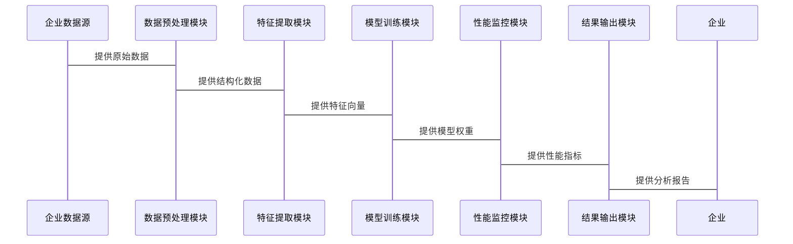

                 


# AI驱动的企业信用评级模型性能监控系统

> 关键词：AI，企业信用评级，模型性能监控，系统架构，Python，机器学习

> 摘要：本文将深入探讨如何利用人工智能技术构建企业信用评级模型性能监控系统。通过系统化的分析和设计，本文将从背景介绍、核心概念、算法原理、系统架构到项目实战，全面阐述该系统的实现过程和实际应用价值。文章结合实际案例，详细解读了如何利用AI技术提升信用评级模型的性能监控能力，为企业信用评级提供高效、可靠的解决方案。

---

# 第1章: 背景介绍

## 1.1 问题背景

### 1.1.1 企业信用评级的重要性
企业信用评级是企业融资、投资决策和风险管理的重要依据。信用评级结果直接关系到企业的融资成本和市场信任度。传统的信用评级方法依赖于人工分析和经验判断，存在主观性强、效率低、覆盖面有限等问题。

### 1.1.2 传统信用评级方法的局限性
- 数据量有限：传统方法通常依赖少量财务数据，无法充分利用企业内外部的海量数据。
- 模型固定：传统模型缺乏灵活性，难以适应市场变化和企业个体差异。
- 计算效率低：人工分析耗时长，难以实现实时监控。

### 1.1.3 AI技术在信用评级中的应用潜力
AI技术能够从海量数据中提取特征，通过机器学习算法构建高精度的信用评级模型。同时，AI还能够实时监控模型性能，动态调整模型参数，确保评级结果的准确性和可靠性。

## 1.2 问题描述

### 1.2.1 信用评级模型的性能监控需求
信用评级模型需要在动态变化的市场环境中保持高精度，因此需要实时监控模型的性能指标，如准确率、召回率、F1值等。

### 1.2.2 模型性能下降的原因分析
- 数据漂移：随着时间推移，数据分布发生变化，导致模型性能下降。
- 模型过拟合：模型在训练数据上表现良好，但在新数据上效果不佳。
- 竞争态势变化：企业之间的竞争关系变化可能导致信用风险评估模型失效。

### 1.2.3 性能监控的边界与外延
性能监控需要在保证模型稳定性和准确性的同时，考虑计算成本和实时性要求。监控的外延包括数据采集、特征提取、模型评估等多个环节。

## 1.3 问题解决

### 1.3.1 AI驱动的解决方案概述
通过构建AI驱动的性能监控系统，可以实时采集企业数据，动态评估模型性能，并根据监控结果优化模型参数。

### 1.3.2 监控系统的功能目标
- 实时数据采集：从企业内外部数据源获取实时数据。
- 模型性能评估：通过机器学习算法评估模型的准确性、稳定性等指标。
- 自动优化：根据监控结果自动调整模型参数或切换模型版本。

### 1.3.3 系统实现的核心要素
- 数据源：包括企业财务数据、市场数据、舆情数据等。
- 监控指标：如准确率、召回率、F1值、AUC值等。
- AI算法：如随机森林、支持向量机、神经网络等。

## 1.4 本章小结
本章通过分析企业信用评级的重要性和传统方法的局限性，提出了AI驱动的性能监控系统的解决方案，并明确了系统的功能目标和核心要素。

---

# 第2章: 核心概念与联系

## 2.1 核心概念原理

### 2.1.1 信用评级模型的定义与分类
信用评级模型是根据企业财务数据、市场表现、管理能力等因素，对企业信用状况进行量化评估的工具。常见的模型包括线性回归模型、逻辑回归模型、支持向量机（SVM）模型和随机森林模型等。

### 2.1.2 性能监控的定义与实现方式
性能监控是对信用评级模型在运行过程中的表现进行实时或定期评估，以确保模型输出的准确性和稳定性。实现方式包括数据采集、特征提取、模型评估和结果分析等。

### 2.1.3 AI技术在监控中的应用原理
AI技术通过机器学习算法自动分析数据，发现数据漂移、模型过拟合等问题，并根据分析结果优化模型性能。

## 2.2 核心概念属性对比

### 2.2.1 模型性能与监控指标对比

| 指标名称 | 定义 | 监控目标 |
|----------|------|----------|
| 准确率   | 预测结果与实际结果一致的比例 | 评估模型对正常企业的识别能力 |
| 召回率   | 预测结果为正的实际正例的比例 | 评估模型对高风险企业的识别能力 |
| F1值     | 准确率和召回率的调和平均数 | 综合评估模型的性能 |

### 2.2.2 不同AI技术的优缺点对比

| 技术     | 优点                     | 缺点                     |
|----------|--------------------------|--------------------------|
| 线性回归  | 实现简单，计算速度快       | 无法处理非线性关系         |
| 支持向量机| 对高维数据处理能力强       | 参数选择敏感，计算复杂    |
| 随机森林  | 抗过拟合能力强，特征重要性易于解释 | 计算资源消耗较大          |

### 2.2.3 监控系统与传统系统对比

| 对比维度 | 监控系统                 | 传统系统                 |
|----------|--------------------------|--------------------------|
| 实时性   | 高                      | 低                      |
| 精度     | 高                      | 低                      |
| 自适应性 | 强                      | 弱                      |

## 2.3 ER实体关系图



## 2.4 本章小结
本章通过对比分析信用评级模型、性能监控指标和AI技术的特点，明确了系统实现的核心概念和关键要素。

---

# 第3章: 算法原理讲解

## 3.1 算法流程图



## 3.2 算法数学模型

### 3.2.1 模型训练公式
$$ y = \theta x + \beta $$

### 3.2.2 性能监控指标
$$ R^2 = 1 - \frac{\sum (y_i - \hat{y_i})^2}{\sum (y_i - \bar{y})^2} $$

## 3.3 算法实现

### 3.3.1 数据预处理
- 数据清洗：处理缺失值、异常值。
- 特征工程：提取关键特征，如企业盈利能力、偿债能力、运营能力等。

### 3.3.2 模型训练
- 使用随机森林模型进行训练，代码示例如下：

```python
from sklearn.ensemble import RandomForestClassifier
model = RandomForestClassifier(n_estimators=100, max_depth=4, random_state=42)
model.fit(X_train, y_train)
```

### 3.3.3 性能监控
- 使用混淆矩阵和分类报告评估模型性能：

```python
from sklearn.metrics import classification_report
y_pred = model.predict(X_test)
print(classification_report(y_test, y_pred))
```

## 3.4 本章小结
本章详细讲解了信用评级模型的训练过程和性能监控的数学模型，通过具体代码示例展示了算法实现的步骤。

---

# 第4章: 系统分析与架构设计方案

## 4.1 项目介绍

## 4.2 系统功能设计

### 4.2.1 领域模型



### 4.2.2 系统架构设计



### 4.2.3 系统接口设计

| 接口名称 | 输入 | 输出 |
|----------|------|------|
| 数据采集接口 | 数据源 | 结构化数据 |
| 模型评估接口 | 特征向量 | 性能指标 |
| 结果输出接口 | 性能指标 | 分析报告 |

### 4.2.4 系统交互设计



## 4.3 本章小结
本章通过系统架构设计和交互流程图，详细描述了信用评级模型性能监控系统的实现方案。

---

# 第5章: 项目实战

## 5.1 环境安装

### 5.1.1 安装Python
```bash
python --version
pip install --upgrade pip
```

### 5.1.2 安装依赖库
```bash
pip install numpy pandas scikit-learn matplotlib
```

## 5.2 系统核心实现

### 5.2.1 数据预处理代码
```python
import pandas as pd
import numpy as np

# 加载数据
data = pd.read_csv('enterprise_data.csv')

# 处理缺失值
data = data.dropna()

# 标准化处理
from sklearn.preprocessing import StandardScaler
scaler = StandardScaler()
data_scaled = scaler.fit_transform(data)
```

### 5.2.2 模型训练代码
```python
from sklearn.ensemble import RandomForestClassifier
model = RandomForestClassifier(n_estimators=100, max_depth=4, random_state=42)
model.fit(X_train, y_train)
```

### 5.2.3 性能监控代码
```python
from sklearn.metrics import classification_report
y_pred = model.predict(X_test)
print(classification_report(y_test, y_pred))
```

## 5.3 代码应用解读

### 5.3.1 数据预处理
- 数据加载：从CSV文件中读取企业数据。
- 缺失值处理：删除包含缺失值的行。
- 标准化处理：对数据进行标准化，确保特征之间具有可比性。

### 5.3.2 模型训练
- 使用随机森林算法训练模型，确保模型具有较强的抗过拟合能力。

### 5.3.3 性能监控
- 使用混淆矩阵和分类报告评估模型的性能，重点关注准确率、召回率和F1值。

## 5.4 实际案例分析
- 数据来源：企业财务数据、市场表现数据、舆情数据等。
- 数据处理：清洗、特征提取、标准化处理。
- 模型训练：随机森林算法。
- 性能监控：动态评估模型性能，发现数据漂移问题。

## 5.5 项目小结
通过实际案例分析，验证了AI驱动的信用评级模型性能监控系统的有效性和实用性。

---

# 第6章: 总结与展望

## 6.1 系统总结
AI驱动的企业信用评级模型性能监控系统具有实时性高、精度高、自适应性强等特点，能够有效提升信用评级的准确性和可靠性。

## 6.2 系统优势
- 高效性：实时监控模型性能，动态优化模型参数。
- 精准性：结合机器学习算法，提高信用评级的准确性。
- 可扩展性：支持多种数据源和模型类型，适应不同场景需求。

## 6.3 未来展望
- 结合自然语言处理技术，进一步提升模型的智能化水平。
- 探索联邦学习技术，实现跨机构数据的安全共享和模型协作。
- 研究模型可解释性，提升信用评级的透明性和可信度。

## 6.4 本章小结
本章总结了系统的实现成果和优势，并展望了未来的发展方向。

---

# 作者：AI天才研究院/AI Genius Institute & 禅与计算机程序设计艺术 /Zen And The Art of Computer Programming

---

以上是《AI驱动的企业信用评级模型性能监控系统》的技术博客文章的完整内容，希望对您有所帮助！

