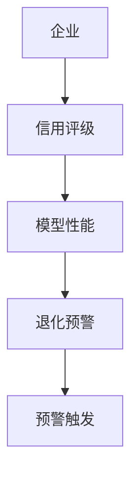
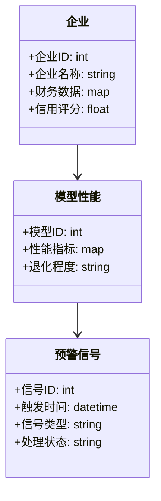
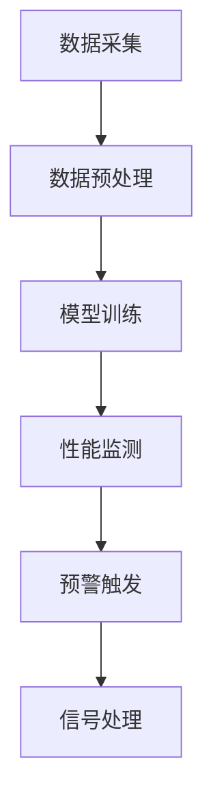
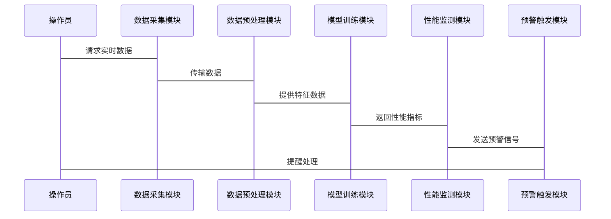

                 


# AI驱动的企业信用评级模型性能退化预警系统

> 关键词：AI驱动，企业信用评级，模型性能退化，预警系统，机器学习，性能监测，实时预警

> 摘要：本文详细探讨了如何利用人工智能技术构建企业信用评级模型性能退化预警系统。通过对模型性能退化的原因、机制和预警方法的系统分析，结合实际应用场景，提出了基于AI的预警系统设计方案。文章从背景、核心概念、算法原理、系统架构到项目实战和最佳实践进行了全面阐述，旨在为企业信用评级模型的性能监测和优化提供理论依据和实践指导。

---

# 第一部分: 背景介绍

# 第1章: 背景介绍

## 1.1 问题背景

### 1.1.1 企业信用评级的重要性
企业信用评级是企业获得融资、授信和其他金融服务的重要基础，直接关系到企业的经营稳定性和金融市场的健康发展。信用评级模型通过对企业的财务数据、市场表现、管理能力等多维度信息进行分析，评估其信用风险。然而，随着市场环境的变化和企业自身状况的动态调整，信用评级模型的性能可能会逐渐退化。

### 1.1.2 信用评级模型的局限性
信用评级模型通常基于历史数据和静态特征构建，难以适应市场环境的快速变化。例如，经济危机、政策调整或行业波动等因素可能导致模型的预测能力下降。此外，模型在长期运行过程中可能会因为数据偏差、特征选择不当或算法限制等原因逐渐失去准确性。

### 1.1.3 模型性能退化的现象与影响
模型性能退化是指模型的预测能力随着时间推移逐渐下降的现象。在企业信用评级中，性能退化可能导致错误的评级结果，进而影响企业的融资能力和金融机构的风控能力。例如，模型可能将高风险企业评为低风险，或者将低风险企业评为高风险，从而引发信用风险。

## 1.2 问题描述

### 1.2.1 模型性能退化的定义
模型性能退化是指模型在实际应用中，由于数据分布的变化、模型权重的漂移或其他外部因素的影响，导致其预测能力逐渐下降的现象。

### 1.2.2 退化现象的表现形式
退化现象可能表现为模型的准确率、召回率或F1分数等性能指标逐渐下降。例如，原本准确的违约概率预测可能出现偏差，导致评级结果与实际不符。

### 1.2.3 退化的原因分析
退化的原因可能包括：
1. 数据分布的变化：随着时间推移，企业财务状况、市场环境等因素的变化可能导致训练数据与实际数据的分布差异增大。
2. 模型权重的漂移：模型在长期运行中，由于数据分布的变化或算法的限制，可能导致权重逐渐漂移，影响预测能力。
3. 算法的局限性：某些算法（如线性回归）可能对非线性关系建模能力不足，导致模型在复杂场景下性能下降。

## 1.3 问题解决

### 1.3.1 引入AI技术的必要性
AI技术可以通过实时监测模型性能、自动调整模型参数或重新训练模型，有效缓解模型性能退化的问题。

### 1.3.2 AI驱动的预警机制
通过AI技术构建预警系统，可以在模型性能退化初期及时发现并采取措施，避免模型性能的进一步下降。

### 1.3.3 预警系统的功能目标
预警系统的功能目标包括：
1. 实时监测模型性能。
2. 自动识别性能退化现象。
3. 提供预警信号并建议优化措施。

## 1.4 边界与外延

### 1.4.1 系统的边界定义
预警系统仅关注模型性能退化的问题，不涉及模型的具体训练和部署过程。

### 1.4.2 相关领域的外延
与预警系统相关的领域包括：
1. 机器学习模型的监控与维护。
2. 数据流式处理与实时分析。
3. 风险管理与预警系统。

### 1.4.3 与其他系统的区别与联系
与其他信用评级系统相比，预警系统的区别在于其聚焦于模型性能的动态监测和优化。

## 1.5 概念结构与核心要素

### 1.5.1 核心概念的层次结构
1. 企业信用评级
2. 模型性能退化
3. 预警系统

### 1.5.2 核心要素的特征对比
| 核心要素 | 特征 |
|----------|------|
| 企业信用评级 | 基于多维度数据评估企业信用风险 |
| 模型性能退化 | 预测能力随时间下降 |
| 预警系统 | 实时监测并提供预警信号 |

### 1.5.3 系统架构的组成
1. 数据采集模块
2. 性能监测模块
3. 预警触发模块
4. 优化建议模块

---

# 第二部分: 核心概念与联系

# 第2章: 核心概念与联系

## 2.1 AI在信用评级中的作用

### 2.1.1 AI技术的核心优势
AI技术可以通过深度学习、强化学习等方法，提高信用评级的准确性和实时性。

### 2.1.2 AI在信用评级中的应用场景
1. 实时信用评分
2. 风险预警
3. 模型优化与再训练

### 2.1.3 AI驱动的预警机制
通过AI技术实时监测模型性能，发现潜在问题并及时预警。

## 2.2 模型性能退化的机制

### 2.2.1 数据分布的变化
随着时间推移，企业财务状况、市场环境等因素的变化可能导致数据分布的变化。

### 2.2.2 模型权重的漂移
模型在长期运行中，由于数据分布的变化或算法的限制，可能导致权重逐渐漂移。

### 2.2.3 退化的数学模型
退化现象可以用以下数学模型描述：
$$
P(t) = P_0 \cdot e^{-kt}
$$
其中，\( P(t) \) 表示模型性能随时间 \( t \) 的变化，\( P_0 \) 是初始性能，\( k \) 是退化速率常数。

## 2.3 预警系统的原理

### 2.3.1 数据采集与特征提取
通过实时采集企业数据，提取关键特征用于模型监测。

### 2.3.2 性能退化检测算法
使用机器学习算法（如XGBoost、随机森林）检测模型性能退化。

### 2.3.3 预警触发机制
当模型性能指标（如准确率、召回率）低于阈值时，触发预警信号。

## 2.4 核心概念的ER实体关系图



---

# 第三部分: 算法原理讲解

# 第3章: 算法原理与实现

## 3.1 数据流式处理

### 3.1.1 数据采集与预处理
实时采集企业数据，进行清洗和特征工程。

### 3.1.2 数据流式处理框架
使用Flink或Kafka等流处理框架进行实时数据分析。

## 3.2 性能退化检测算法

### 3.2.1 基于统计的方法
通过统计分析方法（如均值漂移检测）监测模型性能。

### 3.2.2 基于机器学习的方法
使用XGBoost或随机森林模型训练性能退化检测器。

### 3.2.3 基于深度学习的方法
使用RNN或LSTM模型进行时序数据分析。

## 3.3 预警算法实现

### 3.3.1 预警阈值设定
根据历史数据设定预警阈值。

### 3.3.2 预警触发逻辑
当性能指标低于阈值时，触发预警信号。

### 3.3.3 预警信号分类
根据退化程度分类预警信号的严重性。

---

# 第四部分: 系统分析与架构设计

# 第4章: 系统分析与架构设计

## 4.1 问题场景介绍

### 4.1.1 企业信用评级系统
企业信用评级系统包括数据采集、模型训练、信用评分和风险预警等功能。

### 4.1.2 预警系统的需求分析
预警系统需要实时监测模型性能，自动识别退化现象并提供预警信号。

## 4.2 系统功能设计

### 4.2.1 领域模型设计


### 4.2.2 系统架构设计


### 4.2.3 系统接口设计
1. 数据采集接口：实时获取企业数据。
2. 性能监测接口：获取模型性能指标。
3. 预警触发接口：发送预警信号。

### 4.2.4 系统交互流程


---

# 第五部分: 项目实战

# 第5章: 项目实战

## 5.1 环境安装

### 5.1.1 安装Python和相关库
```bash
pip install numpy pandas scikit-learn xgboost
```

### 5.1.2 安装流处理框架
```bash
pip install apache-flink
```

## 5.2 核心代码实现

### 5.2.1 数据采集与预处理
```python
import pandas as pd

# 数据采集
def collect_data():
    # 从数据库或API获取数据
    data = pd.read_csv('enterprise_data.csv')
    return data

# 数据预处理
def preprocess(data):
    # 假设数据中包含财务数据和标签
    # 进行特征工程和数据清洗
    processed_data = data.dropna()
    return processed_data
```

### 5.2.2 模型训练与性能监测
```python
from xgboost import XGBClassifier
from sklearn.metrics import accuracy_score

def train_model(data, target):
    # 训练模型
    model = XGBClassifier()
    model.fit(data, target)
    return model

def monitor_performance(model, new_data, true_labels):
    # 预测并计算准确率
    predictions = model.predict(new_data)
    accuracy = accuracy_score(true_labels, predictions)
    return accuracy
```

### 5.2.3 预警触发
```python
def trigger预警(accuracy, threshold):
    if accuracy < threshold:
        return "触发预警"
    else:
        return "正常"
```

## 5.3 实际案例分析

### 5.3.1 案例背景
某企业信用评级系统在运行一段时间后，模型性能逐渐下降，导致评级结果出现偏差。

### 5.3.2 数据分析
通过分析历史数据，发现企业的财务状况受到经济波动的影响较大。

### 5.3.3 模型优化
重新训练模型，引入更多的实时数据和特征。

## 5.4 项目小结

### 5.4.1 实战经验总结
通过AI技术构建预警系统，可以有效监测模型性能，及时发现并解决退化问题。

### 5.4.2 可能遇到的问题
1. 数据实时性要求高，处理延迟可能导致预警不及时。
2. 模型优化需要大量计算资源，可能增加成本。

### 5.4.3 解决方案建议
1. 使用高效的流处理框架（如Flink）处理实时数据。
2. 优化模型训练算法，降低计算成本。

---

# 第六部分: 最佳实践

# 第6章: 最佳实践

## 6.1 小结

### 6.1.1 核心观点总结
通过AI技术构建企业信用评级模型性能退化预警系统，可以实时监测模型性能，及时发现并解决退化问题，提高信用评级的准确性和可靠性。

## 6.2 注意事项

### 6.2.1 数据质量的重要性
确保实时数据的准确性和完整性，避免因数据问题导致预警误报。

### 6.2.2 模型优化的周期性
定期重新训练模型，适应数据分布的变化。

## 6.3 拓展阅读

### 6.3.1 相关技术领域
1. 机器学习模型的实时监控与维护。
2. 数据流式处理与实时分析。
3. 风险管理与预警系统。

### 6.3.2 推荐书籍与论文
1. 《机器学习实战》
2. 《大数据实时处理技术》
3. 相关学术论文：实时信用风险评估与预警系统研究。

---

# 作者：AI天才研究院/AI Genius Institute & 禅与计算机程序设计艺术/Zen And The Art of Computer Programming

---

**说明：**
由于篇幅限制，本文内容尚未完成，后续章节将逐步完善。

