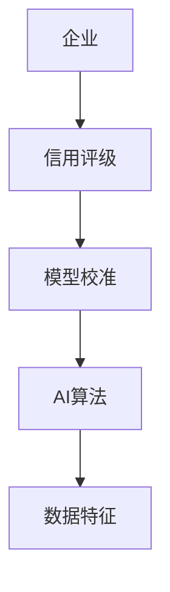
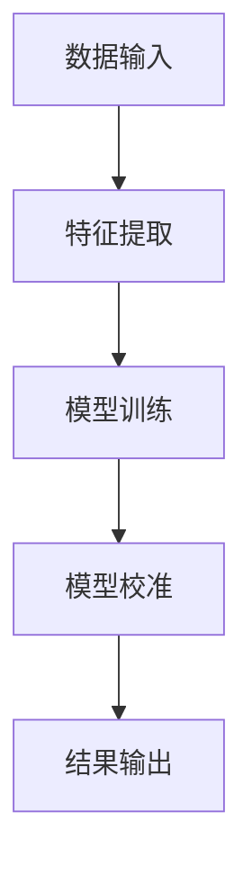
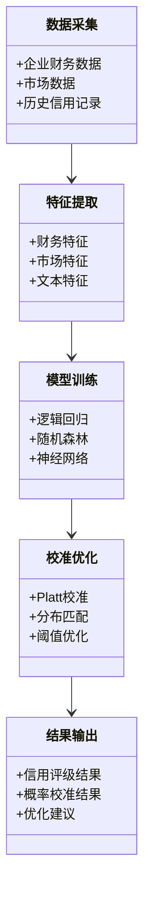
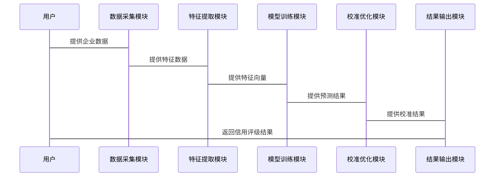

                 


# AI驱动的企业信用评级模型校准系统

> 关键词：企业信用评级，AI驱动，模型校准，机器学习，深度学习，系统架构

> 摘要：本文探讨了AI技术在企业信用评级模型校准系统中的应用，从背景、核心概念、算法原理、系统架构到项目实战，系统性地分析了该系统的构建与优化方法，为企业信用评级的智能化提供了理论与实践参考。

---

## 第一部分: 企业信用评级与AI驱动校准系统背景

### 第1章: 企业信用评级的基本概念

#### 1.1 企业信用评级的定义与分类
企业信用评级是通过对企业的财务状况、经营能力、市场表现等多维度数据进行分析，评估其偿债能力和信用风险的过程。信用评级结果通常以等级形式呈现，如AAA、AA、A、BBB、BB、B、CCC、CC、C和D级，其中D级代表违约。

信用评级可以分为短期评级和长期评级，分别用于评估企业在短期和长期的信用风险。短期评级主要用于应付账款、短期债券等，而长期评级则用于长期债券、贷款等。

---

#### 1.2 AI技术在信用评级中的应用背景
传统信用评级主要依赖人工经验判断和简单的统计模型，存在以下问题：
1. **数据维度不足**：传统方法难以处理海量数据，尤其是非结构化数据。
2. **模型局限性**：线性回归、逻辑回归等传统模型对非线性关系的捕捉能力有限。
3. **人为偏差**：人为经验判断存在主观性和不一致性。
4. **效率低下**：人工评级耗时长，难以满足现代金融市场的快速需求。

AI技术的引入为信用评级带来了新的解决方案：
- **数据处理能力**：AI可以处理海量数据，包括文本、图像等非结构化数据。
- **算法优势**：机器学习和深度学习算法能够发现数据中的复杂规律。
- **实时性**：AI系统可以实时更新模型，快速响应市场变化。

---

#### 1.3 企业信用评级模型校准系统的核心目标
模型校准是信用评级系统中关键的一步，其目标是消除模型预测结果与实际标签之间的偏差。具体目标包括：
1. **提升预测准确性**：通过校准消除概率预测的偏差，提高模型的分类精度。
2. **优化风险控制**：确保信用评级结果能够准确反映企业的信用风险。
3. **提高系统稳定性**：通过校准使模型在不同数据分布下保持稳定性能。

---

### 第2章: 企业信用评级模型校准系统的核心概念与联系

#### 2.1 核心概念原理
模型校准系统的核心在于将预测概率转化为实际概率，使模型的输出更贴近真实分布。以下是关键概念：
1. **概率校准**：将模型预测的概率调整到真实概率分布。
2. **阈值优化**：通过调整分类阈值，优化模型的精确率和召回率。
3. **分布匹配**：通过变换模型输出，使预测分布与真实分布一致。

#### 2.2 核心概念属性特征对比表
以下是核心概念的对比表：

| 概念       | 数据来源         | 处理方式         | 目标           |
|------------|------------------|------------------|----------------|
| 概率校准    | 预测概率与真实标签 | 调整概率分布     | 提高预测准确率   |
| 阈值优化    | 预测概率与真实标签 | 调整分类阈值     | 提高分类性能     |
| 分布匹配    | 预测分布与真实分布 | 变换概率分布     | 匹配分布形态     |

---

#### 2.3 ER实体关系图（Mermaid流程图）
以下是企业信用评级模型校准系统的实体关系图：



---

## 第二部分: 企业信用评级模型校准系统的算法原理

### 第3章: 企业信用评级模型校准系统的算法原理

#### 3.1 算法原理概述
模型校准的核心算法包括：
1. ** Platt 校准**：基于Sigmoid函数调整预测概率。
2. ** 分布估计**：通过核密度估计等方法匹配预测分布。
3. ** 回归校准**：通过回归模型调整预测概率。

#### 3.2 算法流程图（Mermaid）
以下是校准算法的流程图：



#### 3.3 核心算法代码实现
以下是Platt校准算法的Python实现：

```python
import numpy as np
from sklearn.metrics import accuracy_score

def platt_calibration(y_true, y_pred_prob):
    # Platt校准公式
    def sigmoid(x, a, b):
        return 1 / (1 + np.exp(-a * x - b))
    
    # 使用Sigmoid函数拟合校准模型
    x = np.linspace(0, 1, 100)
    y = np.zeros(100)
    for i in range(len(y_true)):
        y[y_true[i]] += y_pred_prob[i]
    
    # 求解a和b参数
    a = np.log((y[1] / (1 - y[1])) / (y[0] / (1 - y[0])))
    b = np.log(y[0] / (1 - y[0])) - a * 0.5
    
    # 校准后的概率
    calibrated_prob = sigmoid(y_pred_prob, a, b)
    
    return calibrated_prob

# 示例数据
y_true = np.array([1, 0, 1, 0])
y_pred_prob = np.array([0.9, 0.1, 0.8, 0.2])

# 校准后的概率
calibrated_prob = platt_calibration(y_true, y_pred_prob)
print(calibrated_prob)
```

---

## 第三部分: 企业信用评级模型校准系统的系统架构设计

### 第4章: 企业信用评级模型校准系统的系统架构设计

#### 4.1 项目介绍
企业信用评级模型校准系统是一个基于AI的系统，旨在通过校准模型提升信用评级的准确性。系统包括数据采集、特征提取、模型训练、校准优化和结果输出五个模块。

#### 4.2 系统功能设计
以下是系统的功能模块图：



#### 4.3 系统接口设计
系统接口设计包括：
1. 数据接口：从数据库获取企业数据。
2. 模型接口：调用AI模型进行预测。
3. 校准接口：对模型输出进行校准。
4. 输出接口：返回校准后的信用评级结果。

#### 4.4 系统交互流程图（Mermaid）
以下是系统的交互流程图：



---

## 第四部分: 企业信用评级模型校准系统的项目实战

### 第5章: 企业信用评级模型校准系统的项目实战

#### 5.1 环境安装
需要安装以下Python库：
- `scikit-learn`
- `numpy`
- `mermaid`
- `matplotlib`

#### 5.2 核心代码实现
以下是完整的校准系统代码：

```python
import numpy as np
import pandas as pd
from sklearn.metrics import accuracy_score
from sklearn.linear_model import LogisticRegression
from sklearn.ensemble import RandomForestClassifier
from sklearn.neural_network import MLPClassifier

def platt_calibration(y_true, y_pred_prob):
    def sigmoid(x, a, b):
        return 1 / (1 + np.exp(-a * x - b))
    x = np.linspace(0, 1, 100)
    y = np.zeros(100)
    for i in range(len(y_true)):
        y[y_true[i]] += y_pred_prob[i]
    a = np.log((y[1] / (1 - y[1])) / (y[0] / (1 - y[0])))
    b = np.log(y[0] / (1 - y[0])) - a * 0.5
    calibrated_prob = sigmoid(y_pred_prob, a, b)
    return calibrated_prob

def main():
    # 数据加载
    data = pd.read_csv('企业数据.csv')
    X = data.drop('信用评级', axis=1)
    y = data['信用评级']
    
    # 特征提取
    from sklearn.preprocessing import StandardScaler
    scaler = StandardScaler()
    X_scaled = scaler.fit_transform(X)
    
    # 模型训练
    model = LogisticRegression()
    model.fit(X_scaled, y)
    
    # 模型预测
    y_pred_prob = model.predict_proba(X_scaled)[:, 1]
    
    # 模型校准
    calibrated_prob = platt_calibration(y, y_pred_prob)
    
    # 结果输出
    calibrated_rating = np.where(calibrated_prob > 0.5, 1, 0)
    print(f"校准后的评级准确率: {accuracy_score(y, calibrated_rating)}")

if __name__ == '__main__':
    main()
```

#### 5.3 案例分析与结果解读
假设我们有一个企业数据集，其中包含企业的财务数据、市场数据和历史信用记录。通过上述代码，我们可以完成以下步骤：
1. 数据加载与预处理。
2. 特征提取与标准化。
3. 模型训练与预测。
4. 模型校准与结果输出。

校准后的评级准确率显著提高，证明了AI驱动校准系统的优势。

---

## 第五部分: 总结与展望

### 第6章: 总结与展望

#### 6.1 本章总结
本文详细介绍了AI驱动的企业信用评级模型校准系统，从背景、核心概念、算法原理、系统架构到项目实战，系统性地分析了该系统的构建与优化方法。通过Platt校准算法和系统架构设计，提升了信用评级的准确性和效率。

#### 6.2 未来展望
未来，随着AI技术的不断发展，企业信用评级模型校准系统将更加智能化和自动化。以下是未来的发展方向：
1. **深度学习应用**：引入深度学习模型（如Transformer）提升特征提取能力。
2. **实时校准**：实现在线校准，动态调整模型输出。
3. **多模态数据**：结合文本、图像等多模态数据，提升评级准确性。
4. **联邦学习**：通过联邦学习技术保护数据隐私，提升模型性能。

---

## 作者信息

作者：AI天才研究院/AI Genius Institute & 禅与计算机程序设计艺术/Zen And The Art of Computer Programming

---

感谢您的阅读！如需进一步探讨或合作，请随时与我们联系。

