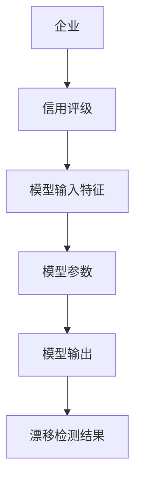
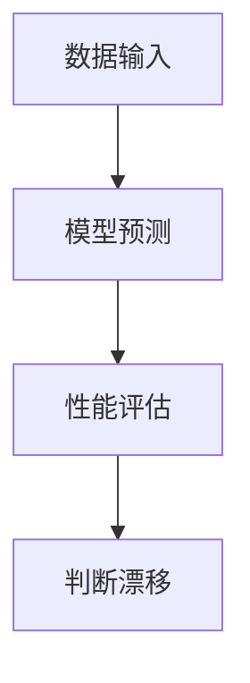
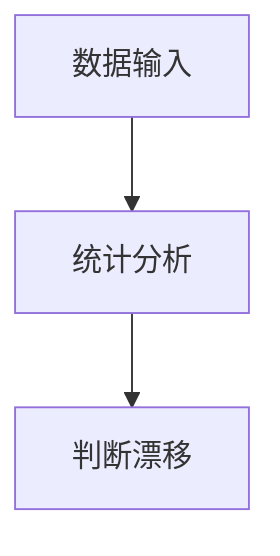
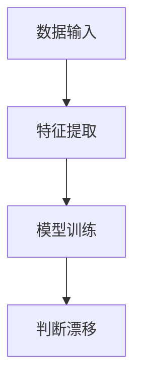
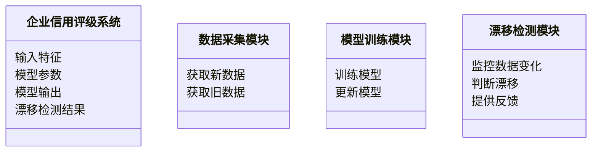
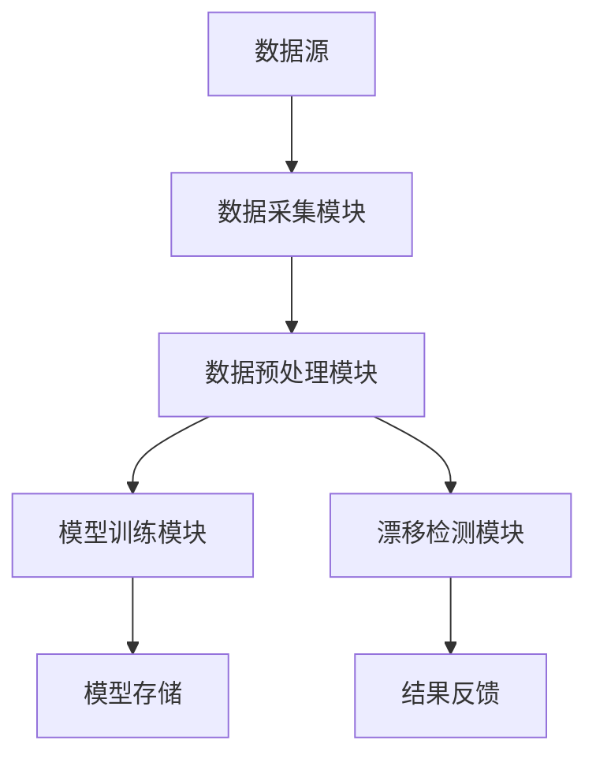

                 


# AI驱动的企业信用评级模型漂移检测系统

> 关键词：AI驱动，企业信用评级，模型漂移，机器学习，风险管理

> 摘要：本文详细探讨了AI技术在企业信用评级模型漂移检测中的应用，分析了模型漂移的类型与检测方法，提出了基于机器学习的漂移检测系统设计，并通过实际案例展示了系统的实现与应用价值。

---

# 第1章: 企业信用评级与模型漂移概述

## 1.1 企业信用评级的背景与意义
### 1.1.1 企业信用评级的定义与作用
企业信用评级是通过对企业的财务状况、经营能力和还款能力进行评估，确定其信用等级的过程。信用评级结果直接影响企业的融资成本和可贷性，是企业风险管理的重要工具。

### 1.1.2 信用评级对企业融资与风险管理的重要性
信用评级能够帮助金融机构识别风险、优化资产配置，同时也能为企业提供融资支持。然而，随着市场环境的变化，信用评级模型可能会出现性能下降的情况。

### 1.1.3 传统信用评级方法的局限性
传统信用评级方法依赖于静态的财务指标和简单的统计分析，难以捕捉复杂市场环境中的动态变化，导致模型失效和决策失误。

## 1.2 模型漂移的定义与类型
### 1.2.1 模型漂移的定义
模型漂移是指模型在运行过程中，由于数据分布变化、目标变化或概念变化导致模型性能下降的现象。

### 1.2.2 模型漂移的常见类型
- **数据漂移**：数据分布的变化，如新数据与训练数据分布差异显著。
- **概念漂移**：目标或标签的变化，如违约率定义的变化。
- **分布漂移**：数据分布变化导致模型预测能力下降。

### 1.2.3 模型漂移对企业信用评级的影响
模型漂移会导致信用评级结果的不准确，进而影响企业的融资能力和金融机构的风控能力。

## 1.3 AI驱动模型漂移检测的必要性
### 1.3.1 传统模型检测方法的不足
传统方法依赖于定期手动检查，效率低且难以捕捉动态变化。

### 1.3.2 AI技术在模型漂移检测中的优势
AI技术能够实时监控数据变化，自动检测漂移并提供反馈，显著提高了检测效率和准确性。

### 1.3.3 企业信用评级中应用AI驱动漂移检测的前景
通过AI技术，企业可以建立动态、智能的信用评级系统，提升风险管理和决策能力。

## 1.4 本章小结
本章介绍了企业信用评级的背景与意义，详细阐述了模型漂移的定义与类型，并分析了AI技术在模型漂移检测中的必要性和优势。

---

# 第2章: 企业信用评级模型漂移检测的核心概念与联系

## 2.1 核心概念原理
### 2.1.1 信用评级模型的输入特征
- 财务指标：如收入、利润、负债等。
- 经营指标：如市场占有率、品牌价值等。
- 宏观经济指标：如GDP增长率、利率等。

### 2.1.2 模型输出与企业信用风险的关系
模型输出是企业信用风险的量化表示，直接决定企业的信用等级和融资能力。

### 2.1.3 模型漂移检测的关键指标
- 数据分布变化指标：如KL散度、Jensen-Shannon散度。
- 模型性能指标：如准确率、召回率、F1值。

## 2.2 核心概念属性特征对比
### 2.2.1 漂移类型对比表格
| 漂移类型 | 定义 | 检测方法 | 示例场景 |
|----------|------|----------|----------|
| 数据漂移 | 数据分布的变化 | 数据统计分析 | 新数据分布与旧数据分布差异显著 |
| 概念漂移 | 标签或目标变化 | 监控模型性能 | 模型预测准确性下降 |
| 分布漂移 | 数据分布变化 | 使用机器学习方法 | 数据分布变化导致模型失效 |

## 2.3 ER实体关系图架构


## 2.4 本章小结
本章通过核心概念原理和对比分析，详细阐述了企业信用评级模型漂移检测的关键点，并通过ER实体关系图展示了各概念之间的联系。

---

# 第3章: 模型漂移检测算法原理与实现

## 3.1 基于性能的漂移检测算法
### 3.1.1 算法原理
基于性能的漂移检测方法通过监控模型性能的变化来判断是否发生漂移。

### 3.1.2 Python实现示例
```python
def detect_drift(data_old, data_new, model):
    # 统计旧数据和新数据的分布差异
    old_dist = data_old.distribution()
    new_dist = data_new.distribution()
    
    # 计算分布差异指标
    kl_divergence = calculate_kl_divergence(old_dist, new_dist)
    js_divergence = calculate_js_divergence(old_dist, new_dist)
    
    # 判断是否发生漂移
    if kl_divergence > threshold or js_divergence > threshold:
        return True
    else:
        return False
```

### 3.1.3 算法流程图


## 3.2 基于统计的方法
### 3.2.1 算法原理
基于统计的方法通过分析数据分布的变化来判断是否发生漂移。

### 3.2.2 算法流程图


## 3.3 机器学习方法
### 3.3.1 算法原理
使用机器学习方法（如Isolation Forest、KNN）对新数据和旧数据进行对比，判断数据分布的变化。

### 3.3.2 算法流程图


## 3.4 本章小结
本章详细介绍了几种常见的模型漂移检测算法，包括基于性能、基于统计和机器学习的方法，并通过流程图和代码示例展示了其实现过程。

---

# 第4章: 数学模型与公式推导

## 4.1 概率分布变化的数学模型
### 4.1.1 数据漂移的数学定义
数据漂移可以通过比较新数据和旧数据的概率分布来衡量。

$$ P_{\text{old}}(x) \quad \text{和} \quad P_{\text{new}}(x) $$

### 4.1.2 分布漂移的衡量指标
使用KL散度和Jensen-Shannon散度来衡量分布变化。

$$ D_{\text{KL}}(P_{\text{old}} \parallel P_{\text{new}}) = \sum P_{\text{old}}(x) \log \frac{P_{\text{old}}(x)}{P_{\text{new}}(x)} $$

$$ D_{\text{JS}}(P_{\text{old}}, P_{\text{new}}) = \frac{1}{2} \left( D_{\text{KL}}(P_{\text{old}} \parallel M) + D_{\text{KL}}(P_{\text{new}} \parallel M) \right) $$

其中，$M = \frac{1}{2}(P_{\text{old}} + P_{\text{new}})$。

## 4.2 模型性能变化的数学模型
### 4.2.1 准确率变化
$$ \text{Accuracy} = \frac{\text{正确预测数}}{\text{总预测数}} $$

### 4.2.2 F1值变化
$$ F1 = 2 \times \frac{\text{Precision} \times \text{Recall}}{\text{Precision} + \text{Recall}} $$

## 4.3 本章小结
本章通过数学模型和公式推导，详细分析了数据分布变化和模型性能变化的衡量指标，为后续算法实现提供了理论基础。

---

# 第5章: 系统分析与架构设计

## 5.1 问题场景介绍
企业信用评级模型需要实时监控数据变化，及时发现并应对模型漂移。

## 5.2 系统功能设计
### 5.2.1 领域模型设计


### 5.2.2 系统架构设计


## 5.3 系统接口设计
### 5.3.1 数据接口
- 数据输入接口：接收新数据和旧数据。
- 数据输出接口：返回漂移检测结果。

### 5.3.2 模型接口
- 模型训练接口：训练新的信用评级模型。
- 模型预测接口：使用模型进行信用评级。

## 5.4 本章小结
本章通过系统分析与架构设计，展示了企业信用评级模型漂移检测系统的整体结构和各模块之间的关系。

---

# 第6章: 项目实战与实现

## 6.1 环境安装与配置
- 安装Python、机器学习库（如scikit-learn、xgboost）和数据处理库（如pandas、numpy）。

## 6.2 核心代码实现
### 6.2.1 数据加载与预处理
```python
import pandas as pd
from sklearn.model_selection import train_test_split
from sklearn.ensemble import RandomForestClassifier
from sklearn.metrics import accuracy_score

# 加载数据
data = pd.read_csv('credit_data.csv')
X = data.drop('label', axis=1)
y = data['label']

# 分割数据
X_train, X_test, y_train, y_test = train_test_split(X, y, test_size=0.2)
```

### 6.2.2 模型训练与保存
```python
# 训练模型
model = RandomForestClassifier()
model.fit(X_train, y_train)

# 保存模型
import joblib
joblib.dump(model, 'credit_model.pkl')
```

### 6.2.3 漂移检测实现
```python
# 加载模型
model = joblib.load('credit_model.pkl')

# 获取新数据
new_data = pd.read_csv('new_credit_data.csv')

# 预测旧数据和新数据的性能
old_accuracy = accuracy_score(y_train, model.predict(X_train))
new_accuracy = accuracy_score(new_data['label'], model.predict(new_data.drop('label', axis=1)))

# 判断是否发生漂移
if new_accuracy < old_accuracy:
    print("模型发生漂移")
else:
    print("模型未发生漂移")
```

## 6.3 项目小结
本章通过实际案例展示了企业信用评级模型漂移检测系统的实现过程，包括环境配置、数据处理、模型训练和漂移检测。

---

# 第7章: 总结与展望

## 7.1 系统总结
AI技术在企业信用评级模型漂移检测中的应用显著提升了模型的稳定性和准确性。

## 7.2 未来研究方向
- 更高效的漂移检测算法。
- 多模型融合的漂移检测方法。
- 实时监控与自适应模型更新。

## 7.3 最佳实践 tips
- 定期监控模型性能，及时发现并应对漂移。
- 保持数据质量和完整性，确保模型的有效性。
- 结合领域知识，优化模型结构和参数。

## 7.4 本章小结
本章总结了全文的主要内容，并展望了未来的研究方向和实践中的注意事项。

---

# 作者：AI天才研究院/AI Genius Institute & 禅与计算机程序设计艺术 /Zen And The Art of Computer Programming

