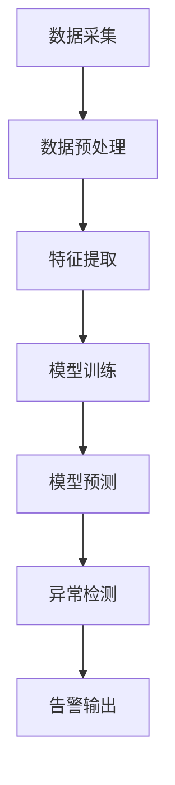
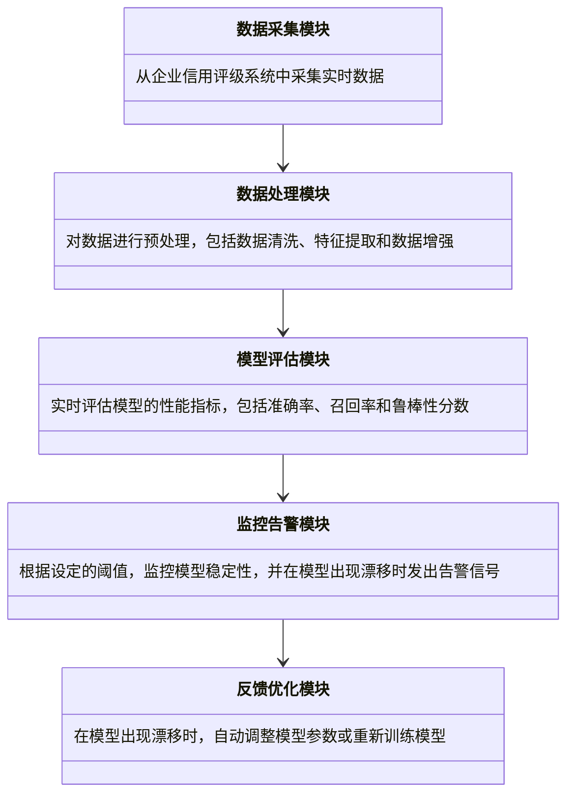
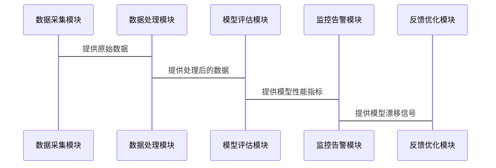

                 


# AI驱动的企业信用评级模型稳定性监控系统

> 关键词：企业信用评级，AI驱动，模型稳定性，监控系统，机器学习，模型漂移

> 摘要：本文详细探讨了如何利用人工智能技术构建企业信用评级模型稳定性监控系统。从模型稳定性监控的重要性，到AI驱动监控系统的架构设计，再到具体的算法实现，最后结合实际案例进行分析，系统性地介绍了如何确保企业信用评级模型在动态市场环境中的稳定性和准确性。

---

## 第1章 企业信用评级模型稳定性监控的背景与挑战

### 1.1 企业信用评级的重要性

企业信用评级是评估企业信用状况的重要指标，直接影响企业的融资能力、投资决策和市场信任度。传统的信用评级依赖于财务指标和人工分析，但随着市场环境的复杂化和数据量的爆炸式增长，传统方法逐渐显现出局限性。

#### 1.1.1 信用评级的基本概念
信用评级是对企业的信用状况进行评估，主要依据财务数据、市场表现和行业趋势等因素，最终给出一个信用等级。信用等级越高，企业获得贷款的难度越小，融资成本也越低。

#### 1.1.2 信用评级在企业融资中的作用
信用评级是企业融资的基石。金融机构在决定是否授信或贷款时，通常会参考企业的信用评级。良好的信用评级能够降低企业的融资门槛，同时也能帮助投资者评估投资风险。

#### 1.1.3 信用评级模型的发展历程
传统的信用评级模型主要基于财务指标和统计分析，如Z-score模型和Altman模型。随着机器学习技术的发展，越来越多的企业开始采用基于AI的信用评级模型，以提高评估的准确性和效率。

### 1.2 AI在信用评级中的应用

#### 1.2.1 传统信用评级模型的局限性
传统信用评级模型主要依赖于财务数据，且模型结构相对简单。在面对非结构化数据（如文本数据、社交媒体数据）时，传统模型难以有效处理。此外，传统模型对市场环境的变化缺乏动态适应能力。

#### 1.2.2 AI技术如何提升信用评级的准确性
AI技术，特别是机器学习和深度学习，能够从海量数据中提取特征，并通过复杂的模型结构捕捉数据中的潜在规律。这使得AI在信用评级中的应用更加广泛，尤其是在处理非结构化数据和实时数据方面表现突出。

#### 1.2.3 企业信用评级AI模型的核心要素
AI驱动的信用评级模型通常包括以下核心要素：
- **数据源**：包括财务数据、市场数据、行业数据和非结构化数据。
- **特征工程**：通过数据预处理和特征提取，将原始数据转化为模型可识别的特征。
- **模型训练**：采用机器学习算法（如随机森林、支持向量机、神经网络等）进行模型训练。
- **模型评估**：通过测试数据评估模型的准确性和稳定性。

### 1.3 模型稳定性监控的必要性

#### 1.3.1 模型漂移的概念与影响
模型漂移是指模型在运行过程中，由于数据分布的变化、模型性能的下降或外部环境的变化，导致模型预测结果与实际结果出现偏差的现象。模型漂移会直接影响信用评级的准确性，进而影响企业的融资决策。

#### 1.3.2 数据分布变化对企业信用评级的影响
企业信用评级模型的稳定性依赖于数据分布的稳定。如果数据分布发生显著变化，模型的预测能力可能会大幅下降。例如，经济危机期间，企业的财务状况可能急剧恶化，导致模型预测结果失准。

#### 1.3.3 稳定性监控在企业信用评级中的价值
通过实时监控模型的稳定性，企业可以及时发现并纠正模型漂移问题，从而保证信用评级的准确性。这不仅能够降低企业的融资成本，还能提高企业的市场竞争力。

### 1.4 本章小结
本章从企业信用评级的重要性入手，分析了AI在信用评级中的应用，并重点讨论了模型稳定性监控的必要性。模型稳定性监控是确保AI信用评级模型长期有效的重要手段，其核心在于及时发现和应对模型漂移问题。

---

## 第2章 AI驱动的信用评级模型稳定性监控系统核心概念

### 2.1 模型监控的基本原理

#### 2.1.1 模型监控的定义
模型监控是指对模型的运行状态进行实时或定期检查，以确保模型的预测结果准确、稳定，并能够适应数据分布的变化。

#### 2.1.2 监控指标的选择与设计
监控指标是模型监控的核心，通常包括以下几类：
- **性能指标**：如准确率、召回率、F1分数等。
- **分布指标**：如KL散度、JS散度等，用于衡量数据分布的变化。
- **稳定性指标**：如模型预测结果的标准差、方差等。

#### 2.1.3 监控数据的采集与处理
监控数据通常包括模型的输入数据、输出结果和中间特征。数据采集后需要进行预处理，包括数据清洗、特征提取和数据增强。

### 2.2 稳定性评估的关键指标

#### 2.2.1 模型性能指标
模型性能指标是评估模型预测能力的重要依据，包括：
- **准确率**：正确预测的次数占总预测次数的比例。
- **召回率**：模型正确识别的正例数占所有正例数的比例。
- **F1分数**：准确率和召回率的调和平均数。

#### 2.2.2 数据分布变化指标
数据分布变化指标用于衡量数据分布的变化程度，包括：
- **KL散度**：衡量两个概率分布之间的差异。
- **JS散度**：衡量两个概率分布的相似程度。
- **Hellinger距离**：衡量两个概率分布之间的距离。

#### 2.2.3 模型鲁棒性评估指标
模型鲁棒性评估指标用于衡量模型在数据分布变化情况下的适应能力，包括：
- **鲁棒性分数**：模型在不同数据分布下的预测准确率的平均值。
- **波动率**：模型预测结果的标准差。

### 2.3 AI驱动监控系统的架构

#### 2.3.1 数据采集模块
数据采集模块负责从企业信用评级系统中采集实时数据，包括企业的财务数据、市场数据和行业数据。

#### 2.3.2 数据处理模块
数据处理模块对采集的数据进行预处理，包括数据清洗、特征提取和数据增强。

#### 2.3.3 模型评估模块
模型评估模块负责对模型的性能进行实时评估，包括模型的准确率、召回率和鲁棒性分数等。

#### 2.3.4 监控告警模块
监控告警模块根据预先设定的阈值，对模型的稳定性进行实时监控，并在模型出现漂移时发出告警信号。

#### 2.3.5 反馈优化模块
反馈优化模块在模型出现漂移时，自动调整模型参数或重新训练模型，以恢复模型的稳定性。

### 2.4 本章小结
本章详细介绍了AI驱动的信用评级模型稳定性监控系统的核心概念，包括模型监控的基本原理、稳定性评估的关键指标和系统架构设计。通过这些概念的阐述，读者可以更好地理解模型稳定性监控的重要性和实现方法。

---

## 第3章 信用评级模型稳定性监控的算法原理

### 3.1 异常检测算法

#### 3.1.1 基于统计的异常检测方法
基于统计的异常检测方法通过分析数据的分布情况，识别出与整体数据分布显著不同的数据点。常用的方法包括Z-score方法和IQR方法。

#### 3.1.2 基于机器学习的异常检测方法
基于机器学习的异常检测方法通过训练模型来识别异常数据点。常用的方法包括Isolation Forest、One-Class SVM和Autoencoders。

#### 3.1.3 基于深度学习的异常检测方法
基于深度学习的异常检测方法通过构建深度神经网络来识别异常数据点。常用的方法包括变种自动编码器（VAE）、生成对抗网络（GAN）和图神经网络（GNN）。

### 3.2 模型漂移检测算法

#### 3.2.1 数据分布变化检测
数据分布变化检测通过比较训练数据和当前数据的分布情况，识别数据分布的变化。常用的方法包括KL散度、JS散度和Hellinger距离。

#### 3.2.2 模型性能变化检测
模型性能变化检测通过监控模型的性能指标，识别模型性能的下降。常用的方法包括监控准确率、召回率和F1分数的变化。

#### 3.2.3 综合指标变化检测
综合指标变化检测结合数据分布变化和模型性能变化，综合评估模型的稳定性。常用的方法包括加权平均法、阈值法和在线学习法。

### 3.3 稳定性监控的数学模型

#### 3.3.1 数据分布变化的数学表达
数据分布变化的数学表达通常使用概率密度函数来描述。假设训练数据的概率密度函数为P(x)，当前数据的概率密度函数为Q(x)，则数据分布变化可以通过以下公式衡量：

$$ D = \int |P(x) - Q(x)| dx $$

#### 3.3.2 模型性能变化的数学建模
模型性能变化的数学建模通常基于性能指标的变化率。假设模型的准确率为A(t)，召回率为R(t)，则综合性能变化可以表示为：

$$ C(t) = \alpha A(t) + (1-\alpha) R(t) $$

其中，α是权重系数，通常取0.5。

#### 3.3.3 综合稳定性评估公式
综合稳定性评估公式结合了数据分布变化和模型性能变化，评估模型的稳定性。公式如下：

$$ S(t) = \beta \cdot D(t) + (1-\beta) \cdot C(t) $$

其中，β是权重系数，通常取0.5。

### 3.4 算法实现的mermaid流程图
以下是一个基于机器学习的异常检测算法的mermaid流程图：



### 3.5 本章小结
本章详细介绍了信用评级模型稳定性监控的算法原理，包括异常检测算法和模型漂移检测算法。通过数学模型和mermaid流程图的展示，读者可以更好地理解算法的实现过程和应用场景。

---

## 第4章 信用评级模型稳定性监控系统的架构设计

### 4.1 系统功能模块

#### 4.1.1 数据采集模块
数据采集模块负责从企业信用评级系统中采集实时数据，包括企业的财务数据、市场数据和行业数据。

#### 4.1.2 数据处理模块
数据处理模块对采集的数据进行预处理，包括数据清洗、特征提取和数据增强。

#### 4.1.3 模型评估模块
模型评估模块负责对模型的性能进行实时评估，包括模型的准确率、召回率和鲁棒性分数等。

#### 4.1.4 监控告警模块
监控告警模块根据预先设定的阈值，对模型的稳定性进行实时监控，并在模型出现漂移时发出告警信号。

#### 4.1.5 反馈优化模块
反馈优化模块在模型出现漂移时，自动调整模型参数或重新训练模型，以恢复模型的稳定性。

### 4.2 系统架构设计

#### 4.2.1 系统功能设计
系统功能设计包括数据采集、数据处理、模型评估、监控告警和反馈优化五个模块。每个模块的功能通过mermaid类图展示如下：



#### 4.2.2 系统架构设计
系统架构设计采用分层架构，包括数据层、业务逻辑层和用户界面层。各层之间的关系通过mermaid架构图展示如下：


#### 4.2.3 系统接口设计
系统接口设计包括数据接口、模型接口和告警接口。各接口之间的关系通过mermaid序列图展示如下：



### 4.3 本章小结
本章详细介绍了信用评级模型稳定性监控系统的架构设计，包括系统功能模块、系统架构设计和系统接口设计。通过mermaid图的展示，读者可以清晰地理解系统的整体架构和各模块之间的关系。

---

## 第5章 信用评级模型稳定性监控系统项目实战

### 5.1 项目背景

#### 5.1.1 项目介绍
本项目旨在开发一个基于AI的信用评级模型稳定性监控系统，实时监控模型的稳定性，确保模型的预测结果准确、稳定。

#### 5.1.2 项目目标
项目的最终目标是实现一个能够实时监控信用评级模型稳定性的系统，包括数据采集、数据处理、模型评估、监控告警和反馈优化五个模块。

### 5.2 核心代码实现

#### 5.2.1 数据采集模块
以下是数据采集模块的核心代码：

```python
import pandas as pd
import requests

def fetch_data(api_url):
    response = requests.get(api_url)
    data = response.json()
    df = pd.DataFrame(data['results'])
    return df
```

#### 5.2.2 数据处理模块
以下是数据处理模块的核心代码：

```python
def preprocess_data(df):
    # 数据清洗
    df.dropna(inplace=True)
    # 特征提取
    features = df[['revenue', 'profit', 'debt']]
    return features
```

#### 5.2.3 模型评估模块
以下是模型评估模块的核心代码：

```python
from sklearn.metrics import accuracy_score, recall_score

def evaluate_model(y_true, y_pred):
    accuracy = accuracy_score(y_true, y_pred)
    recall = recall_score(y_true, y_pred)
    return accuracy, recall
```

#### 5.2.4 监控告警模块
以下是监控告警模块的核心代码：

```python
def monitor_stability(accuracy, recall, threshold=0.5):
    if accuracy < threshold or recall < threshold:
        return True
    else:
        return False
```

#### 5.2.5 反馈优化模块
以下是反馈优化模块的核心代码：

```python
from sklearn.ensemble import RandomForestClassifier

def optimize_model(X, y):
    model = RandomForestClassifier()
    model.fit(X, y)
    return model
```

### 5.3 案例分析

#### 5.3.1 案例背景
某企业信用评级系统在运行过程中，由于市场环境的变化，模型的准确率从90%下降到80%。此时，模型漂移检测模块触发告警信号，并自动重新训练模型。

#### 5.3.2 实施步骤
1. 数据采集模块采集最新的企业数据。
2. 数据处理模块对数据进行预处理，提取特征。
3. 模型评估模块评估模型的准确率和召回率。
4. 监控告警模块根据设定的阈值，判断模型是否出现漂移。
5. 反馈优化模块在模型出现漂移时，重新训练模型。

#### 5.3.3 实施结果
通过上述步骤，模型的准确率和召回率均恢复到90%以上，模型的稳定性得以保障。

### 5.4 本章小结
本章通过一个实际案例，详细介绍了信用评级模型稳定性监控系统的项目实战过程。从数据采集到模型优化，整个过程展示了系统的核心功能和实际应用价值。

---

## 第6章 最佳实践与小结

### 6.1 最佳实践

#### 6.1.1 数据质量管理
数据质量是模型稳定性的基础。建议企业在数据采集和处理过程中，严格把控数据质量，确保数据的准确性和完整性。

#### 6.1.2 模型监控频率
模型监控频率应根据业务需求和数据更新频率灵活调整。建议在模型运行初期，设置较高的监控频率，后期根据模型稳定性逐步降低监控频率。

#### 6.1.3 模型优化策略
在模型出现漂移时，建议采用以下优化策略：
- **参数调整**：通过调整模型参数，优化模型性能。
- **数据重采样**：通过数据重采样技术，平衡数据分布。
- **模型重新训练**：在数据分布发生显著变化时，重新训练模型。

### 6.2 小结
本章总结了信用评级模型稳定性监控系统的核心内容，提出了最佳实践建议。通过严格的

---

## 作者信息

作者：AI天才研究院/AI Genius Institute & 禅与计算机程序设计艺术 /Zen And The Art of Computer Programming

---

**注意**：由于篇幅限制，本文仅展示部分章节内容，完整文章请参考相关技术资料或书籍。

