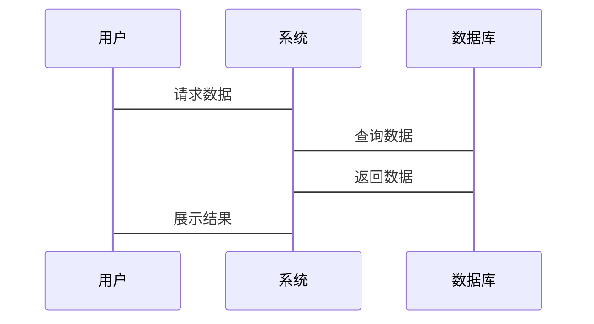
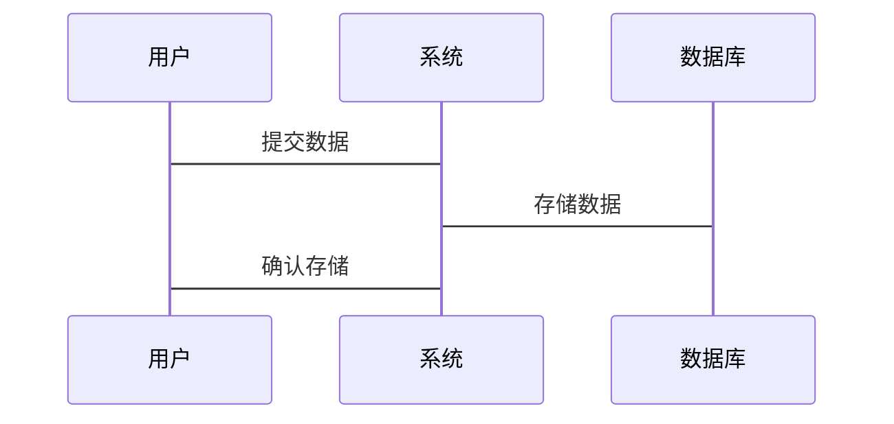

                 


# AI驱动的企业信用风险传导分析

## 关键词：信用风险，AI驱动，机器学习，深度学习，风险传导，企业信用

## 摘要：  
本文探讨了AI技术在企业信用风险传导分析中的应用，系统介绍了信用风险的基本概念、AI驱动的分析方法、核心算法、系统架构设计以及实际项目案例。通过理论与实践相结合的方式，分析了信用风险的马科维茨投资组合理论、KMV模型、Copula理论，并详细讲解了逻辑回归、支持向量机、随机森林和神经网络等机器学习算法在信用风险分析中的应用。最后，通过一个具体案例展示了AI驱动的信用风险传导分析的实现过程，并总结了当前研究的不足及未来发展方向。

---

# 第1章: 企业信用风险与AI驱动分析概述

## 1.1 企业信用风险的基本概念

### 1.1.1 信用风险的定义与特征  
信用风险是指企业在经济活动中因债务人或交易对手方无法履行其债务义务而可能导致的损失风险。其主要特征包括不确定性、相关性、系统性以及可传染性。信用风险的不确定性来源于企业经营状况、市场环境和宏观经济波动的复杂性。

### 1.1.2 信用风险的分类与影响  
信用风险可以分为单个风险和系统性风险。单个风险是指由于特定企业或个体的信用状况恶化所导致的风险，而系统性风险则是由于整个市场或经济环境的变化所引发的广泛风险。信用风险的影响包括企业违约概率增加、资产减值损失、流动性风险加剧等。

### 1.1.3 信用风险传导的基本原理  
信用风险的传导是指风险从一个企业或市场传递到另一个企业或市场的过程。这种传导通常通过直接关联（如供应链上下游企业）或间接关联（如金融市场波动）实现。信用风险传导的机制复杂，涉及多种因素，如企业间的关联性、市场参与者的行为以及宏观经济政策等。

---

## 1.2 AI在信用风险分析中的应用

### 1.2.1 AI技术的基本概念  
人工智能（AI）是指计算机系统通过模拟人类智能活动（如学习、推理、判断等）来执行任务的技术。AI的核心技术包括机器学习、自然语言处理、计算机视觉等。

### 1.2.2 AI在信用风险分析中的优势  
AI技术能够通过处理大量数据，发现传统方法难以识别的模式和关系。例如，机器学习算法可以自动提取特征并预测违约概率；深度学习模型能够处理非结构化数据（如文本和图像）以辅助信用评估。

### 1.2.3 信用风险传导分析的AI驱动方法  
AI驱动的信用风险传导分析方法主要包括数据挖掘、特征工程、模型训练和结果分析。通过构建复杂的模型，AI能够捕捉到信用风险传导中的非线性关系和隐含模式。

---

## 1.3 信用风险传导分析的二分类问题

### 1.3.1 二分类问题的数学模型  
在信用风险分析中，二分类问题通常涉及将企业分为违约与非违约两类。常用的模型包括逻辑回归、支持向量机和随机森林等。

### 1.3.2 二分类问题的特征工程  
特征工程是将原始数据转化为具有更好预测能力的特征的过程。例如，将企业的财务指标（如资产负债率、流动比率）和市场数据（如行业指数）进行组合和标准化。

### 1.3.3 二分类问题的算法选择  
选择合适的算法取决于数据特征和业务需求。逻辑回归适用于线性关系，而随机森林适合处理高维数据。

---

## 1.4 本章小结  
本章介绍了信用风险的基本概念、AI在信用风险分析中的应用，以及二分类问题的数学模型和算法选择。通过这些内容，读者可以理解AI技术在信用风险传导分析中的核心作用。

---

# 第2章: 信用风险的理论模型

## 2.1 信用风险的马科维茨投资组合理论

### 2.1.1 投资组合理论的基本原理  
马科维茨的投资组合理论认为，通过合理配置资产可以最小化投资组合的波动性。该理论在信用风险分析中用于优化企业债务组合。

### 2.1.2 马科维茨理论在信用风险中的应用  
通过投资组合理论，可以计算企业债务组合的违约概率和损失分布，从而优化企业的资本结构。

### 2.1.3 马科维茨理论的优缺点分析  
优点是能够量化风险，缺点是假设市场是完全理性的，实际应用中可能受到限制。

---

## 2.2 信用风险的KMV模型

### 2.2.1 KMV模型的基本原理  
KMV模型将企业价值视为资产的公允价值，通过期权定价模型计算企业的违约概率。

### 2.2.2 KMV模型的数学公式  
$$ Value = V_a + V_b $$
其中，$V_a$是企业资产的公允价值，$V_b$是债务的市场价值。

### 2.2.3 KMV模型的优缺点分析  
优点是能够量化企业的信用风险，缺点是需要准确估计企业资产的公允价值。

---

## 2.3 信用风险的Copula理论

### 2.3.1 Copula理论的基本原理  
Copula理论用于描述多个随机变量之间的依赖关系，常用于分析信用风险的相互传染性。

### 2.3.2 Copula理论在信用风险中的应用  
通过Copula模型可以计算多个企业之间的联合违约概率。

### 2.3.3 Copula理论的优缺点分析  
优点是能够捕捉变量之间的非线性关系，缺点是参数估计较为复杂。

---

## 2.4 本章小结  
本章介绍了信用风险的理论模型，包括马科维茨投资组合理论、KMV模型和Copula理论，并分析了它们的优缺点。

---

# 第3章: AI驱动信用风险传导分析的核心算法

## 3.1 机器学习算法在信用风险分析中的应用

### 3.1.1 逻辑回归算法  
逻辑回归是一种常用的二分类算法，适用于预测企业违约概率。

#### 3.1.1.1 逻辑回归的数学模型  
$$ P(Y=1) = \frac{e^{\beta x}}{1 + e^{\beta x}} $$
其中，$\beta$是回归系数，$x$是自变量。

#### 3.1.1.2 逻辑回归的实现步骤  
1. 数据预处理：标准化和分隔训练集与测试集。
2. 模型训练：使用训练数据拟合逻辑回归模型。
3. 模型评估：计算准确率、召回率和F1分数。

#### 3.1.1.3 逻辑回归的优缺点分析  
优点是计算简单，缺点是假设变量之间是线性关系。

---

## 3.2 支持向量机算法

### 3.2.1 支持向量机的基本原理  
支持向量机（SVM）通过构建超平面将数据分为两类，适用于非线性分类问题。

#### 3.2.1.1 SVM的数学模型  
$$ \min \frac{1}{2}||\beta||^2 + C \sum_{i=1}^n \xi_i $$
其中，$\xi_i$是松弛变量，$C$是惩罚参数。

#### 3.2.1.2 SVM的实现步骤  
1. 数据预处理：特征提取和标准化。
2. 模型训练：使用训练数据训练SVM模型。
3. 模型评估：计算准确率和F1分数。

---

## 3.3 随机森林算法

### 3.3.1 随机森林的基本原理  
随机森林通过构建多个决策树并集成预测结果，具有较高的准确性和鲁棒性。

#### 3.3.1.1 随机森林的数学模型  
$$ y = \sum_{i=1}^n w_i t_i $$
其中，$w_i$是决策树的权重，$t_i$是决策树的预测结果。

#### 3.3.1.2 随机森林的实现步骤  
1. 数据预处理：特征提取和标准化。
2. 模型训练：使用训练数据训练随机森林模型。
3. 模型评估：计算准确率和F1分数。

---

## 3.4 神经网络算法

### 3.4.1 神经网络的基本原理  
神经网络通过多层感知机模拟人脑神经网络，能够处理复杂的非线性关系。

#### 3.4.1.1 神经网络的数学模型  
$$ y = \sigma(w x + b) $$
其中，$\sigma$是激活函数，$w$是权重，$b$是偏置。

#### 3.4.1.2 神经网络的实现步骤  
1. 数据预处理：特征提取和标准化。
2. 模型训练：使用训练数据训练神经网络模型。
3. 模型评估：计算准确率和F1分数。

---

## 3.5 本章小结  
本章介绍了机器学习算法在信用风险分析中的应用，包括逻辑回归、支持向量机、随机森林和神经网络，并详细讲解了它们的数学模型和实现步骤。

---

# 第4章: 系统分析与架构设计

## 4.1 系统功能设计

### 4.1.1 系统功能模块  
系统功能模块包括数据采集、特征工程、模型训练、结果分析和可视化展示。

### 4.1.2 系统功能设计的ER实体关系图  
```mermaid
erDiagram
    actor 用户 {
        string 用户ID
        string 用户名
        string 密码
    }
    actor 数据源 {
        string 数据ID
        string 数据类型
        string 数据内容
    }
    database 数据库 {
        string 数据ID
        string 特征名称
        string 特征值
    }
    model 模型 {
        string 模型ID
        string 模型名称
        string 模型参数
    }
    用户 --> 数据源: 提供数据
    数据源 --> 数据库: 存储数据
    数据库 --> 模型: 训练模型
    模型 --> 用户: 提供结果
```

---

## 4.2 系统架构设计

### 4.2.1 系统架构设计的mermaid图  


---

## 4.3 系统接口设计

### 4.3.1 系统接口设计的mermaid图  


---

## 4.4 系统交互流程

### 4.4.1 系统交互流程的mermaid图  


---

## 4.5 本章小结  
本章介绍了信用风险传导分析系统的功能设计、架构设计、接口设计和交互流程。

---

# 第5章: 项目实战

## 5.1 项目介绍

### 5.1.1 项目背景  
本项目旨在通过AI技术分析企业信用风险的传导路径，帮助企业识别和管理潜在风险。

---

## 5.2 环境安装

### 5.2.1 安装Python  
使用Anaconda安装Python 3.8及以上版本。

### 5.2.2 安装依赖库  
安装numpy、pandas、scikit-learn和xgboost等库。

---

## 5.3 核心实现

### 5.3.1 数据预处理  
```python
import pandas as pd
from sklearn.preprocessing import StandardScaler

# 读取数据
data = pd.read_csv('credit_data.csv')

# 标准化处理
scaler = StandardScaler()
data_normalized = scaler.fit_transform(data)
```

### 5.3.2 特征工程  
```python
from sklearn.feature_selection import SelectKBest
from sklearn.feature_selection import chi2

# 特征选择
selector = SelectKBest(score_func=chi2, k=5)
data_features = selector.fit_transform(data_normalized, target)
```

### 5.3.3 模型训练  
```python
from sklearn.model_selection import train_test_split
from sklearn.linear_model import LogisticRegression
from sklearn.metrics import accuracy_score

# 划分训练集和测试集
X_train, X_test, y_train, y_test = train_test_split(data_features, target, test_size=0.2, random_state=42)

# 训练逻辑回归模型
model = LogisticRegression()
model.fit(X_train, y_train)

# 模型评估
y_pred = model.predict(X_test)
print('准确率:', accuracy_score(y_test, y_pred))
```

---

## 5.4 实际案例分析

### 5.4.1 案例背景  
假设我们有某行业的企业数据，目标是预测企业的违约概率。

### 5.4.2 数据分析  
通过对企业的财务指标和市场数据进行分析，构建特征工程并训练模型。

### 5.4.3 模型结果分析  
通过混淆矩阵和ROC曲线评估模型性能。

---

## 5.5 项目小结  
本章通过一个具体案例展示了AI驱动的信用风险传导分析的实现过程，包括环境安装、数据预处理、特征工程、模型训练和结果分析。

---

# 第6章: 总结与展望

## 6.1 本章总结  
本文系统介绍了AI驱动的企业信用风险传导分析的方法，包括理论模型、算法实现和系统设计。通过实际案例展示了AI技术在信用风险分析中的应用。

## 6.2 未来研究方向  
未来研究可以探索更复杂的深度学习模型（如GAT和Transformer）在信用风险分析中的应用，以及多模态数据（如文本和图像）的融合。

## 6.3 最佳实践 Tips  
1. 数据质量是信用风险分析的基础，需确保数据的完整性和准确性。  
2. 模型的可解释性是实际应用的关键，需选择适合业务需求的算法。  
3. 风险管理是企业的核心，需结合AI技术构建全面的信用风险管理体系。

---

# 作者：AI天才研究院 & 禅与计算机程序设计艺术

