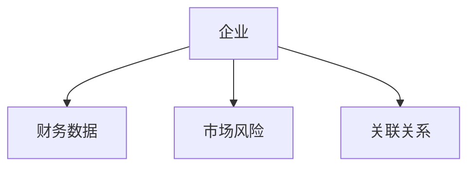
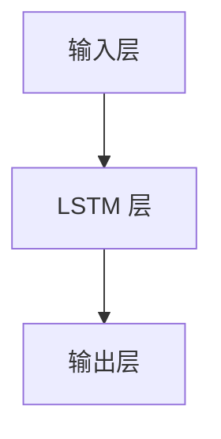
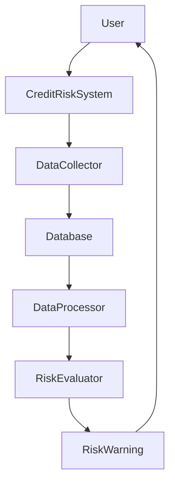
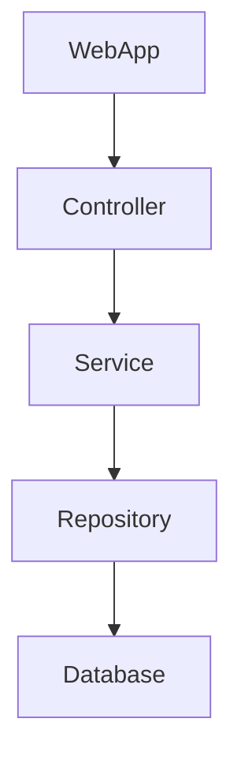
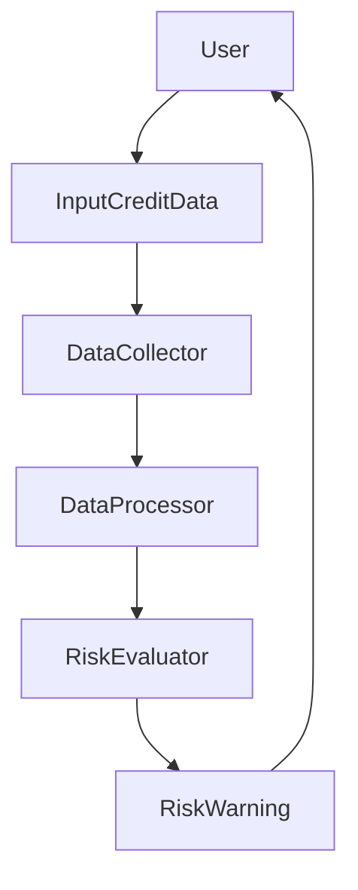

                 


# AI驱动的企业信用风险传导路径识别与预警系统

**关键词**: AI, 企业信用风险, 传导路径, 预警系统, 风险识别

**摘要**: 本文详细探讨了如何利用人工智能技术识别和预警企业信用风险的传导路径。文章从信用风险的基本概念出发，分析了传统信用风险评估方法的局限性，介绍了AI技术在信用风险评估中的优势，并详细阐述了基于AI的企业信用风险传导路径识别与预警系统的构建过程，包括系统架构设计、算法实现和实际应用场景。通过本文的分析，读者可以全面理解AI在信用风险管理中的应用价值和实际效果。

---

# 第一部分: AI驱动的企业信用风险传导路径识别与预警系统背景介绍

## 第1章: 信用风险的基本概念与问题背景

### 1.1 信用风险的定义与特征

#### 1.1.1 信用风险的定义
信用风险是指由于债务人或交易对手无法履行其合同义务，导致债权人或相关利益方遭受损失的风险。在企业层面，信用风险主要体现在企业无法按时偿还债务、履行合同义务或支付相关费用，从而影响其信用评级和市场信任度。

#### 1.1.2 信用风险的特征
- **隐蔽性**：信用风险往往在企业财务状况恶化之前不易察觉。
- **传导性**：信用风险可能通过供应链、金融市场或企业关联关系传导至其他相关方。
- **复杂性**：信用风险的传导路径涉及多个因素，如企业财务状况、市场环境、政策变化等。
- **动态性**：信用风险会随着市场环境和企业经营状况的变化而变化。

#### 1.1.3 信用风险的传导机制
信用风险的传导机制可以通过以下步骤进行分析：
1. **触发因素**：企业内部或外部的负面事件（如财务造假、市场波动等）触发信用风险。
2. **风险扩散**：风险通过企业间的关联关系（如供应链、投资关系等）传导至相关方。
3. **放大效应**：风险在传导过程中可能被放大，导致连锁反应，影响更广泛的市场或行业。

### 1.2 企业信用风险的现状与挑战

#### 1.2.1 传统信用风险评估方法的局限性
传统的信用风险评估方法主要依赖于财务报表分析、信用评分模型和历史数据统计。然而，这些方法存在以下局限性：
- **数据依赖性强**：传统方法需要大量历史数据，难以应对数据稀缺或不完整的情况。
- **静态分析**：传统方法通常基于静态数据进行分析，难以捕捉动态变化的市场环境。
- **主观性较高**：信用评分模型的权重和参数需要人工设定，可能导致主观偏差。

#### 1.2.2 数字化时代信用风险的新特点
随着数字化技术的发展，信用风险的评估和管理方式也在发生变化：
- **数据多样性**：企业可以通过大数据技术获取多维度的数据，包括社交媒体、供应链数据、市场行为数据等。
- **实时性**：通过实时数据流分析，企业可以更快地识别和应对信用风险。
- **复杂性增加**：企业之间的关联性增强，信用风险的传导路径更加复杂。

#### 1.2.3 企业信用风险传导路径的复杂性
在数字化时代，企业信用风险的传导路径变得更加复杂：
- **多维度关联**：企业可能通过供应链、投资关系、市场行为等多种途径与其他企业相关联。
- **网络效应**：信用风险在企业网络中的传导可能导致连锁反应，影响范围更广。
- **不确定性增加**：由于数据的多样性和复杂性，信用风险的预测难度增加。

### 1.3 AI技术在信用风险领域的应用前景

#### 1.3.1 AI技术的基本概念
人工智能（AI）是指模拟人类智能的计算机系统，包括学习、推理、自我改进等能力。AI技术在信用风险评估中的应用主要包括：
- **机器学习**：通过训练模型，识别信用风险的相关特征。
- **自然语言处理（NLP）**：分析非结构化数据（如新闻、社交媒体）中的信用风险信号。
- **深度学习**：通过深度神经网络模型，捕捉复杂的信用风险模式。

#### 1.3.2 AI技术在信用风险评估中的优势
AI技术在信用风险评估中的优势主要体现在以下几个方面：
- **数据处理能力**：AI能够处理大量结构化和非结构化数据，发现传统方法难以察觉的模式。
- **实时性**：AI可以通过实时数据流分析，快速识别信用风险信号。
- **自动化**：AI能够自动化完成信用评估和风险预警，减少人为干预。

#### 1.3.3 企业信用风险预警系统的发展趋势
随着AI技术的不断发展，企业信用风险预警系统将呈现以下发展趋势：
- **智能化**：通过AI技术实现信用风险的智能化评估和预警。
- **实时化**：基于实时数据流分析，实现信用风险的实时监测。
- **个性化**：根据不同企业的特点，提供个性化的信用风险评估和预警服务。

### 1.4 本章小结
本章介绍了信用风险的基本概念、传导机制以及AI技术在信用风险评估中的应用前景。通过分析传统信用风险评估方法的局限性和AI技术的优势，为后续章节的深入探讨奠定了基础。

---

# 第二部分: 企业信用风险传导路径识别的核心概念

## 第2章: 企业信用风险传导路径的识别模型

### 2.1 信用风险传导路径的定义与分类

#### 2.1.1 信用风险传导路径的定义
信用风险传导路径是指信用风险从一个企业或市场传递到另一个企业或市场的路径和机制。识别信用风险传导路径的关键在于分析企业之间的关联关系和风险传播的渠道。

#### 2.1.2 信用风险传导路径的分类
信用风险传导路径可以分为以下几类：
- **直接传导路径**：通过企业间的直接交易或投资关系传递风险。
- **间接传导路径**：通过供应链、金融市场或其他中间媒介传递风险。
- **系统性传导路径**：由于市场整体波动导致的风险传导。

#### 2.1.3 信用风险传导路径的特征
- **路径依赖性**：信用风险的传导路径依赖于企业的关联关系和市场环境。
- **复杂性**：信用风险的传导路径可能涉及多个中间环节和多种传播机制。
- **动态变化**：随着市场环境和企业经营状况的变化，信用风险的传导路径可能发生变化。

### 2.2 信用风险传导路径识别的核心要素

#### 2.2.1 企业财务数据
企业财务数据是信用风险评估的重要依据，主要包括：
- **财务报表**：包括资产负债表、利润表、现金流量表等。
- **财务指标**：如偿债能力指标（流动比率、速动比率）、盈利能力指标（净利率、ROE）等。

#### 2.2.2 市场风险
市场风险是指由于市场价格波动对企业信用风险的影响。市场风险可以通过以下方式传导：
- **股票价格波动**：企业股票价格的大幅波动可能影响投资者信心，进而影响企业的融资能力。
- **债券收益率变化**：债券收益率的变化可能影响企业的债务成本，进而影响企业的偿债能力。

#### 2.2.3 企业关联关系
企业关联关系是指企业之间的投资、供应链、合作等关系。关联关系的存在可能导致信用风险在企业之间传导。例如，如果一家企业的信用状况恶化，可能会影响其关联企业的信用评级。

### 2.3 信用风险传导路径识别的数学模型

#### 2.3.1 线性回归模型
线性回归模型是一种常用的统计模型，可以用于分析信用风险的相关因素。模型形式如下：
$$
y = \beta_0 + \beta_1x_1 + \beta_2x_2 + \cdots + \beta_nx_n + \epsilon
$$
其中，$y$ 是信用风险指标，$x_i$ 是影响信用风险的因素，$\beta_i$ 是回归系数，$\epsilon$ 是误差项。

#### 2.3.2 马尔可夫链模型
马尔可夫链模型可以用于分析信用风险的传导路径。假设企业信用等级的变化服从马尔可夫过程，可以通过转移概率矩阵来描述信用等级的变化。

#### 2.3.3 网络图模型
网络图模型可以用于描述企业之间的关联关系及其信用风险传导路径。例如，可以通过构建企业关联网络，分析信用风险在企业网络中的传播路径。

### 2.4 核心概念的ER实体关系图



---

# 第三部分: 企业信用风险传导路径识别的算法原理

## 第3章: 信用风险传导路径识别的算法实现

### 3.1 基于深度学习的信用风险预测模型

#### 3.1.1 深度学习模型的结构
深度学习模型（如LSTM、CNN）可以用于信用风险的预测。以下是一个简单的LSTM模型结构图：



#### 3.1.2 模型训练过程
模型训练过程包括以下步骤：
1. 数据预处理：清洗数据，提取特征。
2. 模型训练：使用训练数据训练模型。
3. 模型评估：使用测试数据评估模型性能。
4. 模型优化：调整模型参数，优化模型性能。

#### 3.1.3 模型预测与解释
通过训练好的模型，可以对企业的信用风险进行预测，并根据模型输出的结果进行风险预警。

### 3.2 基于网络分析的信用风险传导路径识别

#### 3.2.1 网络分析的基本原理
网络分析可以通过构建企业关联网络，分析信用风险的传导路径。例如，可以通过计算网络中的节点度数、中心度等指标，识别关键企业或高风险节点。

#### 3.2.2 网络分析的实现步骤
1. 数据收集：收集企业的关联关系数据。
2. 网络构建：基于关联关系数据构建企业网络。
3. 网络分析：分析网络中的关键节点和路径。

#### 3.2.3 网络分析的实际应用
通过网络分析，可以识别信用风险的传导路径，并评估不同路径的风险影响。

### 3.3 算法实现的Python代码示例

#### 3.3.1 线性回归模型实现
```python
import pandas as pd
from sklearn.linear_model import LinearRegression
from sklearn.metrics import mean_squared_error

# 加载数据
data = pd.read_csv('credit_risk.csv')

# 定义特征和目标变量
X = data[['revenue', 'profit', 'debt']]
y = data['credit_risk_score']

# 训练模型
model = LinearRegression()
model.fit(X, y)

# 预测结果
y_pred = model.predict(X)

# 评估模型
 mse = mean_squared_error(y, y_pred)
 print('均方误差:', mse)
```

#### 3.3.2 网络分析实现
```python
import networkx as nx

# 创建图
G = nx.Graph()

# 添加节点
G.add_nodes_from(['A', 'B', 'C', 'D'])

# 添加边
G.add_edges_from([('A', 'B'), ('B', 'C'), ('C', 'D')])

# 绘制图
nx.draw(G, with_labels=True)
```

---

# 第四部分: 企业信用风险传导路径识别的系统架构设计

## 第4章: 信用风险传导路径识别的系统架构

### 4.1 系统功能设计

#### 4.1.1 数据采集模块
数据采集模块负责从多种数据源采集企业信用相关的数据，包括：
- **财务数据**：企业的财务报表数据。
- **市场数据**：企业的股票价格、债券收益率等市场数据。
- **关联关系数据**：企业之间的关联关系数据。

#### 4.1.2 数据处理模块
数据处理模块负责对采集到的数据进行清洗、转换和特征提取，为后续分析提供高质量的数据。

#### 4.1.3 风险评估模块
风险评估模块基于处理后的数据，利用AI算法模型进行信用风险评估和传导路径识别。

#### 4.1.4 风险预警模块
风险预警模块根据评估结果生成风险预警信号，并通过可视化界面向用户展示。

### 4.2 系统架构设计

#### 4.2.1 领域模型
领域模型用于描述系统的核心业务逻辑和数据关系。以下是一个简单的领域模型图：



#### 4.2.2 系统架构图
系统架构图用于描述系统的整体架构和各模块之间的关系。以下是一个简单的系统架构图：



#### 4.2.3 系统接口设计
系统接口设计包括以下几个部分：
- **数据接口**：数据采集模块与数据源之间的接口。
- **服务接口**：风险评估模块与数据处理模块之间的接口。
- **用户接口**：风险预警模块与用户的接口。

#### 4.2.4 系统交互流程
系统交互流程描述了用户与系统之间的交互过程。以下是一个简单的交互流程图：



### 4.3 系统实现的注意事项

#### 4.3.1 数据源的选择与整合
数据源的选择与整合是系统实现的关键。需要考虑数据的全面性、准确性和实时性。

#### 4.3.2 系统性能优化
为了提高系统的性能，可以采取以下措施：
- **数据预处理**：减少数据冗余，提高数据处理效率。
- **算法优化**：选择高效的算法和参数设置，提高模型的预测精度和运行效率。
- **分布式计算**：利用分布式计算技术，提高系统的处理能力。

#### 4.3.3 系统的可扩展性
为了保证系统的可扩展性，需要设计模块化、可扩展的系统架构。例如，可以通过插件式设计，方便后续功能的扩展和升级。

---

# 第五部分: 企业信用风险传导路径识别的项目实战

## 第5章: 项目实战与案例分析

### 5.1 环境安装与配置

#### 5.1.1 安装Python环境
需要安装Python 3.6及以上版本，并安装以下库：
- `pandas`
- `numpy`
- `scikit-learn`
- `networkx`
- `pymermaid`

#### 5.1.2 安装Jupyter Notebook
Jupyter Notebook是一个方便的数据分析和可视化的工具，可以通过以下命令安装：
```bash
pip install jupyter
```

#### 5.1.3 安装数据库
可以使用MySQL或MongoDB等数据库来存储和管理企业信用数据。

### 5.2 系统核心功能实现

#### 5.2.1 数据采集模块实现
```python
import pandas as pd

# 从CSV文件读取数据
data = pd.read_csv('credit_risk.csv')

# 查看数据的前几行
print(data.head())
```

#### 5.2.2 数据处理模块实现
```python
from sklearn.preprocessing import StandardScaler

# 标准化数据
scaler = StandardScaler()
data_scaled = scaler.fit_transform(data)
```

#### 5.2.3 风险评估模块实现
```python
from sklearn.linear_model import LinearRegression

# 训练模型
model = LinearRegression()
model.fit(X_train, y_train)

# 预测结果
y_pred = model.predict(X_test)
```

#### 5.2.4 风险预警模块实现
```python
import numpy as np

# 计算风险评分
risk_score = np.mean(abs(y_pred - y_test))
print('风险评分:', risk_score)
```

### 5.3 实际案例分析

#### 5.3.1 案例背景
假设某企业A的财务数据如下：
- 营业收入：1000万元
- 净利润：100万元
- 负债：500万元

#### 5.3.2 案例分析
通过模型分析，发现该企业的流动比率较低，可能存在偿债压力。同时，企业A与多家上下游企业存在关联关系，可能存在较高的信用风险传导风险。

#### 5.3.3 风险预警结果
模型预测结果显示，企业A的信用风险评分为0.7（满分1），属于高风险企业。

### 5.4 项目小结
本章通过实际案例分析，展示了如何利用AI技术进行企业信用风险的传导路径识别与预警。通过系统实现和案例分析，验证了模型的有效性和实用性。

---

# 第六部分: 企业信用风险传导路径识别的优化与扩展

## 第6章: 系统优化与扩展

### 6.1 系统优化建议

#### 6.1.1 数据源的扩展
可以通过引入更多数据源（如社交媒体数据、新闻数据）来提高模型的预测精度。

#### 6.1.2 算法优化
可以通过尝试不同的算法（如随机森林、梯度提升树等）来优化模型性能。

#### 6.1.3 系统性能优化
可以通过分布式计算、缓存优化等技术来提高系统的运行效率。

### 6.2 系统扩展方向

#### 6.2.1 多维度风险评估
可以结合市场风险、操作风险等多种风险因素，进行多维度的信用风险评估。

#### 6.2.2 实时风险监控
可以实现对企业信用风险的实时监控，及时发现和应对风险。

#### 6.2.3 个性化风险预警
可以根据不同企业的特点，提供个性化的风险预警服务。

### 6.3 最佳实践 Tips

#### 6.3.1 数据质量管理
数据质量是模型性能的基础，需要重视数据的清洗和预处理工作。

#### 6.3.2 模型解释性
选择具有较高解释性的模型，方便用户理解和使用。

#### 6.3.3 系统安全性
需要重视系统的安全性，防止数据泄露和网络攻击。

### 6.4 本章小结
本章提出了系统优化建议和扩展方向，并总结了最佳实践，为后续的研究和应用提供了参考。

---

# 作者：AI天才研究院 & 禅与计算机程序设计艺术

通过本文的详细分析，读者可以全面了解AI驱动的企业信用风险传导路径识别与预警系统的构建过程和实际应用。希望本文能够为信用风险管理领域的研究和实践提供有价值的参考。

