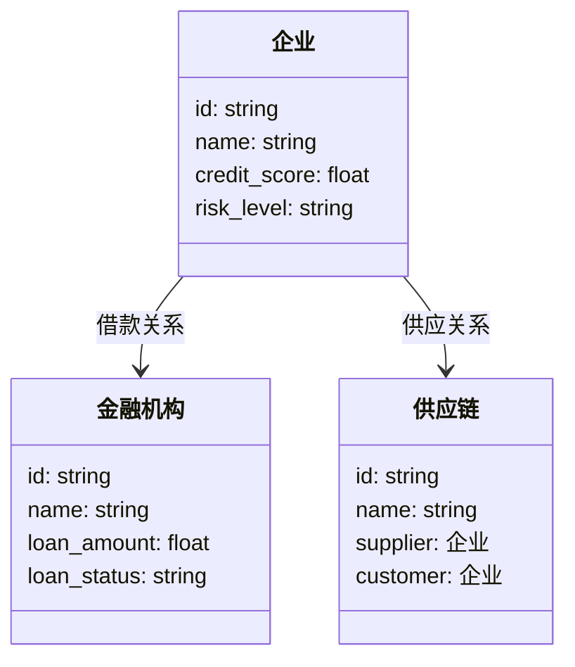
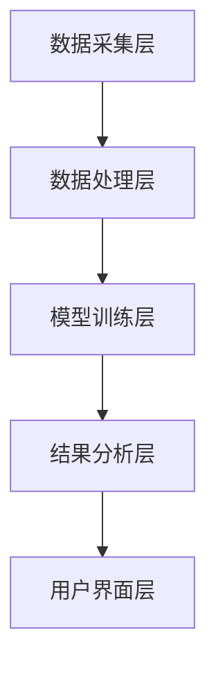
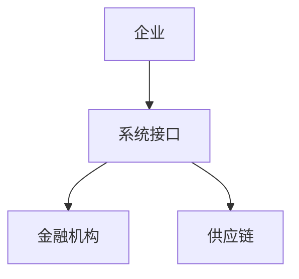
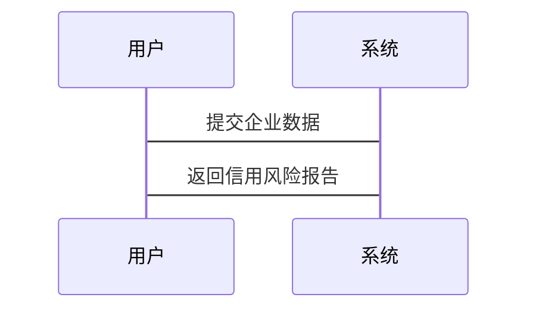

                 


# AI驱动的企业信用风险传导路径识别系统

> 关键词：人工智能, 信用风险, 传导路径识别, 图神经网络, 企业风险管理

> 摘要：本文系统阐述了基于人工智能的企业信用风险传导路径识别系统的构建与应用。通过分析信用风险传导的复杂性，结合人工智能技术的优势，提出了基于图神经网络的解决方案，并详细探讨了系统架构设计、算法实现及实际案例分析。本文旨在为企业信用风险管理提供新的思路和方法，助力企业更好地识别和应对信用风险。

---

## 第一部分: 企业信用风险传导路径识别的背景与基础

### 第1章: 企业信用风险传导路径概述

#### 1.1 企业信用风险的基本概念

##### 1.1.1 企业信用风险的定义
企业信用风险是指企业在经营过程中，由于客户或交易对手无法履行其合同义务，导致企业遭受经济损失的可能性。这种风险广泛存在于企业的日常运营中，尤其是在供应链管理和金融投资领域。

##### 1.1.2 信用风险的分类与特征
信用风险可以分为系统性风险和非系统性风险。系统性风险是由宏观经济因素引起的，影响整个市场的风险；而非系统性风险则是由特定企业或个体的信用状况变化引起的局部风险。信用风险具有隐蔽性、传染性和累积性等特点。

##### 1.1.3 信用风险传导的定义与特点
信用风险传导是指信用风险从一个实体（如企业、银行）传递到另一个实体的过程。其特点是多级性、间接性和复杂性。例如，一家企业的违约可能影响其供应商和客户的信用状况，进而波及更广泛的市场。

#### 1.2 信用风险传导路径的识别需求

##### 1.2.1 企业信用风险传导的复杂性
随着全球化和金融化的深入，企业的供应链和业务网络日益复杂，信用风险的传导路径也变得更加复杂。传统的线性分析方法难以捕捉这种复杂性。

##### 1.2.2 传统信用风险识别的局限性
传统信用风险识别方法通常依赖于财务报表分析和历史数据统计，难以捕捉实时动态变化和非结构化数据中的风险信号。

##### 1.2.3 AI技术在信用风险传导路径识别中的优势
人工智能技术，特别是机器学习和深度学习，能够处理海量数据，发现数据中的隐含关联，从而更准确地识别信用风险传导路径。

#### 1.3 企业信用风险传导路径识别的目标与意义

##### 1.3.1 识别信用风险传导路径的目标
通过识别信用风险传导路径，企业可以提前预警潜在风险，制定相应的风险管理策略，降低风险损失。

##### 1.3.2 信用风险传导路径识别的现实意义
在全球化背景下，企业信用风险传导路径识别具有重要的现实意义。它不仅有助于企业自身的风险管理，还能为政府和监管部门提供决策支持。

##### 1.3.3 对企业风险管理的价值
通过识别信用风险传导路径，企业可以优化供应链管理，降低因供应商或客户违约带来的风险，同时也可以更好地评估和管理合作伙伴的风险。

---

## 第二部分: 企业信用风险传导路径识别的核心概念与联系

### 第2章: 核心概念与原理

#### 2.1 信用风险传导路径识别的核心概念

##### 2.1.1 信用风险传导的主体与客体
主体：企业、金融机构、供应链中的上下游企业；客体：企业的信用状况、财务数据、市场信息等。

##### 2.1.2 信用风险传导的驱动因素
经济环境、企业经营状况、市场波动、政策变化等。

##### 2.1.3 信用风险传导路径的结构化分析
通过构建网络模型，分析信用风险在不同实体之间的传导路径。

#### 2.2 信用风险传导路径的数学模型构建

##### 2.2.1 信用风险传导的网络模型
构建一个基于实体之间的关联网络，使用图论方法分析信用风险的传导路径。

##### 2.2.2 基于图论的信用风险传导路径分析
通过图的遍历算法，如广度优先搜索（BFS）和深度优先搜索（DFS），识别信用风险的传导路径。

##### 2.2.3 信用风险传导路径的权重计算
根据实体之间的关联强度和风险传染性，计算信用风险传导路径的权重。

#### 2.3 AI技术在信用风险传导路径识别中的作用

##### 2.3.1 机器学习在信用风险识别中的应用
使用机器学习算法，如支持向量机（SVM）和随机森林（Random Forest），对企业的信用风险进行分类和预测。

##### 2.3.2 深度学习在信用风险传导路径分析中的优势
深度学习模型，如卷积神经网络（CNN）和循环神经网络（RNN），能够捕捉数据中的复杂模式和关联性，提高信用风险传导路径识别的准确性。

##### 2.3.3 自然语言处理在信用风险文本分析中的应用
使用自然语言处理技术，分析企业财报、新闻报道等文本数据，提取潜在的信用风险信号。

### 第3章: 核心概念与联系的系统分析

#### 3.1 信用风险传导路径识别的核心概念

##### 3.1.1 信用风险传导的主体与客体
主体包括企业、金融机构等，客体包括企业的信用数据、市场信息等。

##### 3.1.2 信用风险传导的驱动因素
经济环境、企业经营状况、市场波动等。

##### 3.1.3 信用风险传导路径的结构化分析
通过构建网络模型，分析信用风险在不同实体之间的传导路径。

#### 3.2 信用风险传导路径的数学模型构建

##### 3.2.1 信用风险传导的网络模型
使用图论方法，将企业与关联实体之间的关系表示为图结构。

##### 3.2.2 基于图论的信用风险传导路径分析
通过图的遍历算法，识别信用风险的传导路径。

##### 3.2.3 信用风险传导路径的权重计算
根据实体之间的关联强度和风险传染性，计算信用风险传导路径的权重。

---

## 第三部分: 系统分析与架构设计

### 第4章: 系统功能设计

#### 4.1 问题场景介绍
企业信用风险传导路径识别系统需要解决的问题包括：如何实时监控企业的信用状况，如何识别潜在的信用风险传导路径，如何预测风险的扩散范围和影响程度。

#### 4.2 领域模型设计
##### 4.2.1 领域模型概述
领域模型描述了系统的功能模块及其相互关系。

##### 4.2.2 领域模型类图
使用Mermaid绘制领域模型类图，展示系统中的主要实体和它们之间的关系。



#### 4.3 系统架构设计

##### 4.3.1 系统架构概述
系统架构包括数据采集层、数据处理层、模型训练层、结果分析层和用户界面层。

##### 4.3.2 系统架构图
使用Mermaid绘制系统架构图，展示各层的功能模块及其相互关系。



#### 4.4 系统接口设计

##### 4.4.1 系统接口概述
系统需要提供API接口，供其他系统或用户调用。

##### 4.4.2 系统接口图
使用Mermaid绘制系统接口图，展示接口的调用关系。



#### 4.5 系统交互设计

##### 4.5.1 系统交互概述
系统交互包括用户与系统的互动，如输入数据、查询结果等。

##### 4.5.2 系统交互图
使用Mermaid绘制系统交互图，展示用户与系统之间的交互流程。



---

## 第四部分: 项目实战

### 第5章: 项目实战

#### 5.1 环境安装

##### 5.1.1 系统环境要求
操作系统：Linux/Windows/MacOS
Python版本：3.6+
依赖库：numpy, pandas, scikit-learn, tensorflow, pymermaid

##### 5.1.2 安装依赖
使用pip安装所需依赖：
```bash
pip install numpy pandas scikit-learn tensorflow pymermaid
```

#### 5.2 核心代码实现

##### 5.2.1 数据预处理
```python
import pandas as pd
import numpy as np

# 加载数据
data = pd.read_csv('credit_data.csv')

# 数据清洗
data.dropna()
data = pd.get_dummies(data)
```

##### 5.2.2 模型训练
```python
from sklearn.model

