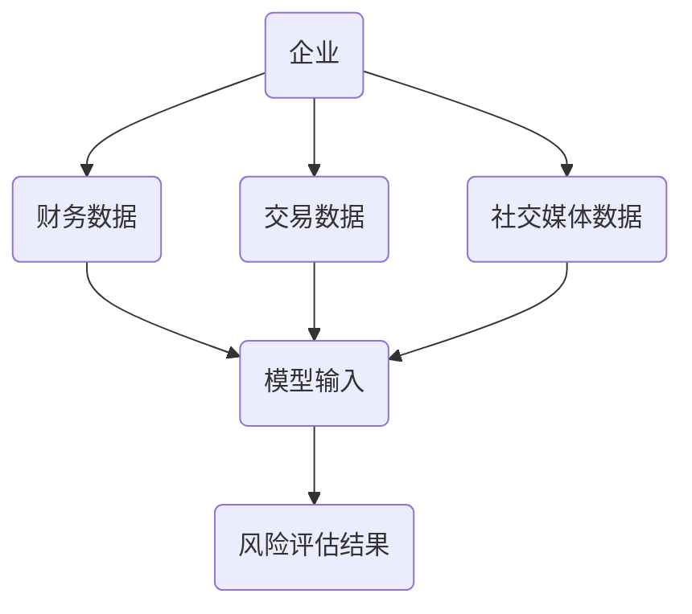
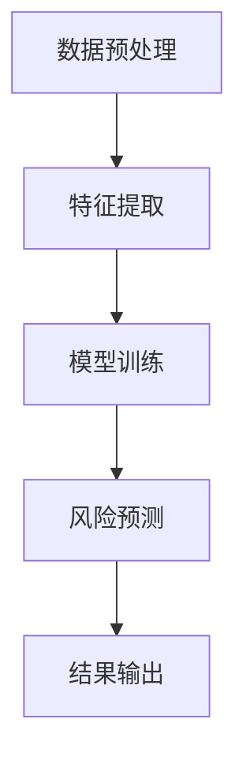
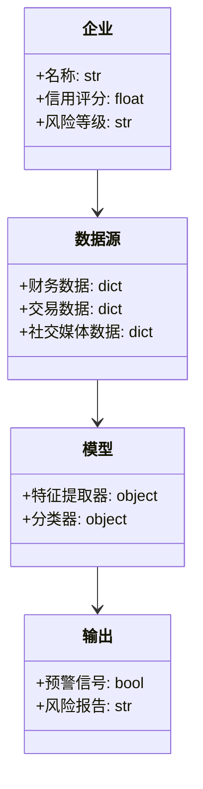
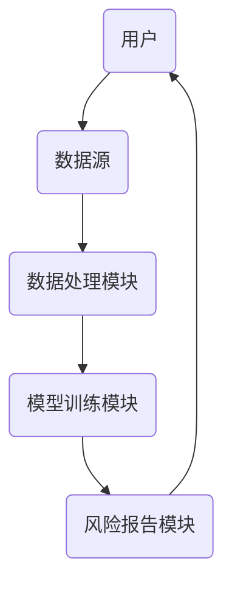
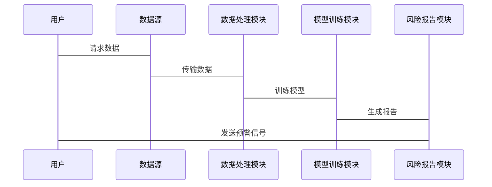

                 


# AI驱动的企业信用风险早期预警信号识别系统

## 关键词：
- AI
- 信用风险
- 早期预警
- 机器学习
- 自然语言处理

## 摘要：
本文探讨了如何利用人工智能技术构建企业信用风险早期预警信号识别系统。通过分析信用风险的核心要素，结合机器学习和自然语言处理技术，提出了一种基于AI的解决方案，旨在提前识别潜在风险，优化企业信用评估流程。文章详细介绍了系统的背景、核心概念、算法原理、架构设计及实际应用案例，为相关领域提供了理论与实践指导。

---

## 第一部分: 企业信用风险早期预警信号识别系统背景介绍

### 第1章: 问题背景与描述

#### 1.1 问题背景
##### 1.1.1 企业信用风险的定义与重要性
企业信用风险是指企业在经营过程中，由于内部或外部因素导致无法履行债务或违约的可能性。信用风险的早期识别对于企业维护财务健康、规避潜在损失具有重要意义。

##### 1.1.2 信用风险对企业经营的影响
信用风险可能导致企业违约、资金链断裂，甚至引发连锁反应，影响整个金融市场的稳定性。因此，及时识别和管理信用风险是企业风险管理的核心任务之一。

##### 1.1.3 传统信用风险评估的局限性
传统信用评估主要依赖财务报表分析和人工经验判断，存在以下问题：
- 数据维度有限，难以捕捉非财务风险因素。
- 人工判断主观性强，效率低下。
- 风险预警滞后，难以实现早期识别。

#### 1.2 问题描述
##### 1.2.1 信用风险早期预警的必要性
早期预警系统能够在风险发生前发出警报，帮助企业采取预防措施，降低损失。

##### 1.2.2 当前信用风险识别的主要挑战
- 数据分散且异构，难以整合。
- 非结构化数据（如文本、社交媒体信息）难以有效利用。
- 模型泛化能力不足，难以适应复杂多变的市场环境。

##### 1.2.3 AI技术在信用风险评估中的潜力
人工智能技术（如机器学习、自然语言处理）能够从多源数据中提取特征，构建高精度的预测模型，显著提升风险识别能力。

#### 1.3 问题解决与边界
##### 1.3.1 AI驱动信用风险预警的核心目标
通过AI技术，实现对企业信用风险的实时监控和早期预警，帮助企业在风险发生前采取应对措施。

##### 1.3.2 系统的边界与外延
- 系统边界：仅关注信用风险的早期识别，不涉及风险处置环节。
- 外延：涵盖企业内外部数据的整合与分析。

##### 1.3.3 核心要素与组成结构
- 核心要素：企业财务数据、交易数据、社交媒体数据、行业趋势数据。
- 组成结构：数据采集、特征提取、模型训练、风险预警。

---

## 第二部分: 核心概念与联系

### 第2章: 核心概念与联系

#### 2.1 核心概念原理
##### 2.1.1 信用风险的核心要素
- 财务状况：如资产负债率、利润率。
- 经营状况：如市场占有率、供应链稳定性。
- 信用历史：如违约记录、还款能力。

##### 2.1.2 AI技术在信用评估中的应用原理
- 数据预处理：清洗、整合多源数据。
- 特征提取：利用NLP技术提取文本特征，如情感分析、关键词提取。
- 模型训练：基于机器学习算法（如XGBoost、随机森林）构建预测模型。

##### 2.1.3 早期预警信号的特征提取
- 时间序列特征：如收入波动、现金流变化。
- 文本特征：如公司公告、行业新闻的情感倾向。

#### 2.2 概念属性特征对比
##### 2.2.1 传统信用评估与AI驱动评估的对比分析

| 特性 | 传统评估 | AI驱动评估 |
|------|----------|------------|
| 数据来源 | 财务数据为主 | 多源数据（财务、文本、交易） |
| 方法 | 统计分析 | 机器学习、NLP |
| 效率 | 低效 | 高效实时 |

##### 2.2.2 早期预警信号的分类与特征
- 财务信号：如应收账款增加、利润率下降。
- 经营信号：如供应链中断、市场份额减少。
- 信用信号：如频繁借贷、还款逾期。

##### 2.2.3 数据特征与模型性能的关系
数据特征的多样性与模型性能呈正相关。多源数据的引入能够显著提升模型的预测精度。

#### 2.3 ER实体关系图


---

## 第三部分: 算法原理与数学模型

### 第3章: 算法原理讲解

#### 3.1 算法流程


#### 3.2 代码实现
##### 3.2.1 数据预处理
```python
import pandas as pd
data = pd.read_csv('credit_data.csv')
data.dropna(inplace=True)
```

##### 3.2.2 特征提取
```python
from sklearn.feature_extraction.text import TfidfVectorizer
vectorizer = TfidfVectorizer()
text_features = vectorizer.fit_transform(text_data)
```

##### 3.2.3 模型训练
```python
from sklearn.ensemble import RandomForestClassifier
model = RandomForestClassifier()
model.fit(features, labels)
```

##### 3.2.4 风险预测
```python
predictions = model.predict(new_features)
```

#### 3.3 数学模型
##### 3.3.1 逻辑回归模型
$$ P(y=1|x) = \frac{1}{1 + e^{-\beta x}} $$

##### 3.3.2 随机森林模型
随机森林通过集成学习提升模型的泛化能力，公式如下：
$$ y = \sum_{i=1}^{n} \text{Tree}(x) $$

---

## 第四部分: 系统分析与架构设计

### 第4章: 系统分析与架构设计

#### 4.1 问题场景介绍
系统需实时监控企业信用风险，及时发出预警信号。主要场景包括：
- 数据采集：从多源数据中获取相关信息。
- 风险评估：基于AI模型进行信用评分。
- 预警通知：通过邮件、短信等方式通知相关人员。

#### 4.2 系统功能设计
##### 4.2.1 领域模型类图


##### 4.2.2 系统架构图


##### 4.2.3 接口设计
- 数据接口：提供API用于数据采集和传输。
- 模型接口：提供API用于调用AI模型进行风险评估。

##### 4.2.4 交互流程


---

## 第五部分: 项目实战

### 第5章: 项目实战

#### 5.1 环境安装
- 安装Python和必要的库：
  ```bash
  pip install pandas sklearn numpy matplotlib
  ```

#### 5.2 核心代码实现
##### 5.2.1 数据预处理
```python
import pandas as pd
data = pd.read_csv('credit_data.csv')
data.dropna(inplace=True)
```

##### 5.2.2 特征提取与建模
```python
from sklearn.ensemble import RandomForestClassifier
from sklearn.feature_extraction.text import TfidfVectorizer

# 提取文本特征
vectorizer = TfidfVectorizer()
text_features = vectorizer.fit_transform(data['text_data'])

# 训练模型
model = RandomForestClassifier()
model.fit(text_features, data['label'])
```

##### 5.2.3 风险预测
```python
new_data = pd.DataFrame({'text_data': ['公司财务状况恶化']})
new_features = vectorizer.transform(new_data['text_data'])
predictions = model.predict(new_features)
print(predictions)
```

#### 5.3 案例分析
以某企业为例，分析其信用风险。通过系统预测，模型识别出潜在风险，并发出预警信号。

#### 5.4 项目小结
通过实战项目，验证了AI驱动信用风险预警系统的效果，展示了系统的实际应用价值。

---

## 第六部分: 最佳实践与总结

### 第6章: 最佳实践

#### 6.1 小结
本文详细介绍了AI驱动的企业信用风险早期预警信号识别系统的构建过程，包括背景分析、核心概念、算法原理、系统设计和项目实战。

#### 6.2 注意事项
- 数据隐私保护需高度重视。
- 模型需定期更新，以适应市场变化。
- 多源数据的整合可能面临技术挑战。

#### 6.3 拓展阅读
建议进一步研究以下内容：
- 基于深度学习的信用风险评估模型。
- 跨领域数据融合技术。
- 实时预警系统的优化方法。

---

## 结语
AI驱动的企业信用风险早期预警信号识别系统通过整合多源数据，利用先进的机器学习和自然语言处理技术，显著提升了信用风险的识别效率和准确性。未来，随着技术的进步，该系统将为企业风险管理提供更强大的支持。

---

## 作者
作者：AI天才研究院 & 禅与计算机程序设计艺术

