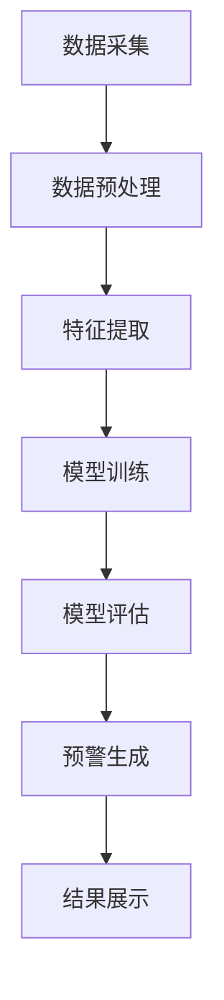
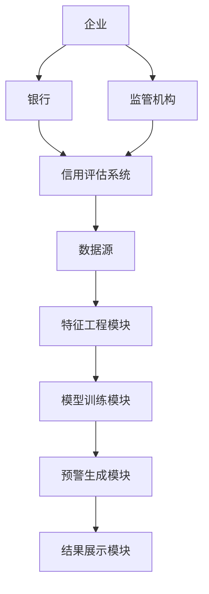
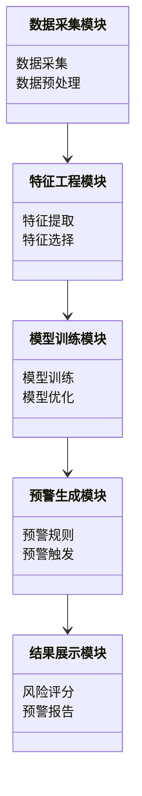
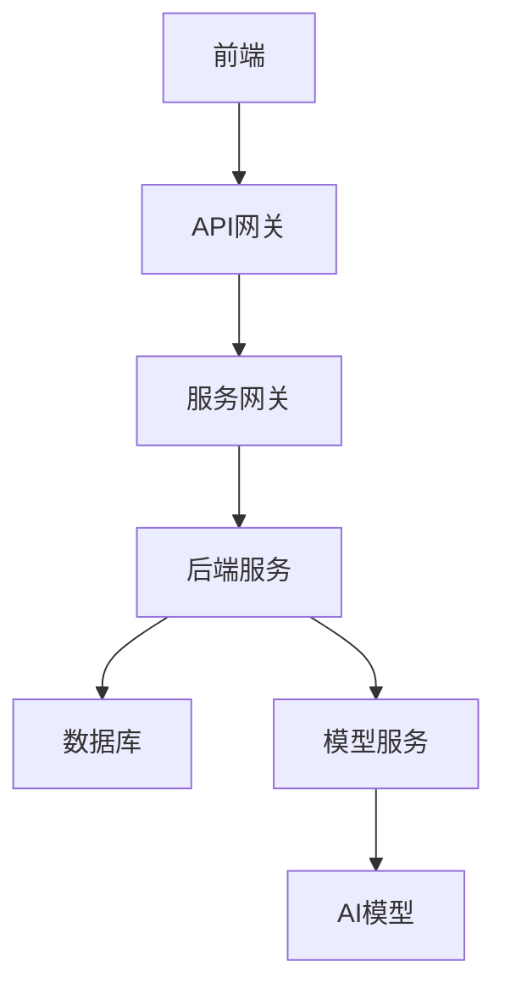
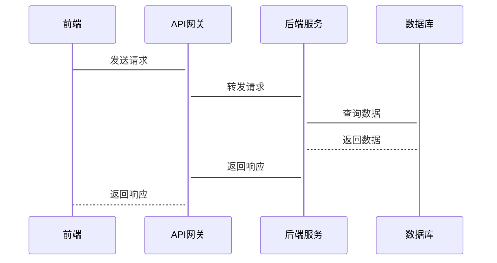

                 


---

# AI驱动的企业信用风险早期预警系统

> 关键词：企业信用风险、AI、早期预警、机器学习、信用评分、风险评估

> 摘要：本文详细探讨了基于AI技术的企业信用风险早期预警系统的构建方法。通过分析企业信用风险的核心概念、算法原理、系统架构和实际应用场景，本文提出了一个基于机器学习的解决方案，并通过实际案例展示了系统的实现过程。文章还结合了数学模型和代码示例，帮助读者深入理解系统的工作原理和实现细节。

---

# 第一部分: 企业信用风险早期预警系统概述

## 第1章: 企业信用风险早期预警系统背景

### 1.1 问题背景

#### 1.1.1 企业信用风险的定义与影响

企业信用风险是指企业在经营过程中由于外部经济环境变化、内部管理问题或其他不可抗力因素，导致无法按时偿还债务或履行合同义务的可能性。信用风险的高发性和隐蔽性使得企业信用风险的早期预警显得尤为重要。一旦信用风险发生，不仅会影响企业的正常运营，还可能引发连锁反应，影响整个金融系统的稳定性。

#### 1.1.2 传统信用风险评估的局限性

传统的信用风险评估方法主要依赖于财务报表分析和人工审核。这种方法存在以下问题：

- **数据维度有限**：传统方法主要依赖财务数据，难以捕捉企业经营中的非财务风险因素。
- **评估周期长**：人工审核效率低下，难以实现风险的实时预警。
- **主观性较强**：审核人员的主观判断可能影响评估结果的客观性。

#### 1.1.3 AI技术在信用风险评估中的应用潜力

随着人工智能技术的发展，机器学习、自然语言处理和深度学习等技术为信用风险评估提供了新的解决方案。通过分析企业内外部数据，AI技术可以更全面、更及时地发现潜在风险，从而实现信用风险的早期预警。

---

### 1.2 问题描述

#### 1.2.1 企业信用风险的主要类型

企业信用风险主要分为以下几种类型：

- **市场风险**：由于市场环境变化导致企业信用状况恶化。
- **流动性风险**：企业无法及时获得足够的资金以维持正常运营。
- **操作风险**：由于内部管理不当或外部欺诈行为导致的信用风险。

#### 1.2.2 信用风险早期预警的核心目标

信用风险早期预警的核心目标是通过分析企业的内外部数据，识别潜在的信用风险信号，提前发出预警，帮助相关方采取预防措施，降低信用风险的发生概率。

#### 1.2.3 系统需要解决的关键问题

- 如何高效采集和处理企业相关数据？
- 如何构建有效的特征工程，提取有用的信用风险指标？
- 如何选择和优化机器学习模型，实现高精度的信用风险预警？

---

### 1.3 问题解决思路

#### 1.3.1 数据驱动的信用风险评估方法

通过收集和分析企业相关的财务数据、经营数据、市场数据等，利用数据挖掘和机器学习技术，构建信用风险评估模型。

#### 1.3.2 AI技术在信用风险预警中的应用框架

AI技术的应用框架主要包括以下步骤：

1. 数据采集与预处理。
2. 特征提取与工程。
3. 模型训练与优化。
4. 预警结果生成与展示。

#### 1.3.3 系统设计的核心思路

- **数据驱动**：以企业内外部数据为基础，构建信用风险评估模型。
- **AI技术驱动**：利用机器学习和深度学习技术，实现信用风险的自动化评估。
- **实时预警**：通过实时监控企业数据，实现信用风险的早期预警。

---

### 1.4 系统的边界与外延

#### 1.4.1 系统功能边界

- 系统主要功能包括数据采集、特征工程、模型训练、预警生成和结果展示。
- 系统不包括企业信用风险管理的具体执行步骤，例如制定风险应对策略。

#### 1.4.2 系统适用的业务场景

- 适用于银行、金融机构、企业等需要进行信用风险评估的场景。
- 可用于企业信用评级、贷款审批、投资决策等领域。

#### 1.4.3 系统与其他系统的交互关系

- 与企业财务系统、市场数据系统等外部系统交互。
- 与企业内部管理系统、风控系统等内部系统交互。

---

### 1.5 核心概念与结构

#### 1.5.1 系统核心要素组成

- 数据来源：企业财务数据、经营数据、市场数据、行业数据等。
- 特征工程：企业信用风险相关的特征提取。
- 模型训练：基于机器学习的信用风险评估模型。
- 预警结果：信用风险预警信号和风险评分。

#### 1.5.2 系统功能模块划分

- 数据采集模块：负责企业数据的采集与预处理。
- 特征工程模块：提取企业信用风险相关的特征。
- 模型训练模块：基于机器学习算法训练信用风险评估模型。
- 预警生成模块：根据模型预测结果生成信用风险预警信号。
- 结果展示模块：将预警结果以可视化形式展示给用户。

#### 1.5.3 系统核心流程图

以下是一个简化的系统核心流程图：



---

## 第2章: 企业信用风险的核心概念

### 2.1 信用风险的核心原理

#### 2.1.1 信用风险的形成机制

信用风险的形成机制主要包括以下几个步骤：

1. **信息不对称**：企业与债权人之间存在信息不对称，导致债权人无法全面了解企业的信用状况。
2. **风险因素积累**：企业经营中的各种风险因素逐渐积累，最终导致信用风险的发生。
3. **触发事件**：某个事件的发生（如市场环境恶化、企业财务状况恶化等）触发信用风险。

#### 2.1.2 信用风险的关键影响因素

以下是一个信用风险影响因素的对比表格：

| 影响因素 | 类型       | 描述                               |
|----------|------------|------------------------------------|
| 财务状况 | 内部因素   | 包括资产负债率、流动比率、净利润率等 |
| 经营状况 | 内部因素   | 包括企业盈利能力、市场占有率等     |
| 行业环境 | 外部因素   | 包括行业竞争状况、政策法规变化等   |
| 市场环境 | 外部因素   | 包括宏观经济环境、市场波动等       |

#### 2.1.3 信用风险的量化方法

信用风险的量化方法主要包括以下几种：

- **信用评分模型**：通过对企业信用状况的评分，量化企业的信用风险。
- **违约概率模型**：通过统计方法估算企业违约的概率。
- **风险价值模型**：通过蒙特卡洛模拟等方法估算信用风险的价值。

---

#### 2.1.4 信用评分模型

以下是一个简化的信用评分模型公式：

$$ \text{信用评分} = \alpha \times \text{财务特征} + \beta \times \text{经营特征} + \gamma \times \text{市场特征} $$

其中，$\alpha$、$\beta$、$\gamma$是模型的权重系数，$\text{财务特征}$、$\text{经营特征}$、$\text{市场特征}$是企业的相关特征。

---

#### 2.1.5 违约概率模型

违约概率模型的核心公式如下：

$$ P(\text{违约}) = \frac{\text{违约企业的数量}}{\text{总企业数量}} $$

---

### 2.2 系统实体关系图

以下是一个系统实体关系图：



---

## 第3章: AI驱动信用风险预警的核心算法

### 3.1 算法原理概述

#### 3.1.1 机器学习在信用评估中的应用

机器学习在信用评估中的主要应用包括：

- 数据预处理：特征提取、数据清洗、数据增强。
- 模型训练：分类模型（如逻辑回归、随机森林、XGBoost）和回归模型（如线性回归）。
- 模型评估：准确率、召回率、F1分数等。

#### 3.1.2 常见信用评分模型的算法原理

以下是一个常见信用评分模型的对比表格：

| 模型名称 | 算法类型 | 优点                                   | 缺点                                   |
|----------|-----------|----------------------------------------|----------------------------------------|
| 逻辑回归 | 分类模型   | 易解释、计算效率高                   | 对非线性关系的拟合能力较差             |
| 随机森林 | 分类模型   | 抗过拟合能力强、特征重要性可解释     | 计算复杂度较高                         |
| XGBoost  | 分类模型   | 高精度、支持并行计算               | � prone to overfitting if not tuned properly |

---

#### 3.1.3 基于AI的信用风险预警算法框架

以下是一个基于AI的信用风险预警算法框架：


---

### 3.2 算法流程图

以下是一个具体的算法流程图：


---

### 3.3 算法实现代码

以下是一个基于Python的信用风险预警系统代码示例：

```python
import pandas as pd
import numpy as np
from sklearn.ensemble import RandomForestClassifier
from sklearn.metrics import accuracy_score, recall_score, f1_score
from sklearn.model_selection import train_test_split

# 数据加载与预处理
data = pd.read_csv('enterprise_credit_data.csv')
data = data.dropna()
data = (data - data.mean()) / data.std()  # 标准化处理

# 特征工程
X = data.drop(columns=['label'])
y = data['label']

# 数据划分
X_train, X_test, y_train, y_test = train_test_split(X, y, test_size=0.2, random_state=42)

# 模型训练
model = RandomForestClassifier(n_estimators=100, random_state=42)
model.fit(X_train, y_train)

# 模型评估
y_pred = model.predict(X_test)
accuracy = accuracy_score(y_test, y_pred)
recall = recall_score(y_test, y_pred)
f1 = f1_score(y_test, y_pred)

print(f'Accuracy: {accuracy}')
print(f'Recall: {recall}')
print(f'F1 Score: {f1}')
```

---

## 第4章: 信用风险预警的数学模型

### 4.1 信用评分模型

#### 4.1.1 逻辑回归模型

逻辑回归模型的核心公式如下：

$$ P(y=1) = \frac{e^{\beta x}}{1 + e^{\beta x}} $$

其中，$x$ 是输入特征，$\beta$ 是模型的参数。

---

#### 4.1.2 随机森林模型

随机森林模型的核心公式如下：

$$ y = \text{sign}(\sum_{i=1}^{n} \text{Tree}_i(x)) $$

其中，$n$ 是树的数量，$\text{Tree}_i(x)$ 是第$i$棵树的输出。

---

#### 4.1.3 XGBoost模型

XGBoost模型的核心公式如下：

$$ y = \sum_{k=1}^{K} \theta_k h(x; \theta_k) $$

其中，$K$ 是树的数量，$\theta_k$ 是每棵树的参数，$h(x; \theta_k)$ 是每棵树的输出函数。

---

## 第5章: 企业信用风险早期预警系统的系统架构设计

### 5.1 系统功能模块划分

以下是一个系统功能模块划分的类图：



---

### 5.2 系统架构设计

以下是一个系统架构设计的架构图：



---

### 5.3 系统接口设计

以下是一个系统接口设计的序列图：



---

## 第6章: 项目实战

### 6.1 环境安装

#### 6.1.1 安装Python和相关库

```bash
pip install pandas numpy scikit-learn xgboost
```

---

#### 6.1.2 安装Jupyter Notebook

```bash
pip install jupyter
```

---

### 6.2 核心代码实现

#### 6.2.1 数据加载与预处理

```python
import pandas as pd
import numpy as np
from sklearn.ensemble import RandomForestClassifier
from sklearn.metrics import accuracy_score, recall_score, f1_score
from sklearn.model_selection import train_test_split

# 数据加载
data = pd.read_csv('enterprise_credit_data.csv')

# 数据清洗
data = data.dropna()

# 数据标准化
data = (data - data.mean()) / data.std()

# 数据划分
X = data.drop(columns=['label'])
y = data['label']
X_train, X_test, y_train, y_test = train_test_split(X, y, test_size=0.2, random_state=42)
```

---

#### 6.2.2 模型训练与评估

```python
model = RandomForestClassifier(n_estimators=100, random_state=42)
model.fit(X_train, y_train)

y_pred = model.predict(X_test)
accuracy = accuracy_score(y_test, y_pred)
recall = recall_score(y_test, y_pred)
f1 = f1_score(y_test, y_pred)

print(f'Accuracy: {accuracy}')
print(f'Recall: {recall}')
print(f'F1 Score: {f1}')
```

---

### 6.3 案例分析

#### 6.3.1 案例背景

假设我们有一家企业的财务数据如下：

| 财务指标 | 数据值 |
|----------|--------|
| 资产负债率 | 70%    |
| 流动比率   | 1.5    |
| 净利润率   | 5%     |

---

#### 6.3.2 模型预测

根据模型预测结果，该企业的信用风险评分为 $0.3$，低于阈值 $0.5$，因此系统会触发预警信号，提示相关人员关注该企业的信用风险。

---

## 第7章: 最佳实践

### 7.1 小结

通过本文的介绍，我们可以看到，基于AI技术的企业信用风险早期预警系统具有以下优势：

- 数据驱动的信用风险评估更加精准。
- AI技术的应用可以实现信用风险的自动化预警。
- 系统可以通过实时监控企业数据，实现信用风险的早期预警。

---

### 7.2 注意事项

- 数据质量对模型性能影响较大，需注意数据清洗和特征工程。
- 模型的可解释性是信用风险评估的重要因素，需选择适合业务需求的模型。
- 系统的实时性和稳定性是确保信用风险预警效果的关键。

---

### 7.3 拓展阅读

- 《Python机器学习实战》
- 《深入浅出机器学习》
- 《信用风险评估与管理》

---

# 作者：AI天才研究院/AI Genius Institute & 禅与计算机程序设计艺术 /Zen And The Art of Computer Programming

