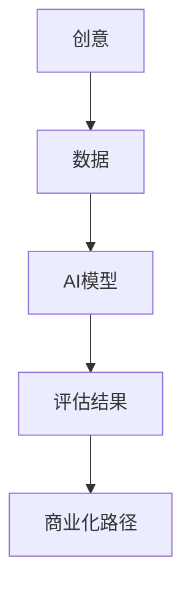
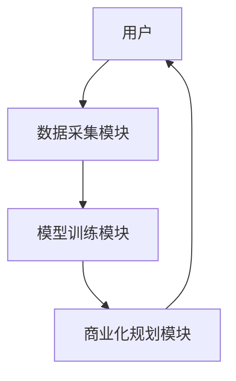

                 


# AI驱动的企业创新孵化器：从创意到商业化

## 关键词：AI驱动，企业创新，孵化器，创意商业化，技术实现

## 摘要：  
本文探讨了AI驱动的企业创新孵化器从创意到商业化的过程，详细分析了其核心技术与原理，包括自然语言处理、机器学习和数据挖掘等技术的应用。通过实际案例分析和系统架构设计，展示了AI在创新识别、评估和商业化路径规划中的重要作用。文章还提供了算法实现的代码示例，并总结了最佳实践和注意事项。

---

# 第一部分: AI驱动的企业创新孵化器概述

## 第1章: AI驱动的企业创新孵化器背景与概念

### 1.1 企业创新孵化器的定义与背景  
企业创新孵化器是一种支持创新企业或项目从初期阶段到成熟发展的机构，旨在为初创企业或内部创新项目提供资源、指导和支持。传统孵化器主要依赖人工筛选和评估创意，而AI驱动的孵化器通过技术手段显著提升了创意识别和评估的效率和准确性。

### 1.2 AI驱动的企业创新孵化器的核心概念  
AI驱动的孵化器通过整合NLP、机器学习和数据挖掘技术，实现了对创意的智能识别、评估和商业化规划。其核心在于利用AI技术从海量数据中提取有价值的信息，帮助企业在创新过程中做出更明智的决策。

### 1.3 创意的商业化过程  
从创意到商业化的过程包括创意的识别与筛选、创意的培育与成长，以及创意的商业化落地。AI技术在这一过程中起到了关键作用，尤其是在创意的筛选和评估阶段。

---

# 第二部分: AI驱动的企业创新孵化器的核心原理

## 第2章: AI驱动孵化器的核心技术与原理  

### 2.1 AI驱动孵化器的核心技术  
1. **自然语言处理（NLP）技术**：用于分析创意文本，提取关键词和情感倾向，辅助创意识别。  
2. **机器学习（ML）技术**：用于对创意进行分类和评分，预测其商业化潜力。  
3. **数据挖掘与分析技术**：用于从历史数据中提取模式，支持决策制定。

### 2.2 AI驱动孵化器的原理分析  
1. **数据驱动的创新识别**：通过NLP技术分析创意文本，识别潜在的创新点。  
2. **AI辅助的创新评估**：利用机器学习模型对创意进行评分，评估其市场潜力和可行性。  
3. **商业化路径的智能规划**：基于AI预测，制定最优的商业化策略。

### 2.3 核心概念与联系  
#### 核心概念对比表  
| 概念 | 属性 | 特征 |  
|------|------|------|  
| 创意识别 | 数据驱动 | 高效筛选 |  
| 创新评估 | AI辅助 | 准确性高 |  
| 商业化规划 | 智能路径 | 灵活性强 |  

#### ER实体关系图  


---

# 第三部分: AI驱动孵化器的算法原理

## 第3章: AI驱动孵化器的核心算法与实现  

### 3.1 创意识别的算法原理  
1. **基于NLP的文本分析算法**：使用TF-IDF（Term Frequency-Inverse Document Frequency）提取关键词。  
2. **基于聚类的创意分类算法**：使用K-means对创意进行分类。  
3. **基于深度学习的创意生成算法**：利用GPT模型生成创意文本。

### 3.2 创新评估的算法实现  
1. **基于机器学习的评分系统**：使用随机森林模型对创意进行评分。  
2. **基于决策树的评估模型**：构建决策树模型预测创意的可行性。  
3. **基于神经网络的预测模型**：使用LSTM预测创意的市场潜力。

### 3.3 商业化路径规划的算法  
1. **基于强化学习的路径优化**：利用Q-Learning算法优化商业化路径。  
2. **基于遗传算法的路径选择**：通过基因优化技术选择最优路径。  
3. **基于贝叶斯网络的风险评估**：评估商业化过程中的潜在风险。

### 3.4 算法实现的Python代码示例  
```python
# 基于TF-IDF的创意文本分析
from sklearn.feature_extraction.text import TfidfVectorizer

vectorizer = TfidfVectorizer()
tfidf = vectorizer.fit_transform(["创意1", "创意2", "创意3"])
```

---

# 第四部分: AI驱动孵化器的系统分析与架构设计

## 第4章: AI驱动孵化器的系统架构设计  

### 4.1 系统功能设计  
1. **领域模型设计**：使用Mermaid类图展示系统的核心组件和交互关系。  
2. **系统架构设计**：采用微服务架构，包括数据采集模块、模型训练模块和商业化规划模块。  
3. **系统交互设计**：通过Mermaid序列图展示用户与系统的交互流程。

### 4.2 系统架构图  


---

# 第五部分: AI驱动孵化器的项目实战

## 第5章: AI驱动孵化器的项目实战  

### 5.1 项目环境安装  
1. 安装Python和必要的机器学习库（如scikit-learn、TensorFlow）。  
2. 配置数据存储和分析环境（如Jupyter Notebook）。  

### 5.2 项目核心实现  
1. **创意识别模块**：编写代码实现NLP文本分析功能。  
2. **创新评估模块**：训练机器学习模型对创意进行评分。  
3. **商业化规划模块**：基于AI预测制定商业化策略。

### 5.3 实际案例分析  
通过具体案例分析AI驱动孵化器在某行业的应用，展示其在创意识别、评估和商业化过程中的实际效果。

---

# 第六部分: 总结与展望

## 第6章: 总结与最佳实践  

### 6.1 本章小结  
总结AI驱动的企业创新孵化器的核心技术与应用场景，强调其在企业创新中的重要性。

### 6.2 最佳实践与注意事项  
1. 在实际应用中，确保数据质量和多样性。  
2. 定期更新AI模型，以适应市场变化。  
3. 结合企业实际需求，灵活调整系统架构。

### 6.3 拓展阅读  
推荐相关书籍和论文，供读者进一步学习和研究。

---

# 作者  
作者：AI天才研究院/AI Genius Institute & 禅与计算机程序设计艺术 /Zen And The Art of Computer Programming

