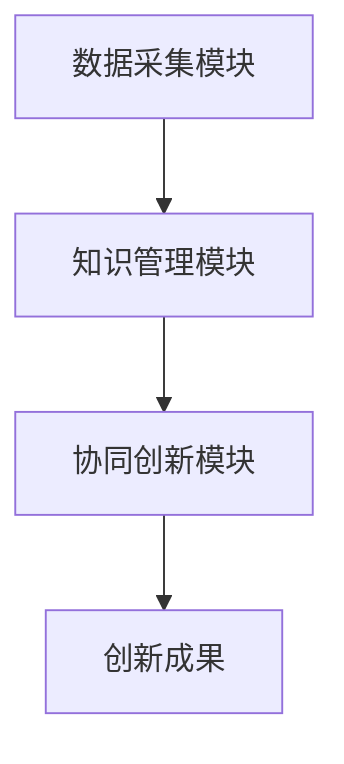
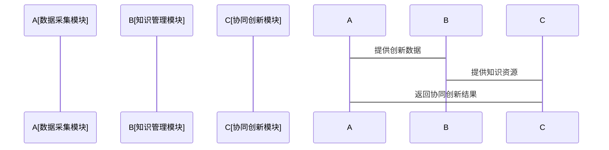

                 


# AI驱动的企业创新生态系统分析：内外部创新网络

> 关键词：AI驱动、企业创新生态系统、内外部创新网络、协同创新、系统架构

> 摘要：AI正在重塑企业创新生态系统，通过内外部创新网络的协同作用，企业能够更高效地捕捉和转化创新机会。本文系统分析了AI在企业创新生态系统中的应用，探讨了内外部创新网络的构建与协同机制，提出了基于AI的创新网络优化方法，并通过实际案例展示了如何利用这些方法推动企业创新。

---

## 第1章：AI驱动的企业创新生态系统概述

### 1.1 AI与企业创新的关系

#### 1.1.1 AI对企业创新的推动作用
人工智能（AI）正在成为企业创新的核心驱动力。通过机器学习、自然语言处理和数据分析等技术，AI能够帮助企业发现新的市场机会、优化创新流程，并加速产品和服务的开发。例如，AI可以分析大量的市场数据，识别潜在的创新方向，从而帮助企业制定更有效的创新战略。

#### 1.1.2 AI在企业创新中的应用场景
AI在企业创新中的应用场景广泛，包括：
- **市场洞察**：通过分析市场数据，识别潜在的市场趋势和竞争对手的动态。
- **产品开发**：利用AI进行产品设计优化和测试，缩短开发周期。
- **创新网络管理**：通过AI工具管理内外部创新网络，促进知识共享和协作。

#### 1.1.3 AI驱动创新的未来趋势
未来的创新将更加依赖AI技术。企业需要构建智能化的创新生态系统，通过AI技术实现内外部资源的高效整合和协同创新。同时，随着AI技术的不断进步，创新网络的动态优化和实时反馈将成为可能。

### 1.2 企业创新生态系统的核心概念

#### 1.2.1 企业创新生态系统的定义
企业创新生态系统是一个由企业内部资源、外部合作伙伴、客户、供应商和第三方创新者组成的复杂网络。这个系统通过知识共享、资源整合和协同创新，为企业创造新的价值。

#### 1.2.2 内部创新网络的特征
内部创新网络是指企业在内部构建的创新资源网络，包括员工、部门和内部团队。其特征包括：
- **内部知识共享**：通过内部平台促进知识的快速传播和共享。
- **创新流程优化**：利用AI技术优化内部创新流程，提高创新效率。

#### 1.2.3 外部创新网络的特征
外部创新网络是指企业与外部合作伙伴（如供应商、客户、研究机构和创新者）之间的创新网络。其特征包括：
- **开放协作**：通过外部合作实现知识互补和资源整合。
- **动态调整**：根据市场需求和竞争环境动态调整外部合作伙伴关系。

### 1.3 内部与外部创新网络的协同作用

#### 1.3.1 内部创新网络的构建
内部创新网络的构建需要企业内部的资源整合和组织优化。例如，企业可以通过建立创新实验室、创新团队和内部协作平台，促进内部知识的共享和创新资源的整合。

#### 1.3.2 外部创新网络的构建
外部创新网络的构建需要企业与外部合作伙伴建立长期的战略合作关系。例如，企业可以通过开放创新平台吸引外部创新者参与企业的创新活动。

#### 1.3.3 内部与外部创新网络的协同机制
内部与外部创新网络的协同机制包括知识共享、资源整合和创新成果的快速转化。通过AI技术，企业可以实时监控内外部创新网络的动态，优化资源分配，提高创新效率。

---

## 第2章：企业创新生态系统中的AI技术应用

### 2.1 AI在内部创新网络中的应用

#### 2.1.1 数据驱动的内部创新
企业可以通过AI技术分析内部数据，识别创新机会和潜在风险。例如，通过分析员工的创新提案，识别具有商业价值的创新方向。

#### 2.1.2 AI在内部知识管理中的作用
AI可以帮助企业实现内部知识的智能化管理。例如，通过自然语言处理技术，企业可以自动分类和存储内部文档，提高知识检索效率。

#### 2.1.3 AI在内部创新流程优化中的应用
通过AI技术优化内部创新流程，例如：
- **自动化审批**：利用AI实现创新提案的自动审批和反馈。
- **创新资源分配**：根据创新项目的需求，自动分配内部资源。

### 2.2 AI在外部创新网络中的应用

#### 2.2.1 AI在外部合作伙伴关系中的应用
企业可以通过AI技术与外部合作伙伴建立更紧密的关系。例如，通过AI驱动的协作平台，实现外部合作伙伴的实时沟通和知识共享。

#### 2.2.2 AI在外部创新网络中的知识整合
AI可以帮助企业整合外部创新网络中的知识资源。例如，通过机器学习技术分析外部合作伙伴的研究成果，识别潜在的创新机会。

#### 2.2.3 AI在外部创新网络中的动态调整
企业可以通过AI技术实时监控外部创新网络的动态，根据市场需求和竞争环境调整外部合作伙伴关系。例如，通过实时数据分析，识别外部合作伙伴的绩效变化，优化合作关系。

---

## 第3章：基于AI的内外部创新网络协同机制

### 3.1 协同创新的定义与特征

#### 3.1.1 协同创新的定义
协同创新是指企业内部和外部资源的协同合作，共同推动创新活动。通过协同创新，企业可以实现知识互补和资源整合，提高创新效率。

#### 3.1.2 协同创新的特征
协同创新的特征包括：
- **知识互补**：内部和外部资源的知识互补性。
- **资源整合**：通过资源整合实现创新目标。
- **动态调整**：根据环境变化动态调整协同创新策略。

### 3.2 协同创新的核心要素

#### 3.2.1 协同创新的目标
协同创新的目标是通过内外部资源的协同合作，实现创新价值的最大化。

#### 3.2.2 协同创新的主体
协同创新的主体包括：
- **企业内部团队**：内部创新团队。
- **外部合作伙伴**：外部供应商、客户和研究机构。

#### 3.2.3 协同创新的工具
协同创新的工具包括：
- **协作平台**：用于内部和外部资源的协作。
- **AI技术**：用于知识共享和创新流程优化。

### 3.3 协同创新的实现机制

#### 3.3.1 协同创新的流程
协同创新的流程包括：
- **需求识别**：识别创新需求。
- **资源分配**：分配内部和外部资源。
- **协作实施**：实施创新活动。
- **成果评估**：评估创新成果。

#### 3.3.2 协同创新的策略
协同创新的策略包括：
- **知识共享**：促进内部和外部知识的共享。
- **资源整合**：优化资源分配，提高创新效率。
- **动态调整**：根据环境变化动态调整协同创新策略。

---

## 第4章：AI驱动的企业创新生态系统中的算法与模型

### 4.1 协同创新模型的数学公式

#### 4.1.1 协同创新模型的定义
协同创新模型是一种用于描述内外部创新网络协同合作的数学模型。

#### 4.1.2 协同创新模型的公式
$$ C = \alpha I + \beta E $$
其中：
- \( C \) 表示协同创新的成果。
- \( I \) 表示内部创新资源。
- \( E \) 表示外部创新资源。
- \( \alpha \) 和 \( \beta \) 表示内部和外部资源的权重。

#### 4.1.3 协同创新模型的解释
协同创新模型通过量化内外部资源的权重，评估协同创新的成果。企业可以根据模型的输出结果，优化资源分配，提高创新效率。

### 4.2 协同创新模型的实现

#### 4.2.1 协同创新模型的实现步骤
协同创新模型的实现步骤包括：
1. **数据收集**：收集内部和外部创新资源的数据。
2. **模型训练**：通过机器学习算法训练协同创新模型。
3. **模型优化**：根据实际需求优化模型参数。
4. **模型应用**：将模型应用于实际的创新活动中。

#### 4.2.2 协同创新模型的代码实现

```python
import numpy as np
from sklearn.linear_model import LinearRegression

# 数据准备
internal_resources = np.array([1, 2, 3, 4, 5]).reshape(-1, 1)
external_resources = np.array([2, 3, 4, 5, 6]).reshape(-1, 1)
collaboration_outcomes = np.array([3, 5, 7, 9, 11])

# 模型训练
model = LinearRegression()
model.fit(internal_resources, external_resources, collaboration_outcomes)

# 模型预测
new_internal = np.array([[6]])
new_external = np.array([[7]])
predicted_outcome = model.predict(new_internal, new_external)
print(predicted_outcome)
```

#### 4.2.3 协同创新模型的解释
协同创新模型通过机器学习算法，量化内外部创新资源的权重，预测协同创新的成果。企业可以根据模型的预测结果，优化资源分配，提高创新效率。

---

## 第5章：AI驱动的企业创新生态系统中的系统架构

### 5.1 系统架构设计

#### 5.1.1 系统功能模块
系统功能模块包括：
- **数据采集模块**：采集内外部创新资源的数据。
- **协同创新模块**：实现内外部创新网络的协同合作。
- **知识管理模块**：管理内部和外部知识资源。

#### 5.1.2 系统架构图


#### 5.1.3 系统交互流程


### 5.2 系统实现细节

#### 5.2.1 数据采集模块
数据采集模块负责采集内部和外部创新资源的数据，包括市场数据、竞争对手数据和客户需求数据。

#### 5.2.2 知识管理模块
知识管理模块通过AI技术管理内部和外部知识资源，实现知识的智能化共享和应用。

#### 5.2.3 协同创新模块
协同创新模块实现内外部创新网络的协同合作，优化创新流程，提高创新效率。

---

## 第6章：项目实战——基于AI的企业创新生态系统构建

### 6.1 项目背景与目标

#### 6.1.1 项目背景
本项目旨在通过AI技术构建一个智能化的企业创新生态系统，实现内外部创新网络的协同合作。

#### 6.1.2 项目目标
项目的具体目标包括：
- 实现内部创新资源的智能化管理。
- 优化外部创新网络的协同合作。
- 提高企业的创新效率和创新成果。

### 6.2 项目实施步骤

#### 6.2.1 环境配置
项目环境配置包括：
- **操作系统**：Linux
- **编程语言**：Python
- **开发工具**：Jupyter Notebook
- **AI框架**：TensorFlow

#### 6.2.2 核心代码实现

```python
import numpy as np
from tensorflow.keras import layers, models

# 数据准备
internal_data = np.random.rand(100, 10)
external_data = np.random.rand(100, 10)
labels = np.random.randint(2, size=100)

# 模型构建
model = models.Sequential()
model.add(layers.Dense(16, activation='relu', input_dim=10))
model.add(layers.Dense(8, activation='relu'))
model.add(layers.Dense(1, activation='sigmoid'))

model.compile(optimizer='adam', loss='binary_crossentropy', metrics=['accuracy'])

# 模型训练
model.fit(internal_data, labels, epochs=10, batch_size=32)
```

#### 6.2.3 代码解读与分析
上述代码实现了一个简单的神经网络模型，用于分类内部和外部创新资源。模型通过多层感知机结构，实现对创新资源的分类和预测。

### 6.3 实际案例分析

#### 6.3.1 案例背景
某高科技企业希望通过AI技术优化其内部和外部创新网络的协同合作，提高创新效率。

#### 6.3.2 案例分析
通过AI技术，企业实现了内部创新资源的智能化管理，优化了外部创新网络的协同合作，提高了创新成果的转化效率。

### 6.4 项目小结
通过本项目，企业成功构建了一个智能化的企业创新生态系统，实现了内外部创新网络的协同合作，提高了创新效率和创新成果。

---

## 第7章：最佳实践与未来展望

### 7.1 小结

#### 7.1.1 AI驱动的企业创新生态系统的核心价值
AI驱动的企业创新生态系统通过内外部创新网络的协同合作，帮助企业更高效地捕捉和转化创新机会。

#### 7.1.2 AI在企业创新生态系统中的应用前景
随着AI技术的不断进步，企业创新生态系统将更加智能化和动态化。未来，企业需要更加注重内外部创新网络的协同合作，构建更具韧性和适应性的创新生态系统。

### 7.2 注意事项

#### 7.2.1 数据隐私与安全
企业在应用AI技术时，需要高度重视数据隐私和安全问题。

#### 7.2.2 技术与组织的匹配
企业需要根据自身的实际情况，选择合适的技术和组织模式，确保AI技术的有效应用。

#### 7.2.3 创新文化的建设
企业需要注重创新文化的建设，营造开放、包容的创新氛围，促进内外部创新网络的协同合作。

### 7.3 拓展阅读

#### 7.3.1 推荐书籍
- 《人工智能：一种现代的方法》
- 《企业创新管理》

#### 7.3.2 推荐文章
- 《AI驱动的企业创新生态系统：现状与未来》
- 《内外部创新网络的协同机制研究》

---

## 作者：AI天才研究院/AI Genius Institute & 禅与计算机程序设计艺术/Zen And The Art of Computer Programming

---

本文系统分析了AI驱动的企业创新生态系统，探讨了内外部创新网络的构建与协同机制，提出了基于AI的创新网络优化方法，并通过实际案例展示了如何利用这些方法推动企业创新。希望本文能够为企业的创新管理提供有价值的参考和启示。

