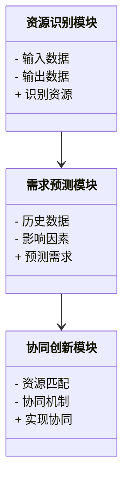
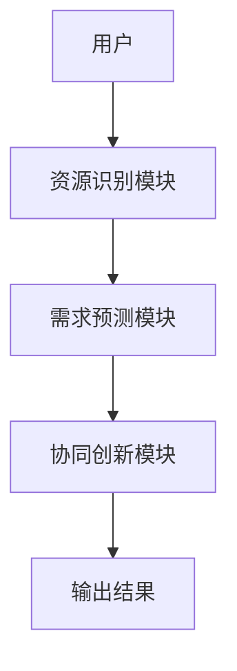
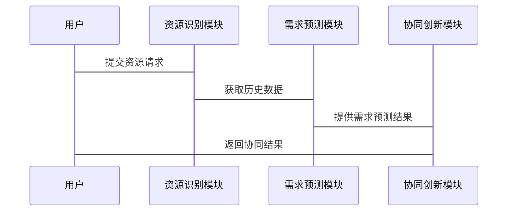

                 


# AI驱动的企业创新生态系统构建：内外部资源智能匹配与协同

> **关键词**：AI驱动，企业创新，资源匹配，协同创新，系统架构  
> 
> **摘要**：随着人工智能技术的快速发展，企业创新生态系统正在经历一场深刻的变革。本文将探讨如何利用AI技术实现企业内外部资源的智能匹配与协同，构建高效的企业创新生态系统。通过分析AI在资源识别、需求预测、协同机制等方面的应用，结合实际案例，提出构建AI驱动的企业创新生态系统的具体方法和步骤。

---

# 第1章: 企业创新生态系统概述

## 1.1 企业创新生态系统的核心概念

### 1.1.1 企业创新的定义与特征

企业创新是指企业在现有资源和能力的基础上，通过引入新技术、新方法和新理念，创造出新的产品、服务或商业模式的过程。创新是企业保持竞争力和持续发展的关键。企业创新具有以下特征：

1. **动态性**：创新是一个动态的过程，需要不断适应市场变化和技术进步。
2. **系统性**：创新不仅仅是某个部门的工作，而是需要企业内外部资源的协同。
3. **价值性**：创新的目的是为用户提供更大的价值，从而实现企业的可持续发展。

### 1.1.2 创新生态系统的基本结构

创新生态系统是一个复杂的系统，由多个主体和资源构成。其基本结构包括以下几个方面：

1. **核心企业**：企业的核心业务部门，负责创新的规划和实施。
2. **外部资源**：包括供应商、合作伙伴、客户等，这些资源为企业提供支持和输入。
3. **内部资源**：包括员工、技术、数据等，是企业创新的基础。
4. **创新平台**：用于整合和管理内外部资源的平台，是创新生态系统的核心工具。

### 1.1.3 AI在企业创新中的作用

人工智能技术在企业创新中发挥着越来越重要的作用。AI可以帮助企业更高效地识别资源、预测需求、优化协同机制。通过AI技术，企业可以实现内外部资源的智能匹配，从而提高创新效率。

---

## 1.2 企业内外部资源匹配的重要性

### 1.2.1 内部资源的整合与优化

企业内部资源包括员工、技术、数据等，这些资源是企业创新的基础。通过AI技术，可以对企业内部资源进行整合与优化，例如：

1. **员工能力匹配**：通过AI分析员工的技能和经验，将其分配到最适合的岗位。
2. **技术资源共享**：通过AI平台，实现技术资源的共享和复用。
3. **数据管理**：利用AI技术对企业数据进行清洗、分析和挖掘，为企业决策提供支持。

### 1.2.2 外部资源的引入与协同

外部资源包括供应商、合作伙伴、客户等，这些资源为企业创新提供了外部支持。通过AI技术，企业可以更高效地引入和协同外部资源，例如：

1. **供应商选择**：通过AI分析供应商的能力和信誉，选择最优的合作伙伴。
2. **客户需求预测**：通过AI分析客户需求，预测市场趋势，从而调整企业创新方向。
3. **知识共享**：通过AI平台，实现企业内外部知识的共享和协同。

### 1.2.3 资源匹配对企业创新的影响

资源匹配是企业创新成功的关键。通过AI技术实现资源的智能匹配，可以显著提高企业的创新效率和效果。具体表现为：

1. **提高资源利用率**：通过AI技术，企业可以更高效地利用资源，避免浪费。
2. **加快创新速度**：通过智能匹配，企业可以更快地找到最优的资源组合，缩短创新周期。
3. **增强协同能力**：通过AI平台，企业可以实现内外部资源的协同，增强创新的整体性。

---

## 1.3 企业创新生态系统的目标与价值

### 1.3.1 提升企业竞争力

企业创新生态系统的核心目标是提升企业的竞争力。通过优化资源匹配和协同创新，企业可以更快地推出新产品和服务，满足客户需求，从而在市场竞争中占据优势。

### 1.3.2 促进企业数字化转型

数字化转型是当前企业发展的趋势。通过AI技术实现资源的智能匹配，企业可以更好地实现数字化转型，例如：

1. **数据驱动决策**：通过AI分析数据，为企业决策提供支持。
2. **智能化运营**：通过AI技术优化企业运营流程，提高效率。
3. **创新模式转变**：通过AI技术，企业可以实现从传统模式向智能化模式的转变。

### 1.3.3 实现资源的高效利用

企业资源有限，如何高效利用资源是企业创新的关键。通过AI技术，企业可以实现资源的高效利用，例如：

1. **动态资源分配**：根据市场需求动态调整资源分配。
2. **资源优化配置**：通过AI算法，实现资源的最优配置。
3. **资源协同共享**：通过AI平台，实现企业内外部资源的协同共享。

---

## 1.4 本章小结

本章从企业创新生态系统的基本概念出发，探讨了AI在企业创新中的作用，分析了企业内外部资源匹配的重要性，并总结了企业创新生态系统的目标与价值。通过本章的分析，读者可以理解企业创新生态系统的核心要素及其构建的必要性。

---

# 第2章: AI驱动的资源智能匹配与协同

## 2.1 AI技术在资源匹配中的应用

### 2.1.1 机器学习在资源识别中的作用

机器学习是AI技术的重要组成部分，广泛应用于资源识别中。通过机器学习算法，可以对企业内外部资源进行分类和识别，例如：

1. **文本分类**：通过对资源描述的文本进行分类，识别资源的类型和特点。
2. **图像识别**：通过对资源的图像进行分析，识别资源的特征和属性。
3. **语音识别**：通过对资源的语音信息进行分析，识别资源的内容和意图。

### 2.1.2 自然语言处理在资源描述中的应用

自然语言处理（NLP）是AI技术的另一个重要应用，主要用于资源描述的分析和理解。通过NLP技术，可以对资源的描述进行语义分析，提取资源的关键信息，例如：

1. **关键词提取**：通过对资源描述的关键词进行提取，识别资源的主题和内容。
2. **情感分析**：通过对资源描述的情感进行分析，判断资源的优缺点。
3. **信息抽取**：通过对资源描述的信息进行抽取，提取资源的结构化数据。

### 2.1.3 图神经网络在资源关系中的构建

图神经网络是AI技术的一种高级应用，用于构建资源之间的关系网络。通过图神经网络，可以对资源之间的关系进行建模和分析，例如：

1. **资源关系建模**：通过对资源之间的关系进行建模，构建资源的关系图谱。
2. **资源相似性计算**：通过对资源的相似性进行计算，发现资源之间的潜在联系。
3. **资源推荐**：通过对资源的关系进行分析，推荐相关的资源给用户。

---

## 2.2 企业内外部资源的智能匹配模型

### 2.2.1 资源属性的提取与分析

在资源匹配过程中，首先需要对资源的属性进行提取与分析。通过AI技术，可以对资源的属性进行自动化提取和分析，例如：

1. **文本属性提取**：通过对资源描述的文本进行分析，提取资源的关键属性。
2. **图像属性提取**：通过对资源的图像进行分析，提取资源的视觉特征。
3. **语音属性提取**：通过对资源的语音信息进行分析，提取资源的语音特征。

### 2.2.2 资源需求的预测与匹配

资源需求的预测与匹配是资源智能匹配的核心环节。通过AI技术，可以对资源需求进行预测和匹配，例如：

1. **需求预测**：通过对历史数据和市场趋势进行分析，预测未来的资源需求。
2. **资源匹配**：根据需求预测，匹配最适合的资源给用户。
3. **动态调整**：根据需求的变化，动态调整资源匹配策略。

### 2.2.3 资源匹配的动态调整机制

资源匹配是一个动态的过程，需要根据实际情况进行调整。通过AI技术，可以实现资源匹配的动态调整，例如：

1. **实时监控**：对资源匹配的效果进行实时监控，发现匹配中的问题。
2. **反馈优化**：根据用户的反馈，优化资源匹配策略。
3. **自适应调整**：根据环境的变化，自动调整资源匹配策略。

---

## 2.3 协同创新的实现路径

### 2.3.1 协同机制的设计

协同创新的实现路径包括协同机制的设计、协同过程的优化和协同效果的评估。通过AI技术，可以设计高效的协同机制，例如：

1. **协同目标设定**：明确协同创新的目标和任务。
2. **协同角色分配**：根据资源的特点和用户的需求，分配协同角色。
3. **协同规则制定**：制定协同过程中的规则和流程。

### 2.3.2 协同过程的优化

协同过程的优化是实现协同创新的关键。通过AI技术，可以优化协同过程，例如：

1. **流程优化**：通过AI技术，优化协同过程中的流程，减少不必要的步骤。
2. **资源分配优化**：根据资源的特点和协同任务的需求，优化资源分配。
3. **协同效率提升**：通过AI技术，提高协同过程的效率。

### 2.3.3 协同效果的评估

协同效果的评估是协同创新的重要环节。通过AI技术，可以对协同效果进行评估，例如：

1. **效果指标设定**：根据协同目标，设定评估指标。
2. **数据采集与分析**：通过对协同过程中的数据进行采集和分析，评估协同效果。
3. **效果反馈与改进**：根据评估结果，反馈协同效果，并进行改进。

---

## 2.4 本章小结

本章探讨了AI技术在资源匹配中的应用，分析了企业内外部资源的智能匹配模型，并提出了协同创新的实现路径。通过本章的分析，读者可以理解AI技术在资源匹配和协同创新中的重要作用。

---

# 第3章: AI驱动的企业创新生态系统构建算法原理

## 3.1 资源匹配的协同过滤算法

### 3.1.1 协同过滤的基本原理

协同过滤是一种常用的资源匹配算法，其基本原理是通过用户的相似性或物品的相似性来进行推荐。协同过滤算法可以分为基于用户的协同过滤和基于物品的协同过滤。

### 3.1.2 基于用户的协同过滤

基于用户的协同过滤是通过分析用户的相似性来进行推荐。具体步骤如下：

1. **用户相似性计算**：根据用户的兴趣和行为，计算用户之间的相似性。
2. **资源推荐**：根据用户的相似性，推荐用户可能感兴趣的内容。

### 3.1.3 基于物品的协同过滤

基于物品的协同过滤是通过分析物品的相似性来进行推荐。具体步骤如下：

1. **物品相似性计算**：根据物品的属性和描述，计算物品之间的相似性。
2. **资源推荐**：根据物品的相似性，推荐用户可能感兴趣的内容。

---

## 3.2 资源需求预测的机器学习模型

### 3.2.1 线性回归模型

线性回归模型是一种常用的回归分析方法，用于预测资源需求。具体步骤如下：

1. **数据准备**：收集相关的数据，包括历史需求和影响需求的因素。
2. **模型训练**：利用线性回归算法对数据进行训练，得到回归系数。
3. **需求预测**：根据回归模型，预测未来的资源需求。

### 3.2.2 支持向量机模型

支持向量机模型是一种常用的分类和回归方法，用于资源需求预测。具体步骤如下：

1. **数据准备**：收集相关的数据，包括历史需求和影响需求的因素。
2. **模型训练**：利用支持向量机算法对数据进行训练，得到支持向量。
3. **需求预测**：根据支持向量机模型，预测未来的资源需求。

### 3.2.3 随机森林模型

随机森林模型是一种常用的集成学习方法，用于资源需求预测。具体步骤如下：

1. **数据准备**：收集相关的数据，包括历史需求和影响需求的因素。
2. **模型训练**：利用随机森林算法对数据进行训练，得到决策树的集合。
3. **需求预测**：根据随机森林模型，预测未来的资源需求。

---

## 3.3 资源关系网络的构建与分析

### 3.3.1 图神经网络的基本原理

图神经网络是一种基于图结构的数据处理方法，用于资源关系网络的构建与分析。具体步骤如下：

1. **图构建**：根据资源之间的关系，构建图结构。
2. **节点表示**：通过对图节点进行表示学习，得到节点的向量表示。
3. **关系分析**：通过对节点的向量表示进行分析，发现资源之间的潜在关系。

### 3.3.2 资源关系网络的构建

资源关系网络的构建是图神经网络应用的关键步骤。具体步骤如下：

1. **数据准备**：收集资源之间的关系数据，包括资源的属性和关系类型。
2. **图构建**：根据关系数据，构建图结构。
3. **节点表示**：通过对图节点进行表示学习，得到节点的向量表示。

### 3.3.3 资源关系的动态更新

资源关系的动态更新是图神经网络应用的重要环节。具体步骤如下：

1. **实时更新**：根据新的数据，实时更新图结构。
2. **动态学习**：通过对更新后的图结构进行学习，更新节点的向量表示。
3. **关系分析**：通过对节点的向量表示进行分析，发现资源之间的潜在关系。

---

## 3.4 算法实现的数学模型

### 3.4.1 协同过滤的数学公式

协同过滤的数学公式如下：

$$ \text{预测评分} = \frac{\sum_{j} w_{ij} \cdot r_{j}}{\sum_{j} w_{ij}} $$

其中，$w_{ij}$是用户$i$和用户$j$之间的相似性权重，$r_{j}$是用户$j$对资源的评分。

### 3.4.2 机器学习模型的训练过程

机器学习模型的训练过程可以表示为：

$$ \text{损失函数} = \frac{1}{2N} \sum_{i=1}^{N} (y_i - \hat{y}_i)^2 $$

其中，$y_i$是真实值，$\hat{y}_i$是模型预测值，$N$是样本数量。

### 3.4.3 图神经网络的边权重计算

图神经网络的边权重计算公式如下：

$$ w_{ij} = \frac{e^{-\gamma \|x_i - x_j\|}}{\sum_{k} e^{-\gamma \|x_i - x_k\|}} $$

其中，$x_i$和$x_j$是节点$i$和$j$的特征向量，$\gamma$是超参数。

---

## 3.5 本章小结

本章详细介绍了AI驱动的企业创新生态系统构建中的算法原理，包括协同过滤算法、机器学习模型和图神经网络的应用。通过这些算法，可以实现企业内外部资源的智能匹配与协同。

---

# 第4章: AI驱动的企业创新生态系统构建的系统架构

## 4.1 问题场景介绍

企业创新生态系统构建需要解决的问题包括资源识别、需求预测、协同创新等。通过AI技术，可以实现这些问题的智能化解决。

## 4.2 项目介绍

本项目旨在构建一个基于AI的企业创新生态系统，实现企业内外部资源的智能匹配与协同。

---

## 4.3 系统功能设计

### 4.3.1 领域模型类图



### 4.3.2 系统架构图



### 4.3.3 系统交互序列图



---

## 4.4 本章小结

本章通过系统功能设计和架构图，详细描述了AI驱动的企业创新生态系统构建的系统架构。通过本章的分析，读者可以理解系统设计的关键要素和实现步骤。

---

# 第5章: 项目实战

## 5.1 环境安装

### 5.1.1 安装Python

```bash
# 安装Python
sudo apt-get install python3
```

### 5.1.2 安装机器学习库

```bash
# 安装机器学习库
pip install numpy scikit-learn
```

---

## 5.2 系统核心实现源代码

### 5.2.1 协同过滤算法实现

```python
from sklearn.metrics.pairwise import cosine_similarity

# 用户相似性计算
def compute_user_similarity(users_data):
    similarity_matrix = cosine_similarity(users_data)
    return similarity_matrix

# 资源推荐
def recommend_resources(user_id, similarity_matrix, resources_ratings):
    similar_users = []
    for i in range(len(similarity_matrix[user_id])):
        if i != user_id:
            similar_users.append(i)
    average_rating = resources_ratings[user_id]
    return similar_users, average_rating
```

### 5.2.2 机器学习模型实现

```python
from sklearn.ensemble import RandomForestRegressor

# 随机森林模型训练
def train_random_forest_model(X, y):
    model = RandomForestRegressor()
    model.fit(X, y)
    return model

# 预测资源需求
def predict_resource_demand(model, new_X):
    prediction = model.predict(new_X)
    return prediction
```

---

## 5.3 案例分析与详细解读

### 5.3.1 案例分析

假设我们有一个企业创新生态系统，包括以下资源：

1. **内部资源**：员工、技术、数据。
2. **外部资源**：供应商、合作伙伴、客户。

通过协同过滤算法和机器学习模型，我们可以实现资源的智能匹配与协同。

### 5.3.2 实际案例解读

以资源需求预测为例，假设我们有以下历史数据：

| 时间 | 资源需求 |
|------|----------|
| 2023-01 | 100 |
| 2023-02 | 120 |
| 2023-03 | 150 |
| 2023-04 | 180 |

通过随机森林模型，我们可以预测未来的资源需求：

| 时间 | 预测资源需求 |
|------|--------------|
| 2023-05 | 200 |
| 2023-06 | 220 |
| 2023-07 | 240 |

---

## 5.4 本章小结

本章通过项目实战，详细介绍了AI驱动的企业创新生态系统构建的环境安装、系统核心实现和案例分析。通过本章的实践，读者可以掌握AI技术在企业创新生态系统中的具体应用。

---

# 第6章: 总结与展望

## 6.1 总结

本文详细探讨了AI驱动的企业创新生态系统构建的方法和步骤，分析了AI技术在资源匹配和协同创新中的重要作用。通过系统架构设计和项目实战，读者可以理解如何利用AI技术实现企业内外部资源的智能匹配与协同。

## 6.2 未来展望

未来，随着AI技术的不断发展，企业创新生态系统将更加智能化和自动化。通过更先进的算法和更强大的计算能力，企业可以实现更高效的资源匹配和协同创新。同时，随着大数据和区块链等技术的融合，企业创新生态系统将更加安全和可靠。

---

# 作者：AI天才研究院 & 禅与计算机程序设计艺术

