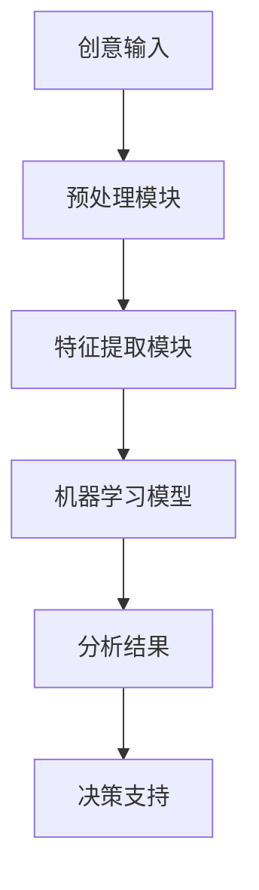

                 


# AI驱动的企业创新管理：从创意筛选到商业化全流程智能化

## 关键词：
AI驱动，企业创新管理，创意筛选，商业化，全流程智能化

## 摘要：
随着人工智能技术的飞速发展，企业创新管理的智能化转型已成为不可忽视的趋势。本文将从创意筛选到商业化全流程的角度，详细探讨AI在企业创新管理中的应用。通过分析机器学习、自然语言处理等技术在创新管理中的具体应用场景，结合实际案例，展示AI如何赋能企业创新管理，提升效率与精准度。本文内容涵盖AI技术基础、系统架构设计、项目实战等多个方面，为企业管理者和技术人员提供有价值的参考。

---

## 第1章: AI驱动企业创新管理的背景与概念

### 1.1 企业创新管理的背景与挑战

#### 1.1.1 创新管理的核心概念
创新管理是企业通过识别、筛选、开发和商业化创新项目，以实现持续增长和竞争优势的过程。传统的创新管理依赖于人工评估和经验判断，存在效率低、主观性强、数据利用不足等问题。

#### 1.1.2 AI技术对企业创新管理的赋能
人工智能技术（AI）的快速发展为企业创新管理提供了新的可能性。通过机器学习、自然语言处理（NLP）等技术，企业可以实现创意筛选的智能化、研发管理的优化以及市场推广的精准化。

#### 1.1.3 企业创新管理的数字化转型趋势
数字化转型已成为企业应对市场竞争的必由之路。AI技术的应用不仅提高了创新管理的效率，还为企业提供了数据驱动的决策支持，帮助企业更快地捕捉市场机会，降低创新风险。

### 1.2 AI驱动企业创新管理的核心概念

#### 1.2.1 创意筛选的智能化
AI可以通过自然语言处理技术对创意文本进行分析，提取关键词、主题和情感倾向，帮助企业在大量创意中快速筛选出具有潜力的项目。

#### 1.2.2 研发管理的智能化
通过机器学习模型，企业可以预测研发项目的成功概率，优化资源配置，降低研发成本。同时，AI还可以实时监控研发进度，提供数据支持。

#### 1.2.3 产品开发的智能化
AI技术可以帮助企业预测市场需求，优化产品设计，缩短开发周期。通过数据挖掘和预测分析，企业可以更好地满足客户需求，提升产品竞争力。

#### 1.2.4 市场推广的智能化
基于AI的市场分析工具可以帮助企业制定精准的推广策略，优化广告投放，提高营销效率。

### 1.3 本章小结
本章介绍了AI驱动企业创新管理的背景、核心概念及其在企业创新管理中的应用价值。AI技术的引入不仅提高了创新管理的效率，还为企业提供了更精准的决策支持。

---

## 第2章: AI在创意筛选中的应用

### 2.1 创意筛选的智能化流程

#### 2.1.1 创意来源的多样性
创意可以来自内部员工、外部合作伙伴、客户反馈等多个渠道。传统的创意筛选过程耗时长、效率低，而AI技术可以快速处理海量数据，提高筛选效率。

#### 2.1.2 创意评估的维度与指标
创意评估通常包括市场潜力、技术可行性、经济可行性等多个维度。AI技术可以通过机器学习模型对这些指标进行量化评估，提供客观的决策支持。

#### 2.1.3 AI在创意筛选中的具体应用
AI可以通过自然语言处理技术对创意文本进行分析，提取关键词、主题和情感倾向，帮助企业在大量创意中快速筛选出具有潜力的项目。

### 2.2 基于NLP的创意主题分析

#### 2.2.1 自然语言处理技术在创意分析中的应用
自然语言处理（NLP）技术可以帮助企业对创意文本进行分词、实体识别、情感分析等处理，提取创意的核心内容和潜在价值。

#### 2.2.2 主题建模与情感分析
通过主题建模技术，企业可以将创意文本分为多个主题，了解不同主题的分布情况。情感分析技术可以帮助企业评估创意的情感倾向，判断创意的可行性。

#### 2.2.3 创意优先级的智能排序
基于NLP技术，企业可以对创意进行自动分类和排序，优先筛选出具有高潜力的创意，减少人工筛选的时间和成本。

### 2.3 本章小结
本章详细探讨了AI在创意筛选中的具体应用，包括创意来源的多样性、创意评估的维度与指标，以及基于NLP的创意主题分析。AI技术的应用使得创意筛选更加高效、精准。

---

## 第3章: 机器学习在企业创新管理中的应用

### 3.1 机器学习的基本原理

#### 3.1.1 监督学习与无监督学习
监督学习是一种基于标注数据的学习方法，适用于创意评估等任务。无监督学习适用于创意分类等任务，能够从无标注数据中提取潜在规律。

#### 3.1.2 算法原理与数学模型
机器学习算法的核心是通过数据训练模型，模型可以通过数学公式进行预测和分类。例如，支持向量机（SVM）是一种常用的分类算法，其数学模型如下：

$$
\text{SVM目标函数} = \sum_{i=1}^{n} \alpha_i y_i (\mathbf{x}_i \cdot \mathbf{w} + b) + \frac{1}{2} \| \mathbf{w} \|^2
$$

其中，$\alpha_i$ 是拉格朗日乘子，$y_i$ 是标签，$\mathbf{x}_i$ 是输入向量，$\mathbf{w}$ 是权重向量，$b$ 是偏置项。

#### 3.1.3 机器学习在创新管理中的应用场景
机器学习在创新管理中的应用场景包括创意评估、研发预测、市场分析等。通过机器学习模型，企业可以预测创新项目的成功概率，优化资源配置。

### 3.2 基于机器学习的创新预测

#### 3.2.1 创新成功概率的预测模型
企业可以通过收集历史数据，训练机器学习模型来预测创新项目的成功概率。例如，使用逻辑回归模型进行预测：

$$
P(\text{成功}) = \frac{1}{1 + e^{-(\beta_0 + \beta_1 x_1 + \beta_2 x_2 + \dots + \beta_n x_n)}}
$$

其中，$\beta_0$ 是截距项，$\beta_i$ 是变量$x_i$的系数。

#### 3.2.2 数据特征提取与模型训练
企业需要对创意数据进行特征提取，例如创意的市场潜力、技术可行性、经济可行性等。然后，使用这些特征训练机器学习模型，优化模型参数。

#### 3.2.3 案例分析：某企业的创新预测实践
某企业通过收集历史创新项目的成功数据，训练了一个逻辑回归模型来预测新项目的成功概率。结果显示，模型的准确率达到了85%，帮助企业提高了创新项目的筛选效率。

### 3.3 本章小结
本章详细介绍了机器学习的基本原理及其在企业创新管理中的应用场景。通过案例分析，展示了机器学习在创新预测中的实际应用价值。

---

## 第4章: 自然语言处理（NLP）在创意筛选中的应用

### 4.1 NLP技术的基本原理

#### 4.1.1 分词、实体识别与情感分析
分词是将创意文本分割成词语的过程，实体识别是识别文本中的实体（如人名、地名、组织名等）。情感分析是判断文本的情感倾向（如正面、负面、中性）。

#### 4.1.2 基于NLP的主题建模
主题建模是一种从文本中提取主题的技术，常用算法包括LSA、LDA等。例如，LDA模型可以将创意文本分为多个主题，帮助企业了解创意的分布情况。

#### 4.1.3 NLP在创意分析中的优势
NLP技术可以帮助企业快速处理海量创意文本，提取关键词和主题，提高创意筛选的效率和准确性。

### 4.2 创意文本的智能分析

#### 4.2.1 创意文本的预处理与特征提取
创意文本的预处理包括分词、去停用词、词干提取等。特征提取包括提取关键词、主题向量等。

#### 4.2.2 基于NLP的主题挖掘与分类
通过主题建模技术，企业可以将创意文本分为多个主题，例如“环保技术”、“人工智能应用”等。然后，使用分类算法（如SVM、随机森林）对创意进行分类。

#### 4.2.3 创意优先级的智能排序
基于NLP技术，企业可以对创意进行自动分类和排序，优先筛选出具有高潜力的创意。

### 4.3 本章小结
本章详细探讨了NLP技术在创意筛选中的具体应用，包括文本预处理、主题建模、情感分析等。通过NLP技术，企业可以实现创意筛选的智能化和高效化。

---

## 第5章: AI驱动的企业创新管理系统架构与实现

### 5.1 系统架构设计

#### 5.1.1 系统功能模块划分
AI驱动的企业创新管理系统主要包括创意管理模块、研发管理模块、产品开发模块和市场推广模块。

#### 5.1.2 数据流设计
数据流设计包括创意数据的输入、处理、分析和输出。创意数据经过预处理、特征提取、模型训练等步骤，生成分析结果。

#### 5.1.3 系统架构图
以下是系统架构的Mermaid图：



### 5.2 系统实现细节

#### 5.2.1 数据预处理
数据预处理包括分词、去停用词、词干提取等。例如，使用Python的NLTK库进行文本预处理：

```python
import nltk
text = "This is an example text."
tokens = nltk.word_tokenize(text)
```

#### 5.2.2 模型训练
模型训练包括选择算法、训练数据、优化参数等。例如，使用Scikit-learn库训练逻辑回归模型：

```python
from sklearn.linear_model import LogisticRegression
model = LogisticRegression()
model.fit(X_train, y_train)
```

#### 5.2.3 系统接口设计
系统接口设计包括API接口定义、数据格式规范等。例如，使用RESTful API设计创意筛选接口：

```python
from flask import Flask, request
app = Flask(__name__)

@app.route('/api/analyze', methods=['POST'])
def analyze():
    data = request.json
    # 处理数据
    return jsonify(result)
```

### 5.3 本章小结
本章详细介绍了AI驱动的企业创新管理系统的架构设计与实现细节，包括数据流设计、系统模块划分和接口设计。通过系统的实现，企业可以实现创新管理的智能化和高效化。

---

## 第6章: 项目实战——AI驱动的创意筛选系统

### 6.1 项目背景与目标
本项目旨在开发一个基于AI的创意筛选系统，帮助企业在海量创意中快速筛选出具有潜力的项目。项目目标包括提高筛选效率、降低人工成本、提升筛选准确率。

### 6.2 系统核心实现

#### 6.2.1 环境安装
项目需要安装以下依赖：

```bash
pip install numpy
pip install scikit-learn
pip install nltk
pip install flask
```

#### 6.2.2 核心代码实现
创意筛选系统的核心代码如下：

```python
import nltk
from sklearn.feature_extraction.text import TfidfVectorizer
from sklearn.svm import SVC

# 文本预处理
def preprocess(text):
    tokens = nltk.word_tokenize(text)
    return ' '.join(tokens)

# 特征提取
vectorizer = TfidfVectorizer()
X = vectorizer.fit_transform(texts)

# 模型训练
model = SVC()
model.fit(X.toarray(), labels)

# 接口设计
from flask import Flask, request, jsonify

app = Flask(__name__)

@app.route('/api/score', methods=['POST'])
def score():
    data = request.json
    text = data['text']
    processed_text = preprocess(text)
    X_new = vectorizer.transform([processed_text])
    result = model.predict(X_new.toarray())
    return jsonify({'score': result[0]})

if __name__ == '__main__':
    app.run()
```

### 6.3 项目小结
本章通过一个实际项目展示了AI驱动的创意筛选系统的实现过程，包括环境安装、核心代码实现和系统接口设计。通过本项目，读者可以了解AI技术在创意筛选中的具体应用。

---

## 第7章: 未来展望与最佳实践

### 7.1 未来展望
随着AI技术的不断发展，企业创新管理将更加智能化和数据化。未来的创新管理将更加注重数据驱动的决策支持，以及人机协作的高效模式。

### 7.2 最佳实践 tips
- 数据是AI模型的核心，企业需要重视数据的质量和多样性。
- 在AI模型的应用中，需要结合企业的实际需求，选择合适的算法和模型。
- 人机协作是未来的趋势，企业应注重AI技术与人类智慧的结合。

### 7.3 本章小结
本章总结了AI驱动企业创新管理的未来展望和最佳实践，为企业未来的创新管理提供了指导和建议。

---

## 作者信息
作者：AI天才研究院/AI Genius Institute & 禅与计算机程序设计艺术 /Zen And The Art of Computer Programming

---

以上是《AI驱动的企业创新管理：从创意筛选到商业化全流程智能化》的技术博客文章的完整目录大纲和部分正文内容。文章内容详细介绍了AI在企业创新管理中的应用，从理论到实践，从技术到案例，为企业管理者和技术人员提供了全面的参考。

