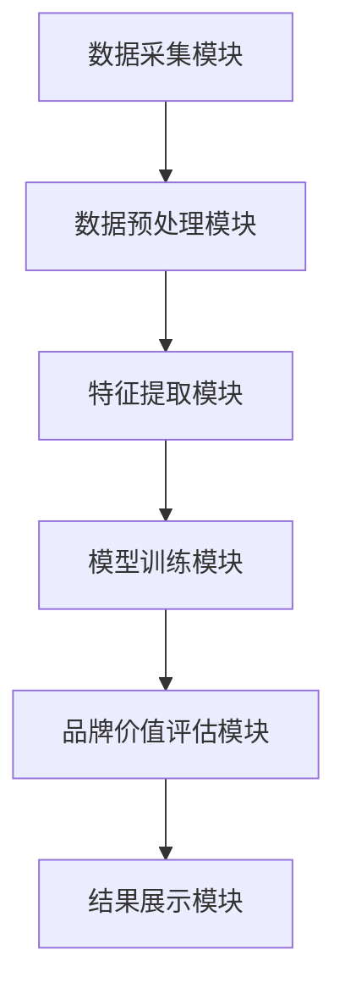

                 


# AI驱动的企业品牌价值动态量化系统

## 关键词：AI驱动、企业品牌价值、动态量化、数据挖掘、机器学习

## 摘要：  
本文介绍了一种基于人工智能技术的企业品牌价值动态量化系统，旨在通过AI技术实现对品牌价值的实时、动态评估。文章从问题背景、核心概念、算法原理、系统架构到项目实战进行了详细阐述，展示了如何利用AI技术解决传统品牌价值评估中的难题，并通过实际案例分析验证了系统的可行性和有效性。本文还探讨了系统在实际应用中的优势、挑战及未来发展方向。

---

# 目录

## 第一部分：背景介绍

### 第1章：问题背景与目标

#### 1.1 问题背景
- 1.1.1 传统品牌价值评估的局限性  
  传统的品牌价值评估方法通常基于财务数据和静态分析，难以捕捉品牌在市场中的动态变化。例如，品牌知名度、客户忠诚度等非财务指标难以量化，且评估结果往往滞后于市场变化。

- 1.1.2 数字化时代品牌价值的新挑战  
  随着社交媒体和大数据技术的发展，品牌价值的动态变化更加频繁且复杂。消费者行为、市场反馈等实时数据对企业品牌价值的评估提出了更高的要求。

- 1.1.3 AI技术在品牌价值评估中的潜力  
  AI技术可以通过对海量数据的实时分析，捕捉品牌价值的变化趋势，提供动态、精准的评估结果。这为企业的品牌管理提供了新的可能性。

#### 1.2 问题描述
- 1.2.1 品牌价值动态变化的特性  
  品牌价值并非固定不变，它受到市场环境、消费者行为、竞争对手策略等多种因素的影响，呈现出动态变化的特性。

- 1.2.2 传统评估方法的不足  
  传统评估方法通常基于历史数据和静态分析，无法实时捕捉品牌价值的变化，导致评估结果滞后且不够准确。

- 1.2.3 建立动态量化系统的需求  
  为了实现品牌价值的实时评估，企业需要一种能够动态捕捉市场变化、整合多维度数据的系统。

#### 1.3 问题解决思路
- 1.3.1 引入AI技术的核心逻辑  
  AI技术能够通过机器学习模型对海量数据进行实时分析，提取品牌价值的关键特征，并预测其变化趋势。

- 1.3.2 数据驱动的品牌价值评估方法  
  基于大数据和AI技术，构建一个数据驱动的评估系统，整合品牌相关的多维度数据，包括社交媒体数据、销售数据、市场调研数据等。

- 1.3.3 系统架构的设计原则  
  系统架构需要具备实时数据处理能力、高可扩展性和灵活性，能够适应不同企业的需求。

---

## 第二部分：核心概念与系统架构

### 第2章：核心概念与系统架构

#### 2.1 核心概念
- 2.1.1 AI驱动的定义与特征  
  AI驱动的品牌价值评估系统通过机器学习模型对品牌相关的数据进行分析，实时捕捉品牌价值的变化趋势。

- 2.1.2 动态量化系统的构成要素  
  系统由数据采集模块、数据预处理模块、特征提取模块、模型训练模块、品牌价值评估模块和结果展示模块组成。

- 2.1.3 品牌价值的多维度评估指标  
  包括品牌知名度、品牌忠诚度、品牌感知价值、品牌实际价值等多维度指标。

#### 2.2 系统架构设计
- 2.2.1 系统整体架构图  

- 2.2.2 各模块的功能说明  
  数据采集模块负责收集品牌相关的多维度数据；数据预处理模块对数据进行清洗和标准化处理；特征提取模块提取品牌价值的关键特征；模型训练模块基于特征数据训练机器学习模型；品牌价值评估模块利用模型预测品牌价值；结果展示模块将评估结果以可视化形式展示给用户。

- 2.2.3 系统的可扩展性与灵活性  
  系统架构设计充分考虑了扩展性和灵活性，支持不同数据源的接入和多种模型的集成。

---

## 第三部分：算法原理与数学模型

### 第3章：AI算法与数学模型

#### 3.1 算法原理
- 3.1.1 基于深度学习的特征提取  
  使用神经网络模型（如LSTM）对品牌相关的文本数据（如社交媒体评论）进行特征提取，捕捉品牌情感变化。

- 3.1.2 时间序列分析模型  
  使用ARIMA模型对品牌价值的时间序列数据进行预测，捕捉品牌价值的短期波动趋势。

- 3.1.3 强化学习的应用  
  在品牌价值动态优化中，强化学习可以用于制定品牌推广策略，最大化品牌价值。

#### 3.2 数学模型
- 3.2.1 品牌价值指数的计算公式  
$$ V(t) = \alpha \cdot S(t) + \beta \cdot T(t) + \gamma \cdot F(t) $$
  其中，$V(t)$ 表示第 $t$ 时刻的品牌价值，$S(t)$ 是品牌认知度，$T(t)$ 是品牌忠诚度，$F(t)$ 是市场反馈。

- 3.2.2 模型训练与优化  
  使用梯度下降算法对模型参数进行优化，确保模型在训练数据上的泛化能力。

#### 3.3 算法实现
- 3.3.1 数据预处理与特征工程  
  对原始数据进行清洗、归一化处理，并提取关键特征。

- 3.3.2 模型训练与优化  
  使用Python的Scikit-learn库训练机器学习模型，并通过交叉验证优化模型参数。

- 3.3.3 模型评估与调优  
  使用准确率、召回率、F1分数等指标评估模型性能，并通过网格搜索进一步调优模型。

---

## 第四部分：系统实现与项目实战

### 第4章：系统实现与项目实战

#### 4.1 环境搭建
- 4.1.1 开发环境配置  
  安装Python、Jupyter Notebook、TensorFlow、Scikit-learn等工具。

- 4.1.2 数据集准备  
  收集品牌相关的多维度数据，包括社交媒体评论、销售数据、市场调研数据等。

- 4.1.3 工具链安装  
  安装必要的开发工具和库，确保系统的顺利运行。

#### 4.2 核心代码实现
- 4.2.1 数据采集模块代码  
```python
import requests

def fetch_data(company):
    url = f"https://api.brandvalue.com/{company}"
    response = requests.get(url)
    return response.json()
```
- 4.2.2 数据预处理模块代码  
```python
import pandas as pd

def preprocess_data(data):
    df = pd.DataFrame(data)
    df.dropna(inplace=True)
    df['date'] = pd.to_datetime(df['date'])
    return df
```
- 4.2.3 特征提取模块代码  
```python
from sklearn.feature_extraction.text import TfidfVectorizer

vectorizer = TfidfVectorizer()
tfidf = vectorizer.fit_transform(text_data)
```
- 4.2.4 模型训练模块代码  
```python
from sklearn.model_selection import train_test_split
from sklearn.linear_model import LinearRegression

X_train, X_test, y_train, y_test = train_test_split(X, y, test_size=0.2)
model = LinearRegression()
model.fit(X_train, y_train)
```
- 4.2.5 品牌价值评估模块代码  
```python
import numpy as np

def predict_brand_value(model, new_features):
    predicted_value = model.predict(new_features)
    return predicted_value
```
- 4.2.6 结果展示模块代码  
```python
import matplotlib.pyplot as plt

plt.plot(actual_values, label='Actual')
plt.plot(predicted_values, label='Predicted')
plt.xlabel('Time')
plt.ylabel('Brand Value')
plt.legend()
plt.show()
```

#### 4.3 项目实战
- 4.3.1 数据采集与预处理  
  通过API接口获取目标品牌的相关数据，并进行清洗和标准化处理。

- 4.3.2 特征提取与模型训练  
  使用TF-IDF方法提取文本特征，并利用线性回归模型进行训练。

- 4.3.3 模型评估与优化  
  使用训练好的模型对测试数据进行预测，并通过均方误差（MSE）评估模型性能，进一步优化模型参数。

- 4.3.4 实际案例分析  
  以具体品牌为例，展示系统的实际应用效果，并对比传统评估方法的不足。

#### 4.4 系统实现总结
- 4.4.1 系统实现的关键点  
  数据采集的准确性、特征提取的有效性、模型训练的效率以及结果展示的直观性是系统实现的关键。

- 4.4.2 系统实现的注意事项  
  数据隐私保护、模型的可解释性以及系统的实时性是需要重点关注的问题。

---

## 第五部分：总结与展望

### 第5章：总结与展望

#### 5.1 总结
- 5.1.1 AI驱动的品牌价值动态量化系统的整体优势  
  通过AI技术实现品牌价值的实时评估，能够帮助企业更好地把握市场动态，优化品牌管理策略。

- 5.1.2 系统架构设计的关键点  
  系统架构设计注重模块化、可扩展性和灵活性，能够适应不同品牌的需求。

- 5.1.3 实际应用中的典型案例  
  通过实际案例分析，展示了系统的可行性和有效性。

#### 5.2 展望
- 5.2.1 系统未来的发展方向  
  结合更多的数据源和更复杂的AI模型（如深度学习模型）进一步提升系统的评估精度。

- 5.2.2 技术创新的空间  
  探索新的算法和技术，如图神经网络，以进一步提升品牌价值评估的准确性。

- 5.2.3 应用场景的拓展  
  将系统应用于更多行业和领域，提供更加多样化的品牌价值评估服务。

---

## 作者：AI天才研究院/AI Genius Institute & 禅与计算机程序设计艺术 /Zen And The Art of Computer Programming

---

通过以上内容，我们构建了一个完整的《AI驱动的企业品牌价值动态量化系统》的技术博客文章，详细涵盖了系统的核心概念、算法原理、系统架构和项目实战，为读者提供了一个全面的技术视角和实现思路。

