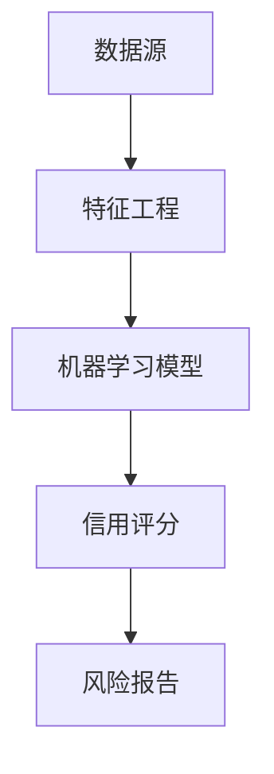
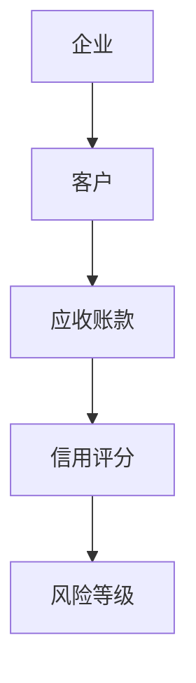
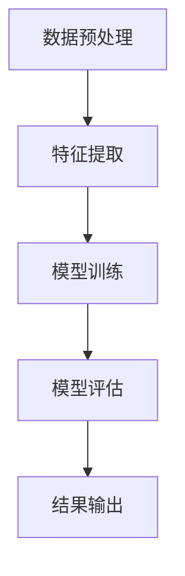
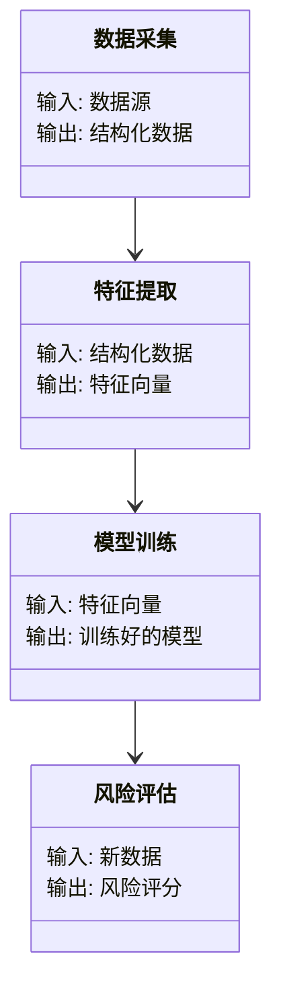
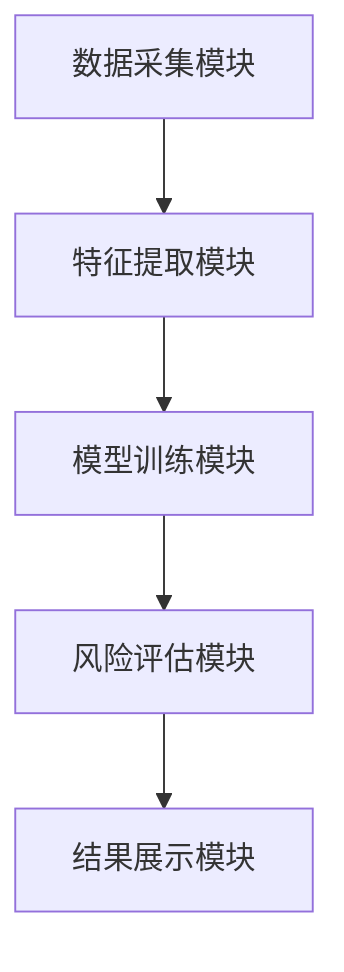
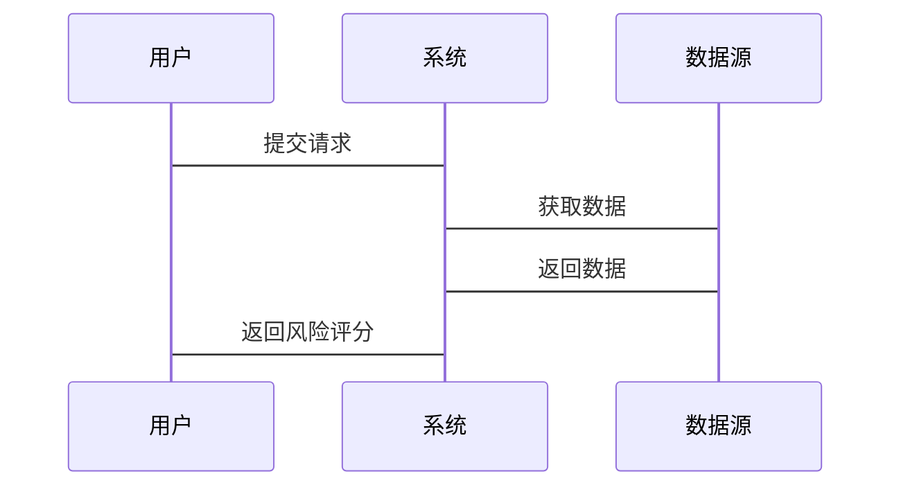

                 


# AI驱动的企业应收账款信用风险评估系统

> 关键词：信用风险评估，人工智能，机器学习，应收账款，风险管理

> 摘要：本文详细探讨了如何利用人工智能技术构建企业应收账款信用风险评估系统，分析了传统方法的局限性，提出了基于AI的解决方案，并通过具体案例展示了系统的实现过程和实际效果。

---

## 第1章: 背景介绍

### 1.1 问题背景
#### 1.1.1 应收账款信用风险的定义与重要性
应收账款是企业在销售商品或服务后，客户承诺在未来某个时间点支付的款项。信用风险是指客户未能按时支付账款的可能性。在企业日常运营中，应收账款的回收情况直接关系到企业的现金流健康和财务稳定性。

#### 1.1.2 传统信用风险评估的局限性
传统信用风险评估方法依赖于人工审核和历史数据分析，存在效率低、主观性强、覆盖范围有限等问题。传统方法通常基于财务报表分析和客户信用历史，难以捕捉到实时变化的市场信息和复杂的客户行为特征。

#### 1.1.3 AI技术在信用风险评估中的应用潜力
人工智能技术，特别是机器学习算法，能够从大量数据中提取特征，并通过模型预测客户还款的可能性。AI技术可以处理结构化和非结构化数据，实时更新模型，从而提高信用风险评估的准确性和效率。

### 1.2 问题描述
#### 1.2.1 应收账款信用风险的核心要素
应收账款信用风险的核心要素包括客户的基本信息、财务状况、历史交易记录、行业风险、宏观经济环境等。这些因素相互作用，影响客户的还款能力和意愿。

#### 1.2.2 企业信用风险评估的关键挑战
企业在信用风险评估中面临的主要挑战包括数据获取困难、数据质量参差不齐、模型泛化能力不足、实时性要求高等问题。

#### 1.2.3 AI驱动解决方案的优势与目标
AI驱动的信用风险评估系统通过自动化数据处理、智能特征提取和高精度预测模型，能够快速、准确地评估客户的信用风险，帮助企业做出更明智的赊销决策。

### 1.3 问题解决
#### 1.3.1 AI技术如何解决信用风险评估问题
AI技术通过机器学习算法（如逻辑回归、随机森林、神经网络等）对海量数据进行建模和分析，能够发现传统方法难以察觉的潜在风险因素。

#### 1.3.2 数据驱动的信用评估新范式
数据驱动的信用评估范式强调数据的多样性和模型的可解释性。通过整合结构化数据（如财务数据）和非结构化数据（如社交媒体数据），AI模型能够更全面地评估客户的信用风险。

#### 1.3.3 系统化解决方案的设计思路
设计思路包括数据收集、特征工程、模型训练、模型部署和持续优化五个阶段。每个阶段都需要精心设计，确保系统的稳定性和高效性。

### 1.4 边界与外延
#### 1.4.1 系统的边界条件
系统仅关注企业应收账款的信用风险评估，不涉及企业的其他财务风险或市场风险。系统的输入是客户的交易数据和相关信息，输出是信用评分和风险等级。

#### 1.4.2 相关领域的外延与区别
与企业信用评级、个人信用评分等领域相比，应收账款信用风险评估更关注短期交易的信用风险，数据范围和模型目标具有特定性。

#### 1.4.3 与其他信用评估方法的对比
传统方法依赖专家经验和历史数据，而AI方法通过数据驱动的方式，能够捕捉更多潜在风险因素，并实时更新模型。

### 1.5 核心概念结构与组成
#### 1.5.1 系统核心要素分析
系统的核心要素包括数据源、特征工程、机器学习模型、信用评分和风险报告。这些要素共同构成了AI驱动的信用风险评估系统。

#### 1.5.2 核心概念之间的关系
数据源提供输入，特征工程提取有用特征，模型基于特征进行预测，信用评分用于评估客户风险，风险报告指导企业决策。

#### 1.5.3 系统整体架构图


---

## 第2章: 核心概念与联系

### 2.1 核心概念原理
#### 2.1.1 信用风险评估的基本原理
信用风险评估是通过分析客户的财务状况、交易历史和市场环境，预测客户违约的可能性。AI技术通过机器学习模型实现这一目标。

#### 2.1.2 AI技术在信用评估中的应用原理
AI技术通过数据预处理、特征提取、模型训练和预测，构建信用风险评估模型。模型能够自动学习数据中的模式和特征，提高评估的准确性和效率。

#### 2.1.3 数据特征提取的原理
数据特征提取是从原始数据中提取能够反映客户信用状况的关键特征，如收入、利润、应收账款余额、应付账款余额等。

### 2.2 核心概念属性特征对比
#### 2.2.1 不同信用评估方法的对比分析
| 方法 | 优点 | 缺点 |
|------|------|------|
| 传统方法 | 易解释，依赖专家经验 | 数据依赖性强，效率低 |
| AI方法 | 高效性，准确性 | 黑箱问题，可解释性差 |

#### 2.2.2 数据特征的分类与属性分析
数据特征可以分为结构化数据（如财务数据）和非结构化数据（如文本数据）。结构化数据易于处理，而非结构化数据需要进行文本挖掘和情感分析。

#### 2.2.3 AI模型的性能指标对比
| 指标 | 逻辑回归 | 随机森林 | 神经网络 |
|------|----------|------------|----------|
| 准确率 | 中等 | 高 | 高 |
| 召回率 | 中等 | 高 | 高 |
| F1分数 | 中等 | 高 | 高 |

### 2.3 ER实体关系图


---

## 第3章: 算法原理讲解

### 3.1 算法原理概述
#### 3.1.1 机器学习在信用评估中的应用
机器学习算法可以用于信用风险评估的特征选择、模型训练和预测。常用的算法包括逻辑回归、随机森林和神经网络。

#### 3.1.2 常见算法的优缺点对比
| 算法 | 优点 | 缺点 |
|------|------|------|
| 逻辑回归 | 易解释，计算速度快 | 非线性关系处理能力差 |
| 随机森林 | 高准确率，鲁棒性强 | 计算复杂度高 |
| 神经网络 | 高准确率，非线性能力强 | 黑箱问题，难解释 |

#### 3.1.3 算法选择的依据
算法选择主要依据数据类型、数据规模、模型解释性和计算资源。对于小规模数据，逻辑回归和随机森林表现较好；对于大规模数据，神经网络更具优势。

### 3.2 算法流程图


### 3.3 算法实现代码
```python
# 示例代码：逻辑回归模型
from sklearn.linear_model import LogisticRegression
from sklearn.metrics import accuracy_score

# 假设X_train和y_train是训练数据
model = LogisticRegression()
model.fit(X_train, y_train)

# 预测
y_pred = model.predict(X_test)

# 计算准确率
accuracy = accuracy_score(y_test, y_pred)
print(f"准确率: {accuracy}")
```

### 3.4 算法数学模型
逻辑回归的损失函数可以表示为：
$$
L(\theta) = -\frac{1}{m} \sum_{i=1}^{m} [y_i \log(h(x_i)) + (1 - y_i)\log(1 - h(x_i))]
$$
其中，$$h(x_i) = \frac{1}{1 + e^{-\theta^T x_i}}$$ 是逻辑函数。

---

## 第4章: 系统分析与架构设计方案

### 4.1 系统分析
#### 4.1.1 系统目标
系统的目标是构建一个基于AI的应收账款信用风险评估平台，帮助企业实时评估客户的信用风险，优化赊销决策。

#### 4.1.2 系统功能需求
系统需要具备数据采集、特征提取、模型训练、风险评估和结果展示五大功能模块。

#### 4.1.3 领域模型


### 4.2 系统架构设计
#### 4.2.1 系统架构图


#### 4.2.2 系统接口设计
系统需要与企业的ERP系统、CRM系统对接，获取客户的交易数据和财务数据。

#### 4.2.3 系统交互图


---

## 第5章: 项目实战

### 5.1 项目环境搭建
#### 5.1.1 环境配置
安装Python、Jupyter Notebook、Scikit-learn、XGBoost等工具。

#### 5.1.2 数据获取
从企业ERP系统获取客户的交易数据、财务数据和行业数据。

### 5.2 系统核心实现
#### 5.2.1 数据预处理
处理缺失值、异常值和数据标准化。

#### 5.2.2 特征工程
提取关键特征，如收入增长率、利润波动率、应收账款周转率等。

#### 5.2.3 模型训练
使用逻辑回归、随机森林和XGBoost三种算法进行训练，比较模型性能。

#### 5.2.4 模型调优
通过网格搜索优化模型参数，提高模型准确率和召回率。

#### 5.2.5 模型部署
将训练好的模型部署到生产环境，实时处理客户的信用评估请求。

### 5.3 实际案例分析
以某制造企业的应收账款数据为例，展示模型的训练过程和评估结果。

### 5.4 项目小结
通过项目实战，验证了AI驱动的信用风险评估系统在实际应用中的可行性和有效性。

---

## 第6章: 最佳实践与注意事项

### 6.1 最佳实践
- 数据质量是模型性能的基础，确保数据的完整性和准确性。
- 组合使用多种算法，提高模型的准确性和鲁棒性。
- 定期更新模型，适应市场环境的变化。

### 6.2 小结
本文详细介绍了AI驱动的企业应收账款信用风险评估系统的构建过程，从理论到实践，全面展示了系统的实现方法和应用价值。

### 6.3 注意事项
- 数据隐私和安全问题需要严格控制。
- 模型的可解释性对于企业的决策至关重要。
- 系统的实时性和稳定性需要充分考虑。

### 6.4 拓展阅读
建议读者进一步学习机器学习在金融领域的应用，以及如何结合自然语言处理技术提升信用风险评估的准确性。

---

## 附录

### 附录A: 数据集说明
详细说明数据集的结构和内容，包括字段定义和数据格式。

### 附录B: 工具库安装
列出项目所需的工具库及其安装方法。

### 附录C: 参考文献
列出本文参考的文献和资料。

### 附录D: 扩展阅读
推荐相关领域的书籍和论文，供读者深入学习。

---

## 作者：AI天才研究院/AI Genius Institute & 禅与计算机程序设计艺术 /Zen And The Art of Computer Programming

---

本文通过系统化的分析和实践，展示了如何利用人工智能技术构建高效、准确的企业应收账款信用风险评估系统。希望本文能为企业的风险管理提供新的思路和方法。

