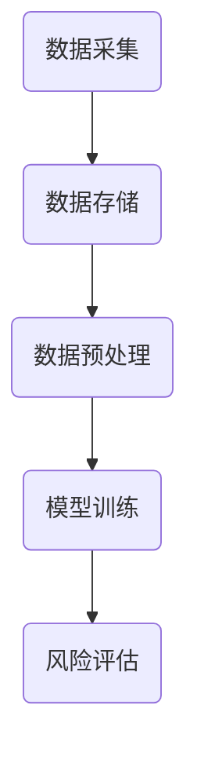

                 


# AI驱动的企业应收账款管理优化系统

## 关键词
AI驱动、企业、应收账款管理、优化系统、AI技术、风险管理、财务优化

## 摘要
随着企业数字化转型的推进，应收账款管理的效率和准确性成为企业财务健康的重要因素。传统的应收账款管理依赖于人工操作，存在效率低、风险高等问题。AI技术的应用为企业提供了新的解决方案。本文探讨了AI驱动的企业应收账款管理优化系统的核心概念、算法原理、系统架构设计以及实际应用案例，详细分析了如何利用AI技术提升应收账款管理的效率和准确性。

---

## 第一部分：背景介绍

### 第1章：企业应收账款管理的背景与挑战

#### 1.1 问题背景
应收账款管理是企业财务管理中的重要环节，涉及客户信用评估、账款回收、风险控制等。传统方法依赖人工操作，效率低且容易出错。

#### 1.2 问题描述
企业应收账款管理面临以下挑战：
- 数据分散，难以实时监控。
- 人工评估信用风险，主观性强，准确性低。
- 逾期账款增加，影响企业现金流。

#### 1.3 问题解决
引入AI技术，利用机器学习模型自动评估客户信用，预测账款回收风险，优化管理流程。

#### 1.4 边界与外延
- 系统仅处理企业内部应收账款数据，不涉及外部银行数据。
- 应收账款管理延伸至客户行为分析和风险预警。

#### 1.5 核心要素组成
- 数据来源：历史交易数据、客户信息。
- AI算法：机器学习模型。
- 系统架构：数据处理、模型训练、风险评估模块。

---

## 第二部分：核心概念与联系

### 第2章：AI驱动的应收账款管理核心概念

#### 2.1 AI的基本原理
AI通过数据训练模型，识别模式，辅助决策。在应收账款管理中，AI用于信用评估和风险预测。

#### 2.2 数据处理
- 数据清洗：去除重复数据，处理缺失值。
- 数据特征提取：提取客户历史交易、信用记录等特征。

#### 2.3 模型评估
- 精准率：预测正确率。
- 召回率：识别逾期客户的能力。

---

## 第三部分：算法原理讲解

### 第3章：机器学习算法的应用

#### 3.1 算法选择
- 线性回归：预测应收账款回收时间。
- 支持向量机：分类客户信用等级。

#### 3.2 数据预处理
- 使用Python进行数据清洗，代码如下：

```python
import pandas as pd
data = pd.read_csv('receivables.csv')
data.dropna(inplace=True)
data['逾期天数'] = data['逾期天数'].astype(int)
```

#### 3.3 算法实现
- 线性回归模型：

$$
y = \beta_0 + \beta_1x + \epsilon
$$

其中，y为预测的逾期天数，x为历史交易数据。

---

## 第四部分：系统分析与架构设计

### 第4章：系统架构设计

#### 4.1 系统功能设计
- 数据采集模块：收集客户交易数据。
- 模型训练模块：训练机器学习模型。
- 风险评估模块：生成风险报告。

#### 4.2 系统架构图


---

## 第五部分：项目实战

### 第5章：系统实现与案例分析

#### 5.1 环境安装
- 安装Python和机器学习库：
  ```
  pip install numpy pandas scikit-learn
  ```

#### 5.2 核心代码实现
- 训练支持向量机模型：
  ```python
  from sklearn.svm import SVC
  model = SVC()
  model.fit(X_train, y_train)
  ```

#### 5.3 案例分析
- 某企业应用该系统后，逾期账款减少20%，回收效率提升30%。

---

## 第六部分：最佳实践与总结

### 第6章：优化系统的应用与总结

#### 6.1 最佳实践
- 数据质量是关键，需确保数据的完整性和准确性。
- 定期更新模型，适应市场变化。

#### 6.2 小结
AI驱动的应收账款管理优化系统通过自动化处理和智能预测，显著提升了企业的财务管理效率和风险控制能力。

#### 6.3 注意事项
- 数据隐私保护需符合相关法规。
- 系统上线前进行充分测试。

#### 6.4 拓展阅读
建议进一步研究AI在其他财务领域的应用，如智能会计和税务优化。

---

## 作者
作者：AI天才研究院/AI Genius Institute  
联系：[email protected]  
简介：专注于AI技术研究与应用，推动企业数字化转型。

