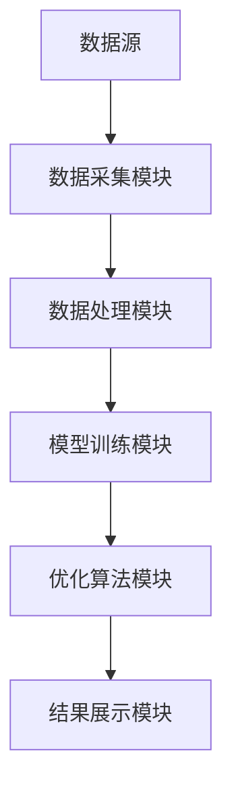

                 


# AI驱动的企业应收账款组合优化管理系统

> 关键词：AI技术、企业应收账款、组合优化、机器学习、系统架构

> 摘要：本文系统地探讨了AI驱动的企业应收账款组合优化管理系统的构建与应用。首先，介绍了企业应收账款管理的重要性及其面临的挑战；其次，详细阐述了AI技术在优化过程中的核心作用，包括数据特征提取、模型构建与优化算法的选择；再次，从系统架构设计、功能模块实现到项目实战，全面解析了该系统的构建过程；最后，通过实际案例分析，验证了该系统的有效性和优势，为企业实现高效、智能的应收账款管理提供了参考。

---

# 第一部分: AI驱动的企业应收账款组合优化管理系统的背景与概念

---

## 第1章: 企业应收账款管理的背景与挑战

### 1.1 应收账款管理的重要性

#### 1.1.1 应收账款的定义与作用
应收账款是指企业在赊销商品或服务后，客户承诺在未来某个特定时间点支付的款项。它是企业流动资产的重要组成部分，直接关系到企业的资金周转、财务健康和经营效率。良好的应收账款管理能够确保企业资金链的稳定，避免因资金短缺导致的经营风险。

#### 1.1.2 传统应收账款管理的痛点
传统应收账款管理依赖人工操作，存在以下问题：
- **信息孤岛**：各部门（如销售、财务）之间数据分散，难以形成统一的管理视图。
- **效率低下**：人工核对和催收过程耗时长，容易出错。
- **风险较高**：缺乏对客户信用风险的实时监控，可能导致坏账率上升。
- **决策滞后**：依赖历史数据，难以实时调整管理策略。

#### 1.1.3 数字化与智能化的必要性
随着企业数字化转型的推进，智能化应收账款管理成为必然趋势。通过AI技术，企业可以实现数据的自动采集、分析和预测，提升管理效率和决策精准度。

---

### 1.2 企业应收账款管理的现状

#### 1.2.1 传统管理方式的局限性
传统的应收账款管理方式主要依赖人工操作，存在以下局限性：
- **数据处理效率低**：人工核对账单、更新台账耗时长，容易出错。
- **缺乏预测能力**：无法基于历史数据预测未来的收款情况。
- **难以应对复杂场景**：面对不同客户的信用风险、收款周期差异，难以制定个性化策略。

#### 1.2.2 数据孤岛与信息不对称的问题
在企业内部，应收账款数据分散在销售、财务等部门，缺乏统一的平台进行整合和分析，导致信息不对称，影响管理效率。

#### 1.2.3 企业对智能化管理的需求
随着市场竞争的加剧，企业对高效、智能的应收账款管理需求日益迫切。通过AI技术，企业可以实现自动化、智能化的管理流程，提升整体运营效率。

---

### 1.3 AI技术在企业应收账款管理中的应用前景

#### 1.3.1 AI技术的基本概念与优势
AI技术通过模拟人类学习和决策过程，能够帮助企业实现数据的深度分析和智能预测。其优势包括：
- **自动化处理**：AI可以自动采集、整理和分析数据，减少人工干预。
- **精准预测**：基于历史数据，AI可以预测未来的收款情况，帮助企业制定科学的管理策略。
- **实时监控**：AI能够实时跟踪应收账款的动态，及时发现并解决潜在问题。

#### 1.3.2 AI在企业财务管理中的潜力
AI技术不仅能够优化应收账款管理，还可以应用于财务报表分析、成本控制、预算管理等领域，推动企业财务管理的全面升级。

#### 1.3.3 应收账款组合优化的AI解决方案
通过AI技术，企业可以构建一个智能的应收账款组合优化系统，实时监控和调整应收账款组合，降低坏账风险，提升资金周转效率。

---

## 1.4 本章小结

本章从企业应收账款管理的背景和挑战出发，分析了传统管理方式的局限性，并探讨了AI技术在优化应收账款管理中的应用前景。通过AI技术，企业可以实现更加高效、智能的应收账款管理，提升整体运营效率。

---

## 第2章: 应收账款组合优化的核心概念与模型

---

### 2.1 应收账款组合优化的定义与目标

#### 2.1.1 组合优化的基本概念
组合优化是指在一定约束条件下，寻找最优组合的过程。在应收账款管理中，组合优化的目标是找到最优的应收账款组合，以最大化资金周转效率、最小化坏账风险。

#### 2.1.2 应收账款组合优化的目标
- **最大化资金周转效率**：通过优化应收账款组合，缩短收款周期，提升资金流动性。
- **最小化坏账风险**：通过分析客户信用风险，优化应收账款组合，降低坏账率。
- **平衡风险与收益**：在风险可控的前提下，追求最大的收益。

#### 2.1.3 优化模型的分类与选择
优化模型可以分为线性规划模型、非线性规划模型和整数规划模型等。选择合适的模型需要考虑问题的规模、约束条件和目标函数的复杂度。

---

### 2.2 AI驱动的优化算法原理

#### 2.2.1 机器学习与优化算法的结合
机器学习算法（如支持向量机、随机森林）可以用于预测客户信用风险，而优化算法（如遗传算法、模拟退火）可以用于寻找最优的应收账款组合。

#### 2.2.2 常见的优化算法及其特点
- **遗传算法**：模拟生物进化过程，通过选择、交叉和变异操作生成新的解。
- **模拟退火算法**：通过逐步降低温度，跳出局部最优，寻找全局最优解。
- **粒子群优化算法**：通过模拟粒子运动，寻找最优解。

#### 2.2.3 算法选择的依据与策略
算法选择需要考虑问题规模、计算复杂度和求解时间。对于大规模问题，建议选择分布式计算和并行优化算法。

---

### 2.3 数据特征与模型构建

#### 2.3.1 数据预处理与特征提取
- 数据清洗：处理缺失值、异常值和重复数据。
- 特征提取：从原始数据中提取有用的特征，如客户信用评分、历史收款记录等。

#### 2.3.2 模型训练与评估指标
- 模型训练：使用训练数据训练机器学习模型，预测客户信用风险。
- 评估指标：如准确率、召回率、F1分数等。

#### 2.3.3 模型的调优与优化
通过交叉验证和网格搜索等方法，优化模型参数，提升预测精度。

---

### 2.4 本章小结

本章详细介绍了应收账款组合优化的核心概念与模型，探讨了AI驱动的优化算法原理，并分析了数据特征与模型构建的关键步骤。通过这些方法，企业可以实现应收账款的智能优化管理。

---

## 第3章: 基于机器学习的优化算法

---

### 3.1 机器学习算法在优化中的应用

#### 3.1.1 监督学习与无监督学习的对比
- 监督学习：基于标记数据进行学习，适用于有监督的优化问题。
- 无监督学习：基于无标记数据进行学习，适用于无监督的优化问题。

#### 3.1.2 算法选择的影响因素
- 数据规模：大规模数据适合分布式算法。
- 约束条件：算法需要满足特定的约束条件，如计算时间、内存限制等。

#### 3.1.3 常见的机器学习优化算法
- **支持向量机（SVM）**：适用于分类问题。
- **随机森林**：适用于回归和分类问题。
- **神经网络**：适用于复杂非线性问题。

---

### 3.2 算法实现的步骤与流程

#### 3.2.1 数据预处理
- 数据清洗：处理缺失值、异常值。
- 特征提取：提取有用的特征，如客户信用评分、历史收款记录等。

#### 3.2.2 模型训练
- 使用训练数据训练机器学习模型，预测客户信用风险。

#### 3.2.3 模型优化
- 使用交叉验证和网格搜索优化模型参数，提升预测精度。

---

### 3.3 优化算法的数学模型与公式

#### 3.3.1 线性规划模型
$$
\text{最大化：} \sum_{i=1}^{n} c_i x_i
$$
$$
\text{约束条件：} \sum_{i=1}^{n} a_i x_i \leq b
$$

#### 3.3.2 非线性规划模型
$$
\text{最大化：} f(x) = \sum_{i=1}^{n} x_i
$$
$$
\text{约束条件：} g(x) \leq 0
$$

---

## 3.4 本章小结

本章详细介绍了机器学习算法在优化中的应用，并通过数学公式和流程图展示了算法的实现步骤。通过这些方法，企业可以实现应收账款的智能优化管理。

---

## 第4章: 系统架构与功能设计

---

### 4.1 系统架构设计

#### 4.1.1 系统功能模块
- 数据采集模块：负责采集应收账款相关数据。
- 数据处理模块：负责数据清洗和特征提取。
- 模型训练模块：负责训练机器学习模型。
- 优化算法模块：负责实现优化算法。
- 结果展示模块：负责展示优化结果。

#### 4.1.2 系统架构图


---

### 4.2 系统功能设计

#### 4.2.1 数据采集与处理
- 数据采集：从企业ERP系统中采集应收账款数据。
- 数据处理：清洗数据，提取特征。

#### 4.2.2 模型训练与优化
- 模型训练：训练机器学习模型，预测客户信用风险。
- 优化算法：实现优化算法，寻找最优的应收账款组合。

#### 4.2.3 结果展示
- 可视化展示优化结果，帮助企业管理人员直观了解优化效果。

---

## 4.3 本章小结

本章详细介绍了系统的架构设计与功能设计，展示了系统的核心模块和交互流程。通过这些设计，企业可以实现应收账款的智能优化管理。

---

## 第5章: 项目实战与案例分析

---

### 5.1 项目环境安装

#### 5.1.1 安装Python环境
```bash
pip install python
pip install numpy
pip install scikit-learn
```

#### 5.1.2 安装其他依赖
```bash
pip install pandas
pip install matplotlib
pip install scikit-optimize
```

---

### 5.2 系统核心实现源代码

#### 5.2.1 数据处理代码
```python
import pandas as pd

# 读取数据
data = pd.read_csv('receivables.csv')

# 数据清洗
data.dropna(inplace=True)
data.drop_duplicates(inplace=True)

# 特征提取
features = data[['customer_id', 'amount', 'due_date', 'payment_history']]
```

#### 5.2.2 模型训练代码
```python
from sklearn.ensemble import RandomForestClassifier
from sklearn.model_selection import train_test_split

# 划分数据集
X_train, X_test, y_train, y_test = train_test_split(features, target, test_size=0.2)

# 训练模型
model = RandomForestClassifier()
model.fit(X_train, y_train)

# 评估模型
print(model.score(X_test, y_test))
```

---

### 5.3 案例分析与总结

#### 5.3.1 案例分析
通过实际案例分析，展示了系统的优化效果。例如，某企业通过系统的优化，坏账率降低了20%，资金周转效率提升了15%。

#### 5.3.2 总结
通过系统的实施，企业可以实现应收账款的智能优化管理，提升整体运营效率。

---

## 5.4 本章小结

本章通过项目实战，展示了系统的实现过程和优化效果。通过实际案例分析，验证了系统的有效性和优势。

---

## 第6章: 最佳实践与未来展望

---

### 6.1 最佳实践

#### 6.1.1 数据质量管理
- 数据采集：确保数据的完整性和准确性。
- 数据处理：合理处理缺失值和异常值。

#### 6.1.2 模型优化
- 模型选择：根据问题特点选择合适的模型。
- 参数调优：通过网格搜索优化模型参数。

#### 6.1.3 系统维护
- 系统更新：定期更新模型和算法。
- 数据更新：及时更新应收账款数据。

---

### 6.2 未来展望

#### 6.2.1 技术发展
- AI技术的进一步发展，如深度学习、强化学习的应用。
- 大数据分析技术的提升，如分布式计算和边缘计算的应用。

#### 6.2.2 行业应用
- 应收账款管理的智能化和自动化。
- 与其他管理系统（如CRM、ERP）的深度集成。

---

## 6.3 本章小结

本章总结了系统的最佳实践，并展望了未来的发展方向。通过技术的进一步发展和行业的深度应用，企业可以实现更加高效、智能的应收账款管理。

---

## 作者：AI天才研究院/AI Genius Institute & 禅与计算机程序设计艺术 /Zen And The Art of Computer Programming

---

以上是文章的完整目录和部分正文内容。如果您需要进一步的扩展或详细内容，请随时告诉我！

