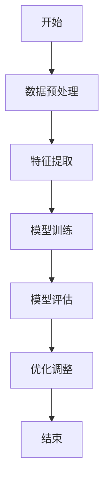
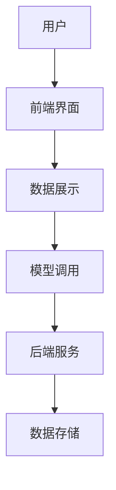
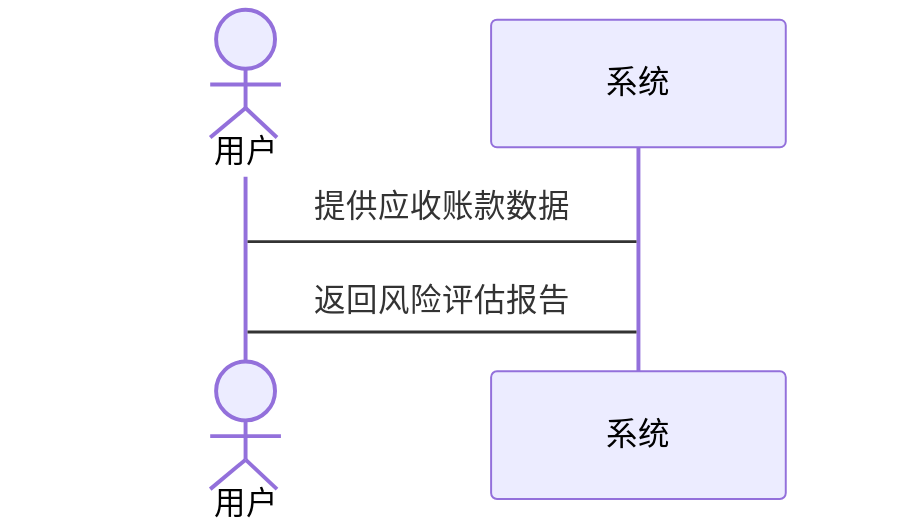

                 


# 第三部分: 算法原理讲解

# 第3章: 算法原理与实现

## 3.1 算法原理
### 3.1.1 风险评估模型的输入与输出
### 3.1.2 模型训练的流程
### 3.1.3 模型的评估与优化

## 3.2 算法流程图



## 3.3 算法实现代码示例
```python
import pandas as pd
from sklearn.model_selection import train_test_split
from sklearn.ensemble import RandomForestClassifier
from sklearn.metrics import accuracy_score

# 数据加载与预处理
data = pd.read_csv('accounts.csv')
X = data.drop('label', axis=1)
y = data['label']

# 划分训练集和测试集
X_train, X_test, y_train, y_test = train_test_split(X, y, test_size=0.2, random_state=42)

# 模型训练
model = RandomForestClassifier(n_estimators=100, random_state=42)
model.fit(X_train, y_train)

# 模型预测
y_pred = model.predict(X_test)

# 模型评估
accuracy = accuracy_score(y_test, y_pred)
print(f"Accuracy: {accuracy}")
```

## 3.4 数学模型与公式
### 3.4.1 概率模型
$$ P(y=1|x) = \beta_0 + \beta_1x_1 + \beta_2x_2 + \ldots + \beta_nx_n $$

### 3.4.2 统计模型
$$ \hat{y} = \alpha + \beta x + \epsilon $$

---

# 第四部分: 系统分析与架构设计

# 第4章: 系统分析与架构设计

## 4.1 问题场景介绍
### 4.1.1 企业应收账款管理场景
### 4.1.2 系统目标与功能需求
### 4.1.3 系统边界与范围

## 4.2 项目介绍
### 4.2.1 项目目标
### 4.2.2 项目范围
### 4.2.3 项目计划与时间表

## 4.3 领域模型设计
### 4.3.1 核心领域模型
### 4.3.2 领域模型的可视化表示
### 4.3.3 领域模型的动态更新

## 4.4 系统架构设计
### 4.4.1 系统架构图



### 4.4.2 系统接口设计
### 4.4.3 系统交互设计

## 4.5 接口与交互设计
### 4.5.1 接口设计
### 4.5.2 交互流程图



---

# 第五部分: 项目实战

# 第5章: 项目实战

## 5.1 环境安装与配置
### 5.1.1 系统环境要求
### 5.1.2 依赖安装
### 5.1.3 数据准备

## 5.2 系统核心实现
### 5.2.1 数据预处理代码
### 5.2.2 模型训练代码
### 5.2.3 系统接口实现

## 5.3 代码应用解读与分析
### 5.3.1 关键代码解读
### 5.3.2 代码优化建议
### 5.3.3 代码测试与验证

## 5.4 实际案例分析
### 5.4.1 案例背景
### 5.4.2 数据分析
### 5.4.3 模型评估
### 5.4.4 结果解读

## 5.5 项目小结
### 5.5.1 项目总结
### 5.5.2 项目成果
### 5.5.3 项目经验与教训

---

# 第六部分: 最佳实践与小结

# 第6章: 最佳实践与小结

## 6.1 最佳实践 tips
### 6.1.1 数据质量的重要性
### 6.1.2 模型选择与调优
### 6.1.3 系统可扩展性与维护

## 6.2 小结
### 6.2.1 核心内容回顾
### 6.2.2 未来发展方向
### 6.2.3 对读者的建议

## 6.3 注意事项
### 6.3.1 数据隐私与安全
### 6.3.2 模型解释性与可解释性
### 6.3.3 系统性能优化

## 6.4 拓展阅读
### 6.4.1 推荐的书籍与论文
### 6.4.2 相关技术领域的发展趋势
### 6.4.3 进一步学习资源

---

# 作者：AI天才研究院/AI Genius Institute & 禅与计算机程序设计艺术 /Zen And The Art of Computer Programming

