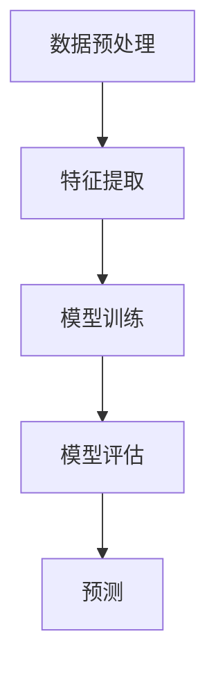
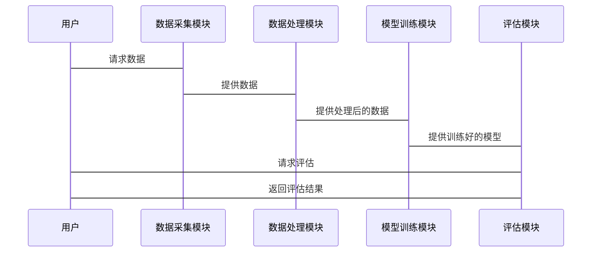

                 


# AI驱动的企业无形资产价值动态评估系统

## 关键词：
- AI驱动
- 企业无形资产
- 动态评估系统
- 机器学习
- 价值评估

## 摘要：
本文探讨了如何利用人工智能技术对企业无形资产进行动态价值评估。随着企业竞争的加剧，无形资产（如品牌价值、专利、商誉等）的重要性日益凸显。传统的评估方法往往静态且不够精准，而AI驱动的动态评估系统能够实时捕捉市场变化，提供更准确的评估结果。本文从核心概念、算法原理、系统架构到项目实战，全面分析了AI驱动的企业无形资产价值动态评估系统的构建与应用，为企业管理者和技术开发者提供了理论与实践的双重指导。

---

# 第1章：背景与概述

## 1.1 无形资产的定义与重要性

企业无形资产是指企业拥有或控制的，无实物形态，能够为企业创造长期经济价值的资源。常见的无形资产包括品牌价值、专利权、商标权、商誉、客户关系、技术诀窍等。这些资产的价值往往难以通过传统财务报表直接反映，但它们对企业的发展和市场竞争力起着至关重要的作用。

### 1.1.1 无形资产的定义
无形资产的定义可以分为两类：
- **狭义无形资产**：主要指法律明确界定的资产，如专利权、商标权等。
- **广义无形资产**：包括企业整体商誉、品牌价值、客户关系等难以量化的资产。

### 1.1.2 无形资产对企业价值的影响
无形资产的价值往往通过企业的市场表现间接反映。例如，品牌价值高的企业更容易吸引客户，从而提高销售额和利润率；拥有大量专利技术的企业可以在技术领域占据竞争优势。

### 1.1.3 无形资产的动态特性
无形资产的价值并非固定不变，它会受到市场环境、企业战略、技术发展等多种因素的影响。例如，一家企业的品牌价值可能因为市场推广、产品质量或负面新闻而波动。

---

## 1.2 传统评估方法的局限性

传统的无形资产评估方法主要包括成本法、市场法和收益法。这些方法在实践中存在以下问题：

### 1.2.1 传统评估方法的概述
- **成本法**：基于资产的重置成本进行评估。
- **市场法**：通过比较类似资产的市场交易价格进行评估。
- **收益法**：基于资产未来预期收益进行折现评估。

### 1.2.2 传统方法的局限性
1. **数据不足**：许多无形资产缺乏可比的市场交易数据。
2. **静态评估**：传统方法通常基于历史数据，难以反映动态变化。
3. **主观性高**：评估结果很大程度上依赖评估师的主观判断。

### 1.2.3 传统方法与现代需求的差距
随着企业运营的复杂化和市场环境的快速变化，传统的评估方法已无法满足企业对无形资产动态评估的需求。例如，品牌价值可能因社交媒体上的舆论变化而迅速波动，而传统方法难以捕捉这些实时变化。

---

## 1.3 AI驱动评估的优势

AI技术的引入为无形资产评估带来了革命性的变化。AI驱动的动态评估系统能够实时分析海量数据，捕捉市场变化，提供更精准的评估结果。

### 1.3.1 AI技术在评估中的应用潜力
- **数据驱动**：AI能够处理大量非结构化数据（如文本、图像、社交媒体数据）。
- **动态调整**：AI模型可以实时更新，反映市场变化。
- **自动化**：AI系统能够自动完成数据收集、分析和评估过程。

### 1.3.2 动态评估的必要性
- 市场环境的快速变化要求评估结果能够实时更新。
- 企业战略调整需要动态的评估支持。

### 1.3.3 AI驱动评估的创新点
- **实时数据处理**：AI系统能够实时分析市场数据，提供即时评估结果。
- **多维度分析**：AI能够从多个维度（如市场、财务、技术）综合评估无形资产的价值。
- **预测能力**：AI模型可以预测无形资产的未来价值变化。

---

# 第2章：AI驱动评估的核心概念

## 2.1 核心概念的定义

### 2.1.1 数据驱动的评估模型
数据驱动的评估模型基于海量数据，利用机器学习算法构建评估模型。例如，可以使用回归模型预测品牌价值，或者使用聚类模型识别市场趋势。

### 2.1.2 机器学习在评估中的应用
机器学习算法（如随机森林、支持向量机）可以用于分类、回归和聚类分析，帮助评估无形资产的价值。

### 2.1.3 动态调整的评估机制
动态调整的评估机制能够根据市场变化实时更新评估结果。例如，当市场环境变化时，AI系统可以自动调整评估模型的参数。

---

## 2.2 核心概念的属性对比

### 2.2.1 传统评估与AI驱动评估的对比分析

| 对比维度       | 传统评估方法                  | AI驱动评估方法                  |
|----------------|------------------------------|--------------------------------|
| 数据来源       | 主要依赖历史数据              | 结合历史和实时数据              |
| 评估频率       | 定期评估                      | 实时动态评估                    |
| 评估准确性     | 受限于数据质量和模型简单性    | 高度依赖数据量和模型复杂性      |
| 适用场景       | 静态环境                      | 动态环境                        |

### 2.2.2 数据来源与处理方式的对比

| 数据来源       | 传统方法                  | AI驱动方法                  |
|----------------|---------------------------|-----------------------------|
| 数据类型       | 结构化数据为主              | 结构化和非结构化数据并重      |
| 数据处理       | 简单的数据清洗和特征提取    | 复杂的数据清洗和特征工程      |

### 2.2.3 模型复杂度与准确性的对比

| 模型复杂度       | 传统模型                  | AI模型                  |
|------------------|---------------------------|--------------------------|
| 复杂度           | 较低                      | 较高                    |
| 准确性           | 中等                      | 高                      |
| 适用场景         | 简单场景                  | 复杂场景                |

---

## 2.3 ER实体关系图

```mermaid
erDiagram
    customer[客户] {
        cust_id : integer
        name : string
        brand_value : float
    }
    brand[品牌] {
        brand_id : integer
        brand_name : string
        market_value : float
    }
    market[市场] {
        market_id : integer
        industry : string
        trend : string
    }
    transaction[交易] {
        trans_id : integer
        date : date
        value : float
    }
    customer *-- transaction : "参与的交易"
    brand *-- transaction : "品牌相关的交易"
    market *-- brand : "所属的市场"
```

---

# 第3章：AI驱动评估的算法原理

## 3.1 算法原理概述

AI驱动的评估系统通常基于以下算法：

### 3.1.1 机器学习在评估中的应用
机器学习算法（如线性回归、随机森林、神经网络）可以用于预测无形资产的价值。例如，可以使用回归模型预测品牌价值，或者使用聚类模型识别市场趋势。

### 3.1.2 算法选择的依据
算法选择的依据包括数据类型、数据规模、评估目标和计算资源。例如，对于小规模数据，可以使用线性回归；对于大规模数据，可以使用随机森林或神经网络。

---

## 3.2 算法原理的详细分析

### 3.2.1 回归模型

回归模型是一种常用的预测模型，可以用于预测无形资产的价值。例如，可以使用线性回归模型预测品牌价值。

$$ y = \beta_0 + \beta_1x_1 + \beta_2x_2 + \dots + \beta_nx_n + \epsilon $$

其中：
- $y$ 是预测的目标变量（品牌价值）。
- $x_i$ 是自变量（如品牌知名度、市场份额）。
- $\beta_i$ 是回归系数。
- $\epsilon$ 是误差项。

### 3.2.2 神经网络

神经网络是一种复杂的机器学习模型，可以用于处理非结构化数据。例如，可以使用卷积神经网络（CNN）分析图像数据，或者使用循环神经网络（RNN）分析时间序列数据。

---

## 3.3 算法实现的代码示例

以下是使用Python实现线性回归模型的代码示例：

```python
import numpy as np
from sklearn.linear_model import LinearRegression
from sklearn.metrics import mean_squared_error

# 数据准备
X = np.array([[2, 3], [4, 5], [6, 7], [8, 9]])
y = np.array([1, 2, 3, 4])

# 模型训练
model = LinearRegression()
model.fit(X, y)

# 预测
y_pred = model.predict(X)

# 评估
mse = mean_squared_error(y, y_pred)
print(f"均方误差：{mse}")
```

---

## 3.4 算法流程图



---

# 第4章：系统分析与架构设计方案

## 4.1 系统功能设计

系统功能设计包括以下几个模块：

### 4.1.1 数据采集模块
数据采集模块负责从多种数据源（如数据库、API、文件）获取数据。例如，可以使用爬虫技术从社交媒体获取品牌相关的数据。

### 4.1.2 数据处理模块
数据处理模块负责对数据进行清洗、转换和特征提取。例如，可以使用Python的Pandas库进行数据清洗。

### 4.1.3 模型训练模块
模型训练模块负责使用机器学习算法训练评估模型。例如，可以使用Scikit-learn库训练回归模型。

### 4.1.4 评估模块
评估模块负责根据训练好的模型对无形资产进行价值评估。例如，可以使用模型预测品牌价值。

---

## 4.2 系统架构设计

### 4.2.1 系统架构图


---

## 4.3 系统接口设计

系统接口设计包括以下几个部分：

### 4.3.1 数据接口
数据接口负责与数据源交互。例如，可以使用REST API从数据库获取数据。

### 4.3.2 模型接口
模型接口负责与机器学习模型交互。例如，可以使用Python的Scikit-learn库调用模型。

---

## 4.4 系统交互流程图



---

# 第5章：项目实战

## 5.1 环境安装

### 5.1.1 安装Python
需要安装Python 3.6及以上版本。

### 5.1.2 安装依赖库
需要安装以下库：
- `numpy`
- `pandas`
- `scikit-learn`
- `mermaid`

安装命令：
```bash
pip install numpy pandas scikit-learn mermaid
```

---

## 5.2 系统核心实现源代码

### 5.2.1 数据采集模块

```python
import requests
import json

def get_data(url):
    response = requests.get(url)
    if response.status_code == 200:
        return json.loads(response.text)
    else:
        return None
```

### 5.2.2 数据处理模块

```python
import pandas as pd

def preprocess_data(data):
    df = pd.DataFrame(data)
    df.dropna(inplace=True)
    return df
```

### 5.2.3 模型训练模块

```python
from sklearn.linear_model import LinearRegression
from sklearn.metrics import mean_squared_error

def train_model(X, y):
    model = LinearRegression()
    model.fit(X, y)
    return model
```

### 5.2.4 评估模块

```python
def evaluate_assets(model, new_X):
    return model.predict(new_X)
```

---

## 5.3 实际案例分析

### 5.3.1 案例背景
假设我们是一家科技公司，希望评估其品牌价值。我们从社交媒体、市场报告和公司财务数据中获取相关数据。

### 5.3.2 数据采集与处理
从社交媒体获取品牌相关数据，从市场报告获取行业趋势数据，从公司财务数据获取财务指标。

### 5.3.3 模型训练
使用历史数据训练回归模型，预测品牌价值。

### 5.3.4 模型评估
使用均方误差（MSE）评估模型的准确性。

---

## 5.4 项目小结

通过项目实战，我们掌握了AI驱动的企业无形资产评估系统的核心技术，包括数据采集、数据处理、模型训练和模型评估。这些技术可以应用于实际的企业无形资产评估中。

---

# 第6章：最佳实践与总结

## 6.1 最佳实践

### 6.1.1 数据质量管理
确保数据的准确性和完整性，避免数据偏差。

### 6.1.2 模型优化
定期更新模型，确保模型的准确性和实时性。

### 6.1.3 可视化展示
使用数据可视化工具（如Matplotlib、Tableau）展示评估结果，便于理解和决策。

---

## 6.2 小结

AI驱动的企业无形资产评估系统能够实时动态评估无形资产的价值，为企业管理者提供科学的决策支持。随着AI技术的不断发展，评估系统将更加精准和智能。

---

## 6.3 注意事项

1. 数据隐私保护：在处理数据时，需遵守相关法律法规，保护数据隐私。
2. 模型更新频率：根据市场变化，定期更新模型，确保评估结果的准确性。
3. 技术可行性：在实际应用中，需考虑技术实现的可行性，避免技术瓶颈。

---

## 6.4 拓展阅读

- 《机器学习实战》
- 《Python数据挖掘与分析》
- 《企业价值评估方法论》

---

# 作者：AI天才研究院 & 禅与计算机程序设计艺术

---

**本文由AI天才研究院（AI Genius Institute）与“禅与计算机程序设计艺术”（Zen And The Art of Computer Programming）联合撰写，转载请注明出处。**

