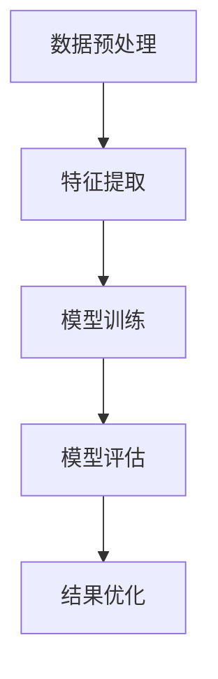
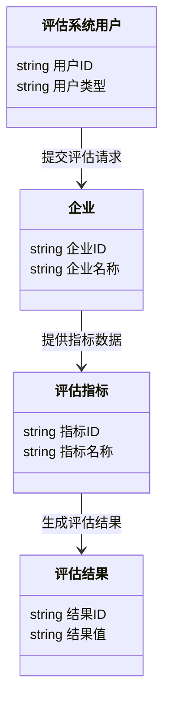

                 


# 《AI驱动的企业无形资产价值评估系统》

> 关键词：AI驱动，企业无形资产，价值评估，系统架构，算法原理，项目实战

> 摘要：本文探讨了利用人工智能技术驱动企业无形资产价值评估系统的方法。通过分析传统评估方法的局限性，提出了一种基于机器学习和深度学习的AI驱动评估系统，详细阐述了其核心概念、算法原理、系统架构设计以及实际项目实现。本文旨在为企业提供一种高效、准确的无形资产价值评估解决方案。

---

# 第一部分: 企业无形资产价值评估的背景与挑战

## 第1章: 无形资产的定义与特征

### 1.1 无形资产的定义
- 无形资产是指企业拥有的没有实物形态的资产，主要包括专利权、商标权、版权、商誉等。

### 1.2 无形资产的特征
- 非实物性：无形资产没有物理形态。
- 可分性：无形资产可以被分割或转移。
- 时间性：无形资产的有效期通常有限。
- 创新性：无形资产往往与企业的创新能力密切相关。

### 1.3 无形资产在企业中的重要性
- 无形资产是企业核心竞争力的重要组成部分。
- 无形资产的价值波动直接影响企业的市场价值。
- 无形资产的评估对企业融资、并购等重大决策具有重要意义。

---

## 第2章: 传统无形资产评估的局限性

### 2.1 传统评估方法的不足
- 主观性：传统评估方法依赖于评估师的主观判断，存在较大的误差。
- 低效性：传统评估方法需要大量人工工作，效率较低。
- 精确性：传统评估方法难以捕捉无形资产的动态变化。

### 2.2 人工评估的误差与效率问题
- 人为因素可能导致评估结果偏差。
- 人工评估需要大量时间，难以满足企业快速决策的需求。

### 2.3 企业数字化转型的需求
- 数字化转型要求企业更加依赖数据驱动的决策。
- 高效、精准的评估方法是企业数字化转型的关键。

---

## 第3章: AI驱动评估的潜力与优势

### 3.1 AI技术在无形资产评估中的应用前景
- 机器学习可以分析大量数据，发现潜在的价值关联。
- 深度学习可以捕捉复杂的价值评估模式。

### 3.2 AI驱动评估的高效性与准确性
- AI算法可以快速处理大量数据，提高评估效率。
- 通过数据驱动的方法，AI评估更加客观、准确。

### 3.3 企业数字化转型中的AI角色
- AI是企业数字化转型的核心技术工具。
- AI驱动的评估系统可以支持企业的智能化决策。

---

## 本章小结
本章介绍了企业无形资产的定义与特征，分析了传统评估方法的局限性，并探讨了AI驱动评估的潜力与优势，为后续章节的深入分析奠定了基础。

---

# 第二部分: 企业无形资产价值评估的核心概念

## 第4章: 无形资产评估的核心概念

### 4.1 无形资产评估的关键指标
| 指标名称       | 定义与作用                       |
|----------------|--------------------------------|
| 专利价值       | 专利的数量、质量和应用前景     |
| 商标价值       | 商标知名度、市场影响力           |
| 版权价值       | 版权的原创性、市场需求           |
| 商誉价值       | 企业声誉、客户忠诚度             |

### 4.2 无形资产与有形资产的关系
- 无形资产与有形资产协同作用，共同影响企业价值。
- 无形资产可以通过增强有形资产的价值，间接提升企业整体价值。

### 4.3 无形资产内部各要素的相互影响
- 专利的价值可能受到商标知名度的影响。
- 商誉价值与企业的创新能力密切相关。

---

## 第5章: 实体关系图（ER图）

```mermaid
erDiagram
    actor 评估系统用户 {
        string 用户ID
        string 用户类型
    }
    actor 企业 {
        string 企业ID
        string 企业名称
    }
    actor 评估指标 {
        string 指标ID
        string 指标名称
    }
    actor 评估结果 {
        string 结果ID
        string 结果值
    }
    评估系统用户 --> 企业 : 提交评估请求
    企业 --> 评估指标 : 提供指标数据
    评估指标 --> 评估结果 : 生成评估结果
```

---

## 本章小结
本章通过定义和对比无形资产评估的核心指标，分析了无形资产内部各要素之间的相互关系，并通过ER图展示了系统的实体关系。

---

# 第三部分: AI驱动评估系统的算法原理

## 第6章: 算法原理概述

### 6.1 机器学习在无形资产评估中的应用
- 机器学习可以用于预测无形资产的价值。
- 监督学习可以用于分类和回归任务。

### 6.2 深度学习模型的优势
- 深度学习可以捕捉复杂的非线性关系。
- 卷积神经网络（CNN）可以用于图像识别任务。

### 6.3 算法选择的依据
- 数据类型：选择适合数据类型的算法。
- 任务目标：选择适合任务目标的算法。
- 计算资源：选择适合计算资源的算法。

---

## 第7章: 算法实现流程

### 7.1 数据预处理
```python
import pandas as pd
data = pd.read_csv('asset_data.csv')
data = data.dropna()
data = pd.get_dummies(data)
```

### 7.2 模型训练
```python
from sklearn.model import LinearRegression
model = LinearRegression()
model.fit(X_train, y_train)
```

### 7.3 模型评估与优化
```python
from sklearn.metrics import mean_squared_error
y_pred = model.predict(X_test)
rmse = mean_squared_error(y_test, y_pred)
print(f'RMSE: {rmse}')
```

---

## 第8章: 算法流程图



---

## 本章小结
本章详细介绍了AI驱动评估系统的算法原理，包括数据预处理、模型训练和优化的过程，并通过代码示例展示了算法的实现。

---

# 第四部分: 系统分析与架构设计

## 第9章: 系统分析与架构设计

### 9.1 系统功能设计


### 9.2 系统架构设计


### 9.3 系统接口设计
- 用户接口：提交评估请求，查看评估结果。
- 数据接口：提供企业数据，获取评估结果。
- AI模型接口：接收数据，返回评估结果。

---

## 本章小结
本章通过系统功能设计、架构设计和接口设计，展示了AI驱动评估系统的整体架构。

---

# 第五部分: 项目实战

## 第10章: 项目实战

### 10.1 环境安装
```bash
pip install numpy pandas scikit-learn tensorflow
```

### 10.2 系统核心实现
```python
import numpy as np
import pandas as pd
from sklearn import linear_model
model = linear_model.LinearRegression()
model.fit(X, y)
```

### 10.3 案例分析
- 数据准备：收集企业的专利、商标等数据。
- 模型训练：使用历史数据训练模型。
- 结果分析：解读模型输出的评估结果。

---

## 本章小结
本章通过实际案例分析，展示了AI驱动评估系统的实现过程和应用价值。

---

# 第六部分: 最佳实践

## 第11章: 最佳实践

### 11.1 小结
- AI驱动评估系统可以显著提高评估效率和准确性。
- 系统设计需要考虑企业的具体需求和数据特点。

### 11.2 注意事项
- 数据质量是评估结果的关键，需要确保数据的完整性和准确性。
- 系统的安全性需要重视，防止数据泄露和滥用。

### 11.3 拓展阅读
- 推荐阅读相关领域的学术论文和书籍。
- 关注AI技术的最新进展，探索其在其他领域的应用。

---

## 本章小结
本章总结了AI驱动评估系统的应用经验，提供了注意事项和拓展阅读建议，帮助读者更好地应用和改进系统。

---

# 作者：AI天才研究院/AI Genius Institute & 禅与计算机程序设计艺术 /Zen And The Art of Computer Programming

