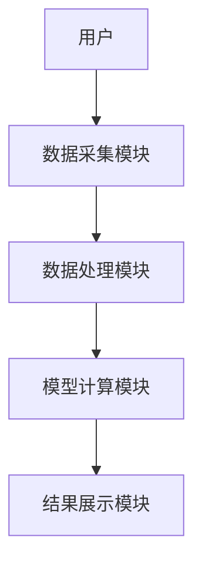

                 

<think>
好的，我将按照您的要求创作《AI驱动的企业现金流优化系统设计》这篇文章。为了让文章更加完整和专业，我需要先列出所有必要的内容和结构。请您看看以下内容是否符合您的预期。如果您有其他想法，可以随时提出，我会进行调整。

### 目录大纲

# AI驱动的企业现金流优化系统设计

> 关键词：企业现金流管理, 人工智能, 现金流预测, 优化算法, 系统架构

> 摘要：本文将详细探讨如何利用人工智能技术优化企业现金流管理。通过分析现金流预测的核心算法、优化模型的数学建模、系统架构设计以及实际项目案例，我们为您提供一套完整的现金流优化解决方案。从理论到实践，从算法到系统架构，本文将带您深入了解AI在企业现金流管理中的应用。

---

## 第一部分: AI驱动的企业现金流优化系统概述

### 第1章: 企业现金流管理的重要性

#### 1.1 现金流管理的核心概念
- 什么是现金流？
- 现金流管理的目的与意义
- 现金流管理的常见挑战

#### 1.2 人工智能在现金流管理中的应用
- AI如何优化现金流预测
- AI在现金流分析中的优势
- AI驱动的现金流管理系统的特点

#### 1.3 系统设计的目标与范围
- 系统设计的目标
- 系统的功能范围
- 系统的边界与限制

---

## 第二部分: 现金流预测的核心算法

### 第2章: 现金流预测模型

#### 2.1 现金流预测的理论基础
- 时间序列分析的基本概念
- 机器学习在时间序列预测中的应用
- 常见的现金流预测方法

#### 2.2 基于机器学习的现金流预测
- 机器学习算法的选择与比较
- 现金流预测的特征工程
- 模型训练与评估指标

#### 2.3 高阶预测算法
- 神经网络在现金流预测中的应用
- 集成学习方法的优化
- 超参数调优与模型优化

---

## 第三部分: 现金流优化的数学建模

### 第3章: 现金流优化的数学模型

#### 3.1 优化问题的定义
- 现金流优化的目标函数
- 约束条件的建立
- 优化问题的分类

#### 3.2 线性规划模型
- 线性规划的基本原理
- 现金流优化的线性模型构建
- 线性规划求解方法

#### 3.3 非线性优化模型
- 非线性规划的基本概念
- 现金流优化的非线性模型
- 求解方法的比较与选择

#### 3.4 动态规划模型
- 动态规划的基本原理
- 现金流优化的动态规划模型
- 模型的实现与优化

---

## 第四部分: 系统架构与实现

### 第4章: 系统架构设计

#### 4.1 系统模块划分
- 数据采集模块
- 数据处理模块
- 模型计算模块
- 结果展示模块

#### 4.2 系统架构图

#### 4.3 系统接口设计
- 数据接口规范
- 模型接口定义
- 用户接口设计

#### 4.4 系统交互流程
- 用户请求处理流程
- 数据处理与计算流程
- 结果展示与反馈流程

---

## 第五部分: 项目实战与案例分析

### 第5章: 项目实战

#### 5.1 环境搭建与数据准备
- 安装必要的开发工具
- 数据获取与预处理
- 数据集的划分与标准化

#### 5.2 现金流预测模型的实现
- 选择合适的算法
- 模型训练与调优
- 模型评估与优化

#### 5.3 现金流优化系统的实现
- 系统功能模块实现
- 系统接口的开发与测试
- 系统的部署与运行

#### 5.4 案例分析
- 实际企业案例分析
- 系统应用效果评估
- 经验总结与改进建议

---

## 第六部分: 总结与展望

### 第6章: 总结与展望

#### 6.1 系统设计总结
- 系统设计的核心成果
- 系统实现的关键点
- 系统应用的成效

#### 6.2 未来研究方向
- 新的算法与技术的应用
- 系统功能的扩展与优化
- 现金流管理的智能化发展

---

## 附录

### 附录A: 相关术语解释

### 附录B: 算法实现代码

### 附录C: 系统架构图与流程图

---

## 作者：AI天才研究院 & 禅与计算机程序设计艺术

---

请您确认以上内容是否符合您的预期。如果需要调整或补充，请随时告诉我，我将根据您的要求进行修改。

