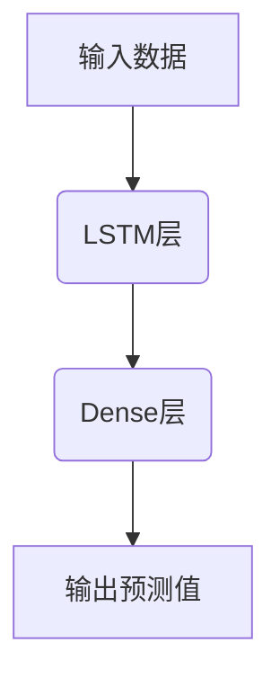
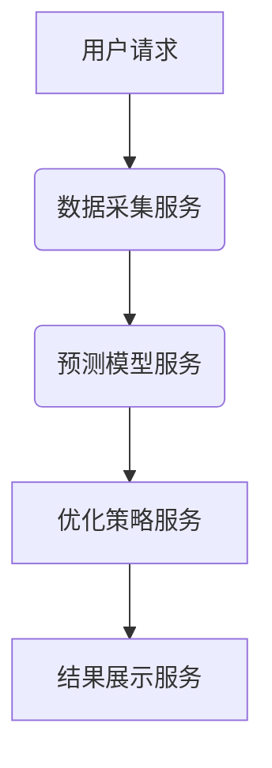

                 

# AI驱动的企业现金流周期优化

## 关键词：AI驱动，现金流周期，企业财务优化，机器学习，现金流预测

## 摘要：  
本文深入探讨了如何利用人工智能（AI）技术优化企业现金流周期管理。通过分析现金流周期的定义、优化目标以及AI技术在其中的应用，本文提出了基于机器学习的现金流预测模型和优化策略。文章详细介绍了算法原理、系统架构设计、项目实战案例以及最佳实践，为企业在AI时代实现现金流周期优化提供了全面的指导和参考。

---

# 第1章: 企业现金流周期优化的背景与挑战

## 1.1 企业现金流周期的基本概念

### 1.1.1 企业现金流周期的定义  
企业现金流周期是指从企业收到现金到支付现金的时间间隔，包括应收账款的回收、存货周转、应付账款支付等环节。现金流周期的长短直接影响企业的财务健康和运营效率。

### 1.1.2 现金流周期对企业财务健康的影响  
现金流周期过长可能导致企业资金链紧张，增加财务风险；而优化现金流周期可以提升资金使用效率，降低融资成本，增强企业抗风险能力。

### 1.1.3 现金流周期优化的必要性  
随着市场竞争加剧和经济环境的不确定性，企业需要通过优化现金流周期来提高资金流动性，增强市场竞争力。

---

## 1.2 AI技术在企业现金流管理中的应用前景

### 1.2.1 AI技术对企业财务管理的革命性影响  
AI技术可以通过数据分析、模式识别和预测建模，帮助企业在现金流预测、风险控制等方面实现智能化管理。

### 1.2.2 现金流周期优化的AI驱动模式  
AI驱动的现金流优化模式基于大数据分析和机器学习算法，能够实时预测现金流变化并提出优化建议。

### 1.2.3 企业现金流管理的未来趋势  
随着AI技术的不断进步，企业现金流管理将更加智能化、精准化和动态化。

---

## 1.3 本章小结  
本章通过介绍企业现金流周期的基本概念、优化目标以及AI技术的应用前景，为后续章节的分析奠定了基础。

---

# 第2章: AI驱动现金流周期优化的核心概念与联系

## 2.1 数据驱动的现金流预测模型

### 2.1.1 数据驱动的现金流预测方法  
基于历史数据和实时数据，结合统计分析和机器学习算法，构建现金流预测模型。

### 2.1.2 基于机器学习的现金流预测模型  
使用LSTM（长短期记忆网络）等深度学习算法，预测未来现金流的变化趋势。

### 2.1.3 数据特征提取与优化  
通过主成分分析（PCA）等方法，提取关键数据特征，提升预测模型的准确性和稳定性。

---

## 2.2 现金流周期优化的数学模型

### 2.2.1 现金流周期优化的数学表达式  
$$ \text{目标函数：最小化现金流周期} $$  
$$ \text{约束条件：现金流波动性、企业运营需求} $$

### 2.2.2 基于动态规划的现金流优化模型  
通过动态规划方法，分阶段优化现金流周期，确保每一步决策的最优性。

### 2.2.3 线性规划在现金流优化中的应用  
将现金流周期优化问题转化为线性规划问题，利用求解器（如Cplex）求解最优解。

---

## 2.3 现金流周期优化的机器学习算法

### 2.3.1 常见现金流预测算法对比  
| 算法名称 | 优势 | 劣势 |
|----------|-------|------|
| ARIMA    | 简单易用 | 对非线性关系捕捉不足 |
| LSTM     | 长期依赖关系捕捉能力强 | 计算复杂度高 |
| XGBoost  | 鲁棒性强 | 对特征工程依赖较大 |

### 2.3.2 基于LSTM的现金流预测模型  
使用LSTM网络预测现金流波动，模型结构如下：

### 2.3.3 算法优缺点分析  
LSTM算法适合处理时间序列数据，但在小数据集上表现一般，需要结合数据增强技术提升性能。

---

## 2.4 本章小结  
本章详细分析了AI驱动现金流周期优化的核心概念，包括数据驱动的预测模型、数学优化方法以及机器学习算法的选择与应用。

---

# 第3章: 现金流周期优化系统的架构设计

## 3.1 系统功能模块划分

### 3.1.1 数据采集模块  
从企业财务系统中采集现金流相关数据，包括应收账款、应付账款、存货等。

### 3.1.2 现金流预测模块  
基于机器学习算法，预测未来现金流的变化趋势。

### 3.1.3 优化策略模块  
根据预测结果，制定现金流周期优化策略，如调整应收账款回收期、优化存货周转率等。

### 3.1.4 结果展示模块  
将优化结果以可视化形式展示，帮助企业管理者快速理解优化方案。

---

## 3.2 系统架构设计

### 3.2.1 分层架构设计  
系统分为数据层、业务逻辑层和用户界面层，各层之间通过API进行交互。

### 3.2.2 微服务架构设计  
采用微服务架构，将系统划分为数据采集、预测模型、优化策略等独立服务，便于扩展和维护。

### 3.2.3 系统交互流程设计  

---

## 3.3 系统接口设计

### 3.3.1 数据接口设计  
定义数据接口的输入格式和输出格式，确保数据采集模块与预测模型模块之间的数据交互顺畅。

### 3.3.2 API接口设计  
提供RESTful API接口，供外部系统调用现金流预测和优化结果。

### 3.3.3 用户界面设计  
设计直观的用户界面，方便企业管理者查看优化结果并进行决策。

---

## 3.4 系统优化策略

### 3.4.1 基于AI的动态优化策略  
根据实时数据动态调整优化策略，确保现金流周期始终处于最优状态。

### 3.4.2 系统性能优化方法  
通过缓存技术、分布式计算等方法提升系统性能，确保高并发场景下的稳定运行。

### 3.4.3 系统可扩展性设计  
预留扩展接口，便于未来增加新的功能模块或优化算法。

---

## 3.5 本章小结  
本章详细描述了现金流周期优化系统的架构设计，包括功能模块划分、系统架构设计、接口设计以及优化策略。

---

# 第4章: 现金流周期优化的项目实战

## 4.1 项目背景与目标

### 4.1.1 项目背景  
某制造企业希望优化其现金流周期，提升资金使用效率。

### 4.1.2 项目目标  
通过AI技术实现现金流预测和优化，将现金流周期缩短10%。

---

## 4.2 系统核心实现

### 4.2.1 环境安装  
安装Python、TensorFlow、Keras等开发工具，搭建深度学习环境。

### 4.2.2 数据预处理  
对历史财务数据进行清洗、归一化处理，提取关键特征变量。

### 4.2.3 模型训练  
使用LSTM网络训练现金流预测模型，调整超参数以提升预测精度。

### 4.2.4 优化策略实现  
基于预测结果，制定现金流优化策略，如优化应收账款回收期。

---

## 4.3 实际案例分析

### 4.3.1 案例背景  
某制造企业历史财务数据，包括应收账款、应付账款、存货等。

### 4.3.2 数据分析  
通过数据分析发现，应收账款回收期过长是现金流周期的主要瓶颈。

### 4.3.3 模型预测  
基于LSTM模型预测未来现金流，发现季度性波动明显。

### 4.3.4 优化策略  
调整应收账款政策，缩短回收期，优化现金流周期。

---

## 4.4 项目小结  
通过本项目实战，验证了AI技术在现金流周期优化中的有效性，为企业提供了可复制的优化方案。

---

# 第5章: AI驱动现金流周期优化的最佳实践

## 5.1 核心要点总结

### 5.1.1 数据是基础  
确保数据质量和完整性，才能训练出准确的预测模型。

### 5.1.2 算法是关键  
选择适合业务场景的算法，结合业务知识进行模型调优。

### 5.1.3 系统是保障  
构建高效的系统架构，确保优化方案能够落地实施。

---

## 5.2 实施中的注意事项

### 5.2.1 数据隐私与安全  
确保企业数据的安全性，遵守相关法律法规。

### 5.2.2 模型解释性  
选择可解释性较强的算法，便于企业管理者理解优化策略。

### 5.2.3 系统稳定性  
确保系统在高并发场景下的稳定运行，避免因技术问题影响业务。

---

## 5.3 拓展阅读

### 5.3.1 AI在企业财务领域的其他应用  
如智能会计、财务报表分析等。

### 5.3.2 最新的现金流预测算法  
如Transformer模型在时间序列预测中的应用。

### 5.3.3 行业最佳实践案例  
分享其他行业在现金流周期优化中的成功经验。

---

# 作者：AI天才研究院 & 禅与计算机程序设计艺术

