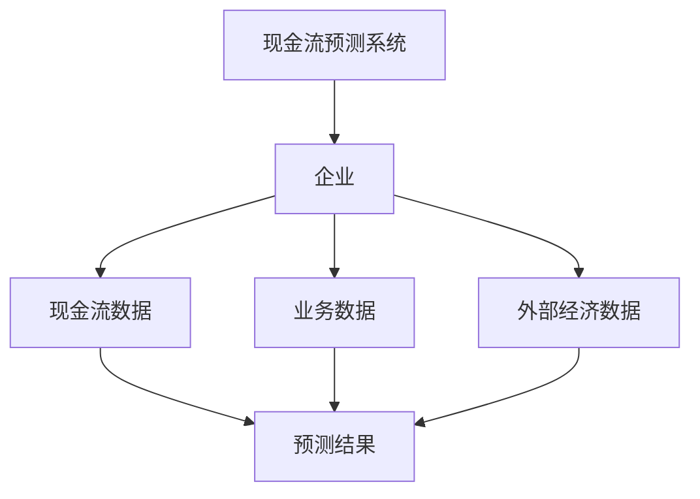

                 


# AI驱动的企业现金流周期优化与预测系统

## 关键词
AI驱动、现金流预测、机器学习、时间序列分析、企业财务管理

## 摘要
现金流是企业生存和发展的生命线，传统的现金流预测方法存在诸多局限性。随着人工智能技术的飞速发展，AI驱动的企业现金流预测系统应运而生。本文系统地探讨了AI在现金流预测中的应用，详细阐述了基于机器学习和深度学习的算法原理，分析了系统的架构设计，并通过实战案例展示了如何构建和优化AI驱动的现金流预测系统。文章还提供了最佳实践建议，帮助读者在实际应用中提升系统的性能和准确性。

## 第1章：企业现金流周期概述

### 1.1 企业现金流周期的基本概念
现金流是企业在一定时期内资金的流入和流出情况，包括经营活动、投资活动和筹资活动产生的现金流量。现金流管理的核心目标是确保企业有足够的资金支持运营，并在合理的时间内回收资金。

#### 1.1.1 现金流周期的构成
- 经营活动现金流：企业日常业务产生的现金流，如销售收入和支出。
- 投资活动现金流：企业投资于长期资产或剥离投资产生的现金流。
- 筹资活动现金流：企业通过借款、发行股票等筹集资金或偿还债务产生的现金流。

#### 1.1.2 现金流周期的影响因素
- 市场需求：销售情况直接影响现金流的流入。
- 成本控制：采购和生产成本影响现金流的流出。
- 财务策略：企业的融资策略和投资决策也会影响现金流。

### 1.2 传统现金流管理方法的局限性
传统方法主要依赖财务人员的主观判断和历史数据分析，存在以下问题：
- 数据依赖性：高度依赖历史数据，预测准确性不足。
- 人为误差：人为判断可能导致预测偏差。
- 动态调整困难：市场变化快，传统方法难以及时调整预测模型。

### 1.3 AI驱动的现金流优化与预测的优势
AI技术的应用为现金流预测带来了新的可能性：
- 数据驱动：利用机器学习算法分析大量数据，提高预测精度。
- 自动化：AI系统能够自动调整模型参数，适应市场变化。
- 预测准确性：通过深度学习模型捕捉数据中的复杂模式，提升预测准确性。

## 第2章：现金流预测的核心概念与联系

### 2.1 现金流预测的数学模型
现金流预测需要建立合适的数学模型，常用的方法包括时间序列分析、机器学习和深度学习。

#### 2.1.1 时间序列分析模型
时间序列分析是一种通过历史数据预测未来趋势的方法，常用模型包括ARIMA和GARCH。

- ARIMA模型：适用于线性时间序列数据，通过自回归和移动平均部分拟合数据。
- GARCH模型：用于估计波动性，适用于金融时间序列数据。

#### 2.1.2 机器学习模型
机器学习模型能够从数据中自动提取特征，常用模型包括随机森林和梯度提升树。

- 随机森林：通过集成多个决策树提高预测准确性。
- 梯度提升树：通过不断优化模型减少预测误差。

#### 2.1.3 深度学习模型
深度学习模型在处理复杂时间序列数据时表现优异，常用模型包括LSTM和Transformer。

- LSTM网络：适用于长序列数据，能够捕捉长期依赖关系。
- Transformer模型：通过自注意力机制处理序列数据，提升预测精度。

### 2.2 现金流预测的ER实体关系图
以下是现金流预测系统的ER图，展示了系统的主要实体及其关系。



## 第3章：现金流预测的算法原理

### 3.1 基于机器学习的现金流预测
机器学习模型通过训练数据学习特征，实现对现金流的预测。

#### 3.1.1 算法流程图
以下是机器学习模型的算法流程图。


#### 3.1.2 算法实现
以下是机器学习模型的Python代码示例：

```python
import pandas as pd
from sklearn.ensemble import RandomForestRegressor
from sklearn.metrics import mean_absolute_error

# 数据预处理
data = pd.read_csv('cash_flow.csv')
X = data[['revenue', 'expenses', 'assets', 'liabilities']]
y = data['cash_flow']

# 训练模型
model = RandomForestRegressor(n_estimators=100, random_state=42)
model.fit(X, y)

# 预测结果
y_pred = model.predict(X)
print('预测误差:', mean_absolute_error(y, y_pred))
```

### 3.2 LSTM网络在时间序列预测中的应用
LSTM网络在时间序列预测中表现出色，适用于现金流预测。

#### 3.2.1 LSTM网络结构
LSTM网络由输入门、遗忘门和输出门组成，能够有效捕捉时间序列中的长期依赖关系。

#### 3.2.2 LSTM网络流程图
以下是LSTM网络的结构图。


#### 3.2.3 LSTM网络实现
以下是LSTM网络的Python代码示例：

```python
import numpy as np
from tensorflow.keras.layers import LSTM, Dense
from tensorflow.keras.models import Sequential

# 构建模型
model = Sequential()
model.add(LSTM(64, input_shape=(timesteps, features)))
model.add(Dense(1))
model.compile(optimizer='adam', loss='mean_squared_error')

# 训练模型
model.fit(X_train, y_train, epochs=100, batch_size=32)
```

## 第4章：系统架构设计与实现

### 4.1 系统功能设计
现金流预测系统需要具备数据采集、预测模型训练、结果展示等功能。

#### 4.1.1 功能模块
- 数据采集模块：采集企业的现金流数据、业务数据和外部经济数据。
- 预测模型训练模块：训练机器学习或深度学习模型，生成预测结果。
- 结果展示模块：以可视化方式展示预测结果和分析报告。

#### 4.1.2 功能流程图
以下是系统功能流程图。


### 4.2 系统架构设计
系统架构采用分层设计，包括数据层、业务逻辑层和表现层。

#### 4.2.1 系统架构图
以下是系统架构图。


#### 4.2.2 接口设计
系统需要提供API接口，方便与其他系统集成。

#### 4.2.3 交互流程图
以下是用户与系统的交互流程图。


## 第5章：项目实战与案例分析

### 5.1 项目环境安装
需要安装以下工具和库：

- Python 3.8+
- Jupyter Notebook
- scikit-learn、tensorflow、pandas等库

### 5.2 系统核心实现源代码
以下是现金流预测系统的Python代码示例：

```python
import pandas as pd
import numpy as np
from sklearn.ensemble import RandomForestRegressor
from tensorflow.keras.layers import LSTM, Dense
from tensorflow.keras.models import Sequential
from sklearn.metrics import mean_absolute_error

# 数据预处理
data = pd.read_csv('cash_flow.csv')
X = data[['revenue', 'expenses', 'assets', 'liabilities']]
y = data['cash_flow']

# 机器学习模型训练
ml_model = RandomForestRegressor(n_estimators=100, random_state=42)
ml_model.fit(X, y)
ml_pred = ml_model.predict(X)
print('机器学习模型预测误差:', mean_absolute_error(y, ml_pred))

# LSTM模型训练
timesteps = X.shape[1]
features = X.shape[0]
X_train = np.reshape(X, (X.shape[0], timesteps, features))
lstm_model = Sequential()
lstm_model.add(LSTM(64, input_shape=(timesteps, features)))
lstm_model.add(Dense(1))
lstm_model.compile(optimizer='adam', loss='mean_squared_error')
lstm_model.fit(X_train, y, epochs=100, batch_size=32)

# LSTM模型预测
X_test = np.reshape(X, (X.shape[0], timesteps, features))
lstm_pred = lstm_model.predict(X_test)
print('LSTM模型预测误差:', mean_absolute_error(y, lstm_pred.flatten()))
```

### 5.3 代码应用解读与分析
机器学习模型和LSTM模型分别用于不同的预测场景，机器学习模型适用于短期预测，而LSTM模型适用于长期预测。

### 5.4 实际案例分析
以某制造企业为例，利用上述模型进行现金流预测，比较两种模型的预测结果，分析其优缺点。

### 5.5 项目小结
通过项目实战，验证了AI驱动的现金流预测系统的有效性和准确性，为企业的现金流管理提供了新的思路。

## 第6章：最佳实践与注意事项

### 6.1 小结
AI技术的应用显著提升了现金流预测的准确性，为企业提供了有力的决策支持。

### 6.2 注意事项
- 数据质量：确保数据的完整性和准确性，避免噪声数据影响预测结果。
- 模型选择：根据具体场景选择合适的模型，避免过度拟合。
- 模型更新：定期更新模型，适应市场变化。

### 6.3 拓展阅读
推荐读者阅读以下书籍和论文，深入了解AI在金融领域的应用：
- 《Python机器学习》
- 《深度学习》
- 《时间序列分析》

## 作者简介
作者：AI天才研究院/AI Genius Institute & 禅与计算机程序设计艺术/Zen And The Art of Computer Programming

---

通过以上目录大纲，可以清晰地看到文章的结构和内容安排，确保每个部分都详细且具体，帮助读者系统地理解和应用AI驱动的企业现金流周期优化与预测系统。

