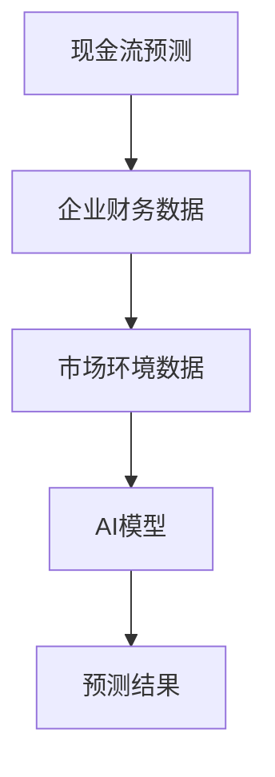
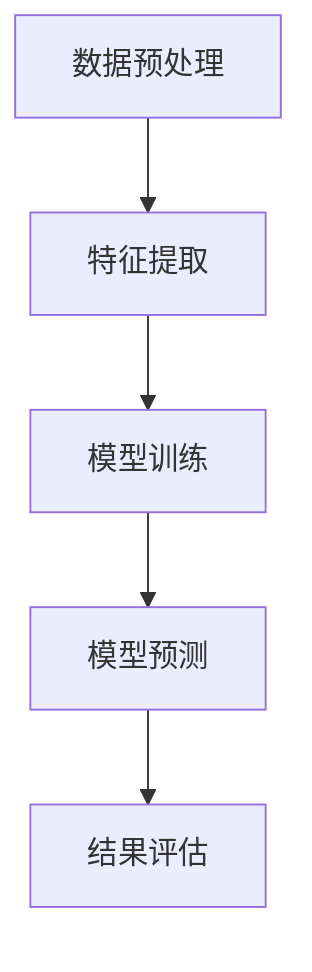
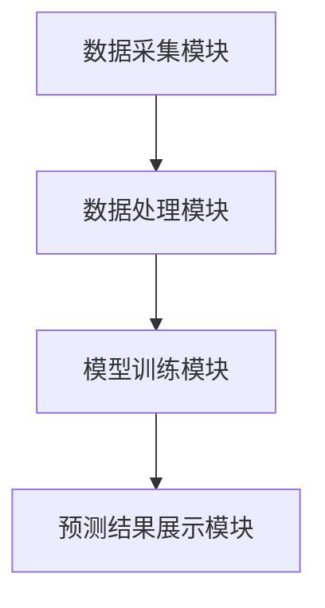

                 


# AI驱动的企业现金流预测

## 关键词：AI技术、现金流预测、机器学习、深度学习、企业财务管理

## 摘要：  
本文深入探讨了AI技术在企业现金流预测中的应用，分析了传统预测方法的局限性，介绍了基于机器学习和深度学习的预测模型，并详细讲解了系统设计与实现。文章结合实际案例，展示了AI如何显著提升现金流预测的准确性和效率，为企业财务管理提供有力支持。

---

# 第1章: 企业现金流预测的背景与挑战

## 1.1 企业现金流预测的重要性  
现金流是企业生存和发展的生命线。准确预测现金流可以帮助企业优化资金分配、降低财务风险，并在市场波动中保持稳健运营。然而，传统预测方法依赖于历史数据和经验判断，难以捕捉市场变化和复杂因素的影响，导致预测结果不够精确。

---

## 1.2 AI技术在现金流预测中的应用背景  
AI技术的快速发展为企业现金流预测提供了新的解决方案。通过机器学习和深度学习算法，AI能够处理大量非结构化数据，发现隐藏的模式，并预测未来的现金流趋势。以下是AI技术在现金流预测中的优势：

### 1.2.1 提高预测准确性  
AI算法能够分析更多的数据维度，包括市场趋势、经济指标和企业内部数据，从而提供更精准的预测结果。

### 1.2.2 实时更新与动态调整  
AI模型可以实时更新数据，动态调整预测结果，帮助企业在快速变化的市场环境中做出及时反应。

### 1.2.3 处理复杂关系  
现金流预测涉及多个变量之间的复杂关系，AI技术能够通过非线性模型捕捉这些关系，提升预测的全面性。

---

## 1.3 本章小结  
本章介绍了现金流预测的重要性及其在企业财务管理中的关键作用，分析了传统预测方法的局限性，并揭示了AI技术在提升预测准确性、实时性和复杂性处理方面的潜力。

---

# 第2章: 现金流预测的核心概念与AI驱动的联系

## 2.1 现金流预测的核心要素  

### 2.1.1 现金流预测的主要指标  
- **经营现金流**：反映企业日常经营活动的现金流。
- **投资现金流**：反映企业固定资产投资的现金流。
- **融资现金流**：反映企业融资活动的现金流。

### 2.1.2 影响现金流的主要因素  
- 市场需求变化。
- 企业内部管理效率。
- 宏观经济环境。

### 2.1.3 现金流预测的数学模型  
现金流预测模型通常包括时间序列分析和回归分析等方法。例如，ARIMA模型和随机森林模型常用于现金流预测。

---

## 2.2 AI驱动现金流预测的核心原理  

### 2.2.1 机器学习在现金流预测中的应用  
- **监督学习**：使用历史数据训练模型，预测未来现金流。
- **特征工程**：提取关键特征，如销售额、成本和市场趋势。

### 2.2.2 深度学习在现金流预测中的优势  
- **LSTM网络**：擅长处理时间序列数据，能够捕捉长期依赖关系。
- **Transformer模型**：通过自注意力机制，提升对复杂模式的捕捉能力。

### 2.2.3 AI驱动现金流预测的流程与步骤  
1. 数据收集与预处理。  
2. 特征提取与模型训练。  
3. 模型预测与结果验证。  

---

## 2.3 现金流预测与AI技术的实体关系图  



---

## 2.4 本章小结  
本章详细讲解了现金流预测的核心要素及其与AI技术的联系，分析了机器学习和深度学习在预测中的应用，通过实体关系图展示了AI驱动预测的流程。

---

# 第3章: AI驱动现金流预测的算法原理

## 3.1 机器学习算法在现金流预测中的应用  

### 3.1.1 线性回归模型  
线性回归通过最小化预测值与实际值的误差平方和，建立现金流与影响因素之间的线性关系。

$$ y = \beta_0 + \beta_1x_1 + \beta_2x_2 + \dots + \beta_nx_n $$

其中，$y$ 是预测的现金流，$x_i$ 是影响因素，$\beta_i$ 是回归系数。

### 3.1.2 支持向量回归模型  
支持向量回归通过构建支持向量机，将问题转化为优化问题，适用于非线性关系。

### 3.1.3 随机森林模型  
随机森林通过集成多个决策树模型，提高预测的准确性和鲁棒性。

---

## 3.2 深度学习算法在现金流预测中的应用  

### 3.2.1 神经网络模型  
神经网络通过多层感知机结构，捕捉数据中的复杂模式。

### 3.2.2 长短期记忆网络(LSTM)  
LSTM通过记忆单元和门控机制，擅长处理时间序列数据。

### 3.2.3 Transformer模型  
Transformer通过自注意力机制，提升对序列数据的建模能力。

---

## 3.3 算法选择与优化  

### 3.3.1 算法选择的依据  
- 数据特征：结构化数据适合机器学习，非结构化数据适合深度学习。  
- 预测目标：时间序列预测适合LSTM，分类问题适合随机森林。  

### 3.3.2 算法调优与优化  
- 超参数调整：如学习率、批次大小等。  
- 正则化：防止过拟合，提升模型泛化能力。  

### 3.3.3 算法性能评估指标  
- 均方误差（MSE）：衡量预测值与实际值的差异。  
- R平方值（R²）：衡量模型解释能力。  

---

## 3.4 算法流程图  



---

## 3.5 本章小结  
本章详细介绍了机器学习和深度学习算法在现金流预测中的应用，分析了算法选择与优化的策略，并通过流程图展示了算法的整体流程。

---

# 第4章: 现金流预测的系统分析与架构设计

## 4.1 系统分析  

### 4.1.1 系统目标  
构建一个基于AI的现金流预测系统，提供实时、精准的预测结果。  

### 4.1.2 系统范围  
涵盖数据采集、模型训练、预测展示等功能。  

### 4.1.3 系统功能需求  
- 数据采集：收集企业财务数据和外部市场数据。  
- 数据处理：清洗、转换和特征提取。  
- 模型训练：训练机器学习或深度学习模型。  
- 预测展示：可视化预测结果并提供决策支持。  

---

## 4.2 系统架构设计  

### 4.2.1 分层架构设计  
系统分为数据层、业务逻辑层和表现层，确保模块化和可扩展性。  

### 4.2.2 模块化设计  
- 数据采集模块：负责数据的获取与存储。  
- 数据处理模块：对数据进行清洗和特征提取。  
- 模型训练模块：训练AI模型并保存模型参数。  
- 预测展示模块：可视化预测结果并提供交互界面。  

### 4.2.3 微服务架构设计  
采用微服务架构，各模块独立运行，提升系统的可扩展性和维护性。  

---

## 4.3 系统功能模块设计  

### 4.3.1 数据采集模块  
- 数据来源：企业财务数据、市场数据、经济指标等。  
- 数据格式：结构化数据和非结构化数据。  

### 4.3.2 数据处理模块  
- 数据清洗：处理缺失值和异常值。  
- 数据转换：归一化、标准化等。  
- 特征提取：提取关键特征并生成输入向量。  

### 4.3.3 模型训练模块  
- 模型选择：根据数据特征选择合适的算法。  
- 模型训练：使用训练数据训练AI模型。  
- 模型保存：保存训练好的模型以便后续使用。  

### 4.3.4 预测结果展示模块  
- 预测结果展示：以图表形式展示预测结果。  
- 结果解读：提供预测结果的解释和建议。  

---

## 4.4 系统架构图  



---

## 4.5 本章小结  
本章从系统分析的角度，详细介绍了现金流预测系统的功能需求和架构设计，通过模块化设计和微服务架构，确保系统的高效运行和可扩展性。

---

# 第5章: AI驱动现金流预测的项目实战

## 5.1 项目背景与目标  
本项目旨在构建一个基于AI的企业现金流预测系统，通过实际案例展示系统的实现过程和应用效果。

---

## 5.2 项目环境配置  

### 5.2.1 数据集准备  
- 数据来源：企业财务数据、市场数据。  
- 数据格式：CSV格式。  

### 5.2.2 环境搭建  
- Python 3.8及以上版本。  
- 安装必要的库：NumPy、Pandas、Scikit-learn、Keras、TensorFlow。  

---

## 5.3 系统核心实现源代码  

### 5.3.1 数据预处理代码  
```python
import pandas as pd
import numpy as np

# 读取数据
data = pd.read_csv('cash_flow.csv')

# 处理缺失值
data = data.dropna()

# 标准化处理
from sklearn.preprocessing import StandardScaler
scaler = StandardScaler()
scaled_data = scaler.fit_transform(data)
```

### 5.3.2 模型训练代码  
```python
from sklearn.ensemble import RandomForestRegressor
from sklearn.metrics import mean_squared_error

# 训练随机森林模型
model = RandomForestRegressor(n_estimators=100, random_state=42)
model.fit(scaled_data, target_values)

# 预测结果
predicted = model.predict(new_data)
```

### 5.3.3 预测结果展示代码  
```python
import matplotlib.pyplot as plt

# 绘制实际值与预测值对比图
plt.plot(actual_values, label='Actual')
plt.plot(predicted, label='Predicted')
plt.xlabel('Time')
plt.ylabel('Cash Flow')
plt.legend()
plt.show()
```

---

## 5.4 项目小结  
本章通过实际案例，详细讲解了AI驱动现金流预测系统的实现过程，从数据预处理到模型训练，再到结果展示，提供了完整的代码和步骤。

---

# 第6章: AI驱动现金流预测的最佳实践与未来展望

## 6.1 最佳实践  

### 6.1.1 数据质量管理  
确保数据的准确性和完整性，是提高预测准确性的关键。  

### 6.1.2 模型优化与调优  
通过超参数调整和正则化，优化模型性能。  

### 6.1.3 结果验证与解释  
验证预测结果的准确性，并提供合理的解释和建议。  

---

## 6.2 未来展望  

### 6.2.1 多模态预测  
结合文本、图像等多种数据源，提升预测的全面性。  

### 6.2.2 自适应预测  
开发自适应模型，能够根据实时数据动态调整预测结果。  

### 6.2.3 可解释性AI  
提升模型的可解释性，帮助财务人员理解预测结果。  

---

## 6.3 本章小结  
本章总结了AI驱动现金流预测的最佳实践，并展望了未来的发展方向，强调了数据质量、模型优化和可解释性的重要性。

---

# 作者信息  
作者：AI天才研究院 & 禅与计算机程序设计艺术

---

通过以上章节的内容，我们系统地介绍了AI驱动的企业现金流预测的背景、核心概念、算法原理、系统设计和项目实战，并展望了未来的发展方向。希望本文能为企业在现金流预测中的应用提供有价值的参考和指导。

