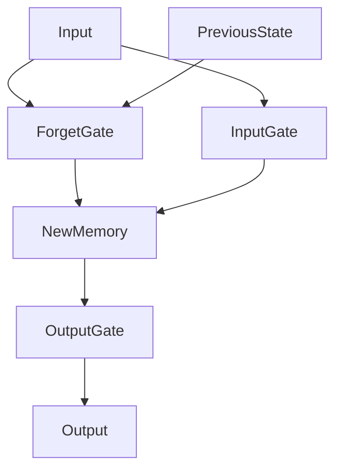
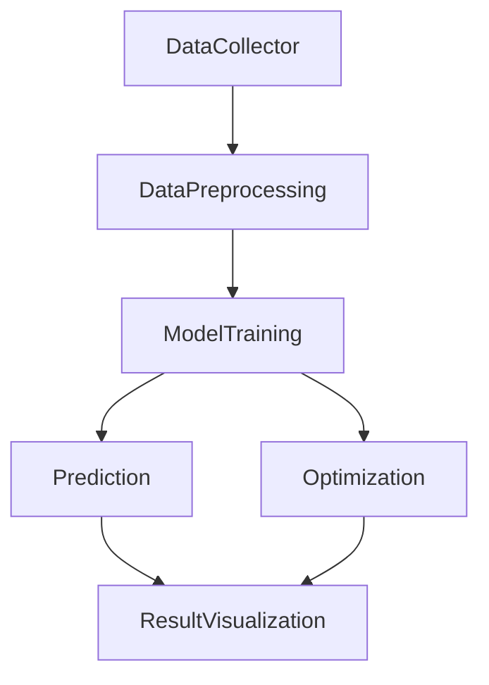
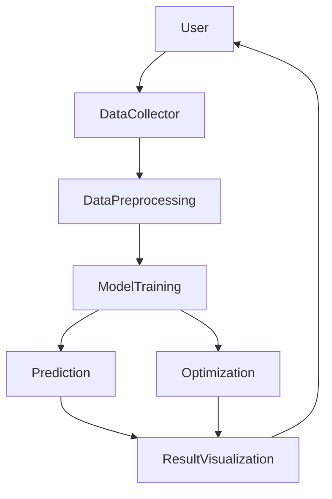

                 


# AI驱动的企业现金流预测与优化系统

## 关键词：现金流预测、AI技术、时间序列分析、机器学习、系统架构设计

## 摘要：本文详细探讨了如何利用AI技术构建企业现金流预测与优化系统。通过分析现金流预测的核心概念、AI算法的选择与优化，以及系统的整体架构设计，提出了一个基于时间序列分析和机器学习的解决方案。文章还结合实际案例，展示了如何通过代码实现和系统优化，提升现金流预测的准确性和实时性，为企业财务管理提供有力支持。

---

# 第1章: 企业现金流预测与优化的背景与重要性

## 1.1 企业现金流管理的重要性

### 1.1.1 现金流在企业运营中的核心地位
现金流是企业运营的核心命脉，直接关系到企业的生存与发展。现金流的稳定性与充足性是企业偿债能力、运营能力和盈利能力的重要指标。传统的现金流预测方法通常基于历史数据和简单线性模型，但在面对复杂多变的市场环境时，其预测精度和实时性往往难以满足企业的需求。

### 1.1.2 现金流预测与优化的必要性
现金流预测与优化是企业财务管理的重要组成部分。准确的现金流预测可以帮助企业合理安排资金使用，优化资金配置，降低财务风险。然而，传统方法在处理复杂数据和非线性关系时表现有限，尤其是在面对外部经济波动、市场需求变化等不确定性因素时，预测精度难以保证。

### 1.1.3 AI技术在现金流管理中的应用前景
随着AI技术的快速发展，其在金融领域的应用日益广泛。AI可以通过大数据分析和深度学习模型，捕捉数据中的复杂模式和隐含关系，显著提升现金流预测的精度和实时性。AI技术还可以结合企业的实际业务场景，提供个性化的现金流优化方案，帮助企业在复杂多变的市场环境中做出更明智的财务决策。

## 1.2 AI技术对企业现金流预测的推动作用

### 1.2.1 数据驱动的预测优势
AI技术的核心优势在于其强大的数据处理能力。通过对海量历史数据和实时数据的分析，AI可以发现传统方法难以察觉的模式和趋势，从而提高预测的准确性。例如，利用时间序列分析模型（如LSTM）可以有效捕捉现金流的时间依赖性，预测未来现金流的变化趋势。

### 1.2.2 AI算法在现金流预测中的独特价值
深度学习算法（如LSTM）在时间序列预测中表现出色，能够处理复杂的非线性关系。与传统的ARIMA模型相比，LSTM具有长期记忆能力，可以更好地捕捉现金流的长周期波动。此外，集成学习方法（如随机森林、梯度提升树）也可以通过组合多个模型的结果，进一步提高预测精度。

### 1.2.3 企业现金流优化的AI解决方案
AI不仅能够预测现金流，还可以通过优化算法（如线性规划、动态规划）为企业提供现金流管理的优化方案。例如，AI可以通过分析企业的资金需求和可用资金，制定最优的资金分配策略，最大化资金利用率，降低财务成本。

## 1.3 本章小结
本章介绍了企业现金流预测与优化的重要性，以及AI技术在其中的应用前景。AI技术通过大数据分析和深度学习算法，显著提升了现金流预测的精度和实时性，为企业财务管理提供了强有力的支持。

---

# 第2章: 现金流预测的核心概念与技术背景

## 2.1 现金流预测的关键要素

### 2.1.1 现金流的时间序列特性
现金流的时间序列特性是其预测的核心基础。时间序列数据具有自相关性，即当前时刻的值与过去时刻的值存在相关关系。此外，时间序列数据还可能表现出趋势性、周期性和随机性等特征。

### 2.1.2 影响现金流的主要因素
影响企业现金流的主要因素包括：
- **内部因素**：企业的销售收入、成本结构、资金管理策略等。
- **外部因素**：宏观经济环境、行业竞争状况、政策法规变化等。
- **偶然因素**：突发事件（如疫情、自然灾害）对企业现金流的影响。

### 2.1.3 现金流预测的边界与外延
现金流预测的边界在于数据的完整性和模型的适用性。在实际应用中，需要明确预测的范围、时间窗口和预测精度。同时，现金流预测的外延还包括对预测结果的解释和应用，如制定资金分配策略、优化资本预算等。

## 2.2 现金流预测的核心概念体系

### 2.2.1 数据特征分析
数据特征分析是现金流预测的基础。通过对历史现金流数据的分析，可以提取出以下关键特征：
- **时间特征**：如星期、月份、季度等周期性特征。
- **数值特征**：如均值、方差、趋势等统计特征。
- **外部特征**：如宏观经济指标、行业指数等。

### 2.2.2 模型选择与评估指标
模型选择是现金流预测的关键步骤。常见的模型包括：
- **时间序列模型**：如ARIMA、GARCH等。
- **机器学习模型**：如随机森林、XGBoost、LSTM等。

评估指标包括：
- **均方误差（MSE）**：衡量预测值与实际值的差异。
- **平均绝对误差（MAE）**：衡量预测值与实际值的绝对差异。
- **R²系数**：衡量模型的拟合优度。

### 2.2.3 现金流预测的数学模型
现金流预测的数学模型可以分为两类：
1. **传统时间序列模型**：如ARIMA模型，其基本形式为：
   $$ ARIMA(p, d, q) $$
   其中，p为自回归阶数，d为差分阶数，q为移动平均阶数。
2. **深度学习模型**：如LSTM网络，其通过细胞状态和门控机制捕捉时间序列的长距离依赖关系。

## 2.3 现金流预测的ER实体关系图

```mermaid
erDiagram
    customer[CashFlowData] {
        <field> date : Date
        <field> amount : Float
        <field> source : String
    }
    transaction[PredictModel] {
        <field> modelType : String
        <field> accuracy : Float
        <field> trainingData : String
    }
    CashFlowData ||--> PredictModel : "使用模型预测"
    PredictModel --> Result[Result] {
        <field> predictedAmount : Float
        <field> confidence : Float
    }
    Result <---> EnterpriseSystem[EnterpriseSystem] : "反馈优化"
```

---

# 第3章: 现金流预测的AI算法实现

## 3.1 时间序列分析的算法选择

### 3.1.1 LSTM网络的原理与优势
LSTM（长短期记忆网络）是一种特殊的RNN（循环神经网络），通过引入记忆单元和门控机制，可以有效解决传统RNN的梯度消失问题。LSTM网络适合处理长序列数据，能够捕捉时间序列中的长距离依赖关系。

### 3.1.2 LSTM网络的结构
LSTM网络由记忆单元、输入门、遗忘门和输出门组成。其基本结构如下：



### 3.1.3 LSTM网络的数学模型
LSTM的数学模型包括以下三个门控机制：
1. **遗忘门**：
   $$ f_t = \sigma(W_f x_t + U_f h_{t-1} + b_f) $$
2. **输入门**：
   $$ i_t = \sigma(W_i x_t + U_i h_{t-1} + b_i) $$
3. **输出门**：
   $$ o_t = \sigma(W_o x_t + U_o h_{t-1} + b_o) $$

记忆单元的更新公式为：
$$ m_t = f_t \cdot m_{t-1} + i_t \cdot tanh(W_c x_t + U_c h_{t-1} + b_c) $$

最终输出为：
$$ h_t = o_t \cdot tanh(m_t) $$

---

## 3.2 基于LSTM的现金流预测实现

### 3.2.1 数据预处理
数据预处理是现金流预测的关键步骤，包括：
1. 数据清洗：处理缺失值、异常值。
2. 数据归一化：将数据标准化到0-1范围，便于模型训练。
3. 数据分割：将数据分为训练集、验证集和测试集。

### 3.2.2 模型训练
模型训练包括以下步骤：
1. **定义损失函数**：通常使用均方误差（MSE）作为损失函数。
   $$ L = \frac{1}{n}\sum_{i=1}^{n}(y_i - \hat{y}_i)^2 $$
2. **选择优化器**：如Adam优化器。
3. **训练模型**：通过反向传播算法更新模型参数，最小化损失函数。

### 3.2.3 模型评估
模型评估包括以下步骤：
1. **计算预测值**：使用训练好的模型对测试集进行预测。
2. **评估指标计算**：
   - 均方误差（MSE）：
     $$ MSE = \frac{1}{n}\sum_{i=1}^{n}(y_i - \hat{y}_i)^2 $$
   - 平均绝对误差（MAE）：
     $$ MAE = \frac{1}{n}\sum_{i=1}^{n}|y_i - \hat{y}_i| $$
   - R²系数：
     $$ R² = 1 - \frac{\sum_{i=1}^{n}(y_i - \hat{y}_i)^2}{\sum_{i=1}^{n}(y_i - \bar{y})^2} $$

---

## 3.3 模型优化与调参

### 3.3.1 超参数调整
超参数调整是提高模型性能的重要步骤，包括：
1. **学习率**：调整学习率，找到最优的学习步长。
2. **网络结构**：调整LSTM的层数、每层的神经元数量等。
3. **正则化参数**：如L2正则化系数，防止模型过拟合。

### 3.3.2 模型评估与选择
通过交叉验证和网格搜索，选择最优的模型参数组合。同时，可以通过留出法评估模型的泛化能力。

### 3.3.3 模型优化策略
1. **早停法**：在验证集上监控损失函数的变化，防止过拟合。
2. **学习率调度器**：动态调整学习率，加速收敛。

---

## 3.4 本章小结
本章详细探讨了基于LSTM的时间序列预测模型，并结合现金流预测的具体场景，介绍了模型的实现过程和优化策略。通过合理的数据预处理和模型调参，可以显著提高现金流预测的精度和稳定性。

---

# 第4章: 现金流预测系统的架构设计与实现

## 4.1 系统架构设计

### 4.1.1 系统功能模块
现金流预测系统的功能模块包括：
1. **数据采集模块**：从企业财务系统中获取现金流数据。
2. **数据预处理模块**：清洗和归一化数据。
3. **模型训练模块**：训练现金流预测模型。
4. **预测与优化模块**：生成预测结果并提供优化建议。
5. **结果展示模块**：以可视化的方式展示预测结果和优化方案。

### 4.1.2 系统架构图



### 4.1.3 接口设计
系统需要设计以下接口：
1. **数据接口**：与企业财务系统的接口，获取现金流数据。
2. **模型接口**：与其他系统的接口，提供预测结果和优化建议。
3. **用户界面**：供用户查看预测结果和优化方案的界面。

---

## 4.2 系统实现

### 4.2.1 环境配置
现金流预测系统的实现需要以下环境：
1. **编程语言**：Python
2. **深度学习框架**：TensorFlow或Keras
3. **数据处理库**：Pandas、NumPy
4. **可视化工具**：Matplotlib、Seaborn

### 4.2.2 核心代码实现

#### LSTM模型实现

```python
import numpy as np
from tensorflow.keras import layers

def build_lstm_model(input_shape):
    model = layers.Sequential()
    model.add(layers.LSTM(50, input_shape=input_shape, return_sequences=True))
    model.add(layers.LSTM(50, return_sequences=False))
    model.add(layers.Dense(1))
    return model
```

#### 数据预处理

```python
def preprocess_data(data):
    # 归一化数据
    data_normalized = (data - data.min()) / (data.max() - data.min())
    # 划分训练集和测试集
    train_size = int(len(data) * 0.8)
    train_data = data_normalized[:train_size]
    test_data = data_normalized[train_size:]
    return train_data, test_data
```

### 4.2.3 系统交互流程



---

## 4.3 本章小结
本章详细介绍了现金流预测系统的架构设计与实现过程，包括系统的功能模块、接口设计和核心代码实现。通过合理的系统设计，可以提高现金流预测的效率和准确性，为企业提供有力的支持。

---

# 第5章: 现金流预测系统的优化与展望

## 5.1 系统优化策略

### 5.1.1 数据优化
1. **数据质量提升**：通过清洗和特征工程，提高数据的准确性和完整性。
2. **数据量扩展**：引入外部数据源（如宏观经济指标、行业数据）丰富预测模型的输入特征。

### 5.1.2 模型优化
1. **模型集成**：通过集成学习方法（如投票法、加权法）结合多个模型的结果，提高预测精度。
2. **模型解释性增强**：使用可解释性模型（如SHAP值）分析预测结果，帮助用户理解模型的决策过程。

### 5.1.3 系统性能优化
1. **计算资源优化**：通过分布式计算和并行计算，提高系统的运行效率。
2. **模型部署优化**：通过容器化技术（如Docker）和云部署，提高系统的可扩展性和可维护性。

## 5.2 未来研究方向

### 5.2.1 新型算法研究
探索更先进的AI算法（如Transformer、图神经网络）在现金流预测中的应用。

### 5.2.2 多模态数据融合
结合文本数据、图像数据等多种数据源，构建更全面的现金流预测模型。

### 5.2.3 实时预测与反馈优化
研究实时预测技术，结合实时反馈优化现金流管理策略。

## 5.3 本章小结
本章探讨了现金流预测系统的优化策略和未来研究方向。通过数据优化、模型优化和系统性能优化，可以进一步提升现金流预测的精度和效率。未来，随着AI技术的不断发展，现金流预测系统将变得更加智能化和高效化。

---

# 第6章: 总结与展望

## 6.1 总结
本文详细探讨了AI驱动的企业现金流预测与优化系统的实现过程，包括现金流预测的核心概念、AI算法的选择与优化、系统的架构设计与实现等。通过理论分析和实践案例，展示了AI技术在现金流预测中的巨大潜力和应用价值。

## 6.2 展望
未来，随着AI技术的不断进步，现金流预测系统将朝着更智能、更实时、更个性化的方向发展。企业可以通过引入更先进的AI算法和大数据技术，进一步提升现金流预测的精度和效率，为企业财务管理提供更有力的支持。

---

# 作者：AI天才研究院/AI Genius Institute & 禅与计算机程序设计艺术 /Zen And The Art of Computer Programming

---

以上是《AI驱动的企业现金流预测与优化系统》的完整目录大纲和文章内容。通过分章节的详细讲解，文章系统地介绍了现金流预测的核心概念、AI算法的实现、系统的架构设计以及优化策略，为企业应用AI技术优化现金流管理提供了理论和实践的双重支持。

