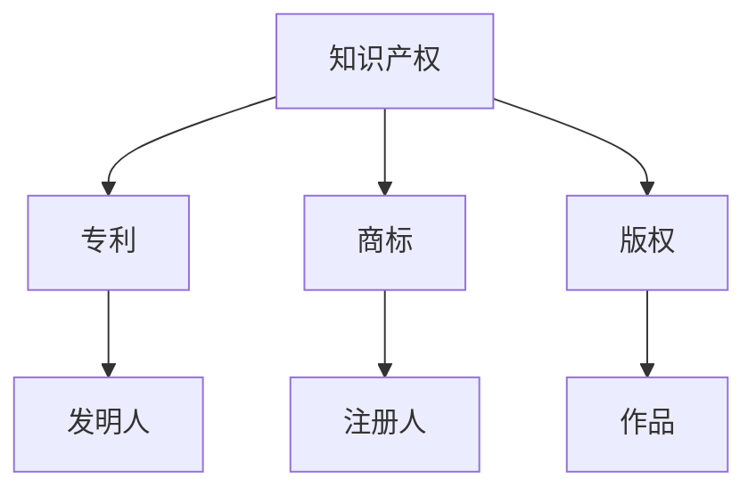
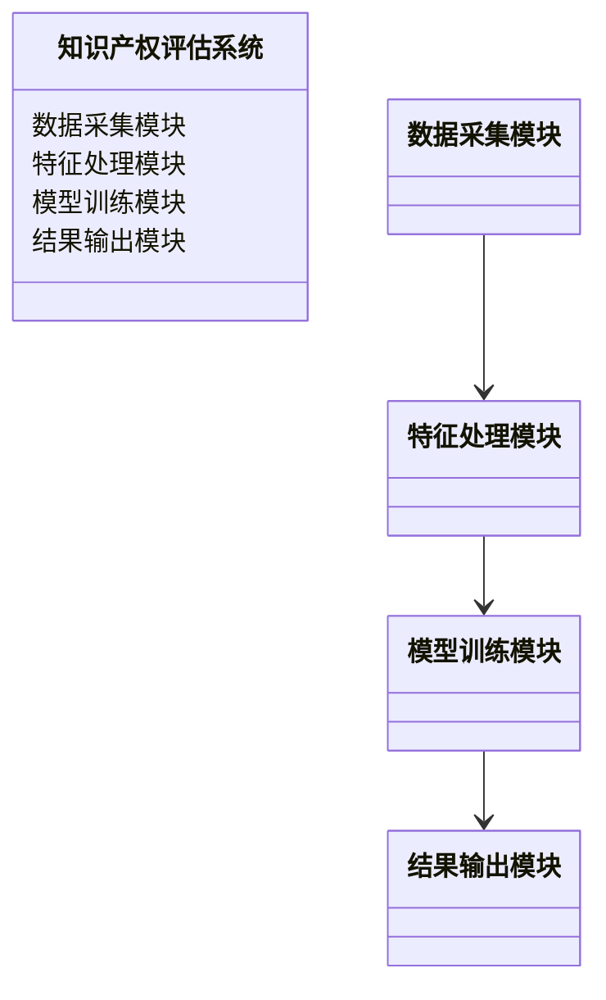
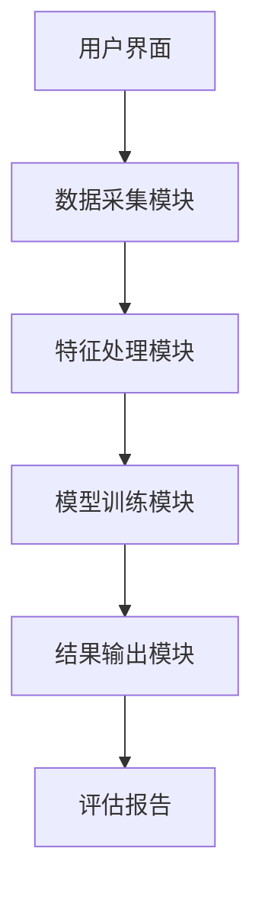
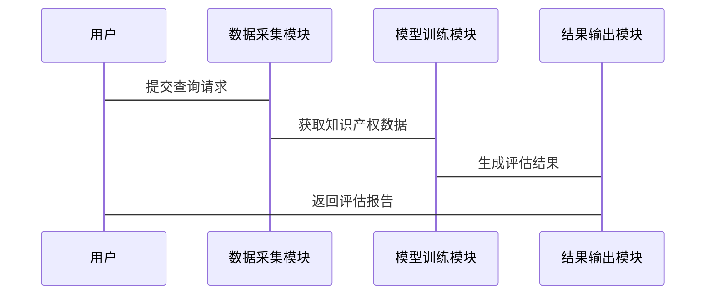

                 


# AI驱动的企业知识产权价值评估系统

> 关键词：人工智能、知识产权、价值评估、机器学习、大数据分析、企业决策

> 摘要：  
本文详细探讨了AI驱动的企业知识产权价值评估系统的构建与应用。通过结合知识产权的基本概念、AI技术的优势以及实际应用场景，系统地分析了如何利用人工智能技术实现知识产权的高效评估。文章从背景介绍、核心概念、算法原理、系统架构到项目实战，全面阐述了AI在知识产权评估中的潜力与实践价值，为企业的知识产权管理和决策提供了新的思路和方法。

---

# 第一部分: AI驱动的企业知识产权价值评估系统概述

# 第1章: 企业知识产权价值评估的背景与挑战

## 1.1 知识产权的基本概念

### 1.1.1 知识产权的定义与范围  
知识产权（Intellectual Property, IP）是指人们通过智力劳动创造的成果，包括专利、商标、版权、商业秘密等。知识产权的核心价值在于其法律保护和经济收益，是企业创新和竞争力的重要来源。

### 1.1.2 知识产权的分类与特点  
知识产权可以分为以下几类：  
1. **专利**：保护发明的独占权。  
2. **商标**：用于区分商品或服务的标识。  
3. **版权**：保护文学、艺术和科学作品的原创性。  
4. **商业秘密**：未公开的商业信息和技术诀窍。  

### 1.1.3 知识产权在企业中的重要性  
知识产权不仅是企业技术创新的核心，也是市场竞争的重要武器。通过知识产权，企业可以保护自身的技术成果，防止他人侵权，同时通过授权或转让实现经济价值。

---

## 1.2 企业知识产权价值评估的必要性

### 1.2.1 知识产权的价值来源  
知识产权的价值来源于其法律保护、市场应用前景和技术领先性。例如，一项高技术壁垒的专利可能为企业带来巨大的市场优势。

### 1.2.2 知识产权评估在企业决策中的作用  
知识产权评估是企业并购、技术合作、诉讼维权等决策的重要依据。例如，在企业并购中，知识产权的价值评估可以帮助确定合理的交易价格。

### 1.2.3 当前知识产权评估的主要挑战  
1. **数据复杂性**：知识产权数据涉及法律、技术、市场等多个维度，数据获取和处理难度大。  
2. **评估方法单一**：传统评估方法主要依赖人工分析，效率低且主观性强。  
3. **技术更新快**：技术的快速迭代要求知识产权评估方法不断更新，以适应新的市场需求。

---

## 1.3 AI驱动评估的优势与潜力

### 1.3.1 AI技术在知识产权评估中的应用前景  
AI技术可以通过自然语言处理（NLP）、机器学习等方法，从海量知识产权数据中提取有价值的信息，帮助评估其潜在价值。

### 1.3.2 数据驱动的知识产权评估方法  
通过大数据分析和机器学习，可以实现知识产权的自动评估，提高评估的准确性和效率。例如，利用文本挖掘技术分析专利文献，提取技术关键词，评估技术的创新性和市场前景。

### 1.3.3 人工智能在知识产权分析中的创新点  
AI技术可以实时监控知识产权动态，识别潜在的侵权风险，并提供智能化的保护建议。例如，通过AI模型预测专利的失效时间和技术生命周期。

---

## 1.4 本章小结  
本章介绍了知识产权的基本概念及其在企业中的重要性，分析了传统知识产权评估的局限性，并提出了AI驱动评估的优势与潜力。AI技术的应用为知识产权评估提供了新的思路和方法，为企业的知识产权管理和决策提供了有力支持。

---

# 第2章: AI驱动知识产权价值评估的核心概念与联系

## 2.1 知识产权评估的理论基础

### 2.1.1 知识产权评估的主要方法  
1. **法律分析法**：通过法律条文和案例分析，评估知识产权的法律保护力度。  
2. **经济评估法**：从市场角度评估知识产权的经济价值。  
3. **技术评估法**：通过技术指标评估知识产权的技术先进性和创新性。  

### 2.1.2 数据驱动的知识产权评估模型  
数据驱动的评估模型结合了法律、技术和市场数据，通过机器学习算法预测知识产权的价值。

### 2.1.3 AI技术在知识产权评估中的应用框架  
1. 数据采集与清洗：获取专利、商标等知识产权数据，并进行预处理。  
2. 特征提取：通过NLP技术提取文本特征，如关键词、语义相似度等。  
3. 模型训练：利用机器学习算法训练评估模型，预测知识产权的价值。  
4. 结果输出：生成评估报告，提供决策支持。

---

## 2.2 知识产权评估的核心要素

### 2.2.1 知识产权的法律属性  
法律属性包括专利的保护期限、权利范围等，是评估知识产权法律风险的重要依据。

### 2.2.2 知识产权的经济价值  
经济价值主要体现在市场竞争力和盈利能力上。例如，高价值的专利可以带来更高的市场份额和利润。

### 2.2.3 知识产权的技术特征  
技术特征包括技术领域、技术复杂度、技术新颖性等，是评估知识产权技术价值的关键因素。

---

## 2.3 AI驱动评估系统的原理

### 2.3.1 数据采集与预处理  
通过爬虫技术获取专利数据库中的数据，并进行清洗和标注。例如，清洗无效专利数据，标注专利的技术领域和关键词。

### 2.3.2 模型训练与优化  
利用机器学习算法（如随机森林、神经网络）训练评估模型，并通过交叉验证优化模型性能。

### 2.3.3 结果输出与解释  
模型输出知识产权的评估得分，并提供可解释的分析结果，如技术关键词和相似专利案例。

---

## 2.4 核心概念对比分析

### 2.4.1 知识产权类型对比表  
| 知识产权类型 | 保护对象 | 保护期限 | 主要用途 |
|--------------|----------|----------|----------|
| 专利          | 技术发明 | 20年     | 技术保护 |
| 商标          | 商标标识 | 10年     | 品牌保护 |
| 版权          | 文学作品 | 50年     | 作品保护 |

### 2.4.2 不同评估方法的优劣势对比  
| 评估方法 | 优势             | 劣势             |
|----------|------------------|------------------|
| 法律分析法 | 准确性高         | 主观性强，效率低 |
| 经济评估法 | 结果直观         | 数据获取难，复杂性高 |
| 技术评估法 | 结果精准         | 需专业技术人员支持 |

### 2.4.3 AI模型性能的评估指标  
| 指标         | 定义             | 示例值           |
|--------------|------------------|------------------|
| 准确率         | 正确预测的比例     | 90%              |
| 召回率         | 正确预测的正例比例   | 85%              |
| F1分数         | 准确率和召回率的调和平均 | 0.85            |

---

## 2.5 实体关系图（ER图）



---

## 2.6 本章小结  
本章详细介绍了知识产权评估的核心概念与联系，通过对比分析和ER图展示了知识产权的分类与关系，为后续的AI驱动评估系统设计奠定了理论基础。

---

# 第3章: AI驱动知识产权价值评估的算法原理

## 3.1 知识产权数据的特征提取

### 3.1.1 文本数据的特征提取  
通过NLP技术从专利文献中提取关键词和语义信息。例如，使用TF-IDF（词频-逆文档频率）算法提取专利文本中的重要关键词。

### 3.1.2 专利数据的特征提取  
提取专利的申请日期、申请人、技术领域、引用次数等特征。例如，技术领域的分类可以通过专利分类号（IPC）实现。

---

## 3.2 评估模型的构建与训练

### 3.2.1 算法选择与实现  
选择随机森林算法进行分类任务，预测专利的高价值性和技术先进性。以下是随机森林算法的伪代码示例：

```python
def random_forest_classifier(X_train, y_train, X_test):
    # 训练随机森林模型
    from sklearn.ensemble import RandomForestClassifier
    model = RandomForestClassifier(n_estimators=100, random_state=42)
    model.fit(X_train, y_train)
    
    # 预测测试数据
    y_pred = model.predict(X_test)
    return y_pred
```

### 3.2.2 数学模型与公式  
评估模型的输出可以表示为一个加权评分系统。例如，专利的综合评分公式如下：

$$
\text{评分} = \alpha \cdot \text{技术得分} + \beta \cdot \text{法律得分} + \gamma \cdot \text{市场得分}
$$

其中，$\alpha + \beta + \gamma = 1$，且$\alpha, \beta, \gamma > 0$。

---

## 3.3 系统输出与结果解释

### 3.3.1 模型输出结果  
模型输出知识产权的评估得分，例如，专利的高价值性评分和潜在风险评估。

### 3.3.2 结果的可视化与解读  
通过可视化工具展示知识产权的评估结果，例如，使用柱状图展示不同技术领域的专利评分分布。

---

## 3.4 本章小结  
本章详细介绍了AI驱动知识产权价值评估的算法原理，包括数据特征提取、模型构建与训练以及结果输出与解释。通过具体的算法实现和数学公式，展示了如何利用AI技术实现知识产权的高效评估。

---

# 第4章: 系统分析与架构设计

## 4.1 问题场景介绍  
企业需要对大量专利数据进行评估，以确定其技术价值和市场潜力。传统方法依赖人工分析，效率低且成本高。因此，构建一个AI驱动的知识产权价值评估系统显得尤为重要。

---

## 4.2 系统功能设计

### 4.2.1 领域模型  
以下是知识产权评估系统的领域模型：



---

## 4.3 系统架构设计



---

## 4.4 系统接口设计  
系统接口包括数据接口和用户接口。数据接口用于与专利数据库对接，获取知识产权数据；用户接口提供友好的操作界面，方便用户输入查询和查看结果。

---

## 4.5 系统交互流程



---

## 4.6 本章小结  
本章从问题场景出发，详细设计了AI驱动知识产权价值评估系统的功能模块、架构和交互流程，为系统的实现提供了清晰的指导。

---

# 第5章: 项目实战

## 5.1 环境搭建与数据准备

### 5.1.1 环境安装  
安装必要的Python库，例如：scikit-learn、pandas、numpy、requests。

### 5.1.2 数据准备  
获取专利数据集，例如，从专利数据库中爬取公开的专利数据，并进行清洗和标注。

---

## 5.2 系统核心实现

### 5.2.1 数据采集模块实现  
使用Python的requests库和BeautifulSoup库爬取专利数据。

```python
import requests
from bs4 import BeautifulSoup

def fetch_patent_data(url):
    response = requests.get(url)
    soup = BeautifulSoup(response.text, 'html.parser')
    data = []
    for item in soup.find_all('div', class_='patent-item'):
        title = item.find('h3').text
        date = item.find('span', class_='date').text
        data.append({'title': title, 'date': date})
    return data
```

### 5.2.2 模型训练与优化  
训练随机森林模型，评估专利的高价值性。

```python
from sklearn.ensemble import RandomForestClassifier
from sklearn.metrics import accuracy_score

def train_model(X_train, y_train, X_test, y_test):
    model = RandomForestClassifier(n_estimators=100, random_state=42)
    model.fit(X_train, y_train)
    y_pred = model.predict(X_test)
    accuracy = accuracy_score(y_test, y_pred)
    return accuracy
```

---

## 5.3 代码应用解读与分析  
通过代码实现数据采集、特征提取和模型训练，展示AI驱动知识产权评估系统的实际应用。

---

## 5.4 实际案例分析  
以具体专利为例，展示系统如何评估其技术价值和市场潜力。

---

## 5.5 项目小结  
本章通过实际案例展示了AI驱动知识产权价值评估系统的实现过程，从数据采集到模型训练，再到结果输出，详细解读了系统的应用与价值。

---

# 第6章: 最佳实践与总结

## 6.1 最佳实践

### 6.1.1 数据质量管理  
确保数据的准确性和完整性，避免因数据问题影响评估结果。

### 6.1.2 模型优化与更新  
定期更新模型，引入新的数据和知识，保持模型的准确性和适用性。

### 6.1.3 数据隐私与安全  
在处理知识产权数据时，注意数据隐私和安全，遵守相关法律法规。

---

## 6.2 小结与展望  
AI驱动的企业知识产权价值评估系统通过结合大数据和人工智能技术，显著提高了知识产权评估的效率和准确性。未来，随着技术的进步，AI在知识产权评估中的应用将更加广泛和深入。

---

## 6.3 注意事项  
在实际应用中，需注意知识产权的法律风险和技术壁垒，确保评估结果的合法性和可靠性。

---

## 6.4 拓展阅读  
推荐相关书籍和论文，帮助读者深入了解AI在知识产权评估中的应用。

---

# 作者：AI天才研究院/AI Genius Institute & 禅与计算机程序设计艺术 /Zen And The Art of Computer Programming

