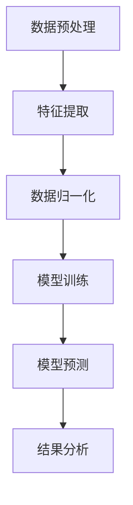
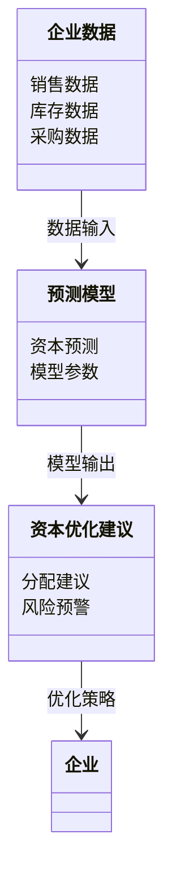
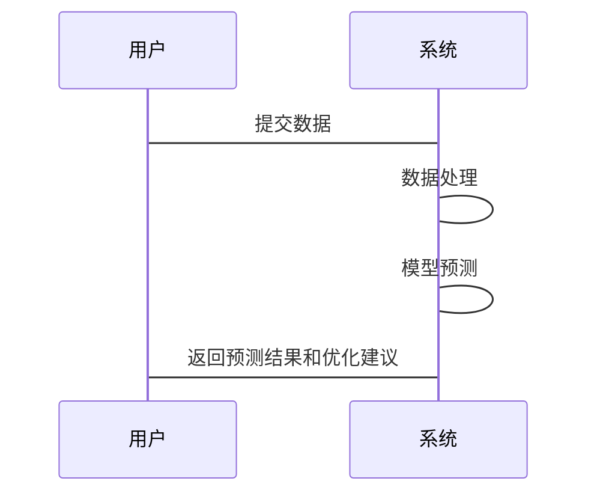

                 


# AI驱动的企业营运资本优化模型

> 关键词：AI驱动、企业营运资本、优化模型、数据分析、人工智能技术

> 摘要：本文将深入探讨AI驱动的企业营运资本优化模型，从背景、核心概念、算法原理到系统架构设计，逐步分析如何利用人工智能技术提升企业资本管理效率和准确性。通过实际案例分析和代码实现，帮助读者全面理解并掌握这一创新的资本优化方法。

---

# 第一部分：AI驱动的企业营运资本优化模型背景介绍

## 第1章：AI驱动的企业营运资本优化模型背景概述

### 1.1 问题背景

#### 1.1.1 企业营运资本管理的重要性
企业营运资本是维持日常运营所需的资金，包括库存、应收账款、应付账款和现金等。有效的营运资本管理能够提高资金周转效率，降低财务风险，为企业创造更大的价值。

#### 1.1.2 当前营运资本管理中的挑战
传统的营运资本管理依赖于财务人员的经验和手工操作，存在效率低、准确性差、难以实时调整等问题。随着市场竞争的加剧，企业需要更加精准和动态的资本管理策略。

#### 1.1.3 AI技术在资本优化中的应用潜力
人工智能技术能够通过大数据分析和机器学习算法，快速识别数据中的模式和趋势，为企业提供实时的资本预测和优化建议，显著提升资本管理的效率和准确性。

### 1.2 问题描述

#### 1.2.1 营运资本管理的核心问题
营运资本管理的核心问题是如何在保证业务运营的同时，最小化资本占用，最大化资金的流动性。传统方法难以应对市场变化和企业内部需求的动态调整。

#### 1.2.2 数据驱动的资本优化需求
企业拥有大量的历史数据，包括销售、库存、采购和财务数据。通过分析这些数据，可以发现潜在的优化机会，但需要高效的数据处理和分析方法。

#### 1.2.3 AI技术如何解决传统资本优化的痛点
AI技术能够快速处理海量数据，建立预测模型，实时监控资本变动，并根据市场变化自动调整资本分配策略，显著提高资本管理的效率和准确性。

### 1.3 问题解决

#### 1.3.1 AI驱动的资本优化方法
AI驱动的资本优化方法包括数据预处理、特征工程、模型训练和部署等步骤。通过机器学习算法，企业可以预测未来的资本需求，并制定最优的资本分配策略。

#### 1.3.2 数据驱动的资本预测与调整策略
通过分析历史数据，建立预测模型，企业可以提前预见到未来的需求变化，并相应调整资本分配，避免资金链断裂或过度占用资金。

#### 1.3.3 智能化资本管理系统的构建
智能化资本管理系统结合AI技术，能够实时监控资本变动，提供预测和建议，并根据企业的实际需求动态调整资本分配策略。

### 1.4 边界与外延

#### 1.4.1 模型的适用范围
AI驱动的资本优化模型适用于各种类型的企业，尤其是数据量大、业务复杂的企业。模型能够处理销售、采购、库存等数据，提供资本预测和优化建议。

#### 1.4.2 模型的局限性与限制条件
模型的准确性依赖于数据的质量和数量，数据不足或数据偏差可能会影响预测结果。此外，模型的运行需要大量的计算资源，可能不适合小型企业。

#### 1.4.3 相关概念的扩展与延伸
AI技术在资本管理中的应用不仅限于营运资本，还包括投资决策、风险管理等领域。未来，随着技术的发展，AI在资本管理中的应用将更加广泛和深入。

### 1.5 概念结构与核心要素组成

#### 1.5.1 模型的基本框架
AI驱动的资本优化模型包括数据输入、特征提取、模型训练、预测和优化建议等部分。模型能够根据输入的数据，输出资本预测和优化策略。

#### 1.5.2 核心要素的定义与关系
核心要素包括企业数据、机器学习算法、资本预测模型和优化建议。数据是模型的基础，算法是模型的核心，预测模型是数据与算法的结合，优化建议是模型的应用。

#### 1.5.3 模型的输入与输出
输入包括企业的历史销售数据、库存数据、采购数据和财务数据等。输出包括未来资本需求预测、资本分配建议和风险预警等。

---

# 第二部分：AI驱动的企业营运资本优化模型核心概念与联系

## 第2章：AI驱动的企业营运资本优化模型核心概念原理

### 2.1 核心概念的原理

#### 2.1.1 AI技术在资本优化中的应用原理
AI技术通过机器学习算法，从企业的历史数据中学习，建立预测模型，实时监控资本变动，并根据市场变化和企业需求自动调整资本分配策略。

#### 2.1.2 数据驱动的资本预测模型
数据驱动的资本预测模型利用统计和机器学习方法，分析企业的历史数据，预测未来的资本需求，帮助企业制定资本分配计划。

#### 2.1.3 智能化资本调整策略
智能化资本调整策略基于实时数据和模型预测，动态调整资本分配，优化资金使用效率，降低财务风险。

### 2.2 核心概念属性特征对比表格

| 特性               | 传统资本优化方法 | AI驱动的资本优化方法 |
|--------------------|-------------------|-----------------------|
| 数据依赖性         | 较低             | 高                   |
| 计算效率           | 低               | 高                   |
| 预测准确性         | 一般             | 高                   |
| 调整实时性         | 低               | 高                   |
| 技术复杂性         | 低               | 高                   |

### 2.3 ER实体关系图架构的Mermaid流程图

```mermaid
er
  entity 企业数据 {
    key 销售数据
    key 库存数据
    key 采购数据
  }

  entity 预测模型 {
    key 资本预测
    key 模型参数
  }

  entity 资本优化建议 {
    key 分配建议
    key 风险预警
  }

  relation 资金管理流程 {
    企业数据 --> 预测模型: 数据输入
    预测模型 --> 资本优化建议: 模型输出
    资本优化建议 --> 企业: 优化策略
  }
```

---

## 第3章：AI驱动的企业营运资本优化模型算法原理讲解

### 3.1 算法原理

#### 3.1.1 机器学习模型选择
常用的机器学习模型包括线性回归、随机森林和神经网络等。根据数据特性和预测目标，选择最适合的模型。

#### 3.1.2 算法流程
1. 数据预处理：清洗、特征提取和归一化。
2. 模型训练：使用训练数据训练模型。
3. 模型预测：使用测试数据进行预测。
4. 模型优化：调整参数，提高预测准确性。

### 3.2 数学模型和公式

#### 3.2.1 线性回归模型
$$ y = \beta_0 + \beta_1 x + \epsilon $$

其中，$y$ 是预测值，$x$ 是自变量，$\beta_0$ 和 $\beta_1$ 是回归系数，$\epsilon$ 是误差项。

#### 3.2.2 随机森林模型
随机森林是一种集成学习方法，通过构建多个决策树并集成结果来提高预测准确性。

#### 3.2.3 神经网络模型
神经网络模型包含输入层、隐藏层和输出层，通过反向传播算法调整权重，最小化预测误差。

### 3.3 流程图



### 3.4 核心代码实现

```python
import pandas as pd
from sklearn.model_selection import train_test_split
from sklearn.ensemble import RandomForestRegressor
from sklearn.metrics import mean_absolute_error

# 数据预处理
data = pd.read_csv('企业数据.csv')
X = data.drop('资本需求', axis=1)
y = data['资本需求']

# 划分训练集和测试集
X_train, X_test, y_train, y_test = train_test_split(X, y, test_size=0.2, random_state=42)

# 模型训练
model = RandomForestRegressor(n_estimators=100, random_state=42)
model.fit(X_train, y_train)

# 模型预测
y_pred = model.predict(X_test)

# 评估模型
mae = mean_absolute_error(y_test, y_pred)
print(f'平均绝对误差：{mae}')
```

---

## 第4章：AI驱动的企业营运资本优化模型系统分析与架构设计方案

### 4.1 问题场景介绍

#### 4.1.1 系统需求分析
系统需要实现资本预测、优化建议和实时监控功能，支持多用户访问和数据可视化。

#### 4.1.2 项目介绍
本项目旨在开发一个基于AI的资本优化系统，帮助企业提高资本管理效率和准确性。

### 4.2 系统功能设计

#### 4.2.1 领域模型mermaid类图


#### 4.2.2 系统架构设计
系统架构包括数据层、业务逻辑层和表现层，支持高并发和实时数据处理。

### 4.3 系统架构设计mermaid架构图


### 4.4 系统接口设计

#### 4.4.1 API接口
- GET /predict：获取资本预测结果
- POST /optimize：提交优化建议

#### 4.4.2 接口交互设计
用户通过API提交数据，系统返回预测结果和优化建议。

### 4.5 系统交互mermaid序列图



---

## 第5章：AI驱动的企业营运资本优化模型项目实战

### 5.1 环境安装

#### 5.1.1 安装Python和相关库
安装Python 3.8及以上版本，安装scikit-learn、pandas和matplotlib等库。

#### 5.1.2 安装Jupyter Notebook
使用pip安装Jupyter Notebook，用于代码编写和调试。

### 5.2 系统核心实现源代码

#### 5.2.1 数据预处理代码
```python
import pandas as pd
import numpy as np

# 读取数据
data = pd.read_csv('企业数据.csv')

# 删除缺失值
data = data.dropna()

# 转换数据类型
data['日期'] = pd.to_datetime(data['日期'])
```

#### 5.2.2 模型训练代码
```python
from sklearn.ensemble import RandomForestRegressor
from sklearn.model_selection import train_test_split

# 划分数据集
X_train, X_test, y_train, y_test = train_test_split(X, y, test_size=0.2, random_state=42)

# 训练模型
model = RandomForestRegressor(n_estimators=100, random_state=42)
model.fit(X_train, y_train)
```

#### 5.2.3 模型预测代码
```python
# 预测结果
y_pred = model.predict(X_test)

# 评估模型
from sklearn.metrics import mean_absolute_error, mean_squared_error

mae = mean_absolute_error(y_test, y_pred)
mse = mean_squared_error(y_test, y_pred)
print(f'平均绝对误差：{mae}\n均方误差：{mse}')
```

### 5.3 代码应用解读与分析

#### 5.3.1 数据预处理
数据预处理是模型训练的基础，包括清洗、特征提取和归一化等步骤。

#### 5.3.2 模型训练
使用训练数据训练随机森林模型，调整模型参数以提高预测准确性。

#### 5.3.3 模型预测
使用测试数据进行预测，并评估模型的性能，如平均绝对误差和均方误差。

### 5.4 实际案例分析和详细讲解剖析

#### 5.4.1 案例背景
某制造企业希望通过AI技术优化其营运资本管理，减少库存积压和资金占用。

#### 5.4.2 数据收集与处理
收集过去三年的销售、库存和采购数据，进行清洗和归一化处理。

#### 5.4.3 模型训练与预测
使用随机森林模型进行训练和预测，生成未来六个月的资本需求预测。

#### 5.4.4 优化建议
根据预测结果，调整资本分配策略，优化库存管理和现金流。

### 5.5 项目小结

#### 5.5.1 项目成果
成功开发了一个基于AI的资本优化系统，显著提高了资本管理效率和准确性。

#### 5.5.2 项目经验
数据预处理和模型调优是项目成功的关键，团队协作和持续优化也是项目成功的重要因素。

---

## 第6章：AI驱动的企业营运资本优化模型最佳实践

### 6.1 小结

#### 6.1.1 文章核心内容总结
本文详细介绍了AI驱动的企业营运资本优化模型，包括背景、核心概念、算法原理和系统架构设计。

#### 6.1.2 AI技术在资本优化中的作用
AI技术能够提高资本管理的效率和准确性，帮助企业应对市场变化和内部需求的动态调整。

### 6.2 注意事项

#### 6.2.1 数据质量和数量
数据是模型的基础，数据质量直接影响模型的准确性。确保数据的完整性和准确性是至关重要的。

#### 6.2.2 模型选择与调优
根据数据特性和预测目标选择最适合的模型，并通过调优参数和特征工程提高模型性能。

#### 6.2.3 系统安全与稳定性
确保系统的安全性和稳定性，防止数据泄露和系统崩溃，保障企业的资本管理正常运行。

### 6.3 拓展阅读

#### 6.3.1 AI在资本管理中的其他应用
AI技术不仅应用于资本优化，还可以用于投资决策、风险管理等领域。

#### 6.3.2 最新研究与发展趋势
关注最新的研究成果和技术发展趋势，保持对AI技术的了解和应用。

#### 6.3.3 相关书籍与文献推荐
推荐相关书籍和文献，帮助读者深入理解和掌握AI驱动的资本优化模型。

---

## 作者

**作者：AI天才研究院/AI Genius Institute & 禅与计算机程序设计艺术/Zen And The Art of Computer Programming**

---

以上内容即为《AI驱动的企业营运资本优化模型》的完整目录和部分正文内容。通过逐步分析和详细阐述，帮助读者全面理解并掌握AI驱动的企业营运资本优化模型的理论与实践。

