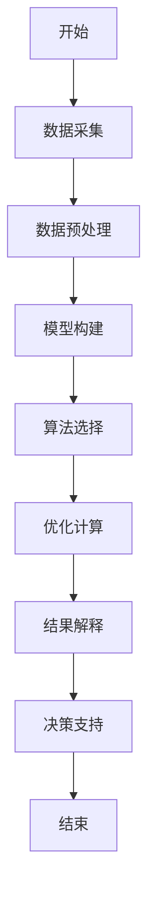
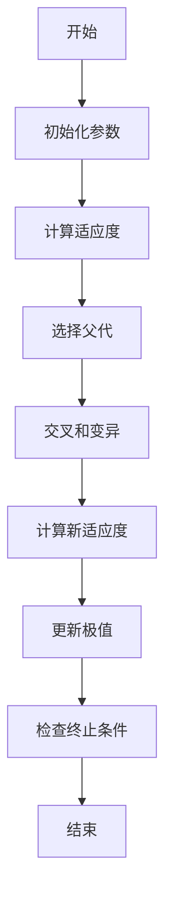
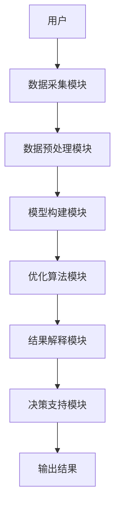
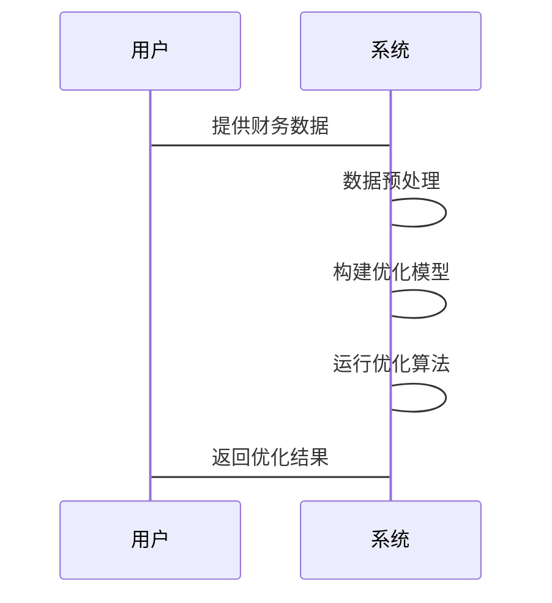

                 


# AI驱动的企业财务战略多目标优化系统

> 关键词：AI技术、企业财务管理、多目标优化、系统架构、项目实战、数学建模

> 摘要：本文探讨了AI技术如何驱动企业财务战略的多目标优化系统。通过分析传统财务管理的局限性，结合AI技术的优势，提出了一种基于多目标优化算法的企业财务战略优化方法。文章详细阐述了AI驱动的优化原理、系统架构设计、项目实现步骤和实际案例分析，为企业财务管理的智能化转型提供了理论和实践指导。

---

# 第一部分：AI驱动的企业财务战略多目标优化系统概述

## 第1章：问题背景与核心概念

### 1.1 问题背景介绍

#### 1.1.1 传统企业财务战略的局限性
传统企业财务管理依赖人工决策和经验判断，存在以下问题：
- 数据处理能力有限，难以应对海量财务数据。
- 优化目标单一，难以兼顾风险、收益、成本等多目标平衡。
- 决策周期长，难以实时响应市场变化。

#### 1.1.2 AI技术对企业财务管理的变革
AI技术的引入为财务管理带来了革命性的变化：
- 自动化数据处理能力，提升效率。
- 多目标优化算法，实现复杂问题的最优解。
- 实时数据分析，助力快速决策。

#### 1.1.3 多目标优化在企业财务中的重要性
多目标优化能够平衡企业财务中的多个关键指标，例如：
- 最大化利润。
- 最小化成本。
- 控制风险。
- 优化资源配置。

### 1.2 核心概念与问题描述

#### 1.2.1 AI驱动的定义与特征
AI驱动的财务优化系统是指利用人工智能算法（如遗传算法、粒子群优化等）对财务数据进行分析和优化，以实现企业财务目标的智能化决策。

#### 1.2.2 多目标优化的数学模型
多目标优化问题可以表示为：
$$
\text{min/max} \ f_i(x), \quad i=1,2,...,m
$$
$$
g_j(x) \leq 0, \quad j=1,2,...,n
$$
$$
x \in X
$$
其中，$f_i$ 是目标函数，$g_j$ 是约束条件，$x$ 是决策变量。

#### 1.2.3 企业财务战略的多目标优化需求
企业在财务管理中需要在以下目标之间找到平衡：
- 利润最大化。
- 风险最小化。
- 资金流动性优化。
- 资源分配最优化。

### 1.3 问题解决与边界条件

#### 1.3.1 AI驱动多目标优化的解决方案
通过AI算法，企业可以实现以下目标：
- 自动化数据采集与分析。
- 多目标优化模型构建。
- 理想解生成与决策支持。

#### 1.3.2 问题的边界与外延
- 数据范围：企业内部财务数据。
- 时间范围：实时或定期优化。
- 约束条件：企业战略目标和行业法规。

#### 1.3.3 核心要素与组成结构
AI驱动的财务优化系统包括以下核心要素：
- 数据采集模块。
- 模型构建模块。
- 优化算法模块。
- 决策支持模块。

## 1.4 本章小结
本章介绍了AI驱动的企业财务战略多目标优化系统的背景、核心概念和问题解决思路，为后续章节的深入分析奠定了基础。

---

# 第二部分：AI与多目标优化的核心原理

## 第2章：AI与多目标优化的核心原理

### 2.1 AI技术在多目标优化中的应用

#### 2.1.1 AI算法的基本原理
AI算法（如遗传算法）通过模拟自然进化过程，逐步优化问题解。

#### 2.1.2 多目标优化的数学模型
多目标优化问题可以通过Pareto前沿分析来寻找最优解。

#### 2.1.3 AI驱动的优化方法
- 算法选择：根据问题特点选择合适的AI算法。
- 模型训练：利用历史数据训练优化模型。
- 解释结果：将优化结果应用于实际财务决策。

### 2.2 核心概念对比分析

#### 2.2.1 AI与传统优化方法的对比
| 特性         | AI优化方法       | 传统优化方法   |
|--------------|------------------|----------------|
| 计算效率     | 高               | 低             |
| 处理维度     | 高维             | 低维或中维     |
| 灵活性       | 高               | 低             |

#### 2.2.2 多目标优化与单目标优化的对比
| 特性         | 多目标优化       | 单目标优化     |
|--------------|------------------|----------------|
| 优化目标数   | 多个             | 单个           |
| 解空间       | 多维             | 单维           |
| 解的数量     | 一个集合         | 一个点         |

#### 2.2.3 企业财务战略中的关键要素对比
| 特性         | 传统财务战略     | AI驱动财务战略   |
|--------------|------------------|------------------|
| 决策速度     | 慢               | 快               |
| 决策精度     | 依赖经验         | 依赖算法         |
| 决策范围     | 局限             | 全局优化         |

### 2.3 实体关系图与流程图

#### 2.3.1 ER实体关系图
```mermaid
er
    entity(企业) {
        id
        name
        financial_data
    }
    entity(目标) {
        id
        name
        weight
    }
    entity(优化结果) {
        id
        result
        explanation
    }
    relationship(拥有) {
        企业 -> 目标
        企业 -> 优化结果
    }
```

#### 2.3.2 优化流程图


## 2.4 本章小结
本章通过对比分析和流程图，详细阐述了AI技术在多目标优化中的核心原理和应用方式。

---

# 第三部分：AI驱动的多目标优化算法原理

## 第3章：AI驱动的多目标优化算法原理

### 3.1 算法原理讲解

#### 3.1.1 基于遗传算法的多目标优化
遗传算法（GA）是一种模拟自然选择的优化算法，适用于多目标优化问题。

#### 3.1.2 基于粒子群优化的多目标优化
粒子群优化（PSO）算法通过模拟鸟群觅食行为，寻找问题的最优解。

#### 3.1.3 算法对比分析
| 算法         | 优点             | 缺点             |
|--------------|------------------|------------------|
| 遗传算法     | 全局搜索能力强   | 收敛速度较慢     |
| 粒子群优化   | 收敛速度快       | 易陷入局部最优   |

### 3.2 数学模型与公式

#### 3.2.1 遗传算法的数学模型
遗传算法的基本步骤如下：
1. 初始化种群。
2. 计算适应度。
3. 选择父代。
4. 进行交叉和变异。
5. 评估新种群的适应度。
6. 重复步骤，直到满足终止条件。

#### 3.2.2 粒子群优化的数学模型
粒子群优化的基本公式为：
$$
v_i = v_i \times w + c_1 \times r_1 \times (p_i - x_i) + c_2 \times r_2 \times (p_g - x_i)
$$
$$
x_i = x_i + v_i
$$
其中，$v_i$ 是速度，$x_i$ 是位置，$p_i$ 是个体极值，$p_g$ 是全局极值，$w$ 是惯性权重，$c_1$ 和 $c_2$ 是学习因子，$r_1$ 和 $r_2$ 是随机数。

### 3.3 算法实现步骤

#### 3.3.1 算法步骤流程图


#### 3.3.2 代码实现示例
```python
import numpy as np

def fitness_function(x):
    # 定义适应度函数
    return -(x**2 + 2*x + 1)

def genetic_algorithm(population_size, generations):
    # 初始化种群
    population = np.random.rand(population_size, 1)
    for _ in range(generations):
        # 计算适应度
        fitness = np.array([fitness_function(x) for x in population])
        # 选择父代
        parents = population[np.argsort(fitness)[-2:]]
        # 交叉
        child = (parents[0] + parents[1]) / 2
        # 变异
        child += np.random.rand() * 0.1
        # 更新种群
        population = np.append(population, child)
        population = population[:population_size]
    return population

# 示例运行
population_size = 10
generations = 10
result = genetic_algorithm(population_size, generations)
print(result)
```

### 3.4 优化效果分析

#### 3.4.1 适应度函数分析
适应度函数用于评估算法的优化效果，越高越好。

#### 3.4.2 收敛曲线分析
优化过程的收敛曲线可以用来评估算法的收敛速度。

---

# 第四部分：系统架构与实现

## 第4章：系统架构设计

### 4.1 问题场景介绍
企业财务数据分散在多个系统中，需要通过统一的平台进行优化。

### 4.2 系统功能设计

#### 4.2.1 数据采集模块
- 数据接口：API。
- 数据类型：财务报表、成本数据。

#### 4.2.2 模型构建模块
- 数据预处理：清洗、转换。
- 模型选择：基于问题选择算法。

#### 4.2.3 优化算法模块
- 算法实现：如遗传算法、粒子群优化。
- 参数设置：适应度函数、约束条件。

#### 4.2.4 决策支持模块
- 结果展示：Pareto前沿。
- 可视化：折线图、散点图。

### 4.3 系统架构图


### 4.4 系统接口设计
- 输入接口：财务数据、优化目标。
- 输出接口：优化结果、决策建议。

### 4.5 系统交互流程图


---

# 第五部分：项目实战与案例分析

## 第5章：项目实战

### 5.1 环境安装与配置

#### 5.1.1 安装Python环境
使用Anaconda安装Python 3.8以上版本。

#### 5.1.2 安装依赖库
安装numpy、pandas、scikit-learn等库。

### 5.2 系统核心实现

#### 5.2.1 数据采集模块实现
```python
import requests
import json

def get_financial_data(api_url):
    response = requests.get(api_url)
    data = json.loads(response.text)
    return data
```

#### 5.2.2 优化算法实现
```python
def optimize(population_size, generations):
    population = np.random.rand(population_size, 1)
    for _ in range(generations):
        fitness = np.array([fitness_function(x) for x in population])
        parents = population[np.argsort(fitness)[-2:]]
        child = (parents[0] + parents[1]) / 2
        child += np.random.rand() * 0.1
        population = np.append(population, child)
        population = population[:population_size]
    return population
```

### 5.3 代码解读与分析
- 数据采集模块：通过API获取财务数据。
- 优化算法模块：基于遗传算法实现多目标优化。

### 5.4 实际案例分析
案例：某制造企业需要优化成本和利润。

#### 5.4.1 数据输入
财务数据：成本、收入、利润等。

#### 5.4.2 算法运行
运行优化算法，得到Pareto前沿。

#### 5.4.3 结果分析
分析优化结果，选择最优解。

### 5.5 优化效果评估
通过适应度函数和收敛曲线评估算法效果。

## 5.6 本章小结
本章通过实际案例展示了AI驱动的多目标优化系统在企业财务管理中的应用。

---

# 第六部分：最佳实践与注意事项

## 第6章：最佳实践与注意事项

### 6.1 实施AI驱动财务优化的注意事项

#### 6.1.1 数据质量
确保数据的准确性和完整性。

#### 6.1.2 算法选择
根据问题特点选择合适的算法。

#### 6.1.3 结果解释
优化结果需要结合业务背景进行解释。

### 6.2 项目实施中的常见问题

#### 6.2.1 数据维度过多
解决方案：特征选择或降维处理。

#### 6.2.2 算法收敛慢
解决方案：优化算法参数或采用混合算法。

#### 6.2.3 业务理解不足
解决方案：加强业务和技术团队的协作。

### 6.3 最佳实践总结

#### 6.3.1 数据准备
- 清洗数据。
- 标准化数据。

#### 6.3.2 模型选择
- 选择适合的算法。
- 验证模型效果。

#### 6.3.3 结果应用
- 结果可视化。
- 决策支持。

## 6.4 本章小结
本章总结了实施AI驱动财务优化系统的最佳实践和注意事项，为读者提供了宝贵的实践经验。

---

# 第七部分：拓展阅读与进一步思考

## 第7章：拓展阅读与进一步思考

### 7.1 拓展阅读
推荐以下书籍和资源：
- 《AI技术与企业应用》。
- 《多目标优化算法及其应用》。

### 7.2 进一步思考
- 如何结合区块链技术实现更安全的财务优化？
- 如何在动态环境中实时优化财务目标？

## 7.3 本章小结
本章为读者提供了进一步学习和思考的方向，鼓励读者深入探索AI技术在企业财务管理中的应用。

---

# 结语

通过本文的系统介绍，读者可以全面了解AI驱动的企业财务战略多目标优化系统的原理、实现和应用。未来，随着AI技术的不断发展，企业财务管理将更加智能化和高效化。

---

# 作者：AI天才研究院 & 禅与计算机程序设计艺术  
[GitHub](https://github.com/yourusername) | [简书](https://www.jianshu.com/u/yourusername)

