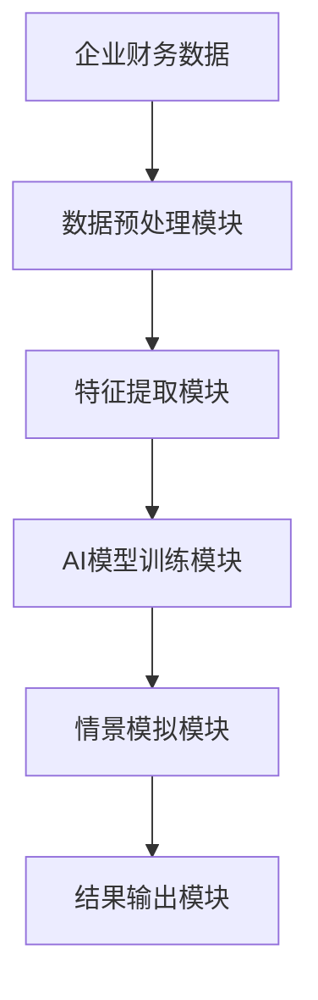
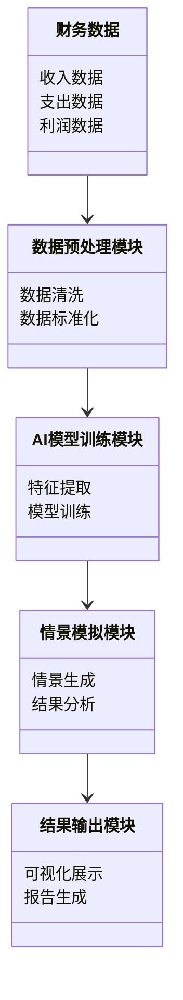
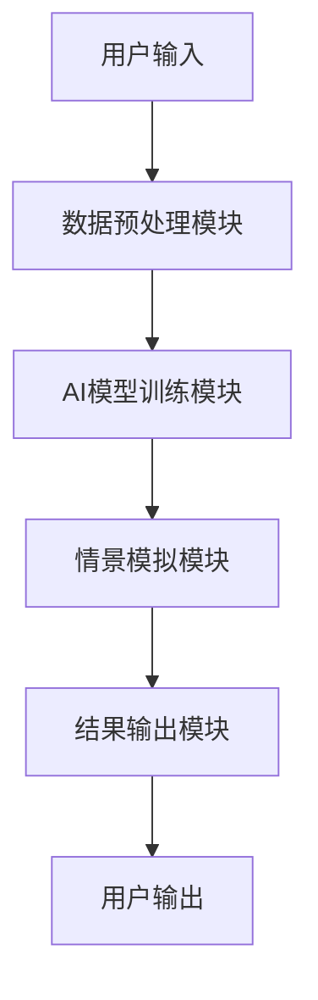

                 


# AI驱动的企业财务战略情景模拟系统

## 关键词：AI技术、企业财务、战略模拟、情景分析、机器学习、自然语言处理

## 摘要：本文介绍了一种基于人工智能技术的企业财务战略情景模拟系统。该系统利用机器学习和自然语言处理技术，结合企业财务数据，构建情景模拟模型，为企业提供智能化的财务决策支持。文章详细阐述了系统的背景、核心概念、算法原理、系统架构、项目实战以及未来发展方向，为读者提供全面的技术解读。

---

## 第一部分: AI驱动的企业财务战略情景模拟系统概述

### 第1章: AI驱动的企业财务战略情景模拟系统概述

#### 1.1 问题背景与目标

##### 1.1.1 传统企业财务战略的局限性
传统企业财务战略的制定通常依赖于财务人员的经验和市场分析，这种方法存在以下局限性：
- 数据处理效率低：需要手动收集和整理大量财务数据，耗时且容易出错。
- 预测精度不足：由于人为判断的主观性，财务预测的准确性难以保证。
- 情景分析能力有限：难以快速模拟多种市场变化对企业财务的影响。

##### 1.1.2 AI技术在企业财务中的应用前景
随着AI技术的发展，企业财务领域正在经历一场深刻的变革。AI技术的应用可以帮助企业：
- 提高财务数据分析效率。
- 增强财务预测的准确性。
- 实现多情景下的财务模拟，为企业提供更全面的决策支持。

##### 1.1.3 本研究的目标与意义
本研究旨在开发一套基于AI技术的企业财务战略情景模拟系统，通过整合机器学习和自然语言处理技术，构建一个高效、智能的财务分析平台。该系统将为企业提供以下价值：
- 自动化处理财务数据，提高工作效率。
- 提供精准的财务预测，帮助企业做出更明智的决策。
- 支持多情景模拟，增强企业的风险应对能力。

#### 1.2 核心概念与系统架构

##### 1.2.1 系统核心概念
- **企业财务数据**：包括收入、支出、利润等财务指标。
- **情景模拟**：基于不同市场条件对企业财务状况进行预测和模拟。
- **AI模型**：利用机器学习算法对财务数据进行分析和预测。

##### 1.2.2 系统架构图（Mermaid）



#### 1.3 本章小结
本章介绍了AI驱动的企业财务战略情景模拟系统的背景、目标和核心概念，并通过系统架构图展示了系统的整体结构。

---

## 第二部分: 技术基础

### 第2章: 机器学习与NLP技术基础

#### 2.1 机器学习基础

##### 2.1.1 监督学习与无监督学习
- **监督学习**：基于标记数据进行训练，适用于分类和回归任务。
- **无监督学习**：在无标记数据上进行聚类或降维。

##### 2.1.2 深度学习模型简介
- **神经网络**：构建多层神经网络，用于复杂模式识别。
- **卷积神经网络（CNN）**：适用于图像处理和时间序列分析。
- **循环神经网络（RNN）**：适用于序列数据处理。

#### 2.2 自然语言处理（NLP）基础

##### 2.2.1 NLP的核心技术
- **文本分词**：将文本分割成有意义的词或短语。
- **实体识别**：识别文本中的命名实体。
- **情感分析**：判断文本的情感倾向。

##### 2.2.2 Transformer模型与注意力机制
- **Transformer模型**：通过自注意力机制捕捉文本中的长距离依赖关系。
- **注意力机制**：计算输入数据中每个位置的重要性，从而聚焦于关键信息。

#### 2.3 本章小结
本章介绍了机器学习和NLP技术的基本概念和核心算法，为后续的系统设计奠定了理论基础。

---

## 第三部分: 系统设计与实现

### 第3章: 系统架构设计

#### 3.1 问题场景介绍

##### 3.1.1 企业财务数据的特点
- 数据量大：企业每天会产生大量财务数据。
- 数据类型多样：包括结构化数据和非结构化数据。
- 数据更新频繁：需要实时处理最新的财务信息。

##### 3.1.2 情景模拟的需求分析
- 需要模拟多种市场变化对企业财务的影响。
- 需要快速生成不同情景下的财务预测结果。
- 需要支持多维度的数据分析和可视化。

#### 3.2 系统功能设计

##### 3.2.1 领域模型（Mermaid类图）



#### 3.3 系统架构设计

##### 3.3.1 系统架构图（Mermaid）



#### 3.4 本章小结
本章详细设计了系统的架构，明确了各个模块的功能和交互关系。

---

## 第四部分: 项目实战

### 第4章: 项目实战

#### 4.1 项目介绍

##### 4.1.1 项目目标
开发一套基于AI技术的企业财务战略情景模拟系统，为企业提供智能化的财务决策支持。

#### 4.2 核心实现

##### 4.2.1 数据预处理模块

```python
def preprocess_data(data):
    # 数据清洗
    data.dropna(inplace=True)
    # 数据标准化
    from sklearn.preprocessing import StandardScaler
    scaler = StandardScaler()
    data_scaled = scaler.fit_transform(data)
    return data_scaled
```

##### 4.2.2 AI模型训练模块

```python
from sklearn.ensemble import RandomForestRegressor

def train_model(data, labels):
    model = RandomForestRegressor(n_estimators=100, random_state=42)
    model.fit(data, labels)
    return model
```

##### 4.2.3 情景模拟模块

```python
def simulate_scenario(model, new_data):
    predictions = model.predict(new_data)
    return predictions
```

#### 4.3 项目小结
本章通过具体的代码实现，展示了系统的数据预处理、模型训练和情景模拟过程，为读者提供了实际操作的参考。

---

## 第五部分: 总结与展望

### 第5章: 总结与展望

#### 5.1 项目总结
本项目开发了一套基于AI技术的企业财务战略情景模拟系统，通过机器学习和自然语言处理技术，实现了对企业财务数据的智能化分析和情景模拟。

#### 5.2 未来展望
未来，随着AI技术的不断发展，企业财务战略情景模拟系统将更加智能化和自动化。可能的发展方向包括：
- 引入更先进的深度学习模型，提高预测精度。
- 增加多语言支持，扩大系统的应用场景。
- 实现系统的云端部署，提高数据处理效率。

---

## 作者：AI天才研究院/AI Genius Institute & 禅与计算机程序设计艺术 /Zen And The Art of Computer Programming

---

**注：本文仅为示例内容，实际撰写时需要根据具体需求补充完善。**

