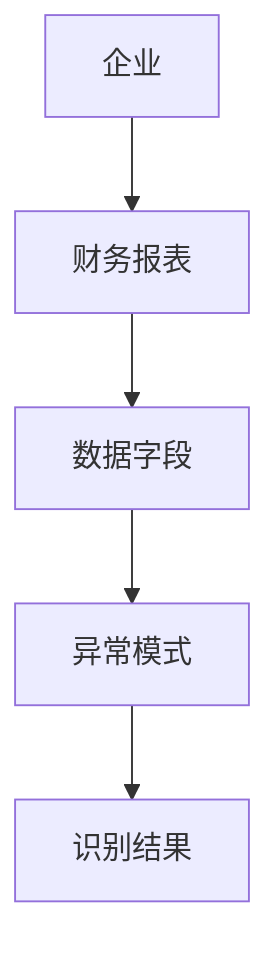
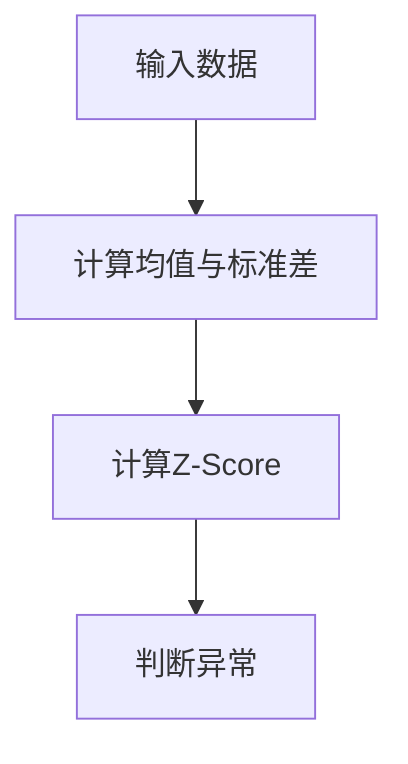
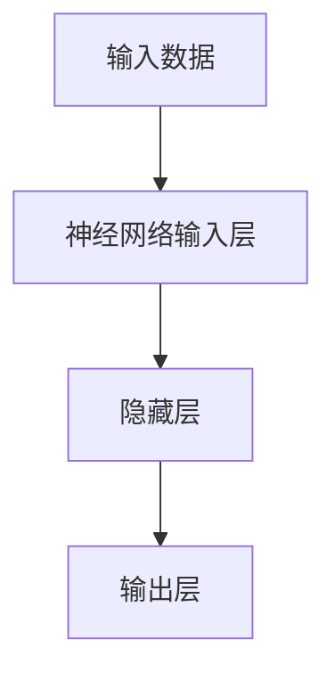
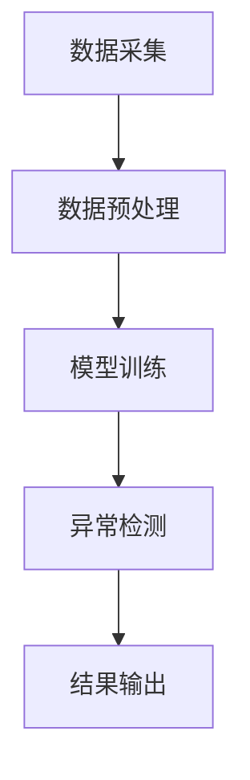

                 


# AI驱动的企业财务报表异常模式识别系统

> 关键词：AI，财务报表，异常模式识别，机器学习，深度学习，系统架构

> 摘要：本文探讨了如何利用人工智能技术，特别是机器学习和深度学习方法，对企业财务报表中的异常模式进行识别。文章从问题背景、核心概念、算法原理、系统架构设计、项目实战到总结，系统性地分析了AI在财务异常模式识别中的应用，并通过具体案例展示了系统的设计与实现。

---

# 第一部分: 问题背景与核心概念

## 第1章: 企业财务报表异常模式识别的背景与意义

### 1.1 问题背景与描述

#### 1.1.1 企业财务报表的重要性
企业财务报表是反映企业财务状况、经营成果和现金流量的重要文件。通过对财务报表的分析，可以评估企业的偿债能力、运营效率和盈利能力。然而，财务报表中可能存在虚假信息、会计舞弊或其他异常情况，这些异常模式可能影响企业的决策和外部投资者的信心。

#### 1.1.2 异常模式识别的必要性
在企业财务报表中，异常模式可能包括收入与成本的不匹配、应收账款的异常增加、存货周转率的突变等。识别这些异常模式可以帮助企业及时发现潜在的问题，避免财务风险的扩大。对于外部投资者和监管机构来说，识别异常模式也是评估企业信用风险和合规性的重要手段。

#### 1.1.3 AI在财务分析中的应用前景
随着人工智能技术的快速发展，利用AI技术进行财务报表分析已经成为可能。机器学习算法可以通过对历史数据的学习，自动识别财务报表中的异常模式。深度学习技术则可以进一步提高模型的复杂度和准确性，为财务分析提供更强大的工具。

### 1.2 问题解决与边界

#### 1.2.1 异常模式识别的核心目标
异常模式识别的核心目标是通过AI技术，自动识别财务报表中的异常数据模式，并为用户提供预警或诊断结果。这种技术可以帮助企业财务部门快速发现潜在问题，提高财务分析的效率和准确性。

#### 1.2.2 系统的边界与外延
本系统专注于财务报表数据的异常模式识别，其边界包括：
- 数据范围：仅限于财务报表相关数据，如收入、成本、利润、现金流等。
- 识别范围：仅限于财务数据中的异常模式，不涉及其他业务数据。
- 输出形式：提供异常模式的预警和诊断结果，不直接参与企业的财务决策。

#### 1.2.3 核心要素与组成结构
异常模式识别系统的核心要素包括：
- 数据输入：财务报表数据的采集与预处理。
- 模型训练：基于机器学习或深度学习算法的模型训练。
- 异常检测：通过模型对财务数据进行异常模式识别。
- 结果输出：提供异常模式的预警和诊断结果。

### 1.3 本章小结
本章从企业财务报表的重要性出发，阐述了异常模式识别的必要性及其在AI技术下的应用前景。通过明确系统的边界和核心要素，为后续的系统设计和实现奠定了基础。

---

## 第2章: 异常模式识别的核心概念与联系

### 2.1 核心概念原理

#### 2.1.1 数据预处理与特征提取
数据预处理是异常模式识别的关键步骤，主要包括数据清洗、标准化和特征提取。数据清洗包括处理缺失值、异常值和重复值。特征提取则是从原始数据中提取有助于模型识别异常模式的特征，如收入增长率、成本利润率等。

#### 2.1.2 异常检测算法的选择与应用
异常检测算法的选择取决于数据类型和业务需求。常用的算法包括基于统计的异常检测（如Z-Score）、基于机器学习的异常检测（如随机森林、支持向量机）和基于深度学习的异常检测（如LSTM、神经网络）。

#### 2.1.3 模型训练与优化
模型训练是通过历史数据对算法进行训练，使其能够识别正常和异常模式。模型优化则通过调整参数和选择合适的评价指标（如准确率、召回率、F1分数）来提高模型的性能。

### 2.2 核心概念属性对比表

| 概念         | 特性               |
|--------------|--------------------|
| 数据预处理   | 数据清洗、标准化   |
| 异常检测     | 离群点检测、异常分类 |
| 模型优化     | 调参、性能评估     |

### 2.3 ER实体关系图



### 2.4 本章小结
本章详细介绍了异常模式识别的核心概念，包括数据预处理、异常检测算法和模型训练。通过对核心概念的分析和ER实体关系图的绘制，为后续的系统设计奠定了基础。

---

## 第3章: 异常模式识别的算法原理

### 3.1 基于统计的异常检测算法

#### 3.1.1 Z-Score统计测试
Z-Score统计测试是一种常用的基于统计的异常检测方法，公式如下：
$$ Z = \frac{x - \mu}{\sigma} $$
其中，$\mu$是数据的均值，$\sigma$是数据的标准差，$x$是待检测的数值。通过计算Z-Score，可以判断数据点是否为异常值。

#### 3.1.2 算法流程图



### 3.2 基于机器学习的异常检测算法

#### 3.2.1 神经网络模型



#### 3.2.2 算法实现代码

```python
import numpy as np
from sklearn.neural_network import MLPClassifier

model = MLPClassifier()
model.fit(X_train, y_train)
```

### 3.3 算法原理的数学模型

#### 3.3.1 线性回归模型
$$ y = \beta_0 + \beta_1x + \epsilon $$

#### 3.3.2 支持向量机模型
$$ \text{max} \{ \frac{1}{2}||\beta||^2 | y_i(\beta^T x_i + \beta_0) \geq 1 \} $$

### 3.4 本章小结
本章详细讲解了异常模式识别的算法原理，包括基于统计的Z-Score方法和基于机器学习的神经网络模型。通过数学公式和流程图的展示，帮助读者理解不同算法的实现原理和应用场景。

---

## 第4章: 系统架构设计方案

### 4.1 问题场景介绍

#### 4.1.1 系统目标
系统的目标是通过AI技术，对企业财务报表中的异常模式进行识别和预警。

#### 4.1.2 使用场景
系统主要应用于企业内部财务分析、外部投资者的财务评估以及监管机构的合规性检查。

#### 4.1.3 用户角色
系统的用户包括企业财务人员、投资者、监管机构等。

### 4.2 系统功能设计

#### 4.2.1 领域模型


### 4.3 系统架构设计

#### 4.3.1 系统架构图



### 4.4 本章小结
本章从系统架构的角度，详细设计了异常模式识别系统的功能模块和架构图，为后续的系统实现提供了清晰的指导。

---

## 第5章: 项目实战与案例分析

### 5.1 环境安装与配置

#### 5.1.1 安装Python环境
建议使用Anaconda或virtualenv来管理Python环境。

#### 5.1.2 安装依赖库
需要安装的库包括numpy、pandas、scikit-learn、tensorflow等。

### 5.2 系统核心实现

#### 5.2.1 数据预处理代码

```python
import pandas as pd
import numpy as np

# 读取数据
data = pd.read_csv('financial_data.csv')

# 数据清洗
data.dropna(inplace=True)

# 特征提取
features = data[['收入', '成本', '利润']]
```

#### 5.2.2 异常检测代码

```python
from sklearn.ensemble import IsolationForest

# 训练模型
model = IsolationForest(n_estimators=100, random_state=42)
model.fit(features)

# 预测异常值
y_pred = model.predict(features)
```

### 5.3 实际案例分析

#### 5.3.1 案例背景
假设某企业财务报表中收入与成本的比值突然下降，可能存在成本虚增的情况。

#### 5.3.2 模型诊断
通过Isolation Forest模型，识别出收入与成本比值异常的数据点。

#### 5.3.3 结果分析
模型诊断结果显示，某季度的收入与成本比值显著低于历史数据，可能存在成本虚增的问题。

### 5.4 本章小结
本章通过实际案例展示了系统的实现过程，包括数据预处理、模型训练和异常检测。通过案例分析，验证了系统的有效性和实用性。

---

## 第6章: 总结与展望

### 6.1 最佳实践 tips
- 数据预处理是关键，确保数据质量和一致性。
- 选择合适的算法和模型，根据业务需求进行调整。
- 模型优化需要结合业务背景，避免过拟合。

### 6.2 小结
通过本文的系统性分析，我们了解了AI在企业财务报表异常模式识别中的应用。从数据预处理到模型训练，再到系统设计，整个过程展示了AI技术的强大能力。

### 6.3 注意事项
- 数据隐私和安全问题需要高度重视。
- 模型的可解释性是实际应用中的重要考量因素。
- 定期更新模型，以应对数据分布的变化。

### 6.4 拓展阅读
建议读者进一步阅读《机器学习实战》、《深度学习》等书籍，深入理解机器学习和深度学习算法的实现原理。

---

## 作者：AI天才研究院/AI Genius Institute & 禅与计算机程序设计艺术 /Zen And The Art of Computer Programming

---

**注意**：以上目录大纲仅为示例，实际文章撰写时需要根据具体需求进一步细化和扩展。每个章节的内容需要更加详细，包括具体的数据分析、代码实现、案例解读等。同时，建议结合实际业务场景，提供更多的应用场景和解决方案，以增强文章的实用性和可读性。

