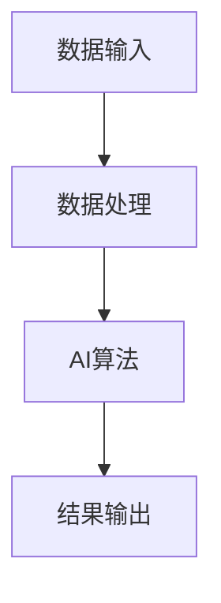

                 


# AI驱动的企业财务报表比较分析系统

> **关键词**：AI技术，财务报表分析，企业财务，智能分析，机器学习，深度学习

> **摘要**：  
> 本文深入探讨了AI技术在企业财务报表比较分析中的应用，详细介绍了系统的核心概念、算法原理、系统架构、项目实现、测试优化以及实际应用案例。通过结合机器学习、深度学习和自然语言处理等技术，本文提出了一种高效、智能的企业财务报表比较分析系统，为企业财务管理提供了新的思路和解决方案。文章内容涵盖了从理论到实践的全过程，旨在为企业财务分析师和IT技术人员提供有价值的参考。

---

# 第一部分: AI驱动的企业财务报表比较分析系统概述

## 第1章: 企业财务报表比较分析的背景与需求

### 1.1 企业财务报表分析的重要性

#### 1.1.1 财务报表分析的定义与作用
财务报表分析是通过对企业的财务报表（如资产负债表、利润表、现金流量表等）进行研究和评估，以揭示企业的财务状况、经营成果和现金流量情况。它是企业决策者、投资者和债权人等利益相关者了解企业财务健康状况的重要工具。

#### 1.1.2 传统财务报表分析的局限性
传统的财务报表分析依赖人工操作，存在以下问题：
1. **数据量大**：企业财务数据通常涉及大量历史数据和多维度数据，人工分析效率低。
2. **主观性高**：分析结果受分析人员的经验和能力影响较大，可能存在主观偏差。
3. **实时性差**：传统分析难以实现实时数据处理和动态分析。

#### 1.1.3 企业对智能财务分析的需求
随着企业规模的扩大和业务复杂度的增加，企业对财务分析的需求也在不断升级：
1. **高效性**：需要快速处理大量数据，提高分析效率。
2. **准确性**：减少人为错误，提高分析结果的准确性。
3. **实时性**：能够实时监控财务状况，支持实时决策。

### 1.2 AI技术在财务分析中的应用前景

#### 1.2.1 AI技术的基本概念
人工智能（AI）是指通过模拟人类智能的计算机系统，包括学习、推理、自我改进等功能。AI技术的核心是通过数据驱动的方法，利用算法和模型来实现智能化任务。

#### 1.2.2 AI在财务领域的潜在应用
AI技术在财务领域的应用潜力巨大，包括：
1. **财务预测**：利用历史数据预测未来的财务状况。
2. **风险评估**：通过分析财务数据识别潜在风险。
3. **智能审计**：利用AI技术辅助审计工作，提高审计效率。

#### 1.2.3 企业财务报表比较分析的AI驱动需求
AI驱动的企业财务报表比较分析系统能够实现以下功能：
1. **多维度数据比较**：支持跨行业、跨区域的财务数据比较。
2. **智能识别异常**：通过AI算法自动识别财务数据中的异常值。
3. **趋势分析**：利用AI技术预测财务趋势，为企业决策提供支持。

### 1.3 本章小结
本章主要介绍了企业财务报表分析的重要性和传统分析的局限性，提出了AI技术在财务分析中的应用前景，特别是AI驱动的企业财务报表比较分析系统的必要性和潜在价值。

---

## 第2章: AI驱动的企业财务报表比较分析系统的概念与框架

### 2.1 核心概念与定义

#### 2.1.1 企业财务报表比较分析的定义
企业财务报表比较分析是指通过对不同时间段、不同企业或不同行业的财务报表进行比较，揭示财务状况的变化趋势和行业差异。

#### 2.1.2 AI驱动的定义
AI驱动是指利用人工智能技术（如机器学习、深度学习等）来实现系统的核心功能，包括数据处理、模型训练和结果输出。

#### 2.1.3 系统的总体框架
AI驱动的企业财务报表比较分析系统的总体框架包括以下几个部分：
1. **数据输入模块**：接收企业的财务报表数据。
2. **数据处理模块**：对数据进行清洗、转换和特征提取。
3. **AI算法模块**：利用机器学习或深度学习算法进行模型训练和预测。
4. **结果输出模块**：生成分析报告并可视化输出。

### 2.2 系统的核心要素与组成

#### 2.2.1 数据源的获取与处理
数据源包括企业的财务报表数据、行业基准数据等。数据处理包括数据清洗（去除缺失值、异常值）和特征提取（如财务比率、趋势指标）。

#### 2.2.2 AI算法的选择与实现
根据分析需求选择合适的AI算法，如线性回归用于趋势预测，随机森林用于分类问题。

#### 2.2.3 系统的输出与反馈机制
系统输出包括财务状况分析报告和可视化图表。反馈机制用于优化模型和改进系统性能。

### 2.3 本章小结
本章详细介绍了AI驱动的企业财务报表比较分析系统的概念和框架，强调了数据处理和AI算法在系统中的核心作用。

---

## 第3章: 企业财务报表比较分析的AI驱动原理

### 3.1 AI算法在财务分析中的应用原理

#### 3.1.1 机器学习的基本原理
机器学习通过训练模型从数据中学习规律，实现对新数据的预测和分类。

#### 3.1.2 深度学习在财务分析中的应用
深度学习通过多层神经网络模型，能够自动提取数据中的高层次特征，适用于复杂的财务分析任务。

#### 3.1.3 自然语言处理在财务文本分析中的应用
自然语言处理（NLP）技术可以用于分析财务报告中的文本信息，提取关键信息。

### 3.2 基于AI的财务报表比较分析模型构建

#### 3.2.1 数据预处理与特征提取
数据预处理包括数据清洗和标准化，特征提取包括选择关键财务指标。

#### 3.2.2 模型训练与优化
通过训练数据对模型进行参数优化，提高模型的预测准确率。

#### 3.2.3 模型评估与验证
通过测试数据验证模型的性能，评估模型的准确性和稳定性。

### 3.3 本章小结
本章详细介绍了AI算法在财务分析中的应用原理，重点讲解了机器学习和深度学习在模型构建中的作用。

---

## 第4章: 系统架构与功能设计

### 4.1 系统架构设计

#### 4.1.1 系统模块划分
系统架构包括数据输入模块、数据处理模块、AI算法模块和结果输出模块。

#### 4.1.2 系统功能流程图


#### 4.1.3 系统架构的优缺点分析
优点：模块化设计便于维护；缺点：初期开发成本较高。

### 4.2 系统功能设计

#### 4.2.1 数据输入与处理模块
数据输入模块负责接收企业的财务报表数据，数据处理模块对数据进行清洗和特征提取。

#### 4.2.2 AI算法处理模块
AI算法模块负责训练模型并进行预测。

#### 4.2.3 结果输出与可视化模块
结果输出模块生成分析报告并进行可视化展示。

### 4.3 本章小结
本章详细描述了系统的架构设计和功能模块，强调了模块化设计的重要性。

---

## 第5章: 系统实现与项目实战

### 5.1 环境搭建与数据准备

#### 5.1.1 开发环境的安装与配置
安装Python、TensorFlow、Pandas等开发工具。

#### 5.1.2 数据源的获取与预处理
获取企业的财务报表数据并进行清洗。

### 5.2 AI算法实现

#### 5.2.1 模型选择与训练
选择合适的机器学习模型并进行训练。

#### 5.2.2 模型调优与优化
通过参数调优提高模型的准确率。

#### 5.2.3 模型部署与应用
将训练好的模型部署到生产环境中。

### 5.3 系统实现代码

#### 5.3.1 数据处理代码
```python
import pandas as pd

# 数据清洗
df = pd.read_csv('financial_data.csv')
df = df.dropna()
```

#### 5.3.2 模型训练代码
```python
from sklearn.linear_model import LinearRegression

model = LinearRegression()
model.fit(X_train, y_train)
```

### 5.4 本章小结
本章通过实际项目案例展示了系统的实现过程，强调了代码实现和模型调优的重要性。

---

## 第6章: 系统测试与性能优化

### 6.1 系统测试方法

#### 6.1.1 功能测试
测试系统是否能够正常完成数据处理和分析任务。

#### 6.1.2 性能测试
测试系统在高负载下的运行情况。

#### 6.1.3 安全测试
测试系统是否能够防止数据泄露和攻击。

### 6.2 系统优化策略

#### 6.2.1 模型优化
通过增加训练数据和优化模型结构提高预测准确率。

#### 6.2.2 系统性能优化
通过优化代码和增加缓存机制提高系统运行效率。

#### 6.2.3 数据优化
通过数据压缩和分布式存储提高数据处理效率。

### 6.3 本章小结
本章详细介绍了系统的测试方法和优化策略，强调了性能优化的重要性。

---

## 第7章: 系统应用与最佳实践

### 7.1 系统的实际应用案例

#### 7.1.1 案例背景介绍
某企业引入AI驱动的财务报表比较分析系统，提高财务分析效率。

#### 7.1.2 系统应用过程
系统通过分析财务数据，识别潜在风险并提出优化建议。

#### 7.1.3 应用效果分析
系统提高了财务分析的准确性和效率，帮助企业做出了更明智的决策。

### 7.2 最佳实践与注意事项

#### 7.2.1 数据质量的重要性
确保数据的完整性和准确性是系统运行的基础。

#### 7.2.2 模型选择的策略
根据具体需求选择合适的AI算法和模型。

#### 7.2.3 系统维护与更新
定期更新模型和优化系统以应对新的挑战。

### 7.3 本章小结
本章通过实际应用案例展示了系统的价值，并提出了最佳实践和注意事项。

---

## 第8章: 未来发展趋势与挑战

### 8.1 未来发展趋势

#### 8.1.1 AI技术的进一步发展
AI技术将更加智能化和自动化，推动财务分析的进一步发展。

#### 8.1.2 财务分析领域的创新
随着技术的进步，财务分析将更加注重实时性和动态性。

#### 8.1.3 结合其他技术的融合应用
AI技术将与其他技术（如区块链、物联网）结合，推动财务管理的创新。

### 8.2 挑战与应对策略

#### 8.2.1 数据隐私与安全问题
加强数据加密和访问控制，确保数据安全。

#### 8.2.2 技术瓶颈
加大研发投入，突破技术瓶颈。

#### 8.2.3 人才短缺
加强人才培养，吸引和留住AI技术人才。

### 8.3 本章小结
本章展望了AI驱动的企业财务报表比较分析系统的未来发展趋势，同时提出了应对挑战的策略。

---

**作者：AI天才研究院/AI Genius Institute & 禅与计算机程序设计艺术 /Zen And The Art of Computer Programming**

