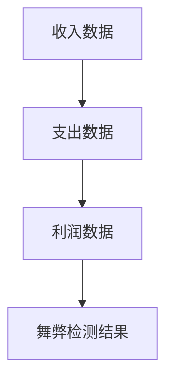
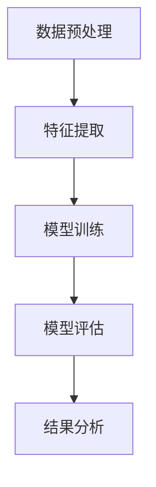
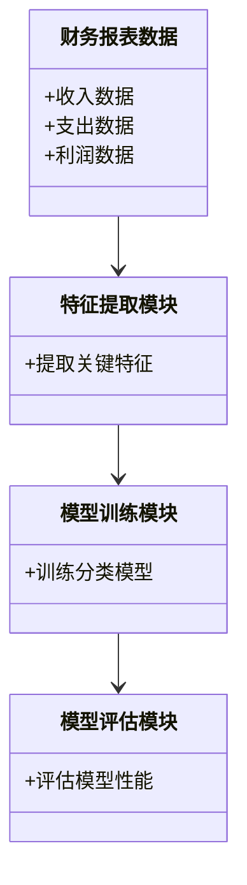
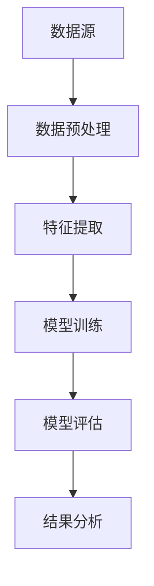

                 


# AI驱动的企业财务报表舞弊检测系统

## 关键词
AI, 财务报表, 舞弊检测, 机器学习, 系统设计, 数据分析

## 摘要
随着企业规模的不断扩大和财务造假手段的不断升级，传统的财务报表审计方法已难以满足高效、准确检测舞弊的需求。本文介绍了一种基于AI技术的企业财务报表舞弊检测系统，结合机器学习算法与系统设计方法，提出了一套完整的解决方案。文章详细探讨了系统的核心算法、系统架构设计、项目实战及最佳实践，为财务审计行业提供了新的思路和技术支持。

---

# 第一部分: AI驱动的企业财务报表舞弊检测系统概述

## 第1章: 企业财务报表舞弊检测的背景与挑战

### 1.1 问题背景
#### 1.1.1 财务报表舞弊的定义与表现形式
财务报表舞弊是指企业在编制财务报表时，故意通过虚报、瞒报、篡改数据等手段，误导报表使用者，从而达到谋取不正当利益的行为。常见的舞弊形式包括收入虚增、成本虚减、资产虚增等。

#### 1.1.2 财务报表舞弊对企业的影响
- 损害企业声誉
- 导致经济损失
- 影响投资者决策
- 违反法律法规

#### 1.1.3 传统财务报表审计的局限性
- 依赖审计人员经验，主观性强
- 审计范围有限，难以覆盖所有潜在风险
- 财务造假手段复杂，传统方法难以识别

### 1.2 问题描述
#### 1.2.1 财务报表舞弊检测的核心问题
- 如何从海量数据中提取有效特征
- 如何准确识别异常数据
- 如何构建高效可靠的预测模型

#### 1.2.2 财务报表舞弊检测的难点与挑战
- 数据复杂性
- 模型泛化能力不足
- 计算资源限制

#### 1.2.3 AI技术在财务报表舞弊检测中的应用前景
- 提高检测效率
- 增强检测准确性
- 降低审计成本

### 1.3 问题解决
#### 1.3.1 AI技术如何解决财务报表舞弊检测问题
- 利用机器学习算法自动识别异常数据
- 通过深度学习技术分析复杂模式
- 基于自然语言处理技术提取文本信息

#### 1.3.2 财务报表舞弊检测的AI解决方案框架
- 数据收集与预处理
- 特征提取与选择
- 模型训练与优化
- 结果分析与可视化

#### 1.3.3 系统的边界与外延
- 输入：企业财务报表数据
- 输出：舞弊风险评估报告
- 边界：仅限于财务数据，不涉及非财务信息
- 外延：可扩展至其他类型数据的分析

### 1.4 核心概念与联系
#### 1.4.1 核心概念原理
- 财务报表舞弊检测系统基于机器学习算法，通过分析财务数据中的异常模式，识别潜在的舞弊行为。

#### 1.4.2 核心概念属性特征对比表格
| 属性 | 正常数据 | 舞弊数据 |
|------|----------|----------|
| 收入增长率 | 稳定增长 | 异常波动 |
| 成本占比 | 合理范围 | 明显降低 |
| 利润率 | 符合预期 | 过高或过低 |

#### 1.4.3 ER实体关系图架构的 Mermaid 流程图


---

## 第2章: AI驱动的财务报表舞弊检测系统核心算法

### 2.1 算法原理讲解
#### 2.1.1 机器学习算法在财务报表舞弊检测中的应用
- 监督学习：基于标注数据训练分类模型
- 无监督学习：通过聚类分析发现异常数据
- 深度学习：用于处理复杂的非线性关系

#### 2.1.2 常见的机器学习算法对比与选择
| 算法类型 | 优点 | 缺点 | 适用场景 |
|----------|------|------|----------|
| 线性回归 | 简单高效 | 无法处理非线性问题 | 线性关系明显时 |
| 逻辑回归 | 易解释 | 非线性能力有限 | 二分类问题 |
| 随机森林 | 高准确性 | 计算资源消耗大 | 多分类问题 |

#### 2.1.3 财务报表舞弊检测的算法流程
1. 数据预处理
2. 特征提取
3. 模型训练
4. 模型评估
5. 结果分析

### 2.2 算法原理的 Mermaid 流程图


### 2.3 算法的数学模型和公式
#### 2.3.1 机器学习模型的数学表达
$$ y = f(x) $$
其中，$x$ 是输入特征，$y$ 是输出结果，$f$ 是模型函数。

#### 2.3.2 常见的分类算法公式
- 线性回归：
$$ y = \beta_0 + \beta_1x + \epsilon $$
- 逻辑回归：
$$ P(y=1|x) = \frac{e^{\beta_0 + \beta_1x}}{1 + e^{\beta_0 + \beta_1x}} $$

---

## 第3章: 系统分析与架构设计方案

### 3.1 问题场景介绍
#### 3.1.1 财务报表舞弊检测的典型场景
- 收入虚增
- 成本虚减
- 资产虚增

#### 3.1.2 系统需要解决的具体问题
- 数据清洗与特征提取
- 模型训练与优化
- 结果可视化与报告生成

### 3.2 系统功能设计
#### 3.2.1 领域模型 Mermaid 类图


### 3.3 系统架构设计
#### 3.3.1 系统架构 Mermaid 架构图


---

## 第4章: 项目实战

### 4.1 环境安装
- 数据预处理工具：Python（Pandas、NumPy）
- 特征提取工具：Scikit-learn
- 模型训练工具：XGBoost、LightGBM
- 可视化工具：Matplotlib、Seaborn

### 4.2 系统核心实现源代码
```python
import pandas as pd
from sklearn.model_selection import train_test_split
from sklearn.ensemble import RandomForestClassifier
from sklearn.metrics import accuracy_score

# 数据加载
df = pd.read_csv('financial_data.csv')

# 数据预处理
df.dropna(inplace=True)
X = df.drop('label', axis=1)
y = df['label']

# 数据分割
X_train, X_test, y_train, y_test = train_test_split(X, y, test_size=0.2)

# 模型训练
model = RandomForestClassifier()
model.fit(X_train, y_train)

# 模型评估
y_pred = model.predict(X_test)
print("Accuracy:", accuracy_score(y_test, y_pred))
```

### 4.3 实际案例分析
- 案例背景：某企业财务报表异常，可能存在收入虚增
- 数据分析：通过随机森林模型，识别出收入增长率与行业平均水平差异显著
- 结果解读：模型预测该企业存在收入虚增的风险，建议进一步调查

---

## 第5章: 总结与展望

### 5.1 总结
本文介绍了一种基于AI技术的企业财务报表舞弊检测系统，详细探讨了系统的背景、核心算法、系统架构设计及项目实战。通过机器学习算法的应用，系统能够高效、准确地识别财务报表中的舞弊行为，为企业的财务审计工作提供了新的思路和技术支持。

### 5.2 展望
未来的研究方向包括：
- 提高模型的泛化能力
- 增强系统的实时检测能力
- 扩展系统的数据来源

### 5.3 最佳实践 tips
- 数据预处理是关键，确保数据质量
- 特征选择要结合业务背景
- 模型调优要结合实际需求

---

## 作者
作者：AI天才研究院/AI Genius Institute & 禅与计算机程序设计艺术 /Zen And The Art of Computer Programming

---

以上是《AI驱动的企业财务报表舞弊检测系统》的技术博客文章的完整内容，涵盖了从背景介绍到系统设计的各个方面，结合了理论与实践，为读者提供了全面的指导和参考。

