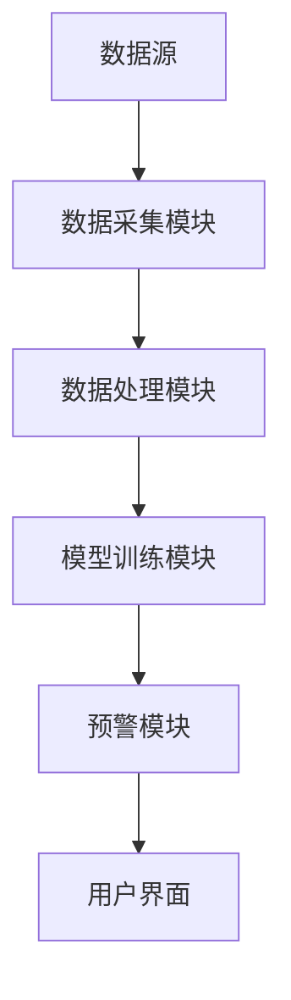

                 


# AI驱动的企业财务报表质量动态监控与预警系统

> 关键词：AI技术、财务报表、质量监控、异常检测、自然语言处理

> 摘要：本文系统地探讨了如何利用人工智能技术构建企业财务报表质量动态监控与预警系统。通过分析财务报表数据，结合机器学习算法和大数据技术，提出了一种基于AI的财务报表质量监控方案。文章从背景、技术基础、核心算法、系统架构到项目实战，全面详细地阐述了该系统的构建过程，并通过实际案例分析验证了系统的有效性和可行性。

---

## 第一部分: AI驱动的企业财务报表质量动态监控与预警系统背景与基础

### 第1章: 企业财务报表质量监控的背景与挑战

#### 1.1 企业财务报表的重要性
企业财务报表是反映企业财务状况、经营成果和现金流量的重要文件，是投资者、债权人、监管机构等利益相关方评估企业信用状况、投资价值和经营能力的关键依据。然而，财务报表数据的复杂性、多样性以及潜在的舞弊行为，使得传统的财务报表质量监控方法面临诸多挑战。

#### 1.2 财务报表质量问题的背景
- **数据质量问题**：财务报表中的数据可能存在缺失、错误或不一致的情况，这些数据问题会影响财务分析的准确性。
- **财务舞弊问题**：企业为了追求短期利益，可能会通过虚构收入、隐瞒支出、虚增资产等方式 manipulate 财务报表数据，这不仅损害了利益相关方的利益，也威胁到资本市场的健康发展。
- **监管难度**：传统的财务报表审计方法依赖于人工检查，效率低下，难以覆盖大规模、高频次的财务数据变化。

#### 1.3 AI技术在财务监控中的应用前景
- **优势**：AI技术能够处理海量的非结构化数据，发现隐藏在数据中的异常模式和潜在风险，从而实现对财务报表质量的实时监控和预警。
- **应用场景**：AI技术可以用于财务报表数据的自动分类、异常检测、趋势预测、风险评估等场景，帮助企业和审计机构提高财务监控的效率和准确性。

### 第2章: AI驱动的财务报表质量监控技术基础

#### 2.1 人工智能在财务分析中的应用
- **机器学习**：机器学习算法（如支持向量机、随机森林、深度学习等）可以用于识别财务数据中的异常模式，预测财务风险。
- **自然语言处理**：NLP技术可以用于分析财务报告中的文本内容，提取关键信息，识别潜在的财务风险。
- **图神经网络**：图神经网络可以用于分析企业之间的关联关系，识别供应链中的潜在风险。

#### 2.2 大数据技术与财务报表分析
- **数据采集**：利用大数据技术可以从企业内部系统、公开数据库、社交媒体等多渠道获取财务相关数据。
- **数据挖掘**：通过数据挖掘技术可以发现数据中的隐藏模式，识别潜在的财务问题。
- **数据融合**：多源数据的融合可以提供更全面的财务视角，提高财务分析的准确性。

#### 2.3 财务报表质量监控的数据基础
- **结构化数据**：包括财务报表中的收入、成本、利润等指标。
- **非结构化数据**：包括财务报告、管理层讨论与分析（MD&A）等文本数据。
- **时间序列数据**：包括财务指标的历史数据，用于趋势分析和异常检测。

---

## 第二部分: AI驱动的财务报表质量监控系统核心算法与原理

### 第3章: 基于机器学习的财务报表异常检测

#### 3.1 异常检测算法原理
- **异常检测的定义**：异常检测是指识别数据中偏离预期模式或分布的样本。
- **基于统计的方法**：如Z-score、LOF（局部异常因子）等方法，适用于数据分布已知的情况。
- **基于机器学习的方法**：如Isolation Forest、One-Class SVM等，适用于数据分布复杂的情况。

#### 3.2 常见异常检测算法对比
| 算法名称 | 基本原理 | 适用场景 | 优缺点 |
|----------|----------|----------|--------|
| LOF      | 基于局部密度差异 | 处理局部异常 | 计算复杂度高 |
| One-Class SVM | 单类分类器 | 处理全局异常 | 对异常点敏感 |

#### 3.3 异常检测流程
1. 数据预处理：包括数据清洗、标准化、特征提取等。
2. 模型训练：选择合适的异常检测算法，训练模型。
3. 异常识别：将新的财务数据输入模型，识别异常样本。
4. 异常分析：对异常样本进行深入分析，找出潜在的财务问题。

---

### 第4章: 基于自然语言处理的财务文本分析

#### 4.1 自然语言处理在财务分析中的应用
- **文本分类**：用于识别财务报告的情感倾向、风险级别等。
- **实体识别**：用于提取财务报告中的关键实体（如公司名称、金额、日期等）。
- **关系抽取**：用于识别财务报告中实体之间的关系（如收入与成本的关系）。

#### 4.2 文本分析流程
1. 数据清洗：去除停用词、标点符号等无用信息。
2. 分词与词性标注：将文本分割成词语，并标注词性。
3. 语义分析：通过深度学习模型（如BERT）进行语义理解。
4. 情感分析：识别文本中的情感倾向。

---

## 第三部分: 系统架构设计与实现

### 第5章: 系统架构设计

#### 5.1 系统功能设计
- **数据采集模块**：从企业内部系统、公开数据库等多渠道获取财务数据。
- **数据处理模块**：对数据进行清洗、标准化、特征提取等预处理。
- **模型训练模块**：训练异常检测模型和自然语言处理模型。
- **预警模块**：实时监控财务数据，识别异常，触发预警。

#### 5.2 系统架构图


#### 5.3 系统接口设计
- **输入接口**：接收财务数据和用户查询请求。
- **输出接口**：输出异常预警信息和分析结果。

---

## 第四部分: 项目实战与应用

### 第6章: 项目实战

#### 6.1 环境搭建
- **工具安装**：安装Python、TensorFlow、Keras、Scikit-learn等工具。
- **数据准备**：获取企业财务报表数据和文本数据。

#### 6.2 核心代码实现
```python
import pandas as pd
from sklearn.ensemble import IsolationForest

# 数据加载
df = pd.read_csv('financial_data.csv')

# 数据预处理
X = df.drop('label', axis=1)
y = df['label']

# 模型训练
model = IsolationForest(n_estimators=100, random_state=42)
model.fit(X)

# 异常检测
y_pred = model.predict(X)
anomalies = df[y_pred == -1]
```

#### 6.3 实际案例分析
- **案例背景**：某企业财务报表中收入与成本的匹配性异常。
- **分析过程**：通过异常检测模型识别出收入与成本的匹配性异常。
- **结果解读**：发现可能存在收入虚增的情况，触发预警机制。

---

## 第五部分: 总结与展望

### 第7章: 总结与展望

#### 7.1 系统总结
- **优势**：AI技术能够提高财务报表质量监控的效率和准确性。
- **局限性**：模型的泛化能力和解释性仍需进一步提升。

#### 7.2 未来展望
- **技术改进**：进一步优化异常检测算法，提高模型的鲁棒性和解释性。
- **应用场景拓展**：将AI技术应用于更多财务相关领域，如财务预测、风险管理等。

---

## 作者：AI天才研究院/AI Genius Institute & 禅与计算机程序设计艺术 /Zen And The Art of Computer Programming

