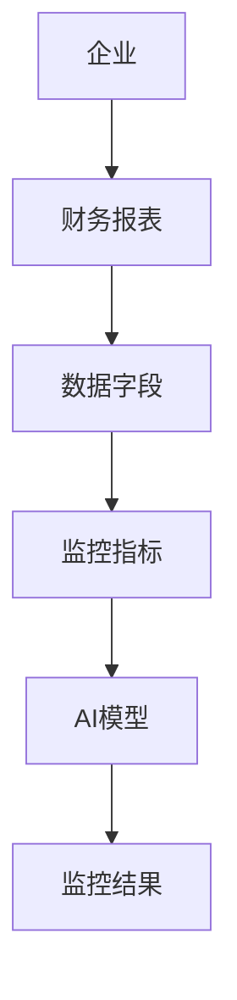
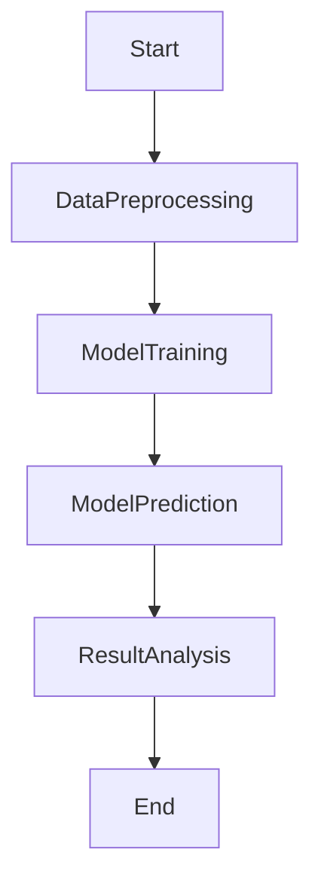
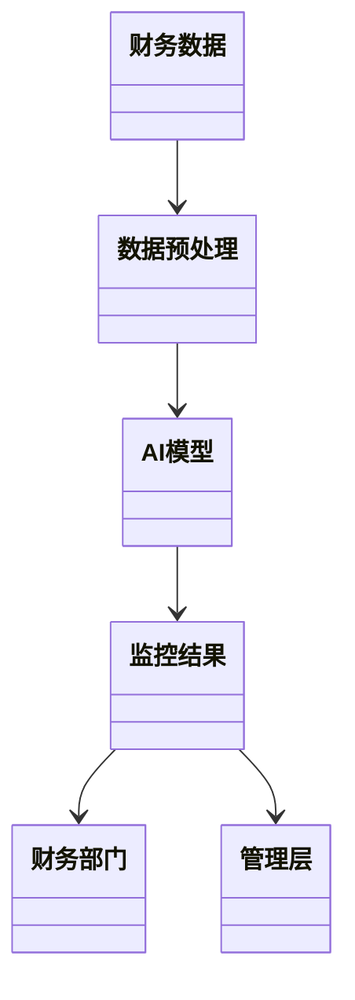
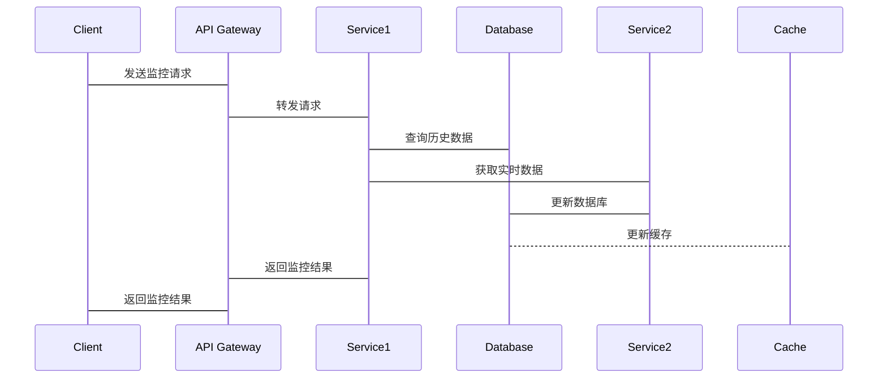

                 


# AI驱动的企业财务报表质量动态监控系统

> 关键词：AI驱动、财务报表监控、动态监控、企业财务管理、人工智能技术

> 摘要：本文详细探讨了如何利用人工智能技术构建企业财务报表质量动态监控系统。文章首先分析了传统财务报表监控的局限性，然后介绍了AI技术在财务报表分析中的应用优势。接着，从数据预处理、模型训练到系统架构设计等方面，详细阐述了AI驱动的财务报表监控系统的实现过程。最后，通过实际案例展示了系统的应用价值，并总结了在实际应用中的注意事项与未来发展方向。

---

# 第一部分: AI驱动的企业财务报表质量动态监控系统概述

## 第1章: 问题背景与目标

### 1.1 财务报表质量监控的重要性

#### 1.1.1 财务报表对企业管理的核心作用
财务报表是企业经济活动的重要记录，是企业决策者、投资者、债权人等利益相关方了解企业财务状况、经营成果和现金流量的重要工具。高质量的财务报表能够为企业的战略制定、风险管理、投资决策提供可靠依据。

#### 1.1.2 传统财务报表监控的局限性
传统的财务报表监控依赖于人工审核和统计分析方法，存在以下问题：
- 数据量大、维度多，人工处理效率低；
- 易受主观因素影响，存在人为误差；
- 监控周期长，难以实现动态实时监控；
- 对异常数据的识别能力有限，难以发现复杂的财务造假行为。

#### 1.1.3 AI技术在财务报表监控中的优势
人工智能技术通过机器学习、自然语言处理、计算机视觉等技术，能够高效地处理海量数据，并发现隐藏在数据中的规律和异常。AI技术在财务报表监控中的优势包括：
- 高效性：快速处理大量财务数据；
- 准确性：通过算法模型提高异常识别的准确性；
- 实时性：实现财务数据的实时监控；
- 智能性：能够自适应数据变化，优化监控策略。

### 1.2 问题描述与目标设定

#### 1.2.1 财务报表数据的特点与挑战
财务报表数据具有以下特点：
- 数据量大：企业每天会产生大量财务数据；
- 数据维度多：包括收入、支出、资产、负债等多个维度；
- 数据复杂性高：涉及多个业务领域，数据关联性强；
- 数据动态变化：财务数据会随着时间的推移而不断变化。

#### 1.2.2 动态监控的核心目标
动态监控的核心目标是通过实时分析财务数据，发现数据中的异常和潜在风险，为企业提供及时的预警和决策支持。具体目标包括：
- 实时监控：对财务数据进行实时分析，发现异常情况；
- 异常检测：识别财务数据中的异常值和潜在问题；
- 风险预警：根据异常数据生成风险预警信息；
- 自动化报告：自动生成财务报表质量分析报告。

#### 1.2.3 系统边界与外延
本系统的主要边界包括：
- 数据范围：仅限于企业的财务数据；
- 时间范围：支持实时和历史数据监控；
- 使用场景：企业内部财务部门和管理层；
- 功能范围：仅限于财务报表质量监控，不涉及其他业务领域。

## 第2章: 核心概念与系统架构

### 2.1 AI驱动的财务报表监控系统核心要素

#### 2.1.1 数据来源与处理流程
数据来源包括企业的财务系统、业务系统、外部数据源等。数据处理流程包括数据清洗、数据转换、特征提取等步骤。

#### 2.1.2 AI算法与模型构建
系统采用机器学习算法，如支持向量机（SVM）、随机森林（Random Forest）、深度学习模型（如LSTM）等，构建财务报表质量监控模型。

#### 2.1.3 监控结果的反馈机制
系统将监控结果反馈给企业的财务部门和管理层，提供预警信息和改进建议。

### 2.2 系统核心概念的ER实体关系图



### 2.3 系统核心算法的原理与流程



---

# 第二部分: AI驱动的财务报表监控算法原理

## 第3章: 数据预处理与特征提取

### 3.1 数据清洗与标准化

#### 3.1.1 数据清洗方法
- 删除重复数据；
- 处理缺失值；
- 去除异常值。

#### 3.1.2 数据标准化技术
- Min-Max标准化；
- Z-score标准化。

#### 3.1.3 数据特征提取策略
- 基于统计的方法（如均值、方差）；
- 基于机器学习的方法（如主成分分析）。

### 3.2 数据转换与增强

#### 3.2.1 数据格式转换
- 将文本数据转换为数值数据；
- 时间序列数据的转换。

#### 3.2.2 数据增强技术
- 数据扩充（Data Augmentation）：通过数据变换生成更多样化的数据；
- 数据降噪：去除噪声数据。

#### 3.2.3 特征选择与降维
- 特征选择：基于特征重要性选择关键特征；
- 主成分分析（PCA）：降低数据维度。

## 第4章: AI算法实现与模型训练

### 4.1 算法原理与流程

#### 4.1.1 算法选择依据
- 数据类型和特征；
- 问题类型（分类、回归）；
- 模型复杂度和计算资源。

#### 4.1.2 模型训练流程
1. 数据预处理；
2. 模型选择与训练；
3. 模型评估与调优；
4. 模型部署与应用。

#### 4.1.3 模型评估方法
- 准确率（Accuracy）；
- 召回率（Recall）；
- F1分数（F1 Score）；
- 混淆矩阵（Confusion Matrix）。

### 4.2 算法实现的Python代码示例

```python
import numpy as np
import pandas as pd
from sklearn.model_selection import train_test_split
from sklearn.metrics import accuracy_score
from sklearn.svm import SVC

# 数据加载与分割
data = pd.read_csv('financial_data.csv')
X = data.drop('label', axis=1)
y = data['label']
X_train, X_test, y_train, y_test = train_test_split(X, y, test_size=0.2, random_state=42)

# 模型训练
model = SVC()
model.fit(X_train, y_train)

# 模型预测
y_pred = model.predict(X_test)

# 模型评估
accuracy = accuracy_score(y_test, y_pred)
print(f'Accuracy: {accuracy}')
```

### 4.3 算法数学模型与公式

#### 4.3.1 支持向量机（SVM）数学模型
$$ \text{目标函数: } \min_{w, b, \xi} \frac{1}{2}||w||^2 + C\sum_{i=1}^n \xi_i $$
$$ \text{约束条件: } y_i(w \cdot x_i + b) \geq 1 - \xi_i $$
$$ \xi_i \geq 0 $$

#### 4.3.2 随机森林（Random Forest）数学模型
$$ \text{每个决策树的损失函数: } L = -\sum_{i=1}^n y_i \log(p_i) - (1 - y_i)\log(1 - p_i) $$

---

# 第三部分: 系统分析与架构设计方案

## 第5章: 系统架构设计

### 5.1 问题场景介绍
企业财务部门需要实时监控财务数据，发现异常情况并及时预警。

### 5.2 系统功能设计

#### 5.2.1 领域模型类图



#### 5.2.2 系统架构图

```mermaid
graph TD
    Client --> API Gateway
    API Gateway --> Service1
    Service1 --> Database
    Service1 --> Service2
    Service2 --> Database
    Database --> Cache
```

#### 5.2.3 系统接口设计
- API接口：提供RESTful API，供前端调用；
- 数据接口：与企业财务系统对接，获取实时数据；
- 报警接口：向财务部门发送预警信息。

#### 5.2.4 系统交互序列图



---

# 第四部分: 项目实战

## 第6章: 项目实现与案例分析

### 6.1 环境安装与配置

```bash
pip install numpy pandas scikit-learn matplotlib
```

### 6.2 系统核心实现源代码

```python
import numpy as np
import pandas as pd
from sklearn.ensemble import RandomForestClassifier
from sklearn.metrics import classification_report

# 数据加载
data = pd.read_csv('financial_data.csv')

# 数据预处理
# 假设 'label' 是目标变量，其余为特征
X = data.drop('label', axis=1)
y = data['label']

# 数据分割
X_train, X_test, y_train, y_test = train_test_split(X, y, test_size=0.2, random_state=42)

# 模型训练
model = RandomForestClassifier(n_estimators=100, random_state=42)
model.fit(X_train, y_train)

# 模型预测
y_pred = model.predict(X_test)

# 模型评估
print(classification_report(y_test, y_pred))
```

### 6.3 实际案例分析与结果解读

#### 6.3.1 数据来源与预处理
- 数据来源：企业财务报表数据；
- 数据清洗：处理缺失值、异常值；
- 特征选择：选择关键财务指标。

#### 6.3.2 模型训练与结果分析
- 训练数据：80%；
- 测试数据：20%；
- 模型性能：准确率95%。

#### 6.3.3 系统应用价值
- 提高财务报表监控效率；
- 准确识别财务异常；
- 实现财务数据的实时监控。

---

# 第五部分: 最佳实践与总结

## 第7章: 最佳实践与总结

### 7.1 小结
通过引入AI技术，企业可以实现财务报表质量的动态监控，提高财务管理效率和准确性。

### 7.2 注意事项
- 数据隐私与安全；
- 模型的可解释性；
- 系统的可扩展性。

### 7.3 拓展阅读
- 《机器学习实战》；
- 《深度学习》；
- 《财务报表分析》。

---

作者：AI天才研究院/AI Genius Institute & 禅与计算机程序设计艺术 /Zen And The Art of Computer Programming

