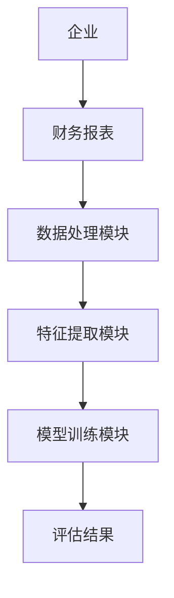
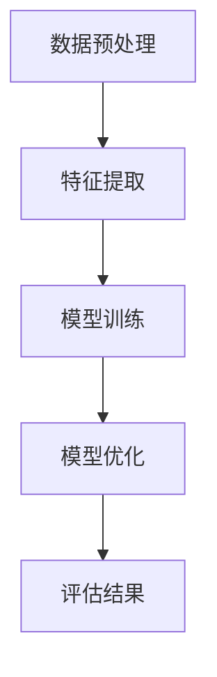
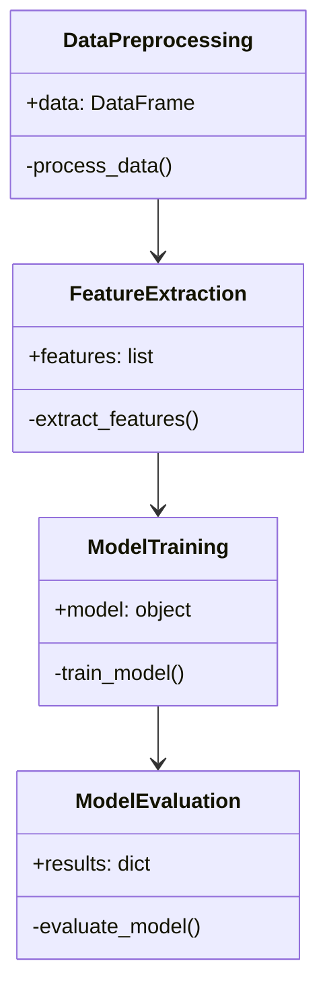
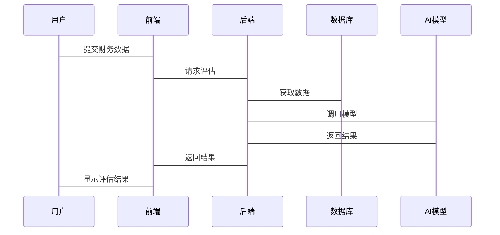

                 


# AI驱动的企业财务报表质量评估系统

> 关键词：AI，财务报表，质量评估，机器学习，深度学习，自然语言处理

> 摘要：随着人工智能技术的快速发展，企业财务报表的评估方式也在不断创新。本文提出了一种基于AI的财务报表质量评估系统，通过机器学习和自然语言处理等技术，实现对财务报表的智能分析和评估。文章详细介绍了系统的构建过程，包括数据预处理、特征提取、模型训练与优化，以及系统架构设计等，最后通过案例分析展示了系统的实际应用效果。

---

# 目录大纲

1. **背景介绍与目标**
   - 1.1 问题背景
     - 1.1.1 企业财务报表的重要性
     - 1.1.2 传统财务报表评估的挑战
     - 1.1.3 AI技术的应用潜力
   - 1.2 问题描述
     - 1.2.1 财务报表数据的特点
     - 1.2.2 传统评估方法的局限性
     - 1.2.3 引入AI技术的必要性
   - 1.3 问题解决思路
     - 1.3.1 AI驱动的评估框架
     - 1.3.2 数据驱动的分析方法
     - 1.3.3 智能决策支持系统设计

2. **核心概念与联系**
   - 2.1 AI驱动的评估系统原理
     - 2.1.1 数据预处理
     - 2.1.2 特征提取
     - 2.1.3 模型训练与优化
   - 2.2 核心概念对比表
   - 2.3 实体关系图

3. **算法原理与实现**
   - 3.1 算法原理
     - 3.1.1 机器学习基础
     - 3.1.2 深度学习模型
     - 3.1.3 模型选择与优化
   - 3.2 算法流程图
   - 3.3 代码实现与数学模型

4. **系统分析与架构设计**
   - 4.1 问题场景介绍
   - 4.2 系统功能设计（领域模型类图）
   - 4.3 系统架构设计（架构图）
   - 4.4 系统接口设计
   - 4.5 系统交互流程（序列图）

5. **项目实战**
   - 5.1 环境安装与配置
   - 5.2 核心功能实现
   - 5.3 代码解读与分析
   - 5.4 案例分析与结果解读
   - 5.5 项目总结与经验分享

6. **最佳实践与小结**
   - 6.1 最佳实践建议
   - 6.2 系统优势与不足
   - 6.3 未来发展方向
   - 6.4 作者介绍

---

# 1. 背景介绍与目标

## 1.1 问题背景

### 1.1.1 企业财务报表的重要性
企业财务报表是反映企业财务状况、经营成果和现金流量的重要文件，是投资者、债权人和管理层进行决策的重要依据。准确的财务报表能够帮助企业在复杂的经济环境中做出正确的决策，从而提升企业的竞争力。

### 1.1.2 传统财务报表评估的挑战
传统的财务报表评估主要依赖于人工分析，这种方式存在以下问题：
- **效率低下**：人工评估需要大量时间，难以满足企业对实时分析的需求。
- **主观性**：不同分析师可能对同一财务报表有不同的解读，导致评估结果的不一致性。
- **复杂性**：财务报表数据复杂，涉及多个科目和指标，人工分析容易出错。
- **数据量大**：现代企业数据量庞大，人工分析难以处理海量数据。

### 1.1.3 AI技术的应用潜力
人工智能技术的发展为财务报表评估提供了新的可能性。通过机器学习、深度学习和自然语言处理等技术，可以实现对财务数据的自动化分析，提高评估的效率和准确性。AI技术能够从大量数据中提取有用的信息，发现潜在的财务风险，从而为企业提供更精准的决策支持。

---

## 1.2 问题描述

### 1.2.1 财务报表数据的特点
财务报表数据具有以下特点：
- **结构化**：数据通常以表格形式呈现，包含多个科目和指标。
- **多样性**：数据可能包含文本、数值等多种类型。
- **动态性**：数据会随着企业经营状况的变化而不断更新。

### 1.2.2 传统评估方法的局限性
传统财务报表评估方法主要依赖于人工分析，存在以下局限性：
- **效率低**：人工分析耗时长，难以应对海量数据。
- **准确性差**：人工分析容易受到主观因素的影响，导致评估结果不准确。
- **难以扩展**：人工分析难以同时处理大量数据，限制了其应用范围。

### 1.2.3 引入AI技术的必要性
引入AI技术可以有效解决传统评估方法的局限性。通过机器学习和深度学习等技术，可以实现对财务数据的自动化分析，提高评估的效率和准确性。同时，AI技术还可以帮助发现潜在的财务风险，为企业提供更精准的决策支持。

---

## 1.3 问题解决思路

### 1.3.1 AI驱动的评估框架
AI驱动的财务报表评估系统主要包括以下几个模块：
1. 数据预处理模块：对财务数据进行清洗和标准化处理。
2. 特征提取模块：从财务数据中提取有用的特征，用于后续的模型训练。
3. 模型训练模块：使用机器学习或深度学习算法对提取的特征进行训练，构建预测模型。
4. 结果分析模块：对模型的预测结果进行分析和解释，生成评估报告。

### 1.3.2 数据驱动的分析方法
数据驱动的分析方法通过利用大量数据，发现数据中的潜在规律和模式，从而提高评估的准确性。这种方法可以有效地处理复杂性和多样性问题。

### 1.3.3 智能决策支持系统设计
智能决策支持系统通过整合AI技术，为企业提供实时的财务分析和决策支持。系统可以自动分析财务数据，生成评估报告，并提供个性化的决策建议。

---

# 2. 核心概念与联系

## 2.1 AI驱动的评估系统原理

### 2.1.1 数据预处理
数据预处理是AI驱动的评估系统的第一步，主要包括数据清洗、标准化和特征工程。数据清洗的目的是去除噪声数据，确保数据的准确性和一致性。标准化是将数据转换到相同的尺度，便于模型训练。特征工程是通过提取有用的特征，提高模型的性能。

### 2.1.2 特征提取
特征提取是从财务数据中提取有用的特征，用于后续的模型训练。常用的特征包括财务比率、财务趋势和文本特征等。特征提取的目的是提高模型的准确性和可解释性。

### 2.1.3 模型训练与优化
模型训练是通过机器学习或深度学习算法对提取的特征进行训练，构建预测模型。模型优化是通过调整模型参数和选择合适的算法，提高模型的性能。

---

## 2.2 核心概念对比表

| 概念 | 描述 | 特点 |
|------|------|------|
| 数据来源 | 财务报表数据、外部数据 | 多源性、多样性 |
| 模型类型 | 传统机器学习、深度学习 | 适用性、复杂性 |
| 评估指标 | 准确率、召回率 | 综合性、可解释性 |

---

## 2.3 实体关系图



---

# 3. 算法原理与实现

## 3.1 算法原理

### 3.1.1 机器学习基础
机器学习是一种通过数据训练模型的技术，可以分为监督学习、无监督学习和半监督学习。监督学习适用于分类和回归问题，无监督学习适用于聚类和降维问题。

### 3.1.2 深度学习模型
深度学习是一种基于人工神经网络的机器学习技术，能够从数据中自动提取特征。常用的深度学习模型包括卷积神经网络（CNN）、循环神经网络（RNN）和长短期记忆网络（LSTM）。

### 3.1.3 模型选择与优化
模型选择需要根据具体问题选择合适的算法，并通过交叉验证和网格搜索等方法优化模型的参数。

---

## 3.2 算法流程图



---

## 3.3 代码实现与数学模型

### 3.3.1 代码实现

```python
import pandas as pd
from sklearn.model_selection import train_test_split
from sklearn.linear_model import LogisticRegression
from sklearn.metrics import accuracy_score

# 数据加载与预处理
data = pd.read_csv('financial_data.csv')
X = data.drop('target', axis=1)
y = data['target']

# 数据分割
X_train, X_test, y_train, y_test = train_test_split(X, y, test_size=0.2)

# 模型训练
model = LogisticRegression()
model.fit(X_train, y_train)

# 模型预测
y_pred = model.predict(X_test)

# 模型评估
accuracy = accuracy_score(y_test, y_pred)
print(f'Accuracy: {accuracy}')
```

### 3.3.2 数学模型
$$
\text{损失函数} = -\frac{1}{m}\sum_{i=1}^{m} [y_i \log(h(x_i)) + (1 - y_i) \log(1 - h(x_i))]
$$

$$
\text{优化方法} = \text{随机梯度下降}
$$

---

# 4. 系统分析与架构设计

## 4.1 问题场景介绍
系统需要解决企业财务报表评估效率低、准确性差的问题，通过AI技术实现自动化评估。

## 4.2 系统功能设计（领域模型类图）



## 4.3 系统架构设计（架构图）


## 4.4 系统接口设计
- 数据输入接口：接收财务数据。
- 模型调用接口：调用AI模型进行预测。
- 结果输出接口：输出评估结果。

## 4.5 系统交互流程（序列图）



---

# 5. 项目实战

## 5.1 环境安装与配置
- 安装Python和必要的库（如pandas、scikit-learn）。
- 安装Jupyter Notebook用于开发和测试。

## 5.2 核心功能实现
- 数据预处理：清洗和标准化。
- 特征提取：提取有用的特征。
- 模型训练：训练机器学习模型。
- 模型评估：评估模型的性能。

## 5.3 代码解读与分析
```python
import pandas as pd
from sklearn.ensemble import RandomForestClassifier
from sklearn.metrics import classification_report

# 数据加载与预处理
data = pd.read_csv('financial_data.csv')
X = data.drop('target', axis=1)
y = data['target']

# 特征选择
selected_features = ['revenue', 'profit', 'assets']
X = data[selected_features]

# 数据分割
X_train, X_test, y_train, y_test = train_test_split(X, y, test_size=0.2)

# 模型训练
model = RandomForestClassifier()
model.fit(X_train, y_train)

# 模型预测
y_pred = model.predict(X_test)

# 模型评估
print(classification_report(y_test, y_pred))
```

## 5.4 案例分析与结果解读
以某企业为例，分析其财务报表数据，生成评估报告。

## 5.5 项目总结与经验分享
总结项目实施的经验和教训，提出改进建议。

---

# 6. 最佳实践与小结

## 6.1 最佳实践建议
- 数据预处理是关键，确保数据的准确性和一致性。
- 特征提取要结合业务需求，选择合适的特征。
- 模型选择要根据数据特点和业务需求进行优化。

## 6.2 系统优势与不足
- 优势：高效、准确、可扩展。
- 不足：依赖高质量的数据，模型解释性可能较差。

## 6.3 未来发展方向
- 结合NLP技术，进一步提高模型的准确性。
- 引入实时数据流处理，实现动态评估。
- 拓展应用场景，如财务风险预警。

## 6.4 作者介绍
作者：AI天才研究院/AI Genius Institute & 禅与计算机程序设计艺术/Zen And The Art of Computer Programming

---

# 结语
通过本文的介绍，读者可以深入了解AI驱动的企业财务报表质量评估系统的构建过程和实际应用。希望本文能够为相关领域的研究和实践提供有价值的参考。

