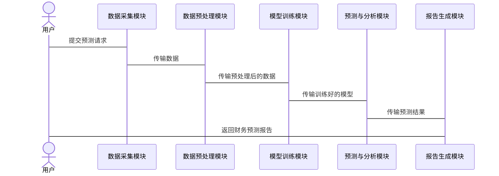

                 


# AI驱动的企业财务报表预测与分析系统

> 关键词：AI技术，企业财务报表预测，财务数据分析，机器学习，深度学习，自然语言处理

> 摘要：随着人工智能技术的快速发展，企业财务报表预测与分析正逐渐从传统的统计方法向智能化、自动化方向转变。本文将详细介绍AI在企业财务报表预测中的应用，探讨其核心算法原理、系统架构设计以及实际项目实现，为企业财务管理人员和技术开发者提供有价值的参考。

---

# 第一部分: AI驱动的企业财务报表预测与分析系统概述

---

# 第一章: AI与企业财务报表预测的背景

## 1.1 企业财务报表预测的背景

### 1.1.1 传统财务报表分析的局限性

传统的财务报表分析主要依赖于财务人员的经验和人工计算，这种方式不仅效率低下，而且容易受到主观因素的影响。以下是传统财务报表分析的主要局限性：

1. **数据处理效率低**：手动收集、整理和分析财务数据耗时耗力，难以应对海量数据的处理需求。
2. **结果准确性有限**：财务预测结果依赖于分析人员的经验和判断，存在人为误差。
3. **缺乏实时性**：传统分析方法难以实现对财务数据的实时监控和预测。

### 1.1.2 AI技术在财务分析中的应用前景

人工智能技术的快速发展为企业财务报表预测带来了新的可能性。AI技术在以下方面展现出显著优势：

1. **数据处理能力**：AI能够快速处理大量复杂数据，提高财务分析的效率。
2. **预测准确性**：通过机器学习算法，AI能够从历史数据中发现规律，从而提高财务预测的准确性。
3. **实时性与自动化**：AI系统可以实时监控财务数据，并自动进行预测和分析。

### 1.1.3 企业财务预测的痛点与需求

企业在财务预测过程中面临的主要痛点包括：

1. **数据复杂性**：企业财务数据通常涉及多个维度，包括收入、支出、利润等，数据复杂性较高。
2. **预测需求多样化**：企业需要对未来的收入、成本、利润等多个指标进行预测，需求多样化。
3. **实时性与动态调整**：市场环境不断变化，企业需要动态调整财务预测模型。

---

## 1.2 AI驱动的财务预测的核心概念

### 1.2.1 什么是AI驱动的财务预测

AI驱动的财务预测是指利用人工智能技术（如机器学习、深度学习等）对企业的财务数据进行分析和建模，从而实现对未来财务状况的预测。

### 1.2.2 财务预测的关键要素

财务预测的关键要素包括：

1. **数据来源**：企业的财务报表数据、市场数据、行业数据等。
2. **预测模型**：基于机器学习的回归模型、时间序列模型等。
3. **预测目标**：如收入预测、成本预测、利润预测等。

### 1.2.3 AI在财务预测中的作用

AI在财务预测中的作用主要体现在以下几个方面：

1. **数据处理与清洗**：AI能够自动处理和清洗财务数据，提高数据质量。
2. **特征提取**：AI能够从海量数据中提取有用的特征，为预测模型提供输入。
3. **模型训练与优化**：通过机器学习算法，AI能够训练出高效的预测模型，并进行参数优化。

---

## 1.3 本书的核心目标与结构

### 1.3.1 本书的核心目标

本书的核心目标是通过系统化的讲解，帮助读者理解AI技术在企业财务报表预测中的应用，并掌握如何利用AI技术构建高效的财务预测系统。

### 1.3.2 本书的结构安排

本书的结构安排如下：

1. **第一部分**：AI驱动的企业财务报表预测与分析系统概述。
2. **第二部分**：企业财务报表预测的核心概念与联系。
3. **第三部分**：AI驱动的财务预测算法原理。
4. **第四部分**：系统分析与架构设计方案。
5. **第五部分**：项目实战与实现。
6. **第六部分**：总结与展望。

### 1.3.3 读者对象与预期收获

读者对象包括：

- 企业财务管理人员
- 数据科学家
- AI开发人员

预期收获包括：

- 理解AI技术在财务预测中的应用
- 掌握核心算法的实现原理
- 学会构建AI驱动的财务预测系统

---

# 第二章: 企业财务报表预测的核心概念

## 2.1 财务报表预测的基本原理

### 2.1.1 财务报表预测的定义

财务报表预测是指通过分析企业的历史财务数据，利用数学模型和算法，预测未来某一时间段内的财务状况。

### 2.1.2 财务报表预测的分类

财务报表预测可以分为以下几种类型：

1. **收入预测**：预测未来一段时间内的收入情况。
2. **成本预测**：预测未来一段时间内的成本支出。
3. **利润预测**：预测未来一段时间内的利润情况。
4. **现金流预测**：预测未来一段时间内的现金流情况。

### 2.1.3 财务预测的关键指标

财务预测的关键指标包括：

- 收入增长率
- 成本占比
- 利润率
- 现金流净额

---

## 2.2 AI在财务预测中的核心作用

### 2.2.1 数据驱动的预测优势

AI技术通过数据驱动的方式，能够从大量历史数据中发现规律，从而提高预测的准确性。

### 2.2.2 AI算法在财务预测中的应用

常见的AI算法在财务预测中的应用包括：

1. **线性回归**：用于简单的线性关系预测。
2. **随机森林**：用于非线性关系的预测。
3. **神经网络**：用于复杂的非线性关系预测。

### 2.2.3 财务预测的模型选择

模型选择需要根据具体的预测目标和数据特征来决定。例如，对于时间序列数据，可以使用ARIMA模型；对于分类问题，可以使用支持向量机（SVM）等。

---

## 2.3 财务数据与AI模型的关系

### 2.3.1 财务数据的特征分析

财务数据的特征包括：

- 时间序列性
- 数值型数据
- 多维度性

### 2.3.2 数据预处理的重要性

数据预处理是财务预测的关键步骤，主要包括：

- 数据清洗：处理缺失值、异常值等。
- 数据标准化：对数据进行归一化处理。
- 特征工程：提取有用的特征。

### 2.3.3 模型输入与输出的关系

模型输入通常是经过预处理的财务数据，模型输出是预测的财务指标。

---

## 2.4 财务预测的边界与外延

### 2.4.1 财务预测的适用范围

财务预测适用于以下场景：

- 企业预算管理
- 投资决策
- 风险评估

### 2.4.2 财务预测的局限性

财务预测的局限性包括：

- 数据的不确定性
- 市场环境的变化
- 模型的假设限制

### 2.4.3 财务预测的未来发展趋势

财务预测的未来发展趋势包括：

- 更加智能化的预测系统
- 多模态数据的融合
- 自适应性更强的预测模型

---

# 第三章: AI驱动的财务预测算法原理

## 3.1 线性回归模型

### 3.1.1 线性回归的基本原理

线性回归是一种简单而有效的回归算法，其基本假设是因变量与自变量之间存在线性关系。

### 3.1.2 线性回归的数学模型

线性回归的数学模型如下：

$$ y = \beta_0 + \beta_1x + \epsilon $$

其中：
- $y$ 是因变量
- $x$ 是自变量
- $\beta_0$ 是截距
- $\beta_1$ 是回归系数
- $\epsilon$ 是误差项

### 3.1.3 线性回归的实现步骤

1. 数据准备：收集并整理数据。
2. 数据预处理：进行标准化处理。
3. 模型训练：使用最小二乘法求解回归系数。
4. 模型评估：计算R²值，评估模型的拟合优度。

---

## 3.2 随机森林模型

### 3.2.1 随机森林的基本原理

随机森林是一种基于决策树的集成学习算法，通过构建多棵决策树并进行投票或平均，从而提高模型的准确性和稳定性。

### 3.2.2 随机森林的特征重要性分析

随机森林可以通过特征重要性分析，找出对预测结果影响最大的特征。

---

## 3.3 神经网络模型

### 3.3.1 神经网络的基本结构

神经网络的基本结构包括输入层、隐藏层和输出层。

### 3.3.2 神经网络的训练过程

神经网络的训练过程包括正向传播和反向传播两个阶段。

### 3.3.3 神经网络的优缺点

优点：
- 能够处理复杂的非线性关系
- 具有良好的泛化能力

缺点：
- 训练时间较长
- 对参数敏感

---

## 3.4 支持向量机（SVM）

### 3.4.1 SVM的基本原理

支持向量机是一种基于统计学习理论的分类算法，通过找到一个最优超平面，将数据分成不同的类别。

### 3.4.2 SVM的核函数选择

常见的核函数包括线性核、多项式核、径向基函数（RBF）核等。

### 3.4.3 SVM在回归任务中的应用

支持向量回归（SVR）是一种基于SVM的回归算法，适用于小样本数据的回归任务。

---

# 第四章: 系统分析与架构设计方案

## 4.1 问题场景介绍

企业财务预测系统需要实现以下功能：

1. 数据采集：从企业财务系统中获取财务数据。
2. 数据预处理：对数据进行清洗和标准化处理。
3. 模型训练：基于历史数据训练预测模型。
4. 预测与分析：利用训练好的模型进行财务预测，并生成分析报告。

---

## 4.2 项目介绍

### 4.2.1 项目目标

本项目的目标是构建一个基于AI的企业财务预测系统，实现对企业未来财务状况的准确预测。

### 4.2.2 系统功能设计

系统功能模块包括：

- 数据采集模块
- 数据预处理模块
- 模型训练模块
- 预测与分析模块
- 报告生成模块

### 4.2.3 系统架构设计

系统架构设计如下：


---

## 4.3 系统接口设计

系统接口设计包括：

1. 数据接口：与企业财务系统对接，获取财务数据。
2. 模型接口：与AI算法框架（如TensorFlow、PyTorch）对接，进行模型训练。
3. 报告接口：生成并输出财务预测报告。

---

## 4.4 系统交互设计

系统交互流程如下：



---

## 4.5 系统功能模块实现

### 4.5.1 数据采集模块

数据采集模块的主要功能包括：

1. 从企业财务系统中获取财务数据。
2. 将数据存储到数据库中。

### 4.5.2 数据预处理模块

数据预处理模块的主要功能包括：

1. 数据清洗：处理缺失值、异常值等。
2. 数据标准化：对数据进行归一化处理。
3. 特征工程：提取有用的特征。

### 4.5.3 模型训练模块

模型训练模块的主要功能包括：

1. 选择合适的机器学习算法。
2. 对数据进行训练，得到预测模型。

### 4.5.4 预测与分析模块

预测与分析模块的主要功能包括：

1. 利用训练好的模型进行财务预测。
2. 对预测结果进行分析和解释。

### 4.5.5 报告生成模块

报告生成模块的主要功能包括：

1. 生成财务预测报告。
2. 将报告以可视化形式呈现。

---

# 第五章: 项目实战与实现

## 5.1 环境安装与配置

### 5.1.1 安装Python环境

```bash
python --version
pip install --upgrade pip
```

### 5.1.2 安装必要的库

```bash
pip install numpy pandas scikit-learn matplotlib
```

---

## 5.2 核心代码实现

### 5.2.1 数据采集与预处理

```python
import pandas as pd
import numpy as np

# 数据采集
data = pd.read_csv('financial_data.csv')

# 数据预处理
# 处理缺失值
data = data.dropna()

# 数据标准化
from sklearn.preprocessing import StandardScaler
scaler = StandardScaler()
scaled_data = scaler.fit_transform(data)
```

### 5.2.2 模型训练与预测

```python
from sklearn.linear_model import LinearRegression
from sklearn.metrics import mean_squared_error

# 训练线性回归模型
model = LinearRegression()
model.fit(scaled_data[:, 0:10], scaled_data[:, 10])

# 预测
predicted = model.predict(scaled_data[:, 0:10])
```

### 5.2.3 模型评估

```python
mse = mean_squared_error(scaled_data[:, 10], predicted)
print(f"均方误差: {mse}")
```

---

## 5.3 项目总结与优化

### 5.3.1 项目总结

通过本项目，我们实现了基于AI的企业财务预测系统，能够对企业未来财务状况进行准确预测。

### 5.3.2 项目优化

1. **模型优化**：尝试使用其他机器学习算法（如随机森林、神经网络）进行预测，比较不同算法的性能。
2. **数据优化**：引入更多的数据源，如市场数据、行业数据等，提高预测的准确性。
3. **系统优化**：优化系统的交互设计，提高用户体验。

---

# 第六章: 总结与展望

## 6.1 本书总结

本书系统地介绍了AI技术在企业财务报表预测中的应用，详细讲解了核心算法的实现原理和系统架构设计。

## 6.2 未来展望

随着AI技术的不断发展，企业财务预测系统将更加智能化和自动化。未来的研究方向包括：

1. **多模态数据融合**：结合文本数据和结构化数据，提高预测的准确性。
2. **自适应模型**：开发能够自适应市场变化的预测模型。
3. **实时预测**：实现财务数据的实时预测和监控。

---

## 6.3 最佳实践Tips

1. 在实际应用中，建议结合企业的具体业务场景选择合适的算法。
2. 数据预处理是财务预测的关键步骤，需要仔细处理。
3. 模型评估是预测系统的重要环节，建议使用多种评估指标。

---

## 6.4 作者信息

作者：AI天才研究院/AI Genius Institute & 禅与计算机程序设计艺术 /Zen And The Art of Computer Programming

---

# 结语

通过本书的阅读和学习，读者将能够掌握AI技术在企业财务报表预测中的应用，为企业财务管理的智能化转型提供有力支持。

