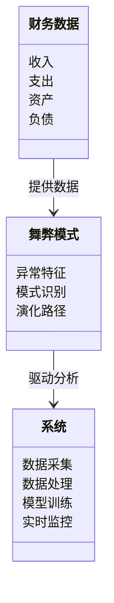
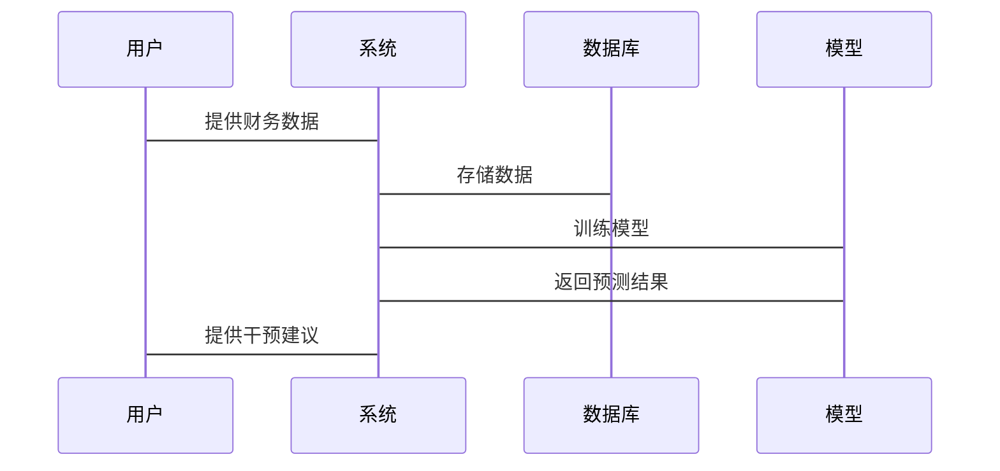

                 


# AI驱动的企业财务舞弊模式演化跟踪系统

> 关键词：AI，企业财务舞弊，模式演化，跟踪系统，机器学习

> 摘要：本文探讨了如何利用人工智能技术构建企业财务舞弊模式演化跟踪系统，通过分析财务数据的异常特征，识别舞弊模式，并预测其演化路径，从而实现对舞弊行为的有效跟踪和干预。文章详细介绍了系统的核心概念、算法原理、系统架构设计、项目实现以及实际案例分析，为企业的财务风险管理提供了新的思路和解决方案。

---

## 第1章 背景介绍

### 1.1 问题背景

#### 1.1.1 企业财务舞弊的现状与挑战
企业财务舞弊是全球范围内普遍存在的问题，其形式多样且隐蔽性高。传统财务审计方法依赖人工审查，效率低下且容易遗漏复杂的舞弊模式。近年来，随着企业规模的扩大和财务数据的复杂化，传统的财务舞弊检测方法已难以应对新型舞弊手段的挑战。

#### 1.1.2 传统财务舞弊检测的局限性
传统财务舞弊检测方法主要依赖审计人员的经验和主观判断，存在以下问题：
- 数据量大：企业财务数据量庞大，人工审查效率低。
- 模式多样：舞弊行为不断演化，传统方法难以覆盖所有可能的舞弊模式。
- 成本高昂：人工审查需要大量时间和资源投入。

#### 1.1.3 AI技术在财务舞弊检测中的潜力
人工智能技术（如机器学习、深度学习）具有数据处理能力强、模式识别准确等特点，能够有效应对财务舞弊检测中的挑战。AI技术可以实时分析海量数据，识别异常模式，并预测舞弊行为的演化路径，从而实现对舞弊行为的早期预警和干预。

### 1.2 问题描述

#### 1.2.1 财务舞弊模式的定义与分类
财务舞弊模式是指企业在财务报表或其他财务数据中，通过虚构、篡改或隐瞒信息等手段，误导利益相关者的行为模式。常见的舞弊模式包括虚假收入确认、资产虚增、费用隐瞒等。

#### 1.2.2 舞弊模式的演化特征
舞弊模式并非固定不变，而是会随着时间推移不断演化。例如，企业可能从简单的虚构收入逐渐转向更为复杂的关联交易舞弊，或者通过隐蔽的内部操控掩盖舞弊行为。舞弊模式的演化主要受以下因素驱动：
- 监管力度：监管政策的变化会影响舞弊行为的方式。
- 技术进步：企业利用新技术掩盖舞弊行为的可能性增加。
- 市场环境：经济波动和市场竞争压力可能促使企业采取舞弊行为。

#### 1.2.3 跟踪系统的目标与意义
系统的目的是通过实时分析企业财务数据，识别潜在的舞弊模式，并预测其演化路径，从而帮助企业及时采取干预措施，降低财务风险。系统的意义在于：
- 提高财务审计效率：通过自动化分析替代部分人工审查工作。
- 降低舞弊风险：早期发现潜在舞弊行为，避免重大财务损失。
- 优化企业治理：通过分析舞弊模式，帮助企业完善内部控制机制。

### 1.3 问题解决

#### 1.3.1 AI驱动的解决方案概述
AI驱动的财务舞弊模式演化跟踪系统通过以下步骤实现舞弊检测和跟踪：
1. 数据采集：收集企业的财务数据（如收入、支出、资产等）。
2. 数据预处理：清洗数据，处理缺失值和异常值。
3. 特征提取：从财务数据中提取有助于识别舞弊模式的特征。
4. 模型训练：利用机器学习算法训练舞弊检测模型。
5. 跟踪与演化预测：实时跟踪财务数据，预测舞弊模式的演化路径。

#### 1.3.2 系统设计的核心思路
系统的整体设计思路可以总结为“数据驱动、智能分析、实时跟踪”。具体包括：
- 数据驱动：以企业财务数据为基础，结合外部数据（如行业基准数据）进行分析。
- 智能分析：利用机器学习算法识别舞弊模式，并预测其演化路径。
- 实时跟踪：通过实时监控企业财务数据的变化，及时发现潜在舞弊行为。

#### 1.3.3 系统实现的关键技术
系统实现的关键技术包括：
- 数据挖掘：从海量数据中提取有价值的信息。
- 机器学习：用于分类、聚类和预测。
- 自然语言处理（NLP）：用于分析财务报告中的文本信息。
- 时间序列分析：用于分析财务数据的时间依赖性。

### 1.4 系统的边界与外延

#### 1.4.1 系统的功能边界
系统的功能主要集中在财务数据的采集、分析和跟踪，不涉及企业的日常财务管理或其他业务系统。

#### 1.4.2 系统的适用范围
系统适用于各类企业，尤其是需要处理大量财务数据的企业。系统特别适合用于检测企业财务舞弊行为，优化财务风险管理。

#### 1.4.3 系统与外部环境的交互
系统需要与企业的财务系统、数据库和其他业务系统进行交互，获取必要的数据支持。

### 1.5 核心概念结构与组成

#### 1.5.1 核心概念的层次结构
- **上层概念**：舞弊模式、演化路径、跟踪系统。
- **中层概念**：数据特征、模式识别、预测模型。
- **底层概念**：财务数据、异常检测、实时监控。

#### 1.5.2 核心要素的组成与关系
- **数据特征**：财务数据的异常特征是识别舞弊模式的基础。
- **模式识别**：通过机器学习算法识别舞弊模式。
- **预测模型**：基于历史数据预测舞弊模式的演化路径。

#### 1.5.3 系统的整体架构
系统的整体架构包括数据采集模块、数据预处理模块、模式识别模块、预测模块和实时跟踪模块。各模块协同工作，实现对舞弊模式的实时跟踪和预测。

---

## 第2章 核心概念与联系

### 2.1 舞弊模式的特征分析

#### 2.1.1 财务数据的异常特征
财务数据的异常特征包括：
- 销售收入与成本的不匹配。
- 资产与负债的异常变动。
- 现金流量的异常波动。

#### 2.1.2 舞弊行为的模式特征
舞弊行为的模式特征包括：
- 重复交易：同一交易多次发生，掩盖真实财务状况。
- 虚假关联交易：通过关联交易转移资金或资产。
- 会计调整：通过不当会计处理掩盖舞弊行为。

#### 2.1.3 舞弊模式的演化特征
舞弊模式的演化特征包括：
- 行为复杂化：舞弊手段逐渐复杂化，难以被传统方法识别。
- 时间依赖性：舞弊行为往往具有时间依赖性，集中发生在特定时间段。
- 隐蔽性增强：舞弊行为逐渐隐蔽化，难以被发现。

### 2.2 舞弊模式的演化机制

#### 2.2.1 舞弊模式的演化路径
舞弊模式的演化路径可以分为以下几个阶段：
1. **初始阶段**：企业开始尝试小规模的舞弊行为。
2. **发展阶段**：舞弊行为逐渐扩大，涉及更多部门和人员。
3. **成熟阶段**：舞弊行为趋于系统化，形成复杂的舞弊网络。
4. **衰退阶段**：由于监管加强或内部审计，舞弊行为逐渐减少或转移。

#### 2.2.2 舞弊模式的驱动因素
舞弊模式的驱动因素包括：
- **内部因素**：企业内部管理混乱、内控机制缺失。
- **外部因素**：市场竞争压力、监管政策变化。
- **技术因素**：企业利用新技术掩盖舞弊行为。

#### 2.2.3 舞弊模式的预测模型
舞弊模式的预测模型需要考虑以下因素：
- 财务数据的时间序列特征。
- 企业的行业特征。
- 舞弊行为的历史数据。

### 2.3 跟踪系统的原理

#### 2.3.1 数据采集与处理
系统通过企业财务系统接口获取财务数据，包括收入、支出、资产、负债等。数据采集后需要进行清洗和预处理，确保数据的完整性和准确性。

#### 2.3.2 模式识别与跟踪
系统利用机器学习算法对财务数据进行模式识别，发现异常特征。识别出的异常特征会被标记为潜在舞弊模式，并通过实时监控功能进行跟踪。

#### 2.3.3 路径预测与干预
系统基于历史数据和当前数据，预测舞弊模式的演化路径，并根据预测结果制定干预措施。干预措施可能包括加强内部审计、调整财务政策等。

### 2.4 核心概念对比表

| 概念 | 特征 | 描述 |
|------|------|------|
| 舞弊模式 | 异常性 | 数据中的异常特征 |
| 舞弊模式 | 模式性 | 行为的模式特征 |
| 舞弊模式 | 演化性 | 模式的动态变化 |
| 跟踪系统 | 数据驱动 | 基于数据的分析 |
| 跟踪系统 | 智能性 | 利用机器学习技术进行分析 |

### 2.5 核心概念的ER实体关系图

```mermaid
erDiagram
    actor 用户
    actor 系统
    actor 数据库
    actor 财务系统
    actor 审计机构

    用户 -> 系统 : 提供数据
    系统 -> 数据库 : 存储数据
    系统 -> 财务系统 : 获取财务数据
    系统 -> 审计机构 : 生成报告
```

---

## 第3章 算法原理讲解

### 3.1 算法选择与原理

#### 3.1.1 算法选择
系统采用监督学习算法中的逻辑回归（Logistic Regression）和随机森林（Random Forest）进行分类。逻辑回归适用于二分类问题，随机森林则能够处理多分类问题，并具有较强的特征重要性分析能力。

#### 3.1.2 算法原理
- **逻辑回归**：
  - 假设数据服从伯努利分布。
  - 通过极大似然估计求解参数。
  - 适用于线性可分的二分类问题。

- **随机森林**：
  - 由多个决策树组成，通过投票机制进行分类。
  - 具有较强的抗过拟合能力。
  - 能够进行特征重要性分析。

### 3.2 数据预处理

#### 3.2.1 数据清洗
- 处理缺失值：使用均值、中位数或插值法填补缺失值。
- 处理异常值：通过Z-score或IQR方法识别并处理异常值。

#### 3.2.2 数据标准化
- 对特征进行标准化处理，确保不同特征的量纲一致。

### 3.3 特征提取

#### 3.3.1 特征选择
- 使用相关性分析和随机森林特征重要性分析选择关键特征。

#### 3.3.2 特征工程
- 构造复合特征：例如，收入与支出的比率、资产与负债的比率等。

### 3.4 模型训练

#### 3.4.1 训练流程
1. 数据分割：将数据划分为训练集和测试集。
2. 模型训练：在训练集上训练逻辑回归和随机森林模型。
3. 模型评估：通过准确率、召回率、F1分数等指标评估模型性能。

#### 3.4.2 训练代码示例
```python
import pandas as pd
from sklearn.model_selection import train_test_split
from sklearn.linear_model import LogisticRegression
from sklearn.ensemble import RandomForestClassifier
from sklearn.metrics import accuracy_score, recall_score, f1_score

# 加载数据
data = pd.read_csv('financial_data.csv')

# 特征选择
features = ['revenue', 'cost', 'assets', 'liabilities']
target = 'is_fraud'

X = data[features]
y = data[target]

# 数据分割
X_train, X_test, y_train, y_test = train_test_split(X, y, test_size=0.2, random_state=42)

# 训练逻辑回归模型
lr_model = LogisticRegression()
lr_model.fit(X_train, y_train)

# 训练随机森林模型
rf_model = RandomForestClassifier()
rf_model.fit(X_train, y_train)

# 模型预测
y_pred_lr = lr_model.predict(X_test)
y_pred_rf = rf_model.predict(X_test)

# 模型评估
print("逻辑回归准确率:", accuracy_score(y_test, y_pred_lr))
print("随机森林准确率:", accuracy_score(y_test, y_pred_rf))
print("逻辑回归召回率:", recall_score(y_test, y_pred_lr))
print("随机森林召回率:", recall_score(y_test, y_pred_rf))
print("逻辑回归F1分数:", f1_score(y_test, y_pred_lr))
print("随机森林F1分数:", f1_score(y_test, y_pred_rf))
```

### 3.5 路径预测与干预

#### 3.5.1 路径预测
- 利用时间序列分析预测舞弊模式的演化路径。
- 使用ARIMA模型或LSTM模型进行时间序列预测。

#### 3.5.2 干预策略
- 根据预测结果制定干预措施，例如：
  - 加强内部审计。
  - 调整财务政策。
  - 优化内部控制流程。

---

## 第4章 系统分析与架构设计方案

### 4.1 问题场景介绍

#### 4.1.1 财务舞弊检测的复杂性
财务舞弊检测需要考虑多个因素，包括数据的复杂性、舞弊行为的隐蔽性等。

#### 4.1.2 系统需求分析
系统需求包括：
- 实时数据采集。
- 高效数据分析。
- 准确的舞弊模式识别。

### 4.2 项目介绍

#### 4.2.1 项目目标
- 实现企业财务舞弊模式的实时检测和演化跟踪。
- 提供智能化的财务风险管理解决方案。

#### 4.2.2 项目范围
- 数据采集与处理。
- 模型训练与部署。
- 系统监控与维护。

### 4.3 系统功能设计

#### 4.3.1 领域模型


#### 4.3.2 系统架构设计


#### 4.3.3 系统接口设计
- 数据接口：与企业财务系统对接，获取财务数据。
- 模型接口：与机器学习模型对接，进行模式识别和预测。
- 用户接口：提供用户查询和干预措施的反馈。

#### 4.3.4 系统交互


---

## 第5章 项目实战

### 5.1 环境安装

#### 5.1.1 系统环境
- 操作系统：Linux/Windows/MacOS
- Python版本：3.6+

#### 5.1.2 依赖安装
```bash
pip install pandas scikit-learn matplotlib seaborn
```

### 5.2 核心实现

#### 5.2.1 数据处理
```python
import pandas as pd
import numpy as np

# 数据加载与预处理
data = pd.read_csv('financial_data.csv')
data = data.dropna()
data = (data - data.mean()) / data.std()  # 标准化
```

#### 5.2.2 模型实现
```python
from sklearn.ensemble import RandomForestClassifier
from sklearn.metrics import accuracy_score

# 模型训练
model = RandomForestClassifier()
model.fit(X_train, y_train)

# 模型预测
y_pred = model.predict(X_test)
print("准确率:", accuracy_score(y_test, y_pred))
```

#### 5.2.3 实时监控
```python
import pandas as pd
import time

# 实时数据获取
def get_realtime_data():
    # 获取实时数据
    return pd.read_csv('realtime.csv')

# 实时监控
while True:
    data = get_realtime_data()
    # 数据处理
    # 模型预测
    # 结果输出
    print("当前舞弊风险:", risk_level)
    time.sleep(60)
```

### 5.3 案例分析

#### 5.3.1 案例背景
某企业财务数据中发现收入与成本匹配异常，可能存在虚假收入确认的舞弊行为。

#### 5.3.2 数据分析
通过机器学习模型分析，发现收入与成本的比率显著高于行业平均水平，且存在大量关联交易。

#### 5.3.3 路径预测
模型预测该企业的舞弊模式可能进一步演化为通过关联交易转移资产，建议加强内部审计和关联交易审查。

---

## 第6章 最佳实践与总结

### 6.1 小结
本文详细介绍了AI驱动的企业财务舞弊模式演化跟踪系统的设计与实现，重点讲解了系统的核心概念、算法原理、系统架构设计以及项目实战。通过机器学习技术，系统能够有效识别财务数据中的异常特征，预测舞弊模式的演化路径，并提供相应的干预措施。

### 6.2 注意事项
- 数据隐私：系统设计时需注意数据隐私保护。
- 模型优化：定期更新模型，确保其准确性。
- 系统维护：定期检查系统运行状态，及时修复问题。

### 6.3 未来展望
未来，随着AI技术的不断发展，财务舞弊模式演化跟踪系统将更加智能化和自动化。可能的发展方向包括：
- 更加复杂的时间序列分析模型。
- 结合自然语言处理技术，分析财务报告中的文本信息。
- 实现多维度的舞弊模式预测。

---

## 附录

### 附录A: 数据集
- 数据集名称：企业财务数据集
- 数据集来源：企业财务系统
- 数据格式：CSV
- 数据字段：收入、支出、资产、负债、是否舞弊

### 附录B: 工具与库
- Python库：pandas、scikit-learn、matplotlib、seaborn
- 开发工具：Jupyter Notebook、PyCharm

---

## 作者：AI天才研究院/AI Genius Institute & 禅与计算机程序设计艺术/Zen And The Art of Computer Programming

---

# END OF ARTICLE

