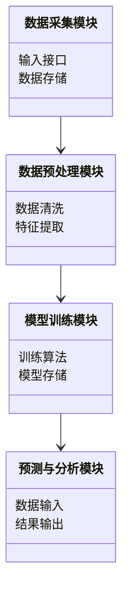
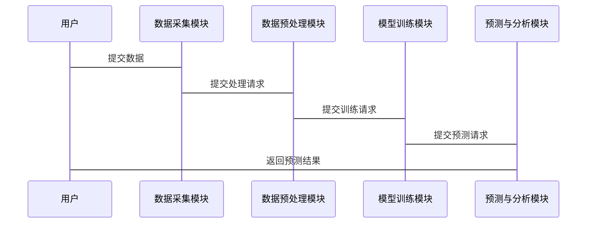

                 


# AI驱动的企业财务舞弊模式演化预测系统

> 关键词：AI，财务舞弊，模式演化，预测系统，机器学习，深度学习

> 摘要：随着企业规模的不断扩大和财务数据的复杂化，传统的财务舞弊检测方法已难以应对日益复杂的舞弊手段。本文将探讨如何利用人工智能技术，特别是机器学习和深度学习，来预测和识别企业财务舞弊模式。文章将从背景介绍、核心概念、算法原理、系统架构设计、项目实战以及总结与展望等方面，详细阐述AI在财务舞弊预测中的应用，帮助读者理解如何利用先进技术提升财务安全。

---

# 第一部分：背景介绍

## 第1章：企业财务舞弊与AI预测系统概述

### 1.1 企业财务舞弊的基本概念

#### 1.1.1 财务舞弊的定义与表现形式

财务舞弊是指企业在财务报表或相关财务数据中故意提供虚假信息或隐瞒重要信息的行为。常见的舞弊手段包括虚构收入、虚增资产、隐瞒债务等。这些行为不仅损害了企业的利益，还可能影响投资者和债权人的决策。

#### 1.1.2 财务舞弊对企业的影响

财务舞弊对企业的影响是多方面的：
1. **经济损失**：舞弊行为可能导致企业面临罚款、诉讼和赔偿，造成直接经济损失。
2. **信誉损害**：一旦财务舞弊被揭露，企业声誉受损，可能失去客户和合作伙伴的信任。
3. **管理混乱**：舞弊行为掩盖了企业的真实情况，可能导致管理层决策失误，进而引发更大的问题。

#### 1.1.3 财务舞弊的常见手段与案例

常见的财务舞弊手段包括：
- **虚增收入**：通过虚构交易或重复计账虚增收入。
- **隐瞒债务**：通过隐藏负债或虚减支出减少债务。
- **虚增资产**：通过虚增资产或低估折旧夸大资产规模。
- **关联交易舞弊**：通过关联交易转移资金或利润。

### 1.2 AI在财务舞弊预测中的作用

#### 1.2.1 AI技术的基本原理

人工智能（AI）通过模拟人类的思维过程，利用计算机技术实现对数据的分析、学习和预测。AI的核心技术包括机器学习、深度学习、自然语言处理等。

#### 1.2.2 AI在财务分析中的优势

AI在财务分析中的优势主要体现在：
1. **高效性**：AI能够快速处理大量数据，发现隐藏的模式和趋势。
2. **准确性**：通过机器学习算法，AI能够识别复杂的财务模式，提高预测的准确性。
3. **实时性**：AI系统可以实时监控财务数据，及时发现异常情况。

#### 1.2.3 财务舞弊预测的AI系统架构

AI驱动的财务舞弊预测系统通常包括以下几个模块：
- **数据采集**：从企业的财务报表、交易记录等数据源获取数据。
- **数据预处理**：对数据进行清洗、标准化和特征提取。
- **模型训练**：利用机器学习算法训练预测模型。
- **预测与分析**：基于训练好的模型对未来的财务数据进行预测，并生成报告。

---

# 第二部分：AI驱动的财务舞弊预测系统核心概念

## 第2章：财务数据与AI模型的结合

### 2.1 财务数据的特征与分类

#### 2.1.1 结构化数据的特征

结构化数据是指可以组织成表格形式的数据，如企业的财务报表中的收入、支出、资产等。结构化数据的特点是易于处理和分析，适合用于机器学习模型的训练。

#### 2.1.2 非结构化数据的特征

非结构化数据是指没有固定结构的数据，如财务报告中的文本描述、管理层的会议记录等。非结构化数据需要经过预处理后才能用于模型训练。

#### 2.1.3 数据的预处理方法

数据预处理是AI模型训练的重要步骤，主要包括：
- **数据清洗**：去除重复数据、填补缺失值。
- **数据标准化**：将数据转换为统一的格式。
- **特征提取**：从数据中提取有助于模型训练的特征。

### 2.2 AI模型在财务舞弊预测中的应用

#### 2.2.1 监督学习的应用

监督学习是一种基于标签数据的机器学习方法，适用于已知财务舞弊情况下的预测。常用的监督学习算法包括决策树、随机森林和支持向量机。

#### 2.2.2 非监督学习的应用

非监督学习适用于没有标签数据的情况，主要用于发现异常模式。常用的非监督学习算法包括聚类分析。

#### 2.2.3 深度学习的应用

深度学习通过多层神经网络模型，能够自动提取数据中的高层次特征，适用于复杂的财务舞弊模式识别。

### 2.3 财务舞弊预测的关键指标

#### 2.3.1 财务比率分析

财务比率分析是评估企业财务健康状况的重要方法，常用的比率包括资产负债率、利润率、周转率等。

#### 2.3.2 时间序列分析

时间序列分析用于分析财务数据的时间依赖性，识别异常波动。

#### 2.3.3 文本挖掘与情感分析

通过对财务报告和管理层会议记录的文本挖掘，分析企业是否存在财务舞弊的倾向。

---

# 第三部分：AI驱动的财务舞弊预测算法原理

## 第3章：常见的AI算法及其在财务舞弊预测中的应用

### 3.1 监督学习算法

#### 3.1.1 决策树算法

决策树是一种直观的分类方法，通过构建树状结构，将数据分成不同的类别。决策树的优点是易于理解和解释。

**决策树的构建过程**：
1. 选择一个特征作为根节点。
2. 根据特征的取值划分数据集。
3. 递归地构建子树，直到叶子节点满足停止条件。

**数学模型**：
决策树的分裂标准通常使用信息增益或基尼指数。信息增益的计算公式为：
$$
\text{信息增益} = \text{熵}(S) - \sum_{v} \text{熵}(S_v)
$$

#### 3.1.2 随机森林算法

随机森林是一种基于决策树的集成学习方法，通过构建多棵决策树并取其预测结果的平均值，提高模型的准确性和稳定性。

#### 3.1.3 支持向量机算法

支持向量机（SVM）是一种监督学习算法，适用于小样本、高维数据的分类问题。SVM通过找到一个超平面，将数据分成两类。

### 3.2 非监督学习算法

#### 3.2.1 K-means聚类算法

K-means是一种常见的聚类算法，适用于将数据分成K个簇。算法步骤如下：
1. 随机选择K个初始质心。
2. 计算每个数据点到各个质心的距离，将数据点归类到最近的簇。
3. 重新计算各簇的质心。
4. 重复步骤2和3，直到质心不再变化。

**数学模型**：
K-means的目标是最小化簇内平方和，公式为：
$$
\min \sum_{i=1}^{K} \sum_{x \in S_i} (x - \mu_i)^2
$$

#### 3.2.2 DBSCAN算法

DBSCAN是一种基于密度的聚类算法，适用于发现任意形状的簇。算法基于距离邻域的概念，将密度足够高的区域划分为簇。

### 3.3 深度学习算法

#### 3.3.1 神经网络基础

神经网络是一种模仿人脑结构的模型，由输入层、隐藏层和输出层组成。神经网络通过多层非线性变换，能够捕捉数据中的高层次特征。

#### 3.3.2 卷积神经网络（CNN）

CNN主要用于处理图像数据，但在财务舞弊预测中，可以用于分析结构化的财务数据。

#### 3.3.3 循环神经网络（RNN）

RNN适用于时间序列数据的分析，能够捕捉数据的时间依赖性。

### 3.4 算法比较与选择

选择合适的算法需要考虑数据的规模、类型以及问题的复杂性。监督学习适用于已知标签的数据，而非监督学习适用于无标签数据。

---

# 第四部分：AI驱动的财务舞弊预测系统架构设计

## 第4章：系统分析与架构设计

### 4.1 问题场景介绍

财务舞弊预测系统需要处理大量的财务数据，包括结构化和非结构化数据，识别潜在的舞弊模式。

### 4.2 系统功能设计

系统功能设计包括数据采集、数据预处理、模型训练、预测与分析四个模块。

**领域模型（类图）**：


### 4.3 系统架构设计

系统架构采用分层设计，包括数据层、业务逻辑层和表现层。

**系统架构图（架构图）**：
```mermaid
archi
    title 系统架构图
    数据层 --> 业务逻辑层
    业务逻辑层 --> 表现层
```

### 4.4 系统接口设计

系统接口设计需要考虑数据输入输出的格式和方式，如API接口的设计。

### 4.5 系统交互设计

系统交互设计包括用户与系统的互动流程，如用户输入数据，系统返回预测结果。

**系统交互流程图（序列图）**：


---

# 第五部分：项目实战

## 第5章：项目实战与案例分析

### 5.1 环境配置与数据准备

#### 5.1.1 环境配置

安装必要的Python库，如Scikit-learn、TensorFlow、Keras等。

#### 5.1.2 数据准备

获取企业财务数据，进行数据清洗和特征提取。

### 5.2 系统核心实现源代码

#### 5.2.1 数据预处理代码

```python
import pandas as pd
from sklearn.preprocessing import StandardScaler

# 数据加载
data = pd.read_csv('financial_data.csv')

# 数据清洗
data.dropna(inplace=True)
data.drop_duplicates(inplace=True)

# 特征提取
features = data[['收入', '支出', '资产', '负债']]
labels = data['舞弊标记']
```

#### 5.2.2 模型训练代码

```python
from sklearn.ensemble import RandomForestClassifier

# 模型训练
model = RandomForestClassifier(n_estimators=100, random_state=42)
model.fit(features, labels)
```

#### 5.2.3 模型预测代码

```python
# 预测
test_features = data_test[['收入', '支出', '资产', '负债']]
predictions = model.predict(test_features)
```

### 5.3 实际案例分析

通过具体案例分析，验证模型的预测准确性，并进行结果解读。

### 5.4 项目小结

总结项目的实施过程，提出改进建议和未来的研究方向。

---

# 第六部分：总结与展望

## 第6章：总结与展望

### 6.1 最佳实践

- **数据质量**：确保数据的完整性和准确性。
- **模型选择**：根据问题特点选择合适的算法。
- **模型维护**：定期更新模型，适应数据的变化。

### 6.2 小结

本文详细介绍了AI在企业财务舞弊预测中的应用，从理论到实践，全面阐述了系统的构建与实现。

### 6.3 注意事项

- 数据隐私问题：在处理企业财务数据时，需注意数据的安全和隐私保护。
- 模型的可解释性：复杂的模型可能难以解释，需权衡准确性和可解释性。

### 6.4 拓展阅读

推荐相关书籍和论文，供读者深入学习。

---

# 作者信息

作者：AI天才研究院/AI Genius Institute & 禅与计算机程序设计艺术/Zen And The Art of Computer Programming

