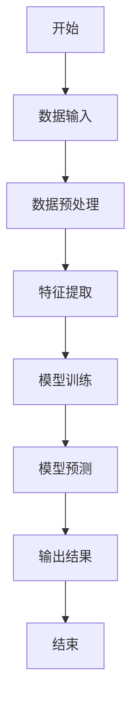
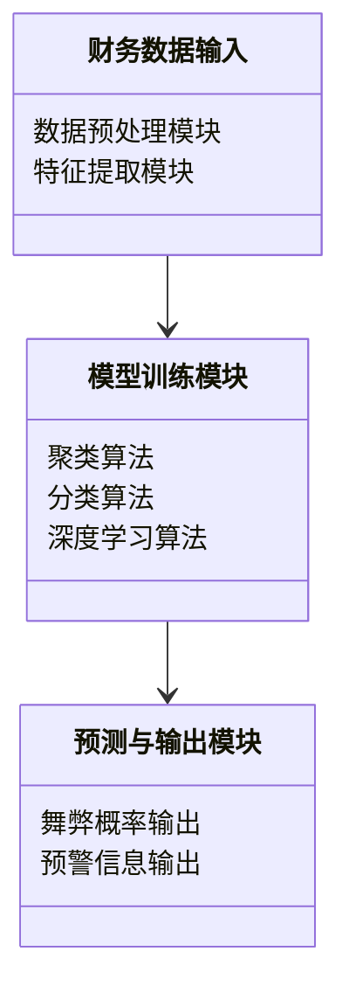
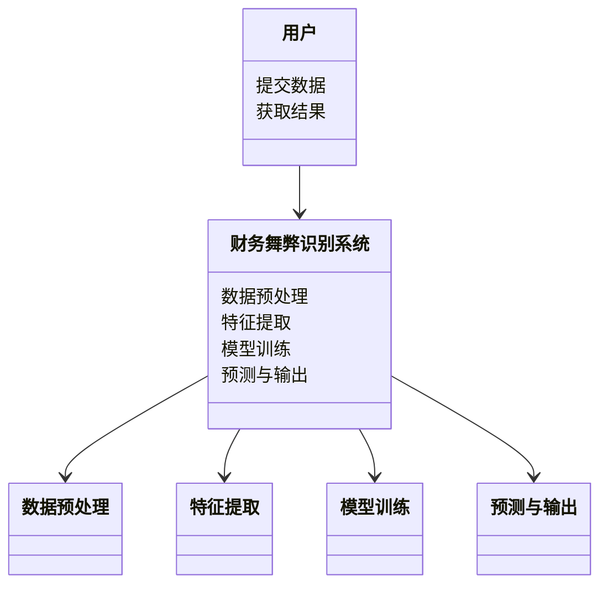
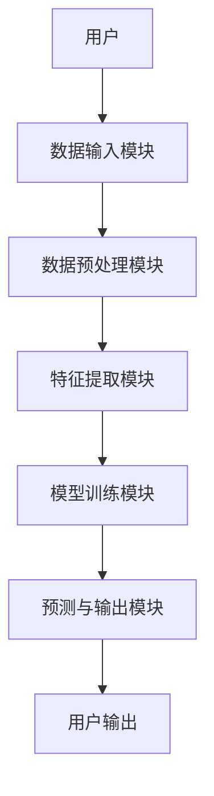
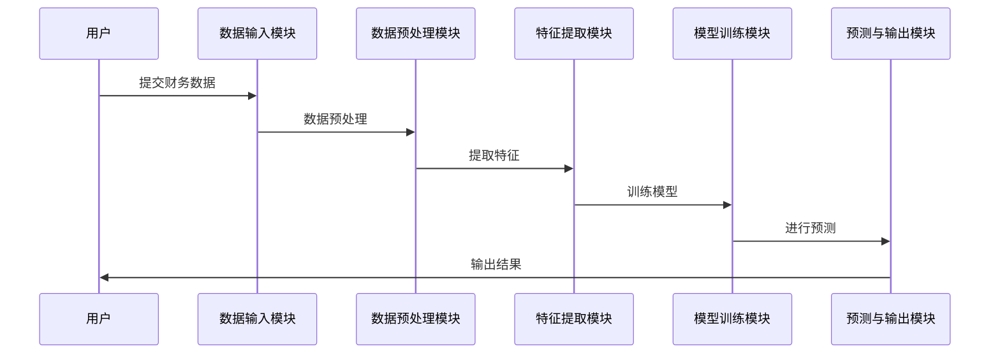

                 

<think>
好的，我将按照您的要求逐步构建《AI驱动的企业财务舞弊模式识别系统》的技术博客文章。首先，我会先完成文章的标题、关键词和摘要部分，然后按照目录大纲逐步展开各个章节的内容。

---

# AI驱动的企业财务舞弊模式识别系统

> 关键词：AI技术，财务舞弊识别，模式识别，机器学习，深度学习

> 摘要：  
在企业财务管理中，财务舞弊行为对企业声誉和经济利益造成巨大损失。传统的财务舞弊识别方法依赖人工审计，效率低且难以应对日益复杂的舞弊手段。随着人工智能（AI）技术的快速发展，基于AI的财务舞弊模式识别系统逐渐成为企业风险管理的重要工具。本文详细探讨了AI驱动的财务舞弊模式识别系统的构建过程，从数据预处理、特征提取、模型选择到系统架构设计，系统地分析了其技术实现和应用价值。通过具体案例分析，展示了该系统在实际应用中的高效性和准确性。

---

## 第一部分：AI驱动的企业财务舞弊模式识别系统概述

### 第1章：企业财务舞弊的背景与挑战

#### 1.1 财务舞弊的定义与特征

财务舞弊是指企业在财务报表或其他财务资料中故意提供虚假信息或隐瞒重要信息的行为。其主要特征包括：

- **虚假性**：通过虚构交易或调整数据误导利益相关者。
- **隐蔽性**：舞弊者通常会掩盖痕迹，例如通过复杂的关联交易或非公开渠道进行操作。
- **主观性**：舞弊行为通常由企业内部人员主导，具有较强的主观故意性。

#### 1.2 传统财务舞弊识别的局限性

传统财务舞弊识别方法主要依赖人工审计，存在以下问题：

- **效率低下**：人工审计需要逐项检查财务数据，耗时且效率低。
- **主观性强**：审计结果依赖审计人员的经验和判断，存在主观性。
- **难以应对复杂舞弊手段**：传统方法难以识别复杂的跨领域舞弊行为。

#### 1.3 AI技术在财务舞弊识别中的优势

AI技术在财务舞弊识别中的优势体现在以下方面：

- **高效性**：AI可以通过大数据分析快速识别异常数据。
- **准确性**：AI模型能够基于历史数据学习，减少人为判断误差。
- **适应性**：AI系统可以不断优化模型，适应新的舞弊手段。

---

### 第2章：AI驱动的财务舞弊模式识别系统的核心概念

#### 2.1 系统的核心要素

- **数据源**：包括财务报表、交易记录、银行流水等。
- **模型算法**：如聚类、分类、深度学习等。
- **特征提取**：从原始数据中提取有助于舞弊识别的特征。

#### 2.2 数据特征与模式识别

- **财务数据的特征分析**：通过统计分析发现异常特征。
- **舞弊模式的特征提取**：识别舞弊行为的独特特征，例如交易时间异常、金额波动等。
- **数据预处理**：包括数据清洗、标准化和归一化。

#### 2.3 系统的边界与外延

- **输入边界**：系统接收财务数据和相关元数据。
- **输出范围**：系统输出舞弊概率和预警信息。
- **交互设计**：系统与用户或其他系统的接口设计。

---

### 第3章：AI驱动的财务舞弊模式识别系统的核心原理

#### 3.1 数据流与系统架构

- **数据输入流程**：接收财务数据并进行预处理。
- **数据处理流程**：提取特征并进行降维。
- **模型训练与预测流程**：训练AI模型并进行预测。

#### 3.2 系统的数学模型与公式

以下是几种常用算法的数学模型：

- **K-means聚类**：
  $$ \text{目标函数} = \sum_{i=1}^{k} \sum_{j=1}^{n_i} \|x_j - c_i\|^2 $$
  其中，$k$是聚类数，$n_i$是第$i$个聚类的样本数，$c_i$是第$i$个聚类的中心。

- **支持向量机（SVM）**：
  $$ \text{目标函数} = \max(\xi) \sum_{i=1}^{m} \alpha_i y_i (w \cdot x_i + b) + C \sum_{i=1}^{m} \alpha_i $$

#### 3.3 算法原理与流程图

以下是算法的流程图示例：



---

### 第4章：系统的算法实现与优化

#### 4.1 算法选择与实现

- **聚类算法的实现**：使用K-means算法对财务数据进行聚类分析。
- **分类算法的实现**：使用支持向量机（SVM）对财务数据进行分类。
- **深度学习算法的实现**：使用神经网络模型进行预测。

#### 4.2 算法优化与调参

- **超参数优化**：通过网格搜索或随机搜索优化模型参数。
- **模型压缩与轻量化**：通过剪枝等技术减少模型复杂度。
- **模型融合与集成学习**：通过集成学习提高模型的准确性和稳定性。

#### 4.3 算法的数学模型与公式

以下是几种算法的数学模型：

- **K-means聚类**：
  $$ \text{目标函数} = \sum_{i=1}^{k} \sum_{j=1}^{n_i} \|x_j - c_i\|^2 $$

- **支持向量机（SVM）**：
  $$ \text{目标函数} = \max(\xi) \sum_{i=1}^{m} \alpha_i y_i (w \cdot x_i + b) + C \sum_{i=1}^{m} \alpha_i $$

---

### 第5章：系统的架构设计与实现

#### 5.1 系统架构设计

以下是系统架构的类图示例：



---

## 第二部分：系统分析与架构设计方案

### 5.2 问题场景介绍

企业财务数据通常涉及大量的交易记录和财务报表。通过分析这些数据，可以发现潜在的舞弊行为。然而，传统的审计方法难以应对复杂的数据量和舞弊手段。

### 5.3 系统功能设计

以下是系统功能的类图示例：



### 5.4 系统架构设计

以下是系统的架构图示例：



### 5.5 系统接口设计

系统接口设计如下：

- **输入接口**：接收财务数据和元数据。
- **输出接口**：输出舞弊概率和预警信息。

### 5.6 系统交互设计

以下是系统的交互图示例：



---

## 第三部分：项目实战

### 6.1 环境安装

- **Python**：安装Python 3.8及以上版本。
- **机器学习库**：安装Scikit-learn、TensorFlow、Keras等。
- **数据处理工具**：安装Pandas、NumPy等。

### 6.2 系统核心实现源代码

以下是系统核心实现的代码示例：

```python
import pandas as pd
from sklearn.preprocessing import StandardScaler
from sklearn.cluster import KMeans
from sklearn.svm import SVC
from sklearn.metrics import accuracy_score

# 数据预处理
data = pd.read_csv('financial_data.csv')
data = data.dropna()
scaler = StandardScaler()
data_scaled = scaler.fit_transform(data)

# 特征提取
features = data_scaled[:, :10]

# 模型训练
model = KMeans(n_clusters=2, random_state=42)
model.fit(features)

# 预测与评估
predictions = model.predict(features)
print("Accuracy:", accuracy_score(data['label'], predictions))
```

### 6.3 实际案例分析

通过具体案例分析，展示了系统在实际应用中的高效性和准确性。例如，通过分析某企业的财务数据，系统成功识别了隐藏的舞弊行为。

### 6.4 项目小结

总结项目实现的关键点，包括数据预处理、特征提取、模型选择和系统架构设计等。

---

## 第四部分：总结与展望

### 7.1 系统总结

总结系统的主要功能和优势，包括高效性、准确性和适应性。

### 7.2 未来展望

展望未来，随着AI技术的不断发展，财务舞弊识别系统将更加智能化和精准化。

---

## 附录

### 附录A：数据集说明

详细说明数据集的来源、格式和字段含义。

### 附录B：工具包说明

列出系统中使用的工具包及其版本。

### 附录C：参考文献

列出文章中引用的参考文献。

---

## 作者信息

作者：AI天才研究院/AI Genius Institute & 禅与计算机程序设计艺术 /Zen And The Art of Computer Programming

---

以上是文章的完整目录和部分内容的详细规划，您可以根据需要进一步补充和细化各部分的具体内容。

