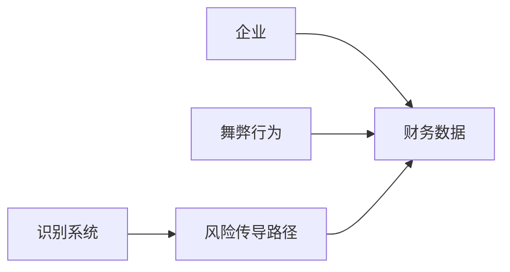
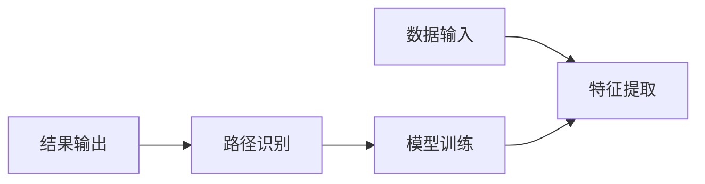
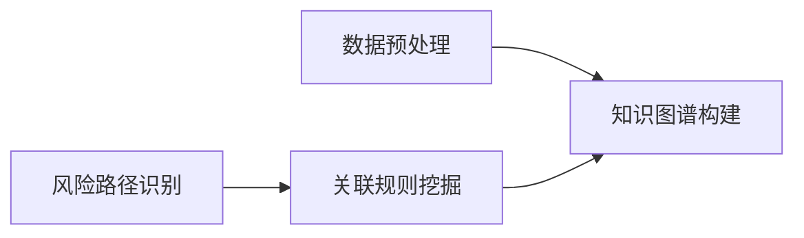
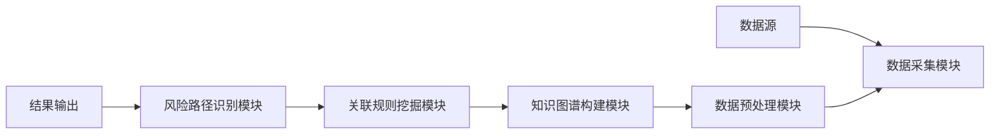

                 


# AI驱动的企业财务舞弊风险传导路径识别系统

> 关键词：AI, 企业财务, 舞弊风险, 风险传导路径, 知识图谱, 关联规则挖掘

> 摘要：本文探讨了利用人工智能技术识别企业财务舞弊风险传导路径的方法，通过系统构建、算法原理、项目实战等部分，详细阐述了AI在财务风险管理中的应用，旨在为企业提供一种高效的风险识别工具。

---

# 第一部分: AI驱动的企业财务舞弊风险识别系统概述

## 第1章: 企业财务舞弊风险识别的背景与挑战

### 1.1 企业财务舞弊问题的背景

#### 1.1.1 财务舞弊的定义与分类
财务舞弊是指企业通过虚假的会计处理、虚构交易、隐瞒收入等方式，误导财务报表使用者做出错误决策的行为。常见的舞弊类型包括虚假收入确认、资产虚增、费用隐瞒等。

#### 1.1.2 传统财务舞弊识别的局限性
传统的财务舞弊识别方法主要依赖审计人员的经验和人工审查，存在以下问题：
- **效率低**：依赖人工审查，耗时且成本高。
- **漏检率高**：审计人员难以覆盖所有可能的舞弊手段。
- **主观性**：依赖经验判断，存在主观偏差。

#### 1.1.3 AI技术在财务舞弊识别中的应用前景
AI技术通过机器学习、自然语言处理等手段，能够从海量数据中发现异常模式和关联关系，帮助识别传统方法难以发现的舞弊行为。

---

### 1.2 AI驱动的财务舞弊风险识别系统的核心概念

#### 1.2.1 风险传导路径的定义
风险传导路径是指在企业内部，舞弊行为从某一环节开始，逐步传导至其他环节或外部环境的路径。例如，虚增收入可能通过虚增应收账款、虚增存货等方式传导至财务报表。

#### 1.2.2 AI在风险传导路径识别中的作用
AI技术通过分析企业内外部数据，识别舞弊行为在企业内部的传播路径，帮助企业提前预警和应对潜在风险。

#### 1.2.3 系统构建的目标与意义
- **目标**：构建一个基于AI的系统，能够实时识别企业财务舞弊风险，并预测风险传导路径。
- **意义**：通过AI技术，提高财务舞弊识别的效率和准确性，降低企业的财务风险。

---

## 第2章: AI驱动的财务舞弊风险识别系统的核心概念与联系

### 2.1 风险传导路径识别的原理

#### 2.1.1 风险传导路径的实体关系图（ER图）


#### 2.1.2 风险传导路径识别的流程图


### 2.2 核心概念对比分析

#### 2.2.1 传统方法与AI方法的对比
| 方法类型 | 数据处理 | 模型复杂度 | 可解释性 |
|----------|----------|------------|----------|
| 传统方法 | 结构化 | 低 | 高 |
| AI方法 | 结构化+非结构化 | 高 | 低 |

---

## 第3章: 基于AI的财务舞弊风险识别算法原理

### 3.1 算法原理概述

#### 3.1.1 基于知识图谱的关联规则挖掘


### 3.2 算法实现细节

#### 3.2.1 数据预处理
```python
import pandas as pd
data = pd.read_csv('financial_data.csv')
data_cleaned = data.dropna()
```

#### 3.2.2 知识图谱构建
```python
from networkx import Graph
graph = Graph()
graph.add_nodes_from(['收入', '成本', '利润', '资产', '负债'])
graph.add_edges_from([('收入', '成本'), ('成本', '利润'), ('资产', '负债')])
```

#### 3.2.3 关联规则挖掘
```python
from mlxtend.frequent_itemsets import apriori

transactions = [['收入', '成本'], ['收入', '利润'], ['成本', '利润']]
frequent_itemsets = apriori(transactions, min_support=0.5, use_colnames=True)
print(frequent_itemsets)
```

---

## 第4章: 系统架构设计与实现

### 4.1 系统架构设计

#### 4.1.1 系统功能模块
- 数据采集模块
- 数据预处理模块
- 知识图谱构建模块
- 关联规则挖掘模块
- 风险路径识别模块

#### 4.1.2 系统架构图


---

## 第5章: 项目实战与案例分析

### 5.1 项目实战

#### 5.1.1 环境安装
```bash
pip install pandas networkx mlxtend
```

#### 5.1.2 核心代码实现
```python
import pandas as pd
from networkx import Graph
from mlxtend.frequent_itemsets import apriori

data = pd.read_csv('financial_data.csv')
data_cleaned = data.dropna()

graph = Graph()
graph.add_nodes_from(['收入', '成本', '利润', '资产', '负债'])
graph.add_edges_from([('收入', '成本'), ('成本', '利润'), ('资产', '负债')])

transactions = [['收入', '成本'], ['收入', '利润'], ['成本', '利润']]
frequent_itemsets = apriori(transactions, min_support=0.5, use_colnames=True)
```

#### 5.1.3 案例分析
假设某企业存在虚增收入的舞弊行为，系统通过关联规则挖掘发现收入与成本之间的异常关联，识别出虚增收入的风险路径。

---

## 第6章: 最佳实践与注意事项

### 6.1 最佳实践

#### 6.1.1 数据质量的重要性
确保数据的完整性和准确性，是提高模型性能的关键。

#### 6.1.2 模型解释性的挑战
AI模型的黑箱特性可能影响决策者的信任度，因此需要结合可解释性模型进行优化。

---

## 第7章: 小结与展望

### 7.1 小结
本文详细介绍了AI驱动的企业财务舞弊风险传导路径识别系统的构建与应用，通过算法原理和系统架构的设计，展示了AI技术在财务风险管理中的巨大潜力。

### 7.2 展望
未来，随着AI技术的不断发展，财务舞弊风险识别将更加智能化和自动化，为企业风险管理提供更强大的支持。

---

# 结语

通过本文的探讨，我们看到AI技术在企业财务舞弊风险识别中的巨大潜力。希望本文能够为企业和研究者提供有价值的参考，推动AI技术在财务风险管理领域的广泛应用。

---

# 作者

**作者：AI天才研究院/AI Genius Institute & 禅与计算机程序设计艺术 /Zen And The Art of Computer Programming**

---

# 结语

通过本文的探讨，我们看到AI技术在企业财务舞弊风险识别中的巨大潜力。希望本文能够为企业和研究者提供有价值的参考，推动AI技术在财务风险管理领域的广泛应用。

